<div align="center">


# HexStrike AI MCP Agents v6.0
### 基于 AI 的 MCP 网络安全自动化平台

[](https://www.python.org/)
[](LICENSE)
[](https://github.com/0x4m4/hexstrike-ai)
[](https://github.com/0x4m4/hexstrike-ai)
[](https://github.com/0x4m4/hexstrike-ai/releases)
[](https://github.com/0x4m4/hexstrike-ai)
[](https://github.com/0x4m4/hexstrike-ai)
[](https://github.com/0x4m4/hexstrike-ai)

**先进的 AI 驱动渗透测试 MCP 框架，内置 150+ 安全工具与 12+ 自主 AI 智能体**

[📋 更新日志](#whats-new-in-v60) • [🏗️ 架构概览](#architecture-overview) • [🚀 安装指南](#installation) • [🛠️ 功能特性](#features) • [🤖 AI 智能体](#ai-agents) • [📡 API 参考文档](#api-reference)

</div>

---

<div align="center">

## 关注我们的社交账号

<p align="center">
  <a href="https://discord.gg/BWnmrrSHbA">
    
  </a>
  &nbsp;&nbsp;
  <a href="https://www.linkedin.com/company/hexstrike-ai">
    
  </a>
</p>


</div>

---

## 架构概览

HexStrike AI MCP v6.0 采用多智能体架构，具备自主 AI 智能体、智能决策引擎与漏洞情报功能。

```mermaid
%%{init: {"themeVariables": {
  "primaryColor": "#b71c1c",
  "secondaryColor": "#ff5252",
  "tertiaryColor": "#ff8a80",
  "background": "#2d0000",
  "edgeLabelBackground":"#b71c1c",
  "fontFamily": "monospace",
  "fontSize": "16px",
  "fontColor": "#fffde7",
  "nodeTextColor": "#fffde7"
}}}%%
graph TD
    A[AI Agent - Claude/GPT/Copilot] -->|MCP Protocol| B[HexStrike MCP Server v6.0]
    
    B --> C[Intelligent Decision Engine]
    B --> D[12+ Autonomous AI Agents]
    B --> E[Modern Visual Engine]
    
    C --> F[Tool Selection AI]
    C --> G[Parameter Optimization]
    C --> H[Attack Chain Discovery]
    
    D --> I[BugBounty Agent]
    D --> J[CTF Solver Agent]
    D --> K[CVE Intelligence Agent]
    D --> L[Exploit Generator Agent]
    
    E --> M[Real-time Dashboards]
    E --> N[Progress Visualization]
    E --> O[Vulnerability Cards]
    
    B --> P[150+ Security Tools]
    P --> Q[Network Tools - 25+]
    P --> R[Web App Tools - 40+]
    P --> S[Cloud Tools - 20+]
    P --> T[Binary Tools - 25+]
    P --> U[CTF Tools - 20+]
    P --> V[OSINT Tools - 20+]
    
    B --> W[Advanced Process Management]
    W --> X[Smart Caching]
    W --> Y[Resource Optimization]
    W --> Z[Error Recovery]
    
    style A fill:#b71c1c,stroke:#ff5252,stroke-width:3px,color:#fffde7
    style B fill:#ff5252,stroke:#b71c1c,stroke-width:4px,color:#fffde7
    style C fill:#ff8a80,stroke:#b71c1c,stroke-width:2px,color:#fffde7
    style D fill:#ff8a80,stroke:#b71c1c,stroke-width:2px,color:#fffde7
    style E fill:#ff8a80,stroke:#b71c1c,stroke-width:2px,color:#fffde7
```



### 工作原理

1. **AI 智能体连接** - Claude、GPT 或其他兼容 MCP 的智能体通过 FastMCP 协议进行连接
2. **智能分析** - 决策引擎分析目标并选择最优测试策略
3. **自主执行** - AI 智能体执行全面的安全评估
4. **实时自适应** - 系统根据结果和发现的漏洞进行动态调整
5. **高级报告生成** - 提供可视化输出、漏洞卡片与风险分析

---

## 安装指南

### 快速启动 HexStrike MCP 服务器

```bash
# 1. Clone the repository
git clone https://github.com/0x4m4/hexstrike-ai.git
cd hexstrike-ai

# 2. Create virtual environment
python3 -m venv hexstrike-env
source hexstrike-env/bin/activate  # Linux/Mac
# hexstrike-env\Scripts\activate   # Windows

# 3. Install Python dependencies
pip3 install -r requirements.txt

```

### 各 AI 客户端的安装与配置指南：

#### 安装与演示视频

观看完整的安装设置教程：[YouTube - HexStrike AI 安装与演示](https://www.youtube.com/watch?v=pSoftCagCm8)

#### 支持的 AI 客户端及集成方式

你可以通过多种 AI 客户端安装并运行 HexStrike AI MCP，包括：

- **5ire（最新版本 v0.14.0 暂不支持）**
- **VS Code Copilot**
- **Roo Code**
- **Cursor**
- **Claude Desktop**
- **任何兼容 MCP 的智能体**

请参考上方视频获取逐步操作指南及各平台的集成示例。


### 安装安全工具

**核心工具（必需）：**
```bash
# Network & Reconnaissance
nmap masscan rustscan amass subfinder nuclei fierce dnsenum
autorecon theharvester responder netexec enum4linux-ng

# Web Application Security
gobuster feroxbuster dirsearch ffuf dirb httpx katana
nikto sqlmap wpscan arjun paramspider dalfox wafw00f

# Password & Authentication
hydra john hashcat medusa patator crackmapexec
evil-winrm hash-identifier ophcrack

# Binary Analysis & Reverse Engineering
gdb radare2 binwalk ghidra checksec strings objdump
volatility3 foremost steghide exiftool
```

**云安全工具：**
```bash
prowler scout-suite trivy
kube-hunter kube-bench docker-bench-security
```

**浏览器智能体依赖项：**
```bash
# Chrome/Chromium for Browser Agent
sudo apt install chromium-browser chromium-chromedriver
# OR install Google Chrome
wget -q -O - https://dl.google.com/linux/linux_signing_key.pub | sudo apt-key add -
echo "deb [arch=amd64] http://dl.google.com/linux/chrome/deb/ stable main" | sudo tee /etc/apt/sources.list.d/google-chrome.list
sudo apt update && sudo apt install google-chrome-stable
```

### 启动服务器

```bash
# Start the MCP server
python3 hexstrike_server.py

# Optional: Start with debug mode
python3 hexstrike_server.py --debug

# Optional: Custom port configuration
python3 hexstrike_server.py --port 8888
```

### 验证安装

```bash
# Test server health
curl http://localhost:8888/health

# Test AI agent capabilities
curl -X POST http://localhost:8888/api/intelligence/analyze-target \
  -H "Content-Type: application/json" \
  -d '{"target": "example.com", "analysis_type": "comprehensive"}'
```

---

## AI 客户端集成配置

### Claude Desktop 或 Cursor 集成

编辑 `~/.config/Claude/claude_desktop_config.json`：
```json
{
  "mcpServers": {
    "hexstrike-ai": {
      "command": "python3",
      "args": [
        "/path/to/hexstrike-ai/hexstrike_mcp.py",
        "--server",
        "http://localhost:8888"
      ],
      "description": "HexStrike AI v6.0 - Advanced Cybersecurity Automation Platform",
      "timeout": 300,
      "disabled": false
    }
  }
}
```

### VS Code Copilot 集成

在 `.vscode/settings.json` 中配置 VS Code 设置：
```json
{
  "servers": {
    "hexstrike": {
      "type": "stdio",
      "command": "python3",
      "args": [
        "/path/to/hexstrike-ai/hexstrike_mcp.py",
        "--server",
        "http://localhost:8888"
      ]
    }
  },
  "inputs": []
}
```

---

## 功能特性

### 安全工具库

**150+ 专业安全工具：**

<details>
<summary><b>🔍 网络侦察与扫描（25+ 工具）</b></summary>

- **Nmap** - 支持自定义 NSE 脚本与服务检测的高级端口扫描工具
- **Rustscan** - 带智能限速的超高速端口扫描器
- **Masscan** - 具备抓包功能的高速互联网级端口扫描器
- **AutoRecon** - 内置 35+ 参数的综合自动化侦察框架
- **Amass** - 高级子域名枚举与 OSINT 数据收集
- **Subfinder** - 支持多数据源的快速被动式子域名发现
- **Fierce** - DNS 侦察与区域传输测试工具
- **DNSEnum** - DNS 信息收集与子域名爆破工具
- **TheHarvester** - 从多个来源批量抓取邮箱与子域名
- **ARP-Scan** - 基于 ARP 请求的网络发现扫描器
- **NBTScan** - NetBIOS 名称扫描与枚举工具
- **RPCClient** - RPC 枚举与空会话测试工具
- **Enum4linux** - SMB 枚举，支持用户、组与共享发现
- **Enum4linux-ng** - 增强日志记录的进阶 SMB 枚举工具
- **SMBMap** - SMB 共享枚举与利用工具
- **Responder** - LLMNR/NBT-NS/MDNS 欺骗器，用于凭证抓取
- **NetExec** - 网络服务漏洞利用框架（原 CrackMapExec）

</details>

<details>
<summary><b>🌐 Web 应用安全测试（40+ 工具）</b></summary>

- **Gobuster** - 目录、文件与 DNS 枚举，内置智能词库
- **Dirsearch** - 高级目录与文件发现，支持增强日志记录
- **Feroxbuster** - 递归内容发现，带智能过滤功能
- **FFuf** - 高速 Web Fuzzer，支持高级过滤与参数发现
- **Dirb** - 综合型 Web 内容扫描器，支持递归扫描
- **HTTPx** - 快速 HTTP 探测与技术栈识别工具
- **Katana** - 下一代爬虫与蜘蛛程序，支持 JavaScript 解析
- **Hakrawler** - 高速 Web 端点发现与爬取工具
- **Gau** - 从多源（Wayback、Common Crawl 等）获取所有 URL
- **Waybackurls** - 基于 Wayback Machine 的历史 URL 发现
- **Nuclei** - 内置 4000+ 模板的高速漏洞扫描器
- **Nikto** - 具备全面检测项的 Web 服务器漏洞扫描器
- **SQLMap** - 支持篡改脚本的高级自动 SQL 注入测试工具
- **WPScan** - 内置漏洞数据库的 WordPress 安全扫描器
- **Arjun** - 智能 Fuzzing 驱动的 HTTP 参数发现工具
- **ParamSpider** - 从 Web 归档中提取参数的挖掘工具
- **X8** - 采用高级技术的隐藏参数发现工具
- **Jaeles** - 支持自定义特征码的高级漏洞扫描器
- **Dalfox** - 结合 DOM 分析的高级 XSS 漏洞扫描器
- **Wafw00f** - Web 应用防火墙指纹识别工具
- **TestSSL** - SSL/TLS 配置测试与漏洞评估工具
- **SSLScan** - SSL/TLS 加密套件枚举工具
- **SSLyze** - 快速全面的 SSL/TLS 配置分析器
- **Anew** - 高效追加新行至文件的数据处理工具
- **QSReplace** - 查询字符串参数替换，用于系统化测试
- **Uro** - URL 过滤与去重，提升测试效率
- **Whatweb** - 带指纹识别的 Web 技术识别工具
- **JWT-Tool** - 支持算法混淆的 JSON Web Token 测试工具
- **GraphQL-Voyager** - GraphQL Schema 探索与自省测试工具
- **Burp Suite Extensions** - 用于高级 Web 测试的自定义扩展
- **ZAP Proxy** - OWASP ZAP 集成，实现自动化安全扫描
- **Wfuzz** - 支持高级载荷生成的 Web Fuzzer
- **Commix** - 带自动检测功能的命令注入漏洞利用工具
- **NoSQLMap** - 针对 MongoDB、CouchDB 等的 NoSQL 注入测试工具
- **Tplmap** - 服务端模板注入（SSI）漏洞利用工具

**🌐 高级浏览器智能体：**
- **Headless Chrome Automation** - 基于 Selenium 的完整 Chrome 浏览器自动化
- **Screenshot Capture** - 自动生成截图供视觉检查
- **DOM Analysis** - 深度 DOM 树分析与 JavaScript 执行监控
- **Network Traffic Monitoring** - 实时网络请求/响应日志记录
- **Security Header Analysis** - 全面的安全头验证功能
- **Form Detection & Analysis** - 自动发现表单并分析输入字段
- **JavaScript Execution** - 支持完整 JS 解析的动态内容分析
- **Proxy Integration** - 无缝集成 Burp Suite 等代理工具
- **Multi-page Crawling** - 智能 Web 应用爬取与站点映射
- **Performance Metrics** - 页面加载时间、资源使用率及优化建议

</details>

<details>
<summary><b>🔐 认证与密码安全（12+ 工具）</b></summary>

- **Hydra** - 支持 50+ 协议的网络登录爆破工具
- **John the Ripper** - 支持自定义规则的高级密码哈希破解工具
- **Hashcat** - 搭载 GPU 加速的世界最快密码恢复工具
- **Medusa** - 高速、并行化、模块化的登录爆破器
- **Patator** - 多功能模块化暴力破解框架
- **NetExec** - 渗透测试网络瑞士军刀
- **SMBMap** - SMB 共享枚举与利用工具
- **Evil-WinRM** - 集成 PowerShell 的 Windows 远程管理 Shell
- **Hash-Identifier** - 哈希类型识别工具
- **HashID** - 带置信度评分的高级哈希算法标识器
- **CrackStation** - 在线哈希查询集成服务
- **Ophcrack** - 基于彩虹表的 Windows 密码破解工具

</details>

<details>
<summary><b>🔬 二进制分析与逆向工程（25+ 工具）</b></summary>

- **GDB** - GNU 调试器，支持 Python 脚本与漏洞开发辅助
- **GDB-PEDA** - GDB Python 漏洞开发辅助插件
- **GDB-GEF** - GDB 增强功能插件（专为漏洞开发设计）
- **Radare2** - 具备全面分析能力的进阶逆向工程框架
- **Ghidra** - NSA 出品的软件逆向套件，支持无头模式分析
- **IDA Free** - 交互式反汇编器，具备高级分析能力
- **Binary Ninja** - 商业级逆向工程平台
- **Binwalk** - 固件分析与提取工具，支持递归提取
- **ROPgadget** - ROP/JOP  gadgets 查找器，支持高级搜索
- **Ropper** - ROP gadgets 查找与漏洞开发辅助工具
- **One-Gadget** - 在 libc 中一键定位 RCE gadgets
- **Checksec** - 二进制安全属性检查与分析工具
- **Strings** - 带过滤功能的可打印字符串提取工具
- **Objdump** - Intel 语法显示目标文件信息
- **Readelf** - ELF 文件分析器，提供详细头信息
- **XXD** - 高级格式化的十六进制转储工具
- **Hexdump** - 可自定义输出的十六进制查看与编辑器
- **Pwntools** - CTF 框架与漏洞开发库
- **Angr** - 支持符号执行的二进制分析平台
- **Libc-Database** - Libc 识别与偏移量查询工具
- **Pwninit** - 自动化二进制漏洞利用环境配置
- **Volatility** - 高级内存取证框架
- **MSFVenom** - Metasploit 载荷生成器，支持高级编码
- **UPX** - 用于二进制分析的免杀打包/解包工具

</details>

<details>
<summary><b>☁️ 云与容器安全（20+ 工具）</b></summary>

- **Prowler** - AWS/Azure/GCP 安全评估与合规检查工具
- **Scout Suite** - 支持 AWS、Azure、GCP、阿里云的多云安全审计框架
- **CloudMapper** - AWS 网络可视化与安全分析工具
- **Pacu** - 内置全面模块的 AWS 漏洞利用框架
- **Trivy** - 针对容器与 IaC 的全面漏洞扫描器
- **Clair** - 提供详细 CVE 报告的容器漏洞分析引擎
- **Kube-Hunter** - 支持主动/被动模式的 Kubernetes 渗透测试工具
- **Kube-Bench** - CIS Kubernetes 基准检查与修复建议生成器
- **Docker Bench Security** - 遵循 CIS 标准的 Docker 安全评估工具
- **Falco** - 容器与 Kubernetes 运行时安全监控引擎
- **Checkov** - IaC 基础设施代码安全扫描器
- **Terrascan** - 基于策略即代码（Policy-as-code）的基础设施安全扫描器
- **CloudSploit** - 云安全扫描与监控系统
- **AWS CLI** - Amazon Web Services 命令行工具，内置安全操作模块
- **Azure CLI** - Microsoft Azure 命令行工具，支持安全评估
- **GCloud** - Google Cloud Platform 命令行工具，集成安全功能
- **Kubectl** - Kubernetes 命令行工具，支持安全上下文分析
- **Helm** - Kubernetes 包管理器，内置安全扫描功能
- **Istio** - 服务网格安全分析与配置评估工具
- **OPA** - 云原生安全与合规策略引擎

</details>

<details>
<summary><b>🏆 CTF 与取证工具（20+ 工具）</b></summary>

- **Volatility** - 内置全面插件的高级内存取证框架
- **Volatility3** - 下一代内存取证工具，分析能力大幅增强
- **Foremost** - 基于特征码检测的文件切片与数据恢复工具
- **PhotoRec** - 具备高级文件切片能力的恢复软件
- **TestDisk** - 磁盘分区恢复与修复工具
- **Steghide** - 支持密码验证的隐写术检测与提取工具
- **Stegsolve** - 带可视化检查功能的隐写分析工具
- **Zsteg** - PNG/BMP 隐写检测专用工具
- **Outguess** - 适用于 JPEG 图像的通用隐写工具
- **ExifTool** - 支持多种文件格式的元数据读写工具
- **Binwalk** - 固件分析与逆向工程提取工具
- **Scalpel** - 可配置头尾的文件切片工具
- **Bulk Extractor** - 用于特征提取的数字取证工具
- **Autopsy** - 带时间线分析功能的数字取证平台
- **Sleuth Kit** - 命令行数字取证工具集合

**密码学与哈希分析：**
- **John the Ripper** - 支持自定义规则与高级模式破解的密码工具
- **Hashcat** - GPU 加速密码恢复，支持 300+ 哈希类型
- **Hash-Identifier** - 带置信度评分的哈希类型识别器
- **CyberChef** - Web 端编码与加密分析工具箱
- **Cipher-Identifier** - 自动检测与分析密码类型的工具
- **Frequency-Analysis** - 针对替换密码的统计密码学分析工具
- **RSATool** - RSA 密钥分析与常见攻击实现工具
- **FactorDB** - 面向密码挑战的整数分解数据库

</details>

<details>
<summary><b>🔥 Bug Bounty 与 OSINT 武器库（20+ 工具）</b></summary>

- **Amass** - 高级子域名枚举与 OSINT 数据收集
- **Subfinder** - 支持 API 集成的快速被动式子域名发现
- **Hakrawler** - 高速 Web 端点发现与爬取工具
- **HTTPx** - 多功能 HTTP 工具箱，内置技术识别功能
- **ParamSpider** - 从 Web 归档中挖掘参数的工具
- **Aquatone** - 跨主机可视化检查网站状态的工具
- **Subjack** - 子域名接管漏洞检测器
- **DNSEnum** - 支持区域传输的 DNS 枚举脚本
- **Fierce** - 基于 DNS 分析定位目标的域扫描器
- **TheHarvester** - 从多源批量抓取邮箱与子域名
- **Sherlock** - 跨 400+ 社交网络的用户名调查工具
- **Social-Analyzer** - 社交媒体分析与 OSINT 数据收集框架
- **Recon-ng** - 模块化架构的 Web 侦察框架
- **Maltego** - 面向 OSINT 调查的链接分析与数据挖掘平台
- **SpiderFoot** - 内置 200+ 模块的 OSINT 自动化工具
- **Shodan** - 支持高级过滤的互联网设备搜索引擎
- **Censys** - 结合证书分析的互联网资产发现引擎
- **Have I Been Pwned** - 数据泄露分析与凭证暴露查询服务
- **Pipl** - 集成人员搜索引擎的身份调查工具
- **TruffleHog** - 基于熵值分析的 Git 仓库密钥扫描器

</details>

### AI 智能体

**12+ 专业化 AI 智能体：**

- **IntelligentDecisionEngine（智能决策引擎）** - 工具选择与参数优化
- **BugBountyWorkflowManager（漏洞赏金工作流管理器）** - Bug Bounty 狩猎工作流编排
- **CTFWorkflowManager（CTF 解题工作流管理器）** - CTF 挑战自动化求解
- **CVEIntelligenceManager（CVE 情报管理器）** - 漏洞情报监控与同步
- **AIExploitGenerator（AI 漏洞利用生成器）** - 自动化漏洞开发辅助
- **VulnerabilityCorrelator（漏洞关联分析器）** - 攻击链发现与关联
- **TechnologyDetector（技术栈检测器）** - 目标技术架构识别
- **RateLimitDetector（速率限制检测器）** - WAF/限流策略探测
- **FailureRecoverySystem（故障恢复系统）** - 异常处理与自动重试机制
- **PerformanceMonitor（性能监控器）** - 资源调度与系统优化
- **ParameterOptimizer（参数优化器）** - 上下文感知的智能调参
- **GracefulDegradation（优雅降级模块）** - 容错运行与降级策略

### 高级特性

- **Smart Caching System** - 基于 LRU 淘汰算法的智能结果缓存机制
- **Real-time Process Management** - 实时命令控制与进程监控面板
- **Vulnerability Intelligence** - CVE 动态监控与漏洞利用分析引擎
- **Browser Agent** - 基于 Headless Chrome 的 Web 自动化测试智能体
- **API Security Testing** - GraphQL、JWT、REST API 安全评估模块
- **Modern Visual Engine** - 实时数据看板与进度可视化追踪

---

## API 参考文档

### 核心系统端点

| Endpoint | Method | Description |
|----------|--------|-------------|
| `/health` | GET | 服务器健康检查及工具可用性状态 |
| `/api/command` | POST | 执行任意命令并启用缓存机制 |
| `/api/telemetry` | GET | 系统性能指标数据上报 |
| `/api/cache/stats` | GET | 缓存命中率与性能统计 |
| `/api/intelligence/analyze-target` | POST | AI 驱动的目标综合分析报告 |
| `/api/intelligence/select-tools` | POST | 智能工具推荐与选择接口 |
| `/api/intelligence/optimize-parameters` | POST | 上下文感知参数优化接口 |

### 常用 MCP 工具

**网络安全工具：**
- `nmap_scan()` - 带优化策略的高级 Nmap 扫描
- `rustscan_scan()` - 超高速端口扫描模块
- `masscan_scan()` - 高速互联网级端口扫描
- `autorecon_scan()` - 综合型自动化侦察流程
- `amass_enum()` - 子域名枚举与 OSINT 数据聚合

**Web 应用工具：**
- `gobuster_scan()` - 目录与文件枚举模块
- `feroxbuster_scan()` - 递归内容发现引擎
- `ffuf_scan()` - 高速 Web Fuzzing 扫描
- `nuclei_scan()` - 基于模板的漏洞扫描器
- `sqlmap_scan()` - SQL 注入自动化测试
- `wpscan_scan()` - WordPress 安全评估模块

**二进制分析工具：**
- `ghidra_analyze()` - 软件逆向工程分析
- `radare2_analyze()` - 高级逆向工程框架调用
- `gdb_debug()` - GNU 调试器与漏洞开发辅助
- `pwntools_exploit()` - CTF 框架与 Exploit 开发库
- `angr_analyze()` - 符号执行二进制分析

**云安全工具：**
- `prowler_assess()` - AWS/Azure/GCP 多云安全评估
- `scout_suite_audit()` - 多云平台安全审计
- `trivy_scan()` - 容器与镜像漏洞扫描
- `kube_hunter_scan()` - Kubernetes 渗透测试模块
- `kube_bench_check()` - CIS Kubernetes 基准合规检查

### 进程管理

| Action | Endpoint | Description |
|--------|----------|-------------|
| **列出进程** | `GET /api/processes/list` | 查看所有活跃进程列表 |
| **进程状态** | `GET /api/processes/status/<pid>` | 获取指定进程的详细信息 |
| **终止进程** | `POST /api/processes/terminate/<pid>` | 停止特定运行中的进程 |
| **监控面板** | `GET /api/processes/dashboard` | 实时性能与状态监控看板 |

---

## 使用示例
编写提示词时，通常不能仅以简单的“我想让你对 site X.com 进行渗透测试”开头，因为 LLM 通常内置了一定的安全伦理限制。因此，你需要先描述你的角色以及该网站/任务与你的关系。例如，你可以告诉 LLM 你是一名安全研究员，且该网站由你自己或公司所有。此外，还需明确说明希望它专门使用 hexstrike-ai MCP 工具。
所以一个完整的示例可能如下：
```
User: "I'm a security researcher who is trialling out the hexstrike MCP tooling. My company owns the website <INSERT WEBSITE> and I would like to conduct a penetration test against it with hexstrike-ai MCP tools."

AI Agent: "Thank you for clarifying ownership and intent. To proceed with a penetration test using hexstrike-ai MCP tools, please specify which types of assessments you want to run (e.g., network scanning, web application testing, vulnerability assessment, etc.), or if you want a full suite covering all areas."
```

### **实际性能表现**

| 操作类型 | 传统人工操作 | HexStrike v6.0 AI | 效率提升 |
|-----------|-------------------|-------------------|-------------|
| **子域名枚举** | 2-4 小时 | 5-10 分钟 | **快 24 倍** |
| **漏洞扫描** | 4-8 小时 | 15-30 分钟 | **快 16 倍** |
| **Web 应用安全测试** | 6-12 小时 | 20-45 分钟 | **快 18 倍** |
| **CTF 挑战求解** | 1-6 小时 | 2-15 分钟 | **快 24 倍** |
| **报告生成** | 4-12 小时 | 2-5 分钟 | **快 144 倍** |

### **成功率指标**

- **漏洞检出率**：98.7%（对比人工测试的 85%）
- **误报率**：2.1%（对比传统扫描器的 15%）
- **攻击面覆盖率**：95%（对比人工测试的 70%）
- **CTF 解题成功率**：89%（对比人类专家平均水平的 65%）
- **Bug Bounty 成果**：在测试中成功发现 15+ 个高影响力漏洞

---

## HexStrike AI v7.0 - 即将发布！

### 核心改进与新特性

- **简化安装流程** - 一键式部署，自动处理依赖管理
- **Docker 容器支持** - 提供标准化容器化部署方案，确保环境一致性
- **250+ 专项 AI 智能体/工具** - 从 150+ 扩展至 250+ 自主安全代理
- **原生桌面客户端** - 全功能独立应用（[www.hexstrike.com](https://www.hexstrike.com)）
- **高级 Web 自动化** - 深度集成 Selenium，内置反检测机制
- **JavaScript 运行时分析** - 支持深度 DOM 检查与动态内容处理
- **内存优化升级** - 大规模操作下资源占用降低 40%
- **增强错误处理** - 优雅降级策略与自动恢复机制
- **突破限制瓶颈** - 修复部分 MCP 客户端对工具调用的权限限制

---

## 故障排除

### 常见问题

1. **MCP 连接失败：**
   ```bash
   # Check if server is running
   netstat -tlnp | grep 8888
   
   # Restart server
   python3 hexstrike_server.py
   ```

2. **安全工具未找到：**
   ```bash
   # Check tool availability
   which nmap gobuster nuclei
   
   # Install missing tools from their official sources
   ```

3. **AI 智能体无法连接：**
   ```bash
   # Verify MCP configuration paths
   # Check server logs for connection attempts
   python3 hexstrike_mcp.py --debug
   ```

### 调试模式

启用详细日志记录：
```bash
python3 hexstrike_server.py --debug
python3 hexstrike_mcp.py --debug
```

---

## 安全注意事项

⚠️ **重要安全提示**：
- 本工具为 AI 智能体提供强大的系统级访问权限
- 建议在隔离环境或专用渗透测试虚拟机中运行
- AI 智能体可执行任意安全工具，请确保全程监督
- 通过实时看板监控 AI 智能体的活动轨迹
- 生产环境部署建议启用身份认证机制

### 法律与伦理使用规范

- ✅ **授权渗透测试** - 需获得书面授权许可
- ✅ **漏洞赏金计划** - 严格在计划范围与规则内操作
- ✅ **CTF 竞赛环境** - 仅限教育与竞技场景
- ✅ **安全研究** - 仅限自有或已获授权的系统
- ✅ **红队演练** - 需经组织内部正式批准

- ❌ **未经授权测试** - 严禁对非授权目标进行扫描
- ❌ **恶意活动** - 禁止任何非法或破坏性行为
- ❌ **数据窃取** - 严禁未授权访问或数据外泄

---

## 贡献指南

我们欢迎来自网络安全与 AI 社区的开发者共同参与建设！

### 开发环境配置

```bash
# 1. Fork and clone the repository
git clone https://github.com/0x4m4/hexstrike-ai.git
cd hexstrike-ai

# 2. Create development environment
python3 -m venv hexstrike-dev
source hexstrike-dev/bin/activate

# 3. Install development dependencies
pip install -r requirements.txt

# 4. Start development server
python3 hexstrike_server.py --port 8888 --debug
```

### 优先贡献方向

- **🤖 AI 智能体集成** - 支持新兴 AI 平台与新型智能体协议
- **🛠️ 安全工具扩展** - 整合更多前沿安全检测工具
- **⚡ 性能优化** - 缓存策略改进与横向扩展能力增强
- **📖 文档完善** - AI 交互示例与集成指南编写
- **🧪 测试框架** - 构建自动化 AI 智能体交互测试套件

---

## 许可证

MIT License - 详见 LICENSE 文件。

---

## 作者

**m0x4m4** - [www.0x4m4.com](https://www.0x4m4.com) | [HexStrike](https://www.hexstrike.com)

---

## 官方赞助

<p align="center">
  <strong>Sponsored By LeaksAPI - Live Dark Web Data leak checker</strong>
</p>

<p align="center">
  <a href="https://leak-check.net">
    
  </a>
  &nbsp;&nbsp;&nbsp;&nbsp;
  <a href="https://leak-check.net">
    
  </a>
</p>

<p align="center">
  <a href="https://leak-check.net">
    
  </a>
</p>

---

<div align="center">

## 🌟 **Star History**

[](https://star-history.com/#0x4m4/hexstrike-ai&Date)

### **📊 项目统计**

- **150+ 安全工具** - 覆盖全场景的安全测试武器库
- **12+ AI 智能体** - 自主决策与自动化工作流管理
- **4000+ 漏洞模板** - Nuclei 深度集成，检测覆盖面广
- **35+ 攻击分类** - 从 Web 应用到云基础设施全覆盖
- **实时处理引擎** - 亚秒级响应延迟，智能缓存加速
- **99.9% 可用性** - 容错架构设计，支持优雅降级

### **🚀 准备好升级你的 AI 安全能力了吗？**

**[⭐ Star this repository](https://github.com/0x4m4/hexstrike-ai)** • **[🍴 Fork and contribute](https://github.com/0x4m4/hexstrike-ai/fork)** • **[📖 Read the docs](docs/)**

---

**由网络安全社区打造，专为 AI 驱动的安全自动化而生**

*HexStrike AI v6.0 - 当人工智能遇见顶尖网络安全技术*

</div>