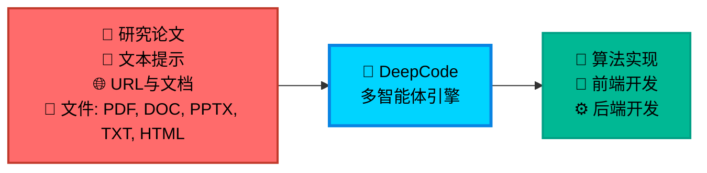
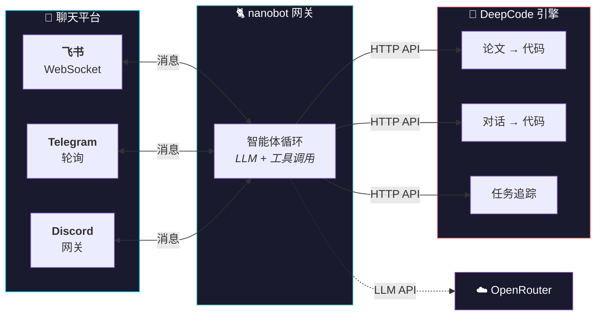

<div align="center">

<table style="border: none; margin: 0 auto; padding: 0; border-collapse: collapse;">
<tr>
<td align="center" style="vertical-align: middle; padding: 10px; border: none; width: 250px;">
  
</td>
<td align="left" style="vertical-align: middle; padding: 10px 0 10px 30px; border: none;">
  <pre style="font-family: 'Courier New', monospace; font-size: 16px; color: #0EA5E9; margin: 0; padding: 0; text-shadow: 0 0 10px #0EA5E9, 0 0 20px rgba(14,165,233,0.5); line-height: 1.2; transform: skew(-1deg, 0deg); display: block;">    ██████╗ ███████╗███████╗██████╗  ██████╗ ██████╗ ██████╗ ███████╗
    ██╔══██╗██╔════╝██╔════╝██╔══██╗██╔════╝██╔═══██╗██╔══██╗██╔════╝
    ██║  ██║█████╗  █████╗  ██████╔╝██║     ██║   ██║██║  ██║█████╗
    ██║  ██║██╔══╝  ██╔══╝  ██╔═══╝ ██║     ██║   ██║██║  ██║██╔══╝
    ██████╔╝███████╗███████╗██║     ╚██████╗╚██████╔╝██████╔╝███████╗
    ╚═════╝ ╚══════╝╚══════╝╚═╝      ╚═════╝ ╚═════╝ ╚═════╝ ╚══════╝</pre>
</td>
</tr>
</table>

<div align="center">
<a href="https://trendshift.io/repositories/14665" target="_blank"></a>
</div>

<!--  -->

#  DeepCode：开放智能体编程

### *基于多智能体系统推进代码生成*

<!-- <p align="center">
  

  
  
  
</p> -->
<p>
  <a href="https://github.com/HKUDS/DeepCode/stargazers"></a>
  <a href='https://arxiv.org/abs/2512.07921'></a>
  
  <!-- <a href="https://pypi.org/project/deepcode-hku/"></a> -->
</p>
<p>
  <a href="https://github.com/HKUDS/.github/blob/main/profile/README.md"></a>
  <a href="https://github.com/HKUDS/.github/blob/main/profile/README.md"></a>
</p>
<div align="center">
  <div style="width: 100%; height: 2px; margin: 20px 0; background: linear-gradient(90deg, transparent, #00d9ff, transparent);"></div>
</div>

<div align="center">
  <a href="#-quick-start" style="text-decoration: none;">
    
  </a>
</div>

<div align="center" style="margin-top: 10px;">
  <a href="README.md">
    
  </a>
  <a href="README_ZH.md">
    
  </a>
</div>

### 🖥️ **界面展示**

<table align="center" width="100%" style="border: none; border-collapse: collapse; margin: 30px 0;">
<tr>
<td width="50%" align="center" style="vertical-align: top; padding: 20px;">

#### 🖥️ **命令行（CLI）界面**
**基于终端的开发体验**

<div align="center">

  

  <div style="background: linear-gradient(135deg, #2D3748 0%, #4A5568 100%); border-radius: 12px; padding: 15px; margin: 15px 0; color: white;">
    <strong>🚀 高级终端体验</strong><br/>
    <small>⚡ 快速命令行工作流<br/>🔧 开发者友好界面<br/>📊 实时进度追踪</small>
  </div>

  *面向高级用户和 CI/CD 集成的专业终端界面*
</div>

</td>
<td width="50%" align="center" style="vertical-align: top; padding: 20px;">

#### 🌐 **Web 界面**
**可视化交互体验**

<div align="center">

  

  <div style="background: linear-gradient(135deg, #0EA5E9 0%, #00D4FF 100%); border-radius: 12px; padding: 15px; margin: 15px 0; color: white;">
    <strong>🎨 现代 Web 仪表盘</strong><br/>
    <small>🖱️ 直观的拖拽操作<br/>📱 响应式设计<br/>🎯 可视化进度追踪</small>
  </div>

  *美观的 Web 界面，为不同技能水平的用户提供 streamlined 工作流*
</div>

</td>
</tr>
</table>

---

<div align="center">

### 🎬 **介绍视频**

<div style="margin: 20px 0;">
  <a href="https://youtu.be/PRgmP8pOI08" target="_blank">
    
  </a>
</div>

*🎯 **观看完整介绍** - 了解 DeepCode 如何将研究论文和自然语言转化为生产级代码*

<p>
  <a href="https://youtu.be/PRgmP8pOI08" target="_blank">
    
  </a>
</p>

</div>

---

> *"当 AI 智能体将想法转化为生产级代码的地方"*

</div>

---

## 📑 目录

- [📰 最新动态](#-news)
- [🚀 核心功能](#-key-features)
- [🏗️ 架构设计](#️-architecture)
- [📊 实验结果](#-experimental-results)
- [🚀 快速开始](#-quick-start)
- [🤖 nanobot 集成（飞书聊天机器人）](#-nanobot-integration-feishu-chatbot)
- [💡 使用示例](#-examples)
  - [🎬 实时演示](#-live-demonstrations)
- [⭐ Star 历史](#-star-history)
- [📄 许可证](#-license)


---

## 📰 最新动态

🧭 **[2026-05-01] OpenRouter 模型选择器、会话清理与工作流体验优化**

- 🧠 **设置中的 OpenRouter 模型目录**。新版 UI 现在可以从 `https://openrouter.ai/api/v1/models` 获取 OpenRouter 模型元数据，本地缓存后为默认、规划和实现阶段提供可搜索的模型选择器。直接使用精确的 OpenRouter 模型 ID（如 `z-ai/glm-5.1`），无需手动编辑 JSON。
- 🔄 **运行时模型切换**。从设置中保存模型配置会更新 `deepcode_config.json`，并重新加载进程内的 LLM 运行时，使新启动的工作流立即采用所选的提供商/模型组合。
- 🗑️ **会话删除执行安全级联清理**。从 UI 删除会话时，会移除其持久化会话存储及关联的 `deepcode_lab/tasks/<task_id>/` 工作区，同时保留共享的 `uploads/` 源文件。包含 `pending`、`running` 或 `waiting_for_input` 任务的会话将被阻止删除，并返回明确的 `409 Conflict` 提示。
- 📊 **更准确的 Paper2Code 进度显示**。前端现在会展示后端阶段消息，并在长 LLM 任务仍在运行时避免将中间阶段标记为完全“完成”。
- 🛡️ **工作流健壮性修复**。上传功能现在拒绝 Git LFS 指针文件；取消的任务会立即停止后端工作；过期的浏览器会话 ID 可干净恢复；规划器在模型延迟或工具调用异常时回退到最小有效计划；文档分片跳过了可能导致进度停滞的额外验证 LLM 调用。

---

🗂️ **[2026-04-28] 持久化会话与双层日志记录**

- 🆕 **会话现已持久化**。每次 CLI / UI 运行都会自动附加到 `~/.deepcode/sessions/<id>/` 下的会话中（可通过 `DEEPCODE_SESSIONS_DIR` 覆盖）。会话采用 JSONL 格式，开箱即用支持 `tail -f session.jsonl`。使用 `python cli/main_cli.py session list|show <id>|new|resume <id>|delete <id>` 或后端 `GET /api/v1/sessions` 进行列表查看、检查与分支操作。
- 🔄 **恢复之前的运行**。向 CLI 传递 `--session <id>` 或向 `POST /api/v1/workflows/paper-to-code`（或 `chat-planning`）传递 `session_id` 即可恢复。后端重启不会丢失任务历史；崩溃遗留的正在运行的任务会标记为 `interrupted`。
- 💻 **CLI 会话交互**。交互式 CLI 现在支持类似 Cursor 的斜杠命令：`/resume` 打开编号会话选择器，`/new [title]` 创建并切换会话，`/session` 显示当前活跃会话，`/help` 列出所有命令。你也可以直接在菜单提示符下粘贴内联输入，如 `@/path/to/paper.pdf`、`@"C:\path with spaces\paper.pdf"` 或 `@https://...`。
- 📜 **双层结构化日志**。全局轮换 JSONL 日志位于 `logs/server-YYYYMMDD.jsonl`；按任务日志位于 `deepcode_lab/tasks/<task_id>/logs/{system,llm,mcp}.jsonl`。每次 `loguru.logger` 调用都会通过 contextvar 自动获取当前 `task_id`，业务代码无需修改。通过 `deepcode_config.json` 中新增的 `logger.{globalFile,taskFile,llm}` 块进行配置。
- 📡 **WebSocket 日志流式传输**。使用 `/ws/tasks/{task_id}/logs?channel=llm` 跟踪单个任务，或通过 `/ws/sessions/{session_id}/logs` 合并会话中所有任务的日志。已移除忽略参数且静默失效的旧版 `/ws/logs/{session_id}` 端点。
- 🧹 **清理废弃代码**。移除了 `utils/simple_llm_logger.py`、`utils/dialogue_logger.py` 以及内存中的 `services/session_service.py` 实现（后者现已薄封装为 `core.sessions.SessionStore` 的重新导出）。

---

🛠️ **[2026-04-17] 稳定性、Windows 兼容性与密钥管理规范更新**

- 🐛 **代码实现阶段不再崩溃**。修复了因未定义 `name 'LoopDetector' is not defined` 导致的错误——在 `workflows/code_implementation_workflow.py` 和 `workflows/code_implementation_workflow_index.py` 中补充了缺失的 `LoopDetector`/`ProgressTracker` 导入。
- 🪟 **Windows：原生支持 `mkdir -p` / `touch` / `rm -rf` / `cp -r` / `mv`**。`tools/command_executor.py` 通过 `pathlib`/`shutil` 在所有平台上翻译这些常见的 Unix 文件树命令，消除了 `cmd.exe` 将 `-p` 视为字面目录名从而导致工作流卡死的 bug。
- 🚀 **移除 Brave Search 端到端支持**。所有 Python 代码、MCP 服务器配置、Dockerfile 预安装、nanobot 集成和文档已全面清理 `brave`/`BRAVE_API_KEY`/`WebSearchTool`。网页抓取现在完全依赖内置的 `fetch` MCP 服务器。
- 🔌 **记录 OpenAI 兼容提供商**。新增 `快速开始 → 配置` 代码片段展示了如何将 `openai`/`openrouter` 块指向 Poe (`https://api.poe.com/v1`)、OpenRouter 或阿里灵积（DashScope），以及如何设置 `agents.defaults.model` / `agents.planning.model` / `agents.implementation.model`（例如 `openai/gpt-5.4`）。
- 🔐 **密钥管理规范**。所有 YAML 配置已合并为单个 `deepcode_config.json`（采用 nanobot 风格），`.gitignore` 现在将其与 `secrets.json`、`*credentials*.json`、`.env`、`.env.*` 一并忽略（仅白名单放行 `*.env.example`）。
- 📝 **启动表格修复**。不带参数的 `deepcode` 实际会启动 Docker 模式——README 现已更新为使用 `deepcode --local` 作为无 Docker 路径，并新增针对“已安装但未运行 Docker”、Windows GBK 编码及上述问题的故障排除行。
- 🧹 **杂项修复**：自动创建 `logs/` 目录以确保 JSONL 日志在 fresh checkout 时不会失败；将 `agent_orchestration_engine.py` 中的裸 `except:` 替换为 `except Exception:`（符合 Ruff E722）；`command_executor` MCP 工具描述现在嵌入主机 OS 信息，以便 LLM 选择兼容命令。

---

🎉 **[2026-02] nanobot ✖️ DeepCode。只需自然对话即可通过 openclaw/nanobot 处理你的编码任务：**

<div align="center">
<table><tr>
<td align="center"><a href="https://github.com/HKUDS/DeepCode"></a></td>
<td align="center"><h2>✦</h2></td>
<td align="center"><a href="https://github.com/HKUDS/nanobot"></a></td>
</tr></table>
</div>

- [nanobot](https://github.com/HKUDS/nanobot) 现已为你的智能体编程与工程赋能！🤖💻
- 离开电脑——让 vibe coding 更加随心所欲！直接在手机上编码！📱✨
- 一键部署：`./nanobot/run_nanobot.sh` → **[设置指南 →](#-nanobot-integration-feishu-chatbot)**

<div align="center">
<table width="100%"><tr>
<td width="50%" align="center">
  
</td>
<td width="50%" align="center">
  
</td>
</tr></table>
<sub><em>飞书机器人实战演示 — 自然语言 → 完整代码生成及环境配置说明</em></sub>
</div>

---

🎉 **[2026-02] Web UI 体验全新升级！**

- 🔄 **用户交互循环（User-in-the-Loop）**：支持工作流中的实时用户交互——AI 直接在聊天中提出澄清问题
- 💬 **内联交互设计**：交互提示自然融入聊天流程，提供无缝体验
- 🚀 **一键启动**：只需运行 `deepcode` 即可启动新版 UI（跨平台：Windows/macOS/Linux）
- 🔧 **改进的流程管理**：增强的服务启停机制，自动清理端口占用
- 📡 **WebSocket 实时通信**：修复消息丢失问题，确保交互状态正确同步

<div align="center">
  
  <br/>
  <sub><em>DeepCode 新版 Web UI - 基于现代 React 的界面</em></sub>
</div>

---

🎉 **[2025-10-28] DeepCode 在 PaperBench 上创下 SOTA！**

DeepCode 在 OpenAI 的 PaperBench Code-Dev 基准测试中所有类别均刷新纪录：

- 🏆 **超越人类专家**：**75.9%**（DeepCode）对比顶尖机器学习博士生 72.4%（+3.5%）。
- 🥇 **领先商业代码智能体**：**84.8%**（DeepCode）对比主流商业代码智能体（Cursor, Claude Code, Codex）（+26.1%）。
- 🔬 **推进科学编码**：**73.5%**（DeepCode）对比 PaperCoder 51.1%（+22.4%）。
- 🚀 **击败 LLM 智能体**：**73.5%**（DeepCode）对比最佳 LLM 框架 43.3%（+30.2%）。

---

## 🚀 核心功能

<br/>

<table align="center" width="100%" style="border: none; table-layout: fixed;">
<tr>
<td width="30%" align="center" style="vertical-align: top; padding: 20px;">

<div style="height: 80px; display: flex; align-items: center; justify-content: center;">
<h3 style="margin: 0; padding: 0;">🚀 <strong>Paper2Code</strong></h3>
</div>

<div align="center" style="margin: 15px 0;">
  
</div>

<div style="height: 80px; display: flex; align-items: center; justify-content: center;">
<p align="center"><strong>复杂算法自动化实现</strong></p>
</div>

<div style="height: 60px; display: flex; align-items: center; justify-content: center;">
<p align="center">轻松将研究论文中的复杂算法转化为<strong>高质量</strong>、<strong>生产就绪</strong>的代码，加速算法复现。</p>
</div>


</td>
<td width="30%" align="center" style="vertical-align: top; padding: 20px;">

<div style="height: 80px; display: flex; align-items: center; justify-content: center;">
<h3 style="margin: 0; padding: 0;">🎨 <strong>Text2Web</strong></h3>
</div>

<div align="center" style="margin: 15px 0;">
  
</div>

<div style="height: 80px; display: flex; align-items: center; justify-content: center;">
<p align="center"><strong>自动化前端 Web 开发</strong></p>
</div>

<div style="height: 60px; display: flex; align-items: center; justify-content: center;">
<p align="center">将纯文本描述转化为<strong>功能完整</strong>、<strong>视觉美观</strong>的前端 Web 代码，快速构建界面。</p>
</div>


</td>
<td width="30%" align="center" style="vertical-align: top; padding: 20px;">

<div style="height: 80px; display: flex; align-items: center; justify-content: center;">
<h3 style="margin: 0; padding: 0;">⚙️ <strong>Text2Backend</strong></h3>
</div>

<div align="center" style="margin: 15px 0;">
  
</div>

<div style="height: 80px; display: flex; align-items: center; justify-content: center;">
<p align="center"><strong>自动化后端开发</strong></p>
</div>

<div style="height: 60px; display: flex; align-items: center; justify-content: center;">
<p align="center">从简单文本输入生成<strong>高效</strong>、<strong>可扩展</strong>且<strong>功能丰富</strong>的后端代码，简化服务端开发。</p>
</div>


</td>
</tr>
</table>

<br/>

---

## 📊 实验结果

<div align="center">
    <br>
</div>
<br/>

我们在 [*PaperBench*](https://openai.com/index/paperbench/) 基准测试（由 OpenAI 发布）上评估 **DeepCode**，这是一个严苛的测试平台，要求 AI 智能体从零开始独立复现 20 篇 ICML 2024 论文。该基准包含 8,316 个可评分组件，使用 SimpleJudge 结合分层权重进行评估。

我们的实验将 DeepCode 与四类基线进行对比：**(1) 人类专家**、**(2) 最先进的商业代码智能体**、**(3) 科学代码智能体**以及 **(4) 基于 LLM 的智能体**。

### ① 🧠 人类专家表现（顶尖机器学习博士生）

**DeepCode: 75.9% vs. 顶尖机器学习博士生: 72.4% (+3.5%)**

在包含 3 篇论文的人类评估子集上，DeepCode 达到 **75.9%**，**超越最佳人类专家基线（72.4%）达 +3.5 个百分点**。这表明我们的框架不仅匹配而且超越了专家级代码复现能力，标志着自主科学软件工程的重要里程碑。

### ② 💼 最先进的商业代码智能体

**DeepCode: 84.8% vs. 最佳商业智能体: 58.7% (+26.1%)**

在包含 5 篇论文的子集上，DeepCode 大幅领先主流商业编码工具：
- Cursor: 58.4%
- Claude Code: 58.7%
- Codex: 40.0%
- **DeepCode: 84.8%**

这代表相比领先的商业代码智能体实现了 **+26.1% 的提升**。所有商业智能体均使用 Claude Sonnet 4.5 或 GPT-5 Codex-high，凸显了 **DeepCode 的卓越架构**（而非基础模型能力）是驱动这一性能差距的关键。

### ③ 🔬 科学代码智能体

**DeepCode: 73.5% vs. PaperCoder: 51.1% (+22.4%)**

与最先进的科学代码复现框架 PaperCoder (**51.1%**) 相比，DeepCode 达到 **73.5%**，实现 **+22.4% 的相对提升**。这一显著差距验证了我们结合规划、分层任务分解、代码生成和迭代调试的多模块架构优于简单的流水线方法。

### ④ 🤖 基于 LLM 的智能体

**DeepCode: 73.5% vs. 最佳 LLM 智能体: 43.3% (+30.2%)**

DeepCode 显著超越所有测试的 LLM 智能体：
- Claude 3.5 Sonnet + IterativeAgent: 27.5%
- o1 + IterativeAgent (36小时): 42.4%
- o1 BasicAgent: 43.3%
- **DeepCode: 73.5%**

相比表现最佳的 LLM 智能体实现 **+30.2% 的提升**，证明复杂的智能体脚手架设计（而非推理时间延长或模型更大）对复杂代码复现任务至关重要。

---

### 🎯 **自主编排多智能体架构**

**面临的挑战**：

- 📄 **实现复杂性**：将学术论文和复杂算法转化为可运行代码需要大量的技术投入与领域专业知识
- 🔬 **研究瓶颈**：研究人员花费宝贵时间实现算法，而非专注于核心研究与发现工作
- ⏱️ **开发延迟**：产品团队在概念到可测试原型之间经历漫长的等待期，拖慢创新周期
- 🔄 **重复编码**：开发者反复实现相似的模式与功能，而非复用现有解决方案

**DeepCode** 通过为常见开发任务提供可靠的自动化来应对这些工作流低效问题，将你的开发流程从概念到代码全面 streamlined。

<div align="center">



</div>

---

## 🏗️ 架构设计

### 📊 **系统概览**

**DeepCode** 是一个 AI 驱动的开发平台，自动化代码生成与实现任务。我们的多智能体系统处理将需求转化为功能完善、结构良好代码的复杂性，让你专注于创新而非实现细节。

🎯 **技术能力**：

🧬 **研究到生产流水线（Research-to-Production Pipeline）**<br>
多模态文档分析引擎，从学术论文中提取算法逻辑与数学模型。生成优化的实现代码，采用合理的数据结构，同时保留计算复杂度特征。

🪄 **自然语言代码合成（Natural Language Code Synthesis）**<br>
基于经过精选代码库训练的微调语言模型进行上下文感知代码生成。在模块间保持架构一致性，同时支持多种编程语言与框架。

⚡ **自动化原型引擎（Automated Prototyping Engine）**<br>
智能脚手架系统生成完整的应用结构，包括数据库模式、API 端点和前端组件。使用依赖分析确保从初始生成即可实现可扩展的架构。

💎 **质量保证自动化（Quality Assurance Automation）**<br>
集成静态分析与自动单元测试生成及文档合成。采用 AST 分析保障代码正确性，并通过基于属性的测试实现全面覆盖。

🔮 **CodeRAG 集成系统**<br>
先进的检索增强生成技术，结合语义向量嵌入与基于图的依赖分析。从大规模代码库中自动发现最优库与实现模式。

---

### 🔧 **核心技术**

- 🧠 **智能编排智能体（Intelligent Orchestration Agent）**：中央决策系统，协调工作流阶段并分析需求。采用动态规划算法，根据不断变化的项目复杂度实时调整执行策略。为每个实现步骤动态选择最优处理策略。<br>

- 💾 **高效记忆机制（Efficient Memory Mechanism）**：先进的上下文工程系统，高效管理大规模代码上下文。实现分层内存结构并进行智能压缩以应对复杂代码库。该组件支持实现模式的即时检索，并在长时间开发会话中保持语义连贯性。<br>

- 🔍 **高级 CodeRAG 系统**：全局代码理解引擎，分析仓库间复杂的相互依赖关系。执行跨代码库的关系映射，从整体视角理解架构模式。该模块利用依赖图与语义分析，在实现过程中提供具备全局视野的代码推荐。

---

### 🤖 **DeepCode 多智能体架构**：

- **🎯 中央编排智能体（Central Orchestrating Agent）**：统筹整个工作流执行并做出战略决策。基于输入复杂度分析协调专业智能体。实现动态任务规划与资源分配算法。<br>

- **📝 意图理解智能体（Intent Understanding Agent）**：对用户需求进行深度语义分析以解码复杂意图。通过先进 NLP 处理提取功能规格与技术约束。将模糊的人类描述转化为精确、可操作的开发规范，并进行结构化任务分解。<br>

- **📄 文档解析智能体（Document Parsing Agent）**：利用高级解析能力处理复杂技术文档与研究论文。使用文档理解模型提取算法与方法论。通过智能内容分析将学术概念转化为实用的实现规格。<br>

- **🏗️ 代码规划智能体（Code Planning Agent）**：执行架构设计与技术栈优化。为自适应开发路线图进行动态规划。通过自动化设计模式选择强制执行编码规范并生成模块化结构。<br>

- **🔍 代码参考挖掘智能体（Code Reference Mining Agent）**：通过智能搜索算法发现相关仓库与框架。分析代码库的兼容性与集成潜力。基于相似度指标与自动依赖分析提供推荐。<br>

- **📚 代码索引智能体（Code Indexing Agent）**：构建所发现代码库的综合知识图谱。维护代码组件间的语义关系。实现智能检索与交叉引用能力。<br>

- **🧬 代码生成智能体（Code Generation Agent）**：将收集的信息综合为可执行代码实现。创建功能接口并集成发现的组件。生成全面的测试套件与文档以确保可复现性。

---

#### 🛠️ **实现工具矩阵**

**🔧 由 MCP（模型上下文协议）驱动**

DeepCode 利用 **Model Context Protocol (MCP)** 标准无缝集成各类工具与服务。这种标准化方法确保 AI 智能体与外部系统间的可靠通信，实现强大的自动化能力。

##### 📡 **MCP 服务器与工具**

| 🛠️ **MCP Server** | 🔧 **主要功能** | 💡 **用途与能力** |
|-------------------|-------------------------|-------------------------------|
| **📂 filesystem** | 文件系统操作 | 本地文件与目录管理，读写操作 |
| **🌐 fetch** | Web 内容获取 | 从 URL 和网页资源抓取并提取内容 |
| **📥 github-downloader** | 仓库管理 | 克隆与下载 GitHub 仓库进行分析 |
| **📋 file-downloader** | 文档处理 | 下载文件（PDF, DOCX 等）并转换为 Markdown |
| **⚡ command-executor** | 系统命令 | 执行 bash/shell 命令以管理系统环境 |
| **🧬 code-implementation** | 代码生成枢纽 | 全面的代码复现，含执行与测试 |
| **📚 code-reference-indexer** | 智能代码搜索 | 代码仓库的智能索引与检索 |
| **📄 document-segmentation** | 智能文档分析 | 针对大型论文与技术文档的智能分片处理 |

##### 🔧 **遗留工具函数** *（供参考）*

| 🛠️ **Function** | 🎯 **使用场景** |
|-----------------|---------------------|
| **📄 read_code_mem** | 从内存中高效检索代码上下文 |
| **✍️ write_file** | 直接生成与修改文件内容 |
| **🐍 execute_python** | Python 代码测试与验证 |
| **📁 get_file_structure** | 项目结构分析与组织 |
| **⚙️ set_workspace** | 动态工作区与环境配置 |
| **📊 get_operation_history** | 流程监控与操作追踪 |


---

🎛️ **多界面框架（Multi-Interface Framework）**<br>
提供 RESTful API，搭配 CLI 和 Web 前端，支持实时代码流式传输、交互式调试及用于 CI/CD 集成的可扩展插件架构。

**🚀 多智能体智能流水线：**

<div align="center">

### 🌟 **智能处理流程**

<table align="center" width="100%" style="border: none; border-collapse: collapse;">
<tr>
<td colspan="3" align="center" style="padding: 20px; background: linear-gradient(135deg, #667eea 0%, #764ba2 100%); border-radius: 15px; color: white; font-weight: bold;">
💡 <strong>输入层（INPUT LAYER）</strong><br/>
📄 研究论文 • 💬 自然语言 • 🌐 URL • 📋 需求说明
</td>
</tr>
<tr><td colspan="3" height="20"></td></tr>
<tr>
<td colspan="3" align="center" style="padding: 15px; background: linear-gradient(135deg, #ff6b6b 0%, #ee5a24 100%); border-radius: 12px; color: white; font-weight: bold;">
🎯 <strong>中央编排（CENTRAL ORCHESTRATION）</strong><br/>
战略决策 • 工作流协调 • 智能体管理
</td>
</tr>
<tr><td colspan="3" height="15"></td></tr>
<tr>
<td align="center" style="padding: 12px; background: linear-gradient(135deg, #3742fa 0%, #2f3542 100%); border-radius: 10px; color: white; width: 50%;">
📝 <strong>文本分析（TEXT ANALYSIS）</strong><br/>
<small>需求处理</small>
</td>
<td width="10"></td>
<td align="center" style="padding: 12px; background: linear-gradient(135deg, #8c7ae6 0%, #9c88ff 100%); border-radius: 10px; color: white; width: 50%;">
📄 <strong>文档分析（DOCUMENT ANALYSIS）</strong><br/>
<small>论文与规格处理</small>
</td>
</tr>
<tr><td colspan="3" height="15"></td></tr>
<tr>
<td colspan="3" align="center" style="padding: 15px; background: linear-gradient(135deg, #00d2d3 0%, #54a0ff 100%); border-radius: 12px; color: white; font-weight: bold;">
📋 <strong>复现规划（REPRODUCTION PLANNING）</strong><br/>
深度论文分析 • 代码需求解析 • 复现策略制定
</td>
</tr>
<tr><td colspan="3" height="15"></td></tr>
<tr>
<td align="center" style="padding: 12px; background: linear-gradient(135deg, #ffa726 0%, #ff7043 100%); border-radius: 10px; color: white; width: 50%;">
🔍 <strong>参考分析（REFERENCE ANALYSIS）</strong><br/>
<small>仓库发现</small>
</td>
<td width="10"></td>
<td align="center" style="padding: 12px; background: linear-gradient(135deg, #e056fd 0%, #f368e0 100%); border-radius: 10px; color: white; width: 50%;">
📚 <strong>代码索引（CODE INDEXING）</strong><br/>
<small>知识图谱构建</small>
</td>
</tr>
<tr><td colspan="3" height="15"></td></tr>
<tr>
<td colspan="3" align="center" style="padding: 15px; background: linear-gradient(135deg, #26de81 0%, #20bf6b 100%); border-radius: 12px; color: white; font-weight: bold;">
🧬 <strong>代码实现（CODE IMPLEMENTATION）</strong><br/>
生成实现 • 测试验证 • 文档编写
</td>
</tr>
<tr><td colspan="3" height="15"></td></tr>
<tr>
<td colspan="3" align="center" style="padding: 20px; background: linear-gradient(135deg, #045de9 0%, #09c6f9 100%); border-radius: 15px; color: white; font-weight: bold;">
⚡ <strong>输出交付（OUTPUT DELIVERY）</strong><br/>
📦 完整代码库 • 🧪 测试套件 • 📚 文档说明 • 🚀 部署就绪
</td>
</tr>
</table>

</div>

<div align="center">
<br/>

### 🔄 **流程智能特性**

<table align="center" style="border: none;">
<tr>
<td align="center" width="25%" style="padding: 15px;">
<div style="background: #f8f9fa; border-radius: 10px; padding: 15px; border-left: 4px solid #ff6b6b;">
<h4>🎯 自适应流程（Adaptive Flow）</h4>
<p><small>基于输入复杂度动态选择智能体</small></p>
</div>
</td>
<td align="center" width="25%" style="padding: 15px;">
<div style="background: #f8f9fa; border-radius: 10px; padding: 15px; border-left: 4px solid #4ecdc4;">
<h4>🧠 智能协调（Smart Coordination）</h4>
<p><small>任务智能分配与并行处理</small></p>
</div>
</td>
<td align="center" width="25%" style="padding: 15px;">
<div style="background: #f8f9fa; border-radius: 10px; padding: 15px; border-left: 4px solid #45b7d1;">
<h4>🔍 上下文感知（Context Awareness）</h4>
<p><small>通过 CodeRAG 集成实现深度理解</small></p>
</div>
</td>
<td align="center" width="25%" style="padding: 15px;">
<div style="background: #f8f9fa; border-radius: 10px; padding: 15px; border-left: 4px solid #96ceb4;">
<h4>⚡ 质量保证（Quality Assurance）</h4>
<p><small>全流程自动化测试与验证</small></p>
</div>
</td>
</tr>
</table>

</div>

---


## 🚀 快速开始

### 📋 **前置要求**

安装 DeepCode 前，请确保满足以下条件：

| 需求 | 版本 | 用途 |
|-------------|---------|---------|
| **Python** | 3.9+ | 核心运行环境 |
| **Node.js** | 18+ | 新版 UI 前端 |
| **npm** | 8+ | 包管理工具 |

```bash
# 检查你的版本
python --version   # 应为 3.9+
node --version     # 应为 18+
npm --version      # 应为 8+
```

<details>
<summary><strong>📥 安装 Node.js（如未安装）</strong></summary>

```bash
# macOS (使用 Homebrew)
brew install node

# Ubuntu/Debian
curl -fsSL https://deb.nodesource.com/setup_20.x | sudo -E bash -
sudo apt-get install -y nodejs

# Windows
# 从 https://nodejs.org/ 下载
```

</details>

### 📦 **步骤 1：安装**

选择以下任一安装方式：

#### ⚡ **直接安装（推荐）**

```bash
# 🚀 直接安装 DeepCode 包
pip install deepcode-hku

# 🔑 下载统一配置模板
curl -O https://raw.githubusercontent.com/HKUDS/DeepCode/main/deepcode_config.json.example
cp deepcode_config.json.example deepcode_config.json
```

#### 🔧 **开发环境安装（从源码）**

<details>
<summary><strong>📂 点击展开开发环境安装选项</strong></summary>

##### 🔥 **使用 UV（推荐用于开发）**

```bash
git clone https://github.com/HKUDS/DeepCode.git
cd DeepCode/

curl -LsSf https://astral.sh/uv/install.sh | sh
uv venv --python=3.13
source .venv/bin/activate  # Windows: .venv\Scripts\activate
uv pip install -r requirements.txt

# 安装前端依赖
npm install --prefix new_ui/frontend
```

##### 🐍 **使用传统 pip**

```bash
git clone https://github.com/HKUDS/DeepCode.git
cd DeepCode/

pip install -r requirements.txt

# 安装前端依赖
npm install --prefix new_ui/frontend
```

##### 🧪 **可编辑模式安装（让 `deepcode` 始终运行当前源码）**

如果你希望全局 `deepcode` 命令启动你正在开发的源码目录，请在完成上述步骤后以可编辑模式安装项目：

```bash
pip install -e .
```

这将注册一个 `deepcode-hku` 包（当前版本 1.2.0）并暴露 `deepcode` CLI 入口点。任何本地代码更改将在下次启动时立即生效——无需重新安装。

> 如果你维护多个 DeepCode 源码目录，同一时间只能有一个拥有 `deepcode` 命令（最近执行 `pip install -e .` 的会覆盖）。想切换活跃版本时，在对应目录下重新安装即可。

</details>

### 🔧 **步骤 2：配置**

> 以下配置适用于**所有安装方式**（pip、UV、源码及 Docker）。所有内容均集中在**一个文件**中：`deepcode_config.json`（单一事实来源，采用 nanobot 风格）。

#### 🔑 API 密钥 *（必需）*

编辑 `deepcode_config.json` 并至少填入一个提供商密钥。支持内联字符串，`${ENV_VAR}` 引用会在加载时解析。

```json
{
  "providers": {
    "openai":    { "apiKey": "your_openai_api_key" },
    "anthropic": { "apiKey": "${ANTHROPIC_API_KEY}" },
    "gemini":    { "apiKey": "" }
  }
}
```

<details>
<summary><strong>🔌 使用 OpenAI 兼容提供商（OpenRouter / Poe / DashScope 等）</strong></summary>

任何 OpenAI 兼容端点均支持，只需在对应提供商条目中覆盖 `apiBase`。然后在 `agents` 块中设置模型名称（使用 `provider/model` 格式）：

```json
{
  "agents": {
    "defaults": {
      "provider": "openrouter",
      "model": "z-ai/glm-5.1"
    },
    "planning":       { "provider": "openrouter", "model": "z-ai/glm-5.1" },
    "implementation": { "provider": "openrouter", "model": "z-ai/glm-5.1" }
  },
  "providers": {
    "openai":     { "apiKey": "your_openai_api_key" },
    "openrouter": { "apiKey": "your_openrouter_key", "apiBase": "https://openrouter.ai/api/v1" }
  }
}
```

OpenRouter 模型 ID 必须使用 OpenRouter 返回的精确 `id`，例如
`z-ai/glm-5.1`、`anthropic/claude-sonnet-4.5` 或
`google/gemini-2.5-pro`。在新 UI 中，打开 **设置 → OpenRouter 模型**
即可搜索实时目录并更新默认、规划和实现阶段的模型，无需手动编辑此文件。从 UI 保存配置会重新加载运行时供新启动的工作流使用。

> **🔐 切勿提交 `deepcode_config.json`。** 它已在 `.gitignore` 中排除。

</details>

#### 🤖 LLM 提供商 *（可选）*

提供商会根据 `model` 前缀自动推断（如 `openai/...`、`anthropic/...`、`gemini/...` 等）。要强制指定后端，请设置 `agents.defaults.provider`：

```json
{
  "agents": {
    "defaults": { "provider": "openai" }
  }
}
```

#### 📄 文档分片 *（可选）*

```json
{
  "documentSegmentation": {
    "enabled": true,
    "sizeThresholdChars": 50000
  }
}
```

<details>
<summary><strong>🪟 Windows 用户：额外 MCP 服务器配置</strong></summary>

在 Windows 上，你可能需要在 `deepcode_config.json` (`tools.mcpServers`) 中手动配置 MCP 服务器：

```bash
# 1. 全局安装 MCP 服务器
npm i -g @modelcontextprotocol/server-filesystem

# 2. 查找你的全局 node_modules 路径
npm -g root
```

```json
{
  "tools": {
    "mcpServers": {
      "filesystem": {
        "type": "stdio",
        "command": "node",
        "args": ["C:/Program Files/nodejs/node_modules/@modelcontextprotocol/server-filesystem/dist/index.js", "."]
      }
    }
  }
}
```

> 请将路径替换为第 2 步中获取的实际全局 `node_modules` 路径。

</details>

<details>
<summary><strong>🔍 Web 搜索配置</strong></summary>

DeepCode 通过内置的 `fetch` MCP 服务器（无需 API 密钥）执行网页内容抓取，并通过 `filesystem` 读取本地文件。辅助搜索服务器默认为 `filesystem`：

```json
{
  "tools": { "defaultSearchServer": "filesystem" }
}
```

> **💡 提示**：要接入其他搜索后端，请在 `deepcode_config.json` 的 `tools.mcpServers` 下添加配置，并将 `tools.defaultSearchServer` 设置为其名称。

</details>

### ⚡ **步骤 3：启动应用**

选择你偏好的启动方式：

<table width="100%">
<tr>
<th width="33%">🐳 Docker（推荐）</th>
<th width="33%">🚀 本地 — 无需 Docker</th>
<th width="33%">🛠️ 其他方式</th>
</tr>
<tr><td>

无需 Python/Node —— 一切都在容器中。

```bash
git clone https://github.com/HKUDS/DeepCode.git
cd DeepCode/
cp deepcode_config.json.example \
   deepcode_config.json
# 在 deepcode_config.json 中填入你的 API 密钥

./deepcode_docker/run_docker.sh
# 访问 → http://localhost:8000
```

> 纯 `deepcode`（无参数）等同于启动此 Docker
> 路径。如果未启动 Docker Desktop，它将失败并提示 `Docker is installed but not running` —— 此时请使用右侧的 `--local` 模式。

</td><td>

直接在宿主机上运行新版 UI（前端 + 后端，无需容器）。

```bash
deepcode --local
# 前端 → http://localhost:5173
# 后端  → http://localhost:8000
# Ctrl+C 停止服务
```

特性：用户交互循环、实时进度、内联聊天。在无法使用 Docker 或需要迭代本地源码更改时使用此模式。

</td><td>

```bash
# macOS / Linux
./run.sh
# 或: python deepcode.py --local

# Windows
run.bat
# 或: python deepcode.py --local

# 经典 Streamlit UI
deepcode --classic

# CLI 模式
deepcode --cli
# 或: python cli/main_cli.py
```

</td></tr>
</table>

#### 💻 **CLI 会话与内联输入**

CLI 默认支持会话感知。未传递 `--session` 的运行会在 `~/.deepcode/sessions/<id>/` 下创建新持久化会话；传递 `--session <id>` 可将新任务附加到现有会话。

```bash
# 从终端管理会话
python cli/main_cli.py session list
python cli/main_cli.py session show <session_id>
python cli/main_cli.py session resume <session_id>   # 显示历史后进入交互模式
python cli/main_cli.py --session <session_id> --file paper.pdf
```

在 `python cli/main_cli.py` 中，在主菜单提示符下输入：

```text
/resume                 # 从编号列表中选择一个之前的会话
/new My experiment      # 创建并切换到新会话
/session                # 显示当前活跃会话
@/absolute/path.pdf     # 处理文件而无需打开文件选择器
@"C:\path with spaces\paper.pdf"
@https://arxiv.org/pdf/....
```

通过这些流程创建的所有任务都会继承当前的 `session_id`；按任务日志写入 `deepcode_lab/tasks/<task>/logs/`。

在 Web UI 中，使用顶部的 **Sessions** 菜单恢复或删除会话。删除会话会移除其 JSONL 会话记录及 `deepcode_lab/tasks/` 下关联的任务工作区，但保留 `uploads/` 中的原始文件。如果会话仍有 `pending`、`running` 或 `waiting_for_input` 任务，后端将拒绝删除直到任务被取消或完成。

<details>
<summary><strong>🐳 Docker 管理命令</strong></summary>

```bash
./deepcode_docker/run_docker.sh stop      # 停止服务
./deepcode_docker/run_docker.sh restart   # 重启（配置更改无需重新构建）
./deepcode_docker/run_docker.sh --build   # 强制重新构建
./deepcode_docker/run_docker.sh logs      # 实时日志
./deepcode_docker/run_docker.sh status    # 健康检查
./deepcode_docker/run_docker.sh clean     # 移除容器与镜像
```

或直接使用 Docker Compose：
```bash
docker compose -f deepcode_docker/docker-compose.yml up --build   # 构建并启动
docker compose -f deepcode_docker/docker-compose.yml down         # 停止服务
docker compose -f deepcode_docker/docker-compose.yml logs -f      # 查看日志
```

> **💡** 配置文件通过卷挂载 —— 修改后重启即可，无需重新构建。
> **💡** Windows 用户：如果无法使用 shell 脚本，可直接运行 `docker compose` 命令。

</details>

### 🎯 **步骤 4：生成代码**

1. **📄 输入** — 上传研究论文、键入需求或粘贴 URL
2. **🤖 处理中** — 多智能体系统进行分析、规划与生成
3. **⚡ 输出** — 接收包含测试与文档的生产就绪代码

---

### 🔧 **故障排除**

<details>
<summary><strong>❓ 常见问题与解决方案</strong></summary>

| 问题 | 原因 | 解决方法 |
|---|---|---|
| Docker 构建失败，提示 `tsc: not found` | 构建缓存损坏 | 执行 `docker builder prune -f` 后使用 `--no-cache` 重新构建 |
| `error during connect` / `cannot find the file` / `Docker is installed but not running` | Docker Desktop 未运行 | 启动 Docker Desktop，**或**完全跳过 Docker 使用 `deepcode --local` |
| 前端空白页 | `node_modules` 损坏 | `cd new_ui/frontend && rm -rf node_modules && npm install` |
| `ERR_CONNECTION_REFUSED` | 端口错误 / 后端未运行 | Docker: `http://localhost:8000`。本地 (`--local`)：前端 `http://localhost:5173`，后端 `http://localhost:8000` |
| `npm install` → `Could not read package.json` | 目录错误 | 使用 `npm install --prefix new_ui/frontend` |
| Windows：MCP 服务器无法工作 | 需要绝对路径 | 见上方 [Windows MCP 配置](#-step-2-configuration) |
| Windows：启动时出现 `UnicodeEncodeError: 'gbk' codec can't encode...` | 默认 GBK 控制台无法渲染启动横幅中的 Emoji | 先设置 UTF-8：`set PYTHONIOENCODING=utf-8 && set PYTHONUTF8=1` (cmd) 或 `$env:PYTHONIOENCODING="utf-8"; $env:PYTHONUTF8="1"` (PowerShell) |
| Windows：code-implementation 阶段卡死 / 生成 `-p` 目录 | LLM 输出了 `mkdir -p ...`，而 `cmd.exe` 将 `-p` 视为文件夹名 | 已在 `tools/command_executor.py` 中修复 —— 常见 Unix 命令 (`mkdir -p`, `touch`, `rm -rf`, `cp -r`, `mv`) 现通过 `pathlib`/`shutil` 原生执行，无需 shell |
| 代码实现期间出现 `name 'LoopDetector' is not defined` | 工作流模块中缺少导入 | 已修复 —— `LoopDetector` 和 `ProgressTracker` 现已从 `utils.loop_detector` 在 `workflows/code_implementation_workflow.py` 与 `workflows/code_implementation_workflow_index.py` 中正确导入 |

</details>

  ---

## 🤖 nanobot 集成（飞书聊天机器人）

> 通过 **飞书** 与 DeepCode 对话 —— 由 [nanobot](https://github.com/HKUDS/nanobot) 驱动。

<div align="center">



</div>

<div align="center">
<table><tr>
<td align="center"><a href="https://github.com/HKUDS/DeepCode"></a></td>
<td align="center"><h2>✦</h2></td>
<td align="center"><a href="https://github.com/HKUDS/nanobot"></a></td>
</tr></table>
</div>

两个服务均运行在同一个 **Docker Compose** 网络中。前置要求：**Docker Desktop** + **OpenRouter API Key**（[获取密钥](https://openrouter.ai/keys)）+ **飞书应用**。

---

### 步骤 1 · 创建飞书机器人

<details open>
<summary><b>飞书 / Lark</b> （推荐 —— WebSocket，无需公网 IP）</summary>

1. 访问 [飞书开放平台](https://open.feishu.cn/app) → **创建自定义应用**
2. 在应用功能中启用 **机器人** 能力
3. 添加权限：`im:message` · `im:message:send_as_bot`
4. 事件订阅 → 选择 **长连接模式** → 添加 `im.message.receive_v1`
5. 记录你的 **App ID** (`cli_xxx`) 和 **App Secret** → 发布应用

> **注意**：飞书要求先建立活跃的 WebSocket 连接才能保存“长连接”模式。请先启动 nanobot（步骤 3），然后再回来配置事件订阅。

</details>

### 步骤 2 · 配置

```bash
cp nanobot_config.json.example nanobot_config.json
```

编辑 `nanobot_config.json` —— 填入 3 个必填字段：

```jsonc
{
  "channels": {
    "feishu": {
      "enabled": true,
      "appId": "cli_xxx",              // ← 飞书 App ID
      "appSecret": "xxx",              // ← 飞书 App Secret
      "allowFrom": []                  // [] = 允许所有用户
    }
  },
  "providers": {
    "openrouter": {
      "apiKey": "sk-or-v1-xxx"         // ← OpenRouter API Key
    }
  },
  "agents": {
    "defaults": {
      "model": "anthropic/claude-sonnet-4-20250514"
    }
  }
}
```

> **模型选择**：[openrouter.ai/models](https://openrouter.ai/models) 上的任意模型均可。英文场景建议使用 `anthropic/claude-sonnet-4-20250514`，中文场景建议使用 `minimax/minimax-m2.1`。

---

### 步骤 3 · 启动

确保 `deepcode_config.json` 已填入你的 DeepCode API 密钥（见 [配置](#-step-2-configuration)），然后：

```bash
./nanobot/run_nanobot.sh -d          # 后台同时启动 DeepCode + nanobot
```

该脚本会检查 Docker、验证配置、构建镜像（首次运行仅执行一次）并启动两个容器。

```
✓ DeepCode API:  http://localhost:8000
✓ Nanobot:       http://localhost:18790
```

现在打开飞书 → 搜索你的机器人 → 发送消息即可！

<details>
<summary><b>管理命令</b></summary>

```bash
./nanobot/run_nanobot.sh              # 启动（前台）
./nanobot/run_nanobot.sh -d           # 启动（后台）
./nanobot/run_nanobot.sh stop         # 停止所有服务
./nanobot/run_nanobot.sh restart      # 重启（配置更改立即生效，无需重新构建）
./nanobot/run_nanobot.sh --build      # 强制重新构建 Docker 镜像
./nanobot/run_nanobot.sh logs         # 查看实时日志
./nanobot/run_nanobot.sh status       # 健康检查
./nanobot/run_nanobot.sh clean        # 移除容器与镜像
```

</details>

<details>
<summary><b>故障排除</b></summary>

| 问题 | 解决方法 |
|---|---|
| 飞书机器人无响应 | 查看日志 (`./nanobot/run_nanobot.sh logs`)，核对 `appId`/`appSecret`，确保应用已发布并启用长连接模式 |
| 无法连接 DeepCode | 验证 `deepcode` 容器健康状态：`curl http://localhost:8000/health` |
| 输出语言错误 | 切换模型 —— `minimax-m2.1` 默认中文，英文场景请使用 Claude/GPT |
| 配置未生效 | 直接重启即可：`./nanobot/run_nanobot.sh restart`（无需重新构建） |
| 清除聊天记录 | 在聊天中发送 `/clear`，或执行：`docker exec nanobot sh -c 'rm -rf /root/.nanobot/sessions/*.jsonl'` |

</details>

---

## 💡 使用示例


### 🎬 **实时演示**


<table align="center">
<tr>
<td width="33%" align="center">

#### 📄 **Paper2Code 演示**
**从研究到实现**

<div align="center">
  <a href="https://www.youtube.com/watch?v=MQZYpLkzsbw">
    
  </a>

  **[▶️ 观看演示](https://www.youtube.com/watch?v=MQZYpLkzsbw)**

  *自动将学术论文转化为生产就绪代码*
</div>

</td>
<td width="33%" align="center">

#### 🖼️ **图像处理演示**
**AI 驱动的图片工具**

<div align="center">
  <a href="https://www.youtube.com/watch?v=nFt5mLaMEac">
    
  </a>

  **[▶️ 观看演示](https://www.youtube.com/watch?v=nFt5mLaMEac)**

  *智能图像处理，支持背景移除与增强*
</div>

</td>
<td width="33%" align="center">

#### 🌐 **前端实现**
**完整 Web 应用**

<div align="center">
  <a href="https://www.youtube.com/watch?v=78wx3dkTaAU">
    
  </a>

  **[▶️ 观看演示](https://www.youtube.com/watch?v=78wx3dkTaAU)**

  *从概念到部署的全栈 Web 开发*
</div>

</td>
</tr>
</table>


### 🆕 **近期更新**

#### 📄 **智能文档分片 (v1.2.0)**
- **智能处理**：自动处理超出 LLM token 限制的大型研究论文与技术文档
- **可配置控制**：通过配置开关分片功能，支持基于大小的阈值设置
- **语义分析**：高级内容理解，保留算法、概念与公式结构
- **向后兼容**：无缝回退至传统处理方式以处理较小文档

### 🚀 **即将推出**

我们正持续为 DeepCode 增添令人兴奋的新特性：

#### 🔧 **增强的代码可靠性与验证**
- **自动化测试**：全面的执行验证功能测试与错误检测。
- **代码质量保证**：通过静态分析、动态测试与性能基准进行多级验证。
- **智能调试**：AI 驱动的错误检测与自动修正建议

#### 📊 **PaperBench 性能展示**
- **基准仪表盘**：提供 PaperBench 评估套件的综合性能指标。
- **准确率指标**：与最先进的论文复现系统详细对比。
- **成功分析**：跨论文类别与复杂度的统计分析。

#### ⚡ **全局优化**
- **性能提升**：多线程处理与优化的智能体协调机制，加速代码生成。
- **增强推理能力**：结合改进的上下文理解的高级推理功能。
- **扩展支持**：兼容更多编程语言与框架。

---

## ⭐ Star 历史

<div align="center">

*社区增长轨迹*

<a href="https://star-history.com/#HKUDS/DeepCode&Date">
  <picture>
    <source media="(prefers-color-scheme: dark)" srcset="https://api.star-history.com/svg?repos=HKUDS/DeepCode&type=Date&theme=dark" />
    <source media="(prefers-color-scheme: light)" srcset="https://api.star-history.com/svg?repos=HKUDS/DeepCode&type=Date" />
    
  </picture>
</a>

</div>

---

### 🚀 **准备好改变开发方式了吗？**

<div align="center">

<p>
  <a href="#-quick-start"></a>
  <a href="https://github.com/HKUDS"></a>
  <a href="https://github.com/HKUDS/deepcode-agent"></a>
</p>

---

<div align="left">

### 📖 **引用**


如果你的研究或应用中使用了 DeepCode，请 kindly 引用：

```
@misc{li2025deepcodeopenagenticcoding,
      title={DeepCode: Open Agentic Coding},
      author={Zongwei Li and Zhonghang Li and Zirui Guo and Xubin Ren and Chao Huang},
      year={2025},
      eprint={2512.07921},
      archivePrefix={arXiv},
      primaryClass={cs.SE},
      url={https://arxiv.org/abs/2512.07921},
}
```

---


### 📄 **许可证**

<div align="center">


**MIT 许可证** - Copyright (c) 2025 Data Intelligence Lab, The University of Hong Kong

---


</div>