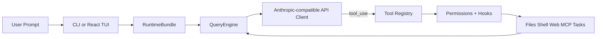

<h1 align="center">
  
  &nbsp;&nbsp;
  
  <br>
  <code>oh</code> — OpenHarness &amp; <code>ohmo</code>
</h1>

<p align="center">
  <a href="README.md"><strong>English</strong></a> ·
  <a href="README.zh-CN.md"><strong>简体中文</strong></a>
</p>

**OpenHarness** 提供核心的轻量级智能体基础设施：工具调用、技能（Skills）、记忆与多智能体协同。

**ohmo** 是基于 OpenHarness 构建的个人 AI 智能体——它不是另一个聊天机器人，而是一个能在长会话中真正为你工作的助手。你可以在飞书 / Slack / Telegram / Discord 中与 ohmo 对话，它会自行创建分支、编写代码、运行测试并提交 PR（Pull Request）。ohmo 直接运行在你现有的 Claude Code 或 Codex 订阅上——无需额外的 API Key。

**加入社区**：为开源智能体开发贡献你的力量。

<p align="center">
  <a href="#-quick-start"></a>
  <a href="#-harness-architecture"></a>
  <a href="#-features"></a>
  <a href="#-test-results"></a>
  <a href="LICENSE"></a>
</p>

<p align="center">
  
  
  
  
  
  <a href="https://github.com/HKUDS/OpenHarness/actions/workflows/ci.yml"></a>
  <a href="https://github.com/HKUDS/.github/blob/main/profile/README.md"></a>
  <a href="https://github.com/HKUDS/.github/blob/main/profile/README.md"></a>
</p>

一条命令（**oh**）即可启动 **OpenHarness**，解锁所有智能体基础设施。 

支持包括 OpenClaw、nanobot、Cursor 等在内的 CLI 智能体集成。

<p align="center">
  
</p>

---
## ✨ OpenHarness 的核心基础设施特性

<table align="center" width="100%">
<tr>
<td width="20%" align="center" style="vertical-align: top; padding: 15px;">

<h3>🔄 Agent Loop（智能体循环）</h3>

<div align="center">
  
</div>


<p align="center"><strong>• 流式工具调用循环</strong></p>
<p align="center"><strong>• 指数退避重试机制（Exponential Backoff）</strong></p>
<p align="center"><strong>• 并行工具执行</strong></p>
<p align="center"><strong>• Token 计数与成本追踪</strong></p>

</td>
<td width="20%" align="center" style="vertical-align: top; padding: 15px;">

<h3>🔧 Harness Toolkit（基础设施工具箱）</h3>

<div align="center">
  
</div>


<p align="center"><strong>• 43+ 工具（文件、Shell、搜索、网页、MCP）</strong></p>
<p align="center"><strong>• 按需加载技能（.md）</strong></p>
<p align="center"><strong>• 插件生态（Skills + Hooks + Agents）</strong></p>
<p align="center"><strong>• 兼容 anthropics/skills 与插件格式</strong></p>

</td>
<td width="20%" align="center" style="vertical-align: top; padding: 15px;">

<h3>🧠 Context & Memory（上下文与记忆）</h3>

<div align="center">
  
</div>


<p align="center"><strong>• CLAUDE.md 自动发现与注入</strong></p>
<p align="center"><strong>• 上下文压缩（Auto-Compact）</strong></p>
<p align="center"><strong>• MEMORY.md 持久化记忆</strong></p>
<p align="center"><strong>• 会话恢复与历史记录</strong></p>

</td>
<td width="20%" align="center" style="vertical-align: top; padding: 15px;">

<h3>🛡️ Governance（治理与安全）</h3>

<div align="center">
  
</div>


<p align="center"><strong>• 多级权限模式</strong></p>
<p align="center"><strong>• 路径级与命令规则限制</strong></p>
<p align="center"><strong>• PreToolUse / PostToolUse 生命周期钩子</strong></p>
<p align="center"><strong>• 交互式审批对话框</strong></p>

</td>
<td width="20%" align="center" style="vertical-align: top; padding: 15px;">

<h3>🤝 Swarm Coordination（集群协同）</h3>

<div align="center">
  
</div>


<p align="center"><strong>• 子智能体生成与任务委派</strong></p>
<p align="center"><strong>• 团队注册表与任务管理</strong></p>
<p align="center"><strong>• 后台任务生命周期管理</strong></p>
<p align="center"><strong>• <a href="https://github.com/HKUDS/ClawTeam">ClawTeam</a> 集成（路线图）</strong></p>

</td>
</tr>
</table>

---

## 🤔 什么是智能体基础设施（Agent Harness）？

**智能体基础设施（Agent Harness）** 是包裹在大型语言模型（LLM）外部的完整基础架构，使其成为可实际运行的智能体。模型提供智力；基础设施则提供**双手、双眼、记忆与安全边界**。

<p align="center">
  
</p>

OpenHarness 是一个开源的 Python 实现，专为**研究人员、开发者与社区**设计：

- **理解（Understand）** 生产级 AI 智能体的底层工作原理
- **实验（Experiment）** 前沿工具、技能与多智能体协同模式
- **扩展（Extend）** 通过自定义插件、提供商适配与领域知识扩展基础设施
- **构建（Build）** 在成熟架构之上开发专用智能体

---

## 📰 更新日志

- **未发布** 🔍 **安全预览（Dry-run safe preview）：**
  - `oh --dry-run` 可在不执行模型、工具或子智能体的情况下，预览解析后的运行时设置、认证状态、技能、命令、工具及配置的 MCP 服务器。
  - 安全预览现在会报告 `ready`（就绪）/ `warning`（警告）/ `blocked`（阻塞）的状态判定，并提供具体建议，如修复认证、修正 MCP 配置或直接运行提示词。
  - 提示词预览会显示可能匹配的技能与工具；斜杠命令预览则标明该命令主要是只读操作还是状态变更操作。
- **2026-04-18** ⚙️ **v0.1.7** — 打包优化与 TUI 体验提升：
  - 安装脚本现在将 `oh`、`ohmo` 和 `openharness` 链接至 `~/.local/bin`，而非修改 `PATH` 环境变量前置虚拟环境目录，从而避免覆盖 Conda 管理的 Shell。
  - React TUI 现在支持使用 `Shift+Enter` 插入换行符，同时保留普通 `Enter` 作为提交键。
  - React TUI 中的忙碌状态动画在 Windows 终端下更安静且不易出错，采用保守的旋转帧设计并减少闪烁。
- **2026-04-10** 🧠 **v0.1.6** — 自动紧凑化与 Markdown TUI：
  - 自动紧凑化（Auto-Compaction）可在上下文压缩时保留任务状态与频道日志——智能体可运行多日会话而无需手动紧凑/清理。
  - 子进程队友以无头工作模式运行；智能体团队创建功能已稳定。
  - 助手消息现在可在 React TUI 中完整渲染 Markdown。
  - `ohmo` 新增频道斜杠命令与多模态附件支持。
- **2026-04-08** 🔌 **v0.1.5** — MCP HTTP 传输与集群轮询：
  - MCP 协议新增 HTTP 传输支持，断线自动重连，并兼容仅工具服务器。
  - 自动推断 MCP 工具输入的 JSON Schema 类型——无需手动映射类型。
  - `ohmo` 频道支持文件附件与多模态网关消息。
  - 实时运行中现可轮询子进程智能体；权限弹窗已序列化以防止输入被吞没。
- **2026-04-08** 🌙 **v0.1.4** — 多提供商认证与 Moonshot/Kimi：
  - 原生支持 Moonshot/Kimi 提供商，为思维模型提供 `reasoning_content` 支持。
  - 认证重构：修复了切换提供商时的密钥不匹配问题、`OPENAI_BASE_URL` 环境变量覆盖逻辑及按配置档案（profile）优先级的凭证管理。
  - MCP 在 `call_tool` / `read_resource` 中优雅处理断连服务器。
  - 安全增强：PermissionChecker 内置敏感路径保护，强化 `web_fetch` URL 验证。
  - 稳定性提升：Ink TUI 增加 EIO 崩溃恢复、`--debug` 日志记录及 Windows cmd 闪烁修复。
- **2026-04-06** 🚀 **v0.1.2** — 统一配置流程与 `ohmo` 个人智能体应用：
  - `oh setup` 现在以工作流形式引导提供商选择，而非暴露底层认证/提供商内部细节。
  - 兼容 API 设置现按配置档案（profile）隔离，Anthropic/OpenAI 兼容端点可独立管理密钥。
  - `ohmo` 作为打包应用发布，包含 `~/.ohmo` 工作区、网关、引导提示词及频道配置流程。
- **2026-04-01** 🎨 **v0.1.0** — 初始开源发布，包含完整的基础设施架构： 

<p align="center">
  <strong>从这里开始：</strong>
  <a href="#-quick-start">快速入门</a> ·
  <a href="#-provider-compatibility">提供商兼容性</a> ·
  <a href="docs/SHOWCASE.md">案例展示</a> ·
  <a href="CONTRIBUTING.md">贡献指南</a> ·
  <a href="CHANGELOG.md">更新日志</a>
</p>

---

## 🚀 快速入门

### 1. 安装

#### Linux / macOS / WSL

```bash
# One-click install
curl -fsSL https://raw.githubusercontent.com/HKUDS/OpenHarness/main/scripts/install.sh | bash

# Or via pip
pip install openharness-ai
```

#### Windows (Native)

```powershell
# One-click install (PowerShell)
iex (Invoke-WebRequest -Uri 'https://raw.githubusercontent.com/HKUDS/OpenHarness/main/scripts/install.ps1')

# Or via pip
pip install openharness-ai
```

**注意**：Windows 现已原生支持。在 PowerShell 中请使用 `openh` 代替 `oh`，因为 `oh` 可能会与内置的 `Out-Host` 别名冲突。

### 2. 配置

```bash
oh setup    # interactive wizard — pick a provider, authenticate, done
# On Windows PowerShell, use: openh setup
```

支持 **Claude / OpenAI / Copilot / Codex / Moonshot(Kimi) / GLM / MiniMax / NVIDIA NIM** 及任何兼容端点。

### 3. 运行

```bash
oh
# On Windows PowerShell, use: openh
```

<p align="center">
  
</p>

### 4. 配置 ohmo（个人智能体）

想要一个能在飞书 / Slack / Telegram / Discord 中为你工作的 AI 助手？

```bash
ohmo init             # initialize ~/.ohmo workspace
ohmo config           # configure channels and provider
ohmo gateway start    # start the gateway — ohmo is now live in your chat app
```

ohmo 直接运行在你现有的 **Claude Code 订阅**或 **Codex 订阅**上——无需额外的 API Key。

### 非交互模式（管道与脚本）

```bash
# Single prompt → stdout
oh -p "Explain this codebase"

# JSON output for programmatic use
oh -p "List all functions in main.py" --output-format json

# Stream JSON events in real-time
oh -p "Fix the bug" --output-format stream-json
```

### 安全预览（Dry Run）

当你希望在任何实际执行开始前检查 OpenHarness 将要使用的配置时，请使用 `--dry-run`。

```bash
# Preview an interactive session setup
oh --dry-run

# Preview one prompt without executing the model or tools
oh --dry-run -p "Review this bug fix and grep for failing tests"

# Preview a slash command path
oh --dry-run -p "/plugin list"

# Get structured output for scripts or channels
oh --dry-run -p "Explain this repository" --output-format json
```

安全预览为静态检查模式：

- 它**不会**调用模型
- 它**不会**执行工具或生成子智能体
- 它**不会**连接 MCP 服务器
- 但它**会**解析设置、认证状态、提示词组装、技能、命令、工具以及明显的 MCP 配置问题

就绪等级说明：

- `ready`：配置看起来可用；下一步建议通常是直接运行提示词。
- `warning`：OpenHarness 可以解析会话，但某些关键项仍存在问题，例如损坏的 MCP 配置或缺乏后续模型工作所需的认证。
- `blocked`：当前路径无法成功执行，例如未知的斜杠命令或无法解析运行时客户端的提示词。

安全预览输出中的 `next actions`（下一步操作）会告诉你最短的修复或跟进步骤，例如：

- 运行 `oh auth login`
- 修复或禁用损坏的 MCP 配置
- 直接使用 `oh -p "..."` 运行提示词，或使用 `oh` 打开交互式界面。

## 🔌 提供商兼容性

OpenHarness 将提供商视为由命名配置档案（profile）支持的**工作流**。日常使用中，建议优先：

```bash
oh setup
oh provider list
oh provider use <profile>
```

### 内置工作流

| Workflow | What it is | Typical backends |
|----------|------------|------------------|
| **Anthropic-Compatible API** | Anthropic-style request format | Claude official, Kimi, GLM, MiniMax, internal Anthropic-compatible gateways |
| **Claude Subscription** | Claude CLI subscription bridge | Local `~/.claude/.credentials.json` |
| **OpenAI-Compatible API** | OpenAI-style request format | OpenAI official, OpenRouter, DashScope, DeepSeek, SiliconFlow, Groq, Ollama, GitHub Models |
| **Codex Subscription** | Codex CLI subscription bridge | Local `~/.codex/auth.json` |
| **GitHub Copilot** | Copilot OAuth workflow | GitHub Copilot device-flow login |

### 兼容 API 家族

#### Anthropic-Compatible API

典型示例：

| Backend | Base URL | Example models |
|---------|----------|----------------|
| **Claude official** | `https://api.anthropic.com` | `claude-sonnet-4-6`, `claude-opus-4-6` |
| **Moonshot / Kimi** | `https://api.moonshot.cn/anthropic` | `kimi-k2.5` |
| **Zhipu / GLM** | custom Anthropic-compatible endpoint | `glm-4.5` |
| **MiniMax** | custom Anthropic-compatible endpoint | `minimax-m1` |

#### OpenAI-Compatible API

任何实现 OpenAI `/v1/chat/completions` 风格 API 的提供商均可工作：

| Backend | Base URL | Example models |
|---------|----------|----------------|
| **OpenAI** | `https://api.openai.com/v1` | `gpt-5.4`, `gpt-4.1` |
| **OpenRouter** | `https://openrouter.ai/api/v1` | provider-specific |
| **Alibaba DashScope** | `https://dashscope.aliyuncs.com/compatible-mode/v1` | `qwen3.5-flash`, `qwen3-max`, `deepseek-r1` |
| **DeepSeek** | `https://api.deepseek.com` | `deepseek-chat`, `deepseek-reasoner` |
| **GitHub Models** | `https://models.inference.ai.azure.com` | `gpt-4o`, `Meta-Llama-3.1-405B-Instruct` |
| **SiliconFlow** | `https://api.siliconflow.cn/v1` | `deepseek-ai/DeepSeek-V3` |
| **NVIDIA NIM** | `https://integrate.api.nvidia.com/v1` | `openai/gpt-oss-120b`, `nvidia/llama-3.3-nemotron-super-49b-v1` |
| **Google Gemini** | `https://generativelanguage.googleapis.com/v1beta/openai` | `gemini-2.5-flash`, `gemini-2.5-pro` |
| **Groq** | `https://api.groq.com/openai/v1` | `llama-3.3-70b-versatile` |
| **Ollama (local)** | `http://localhost:11434/v1` | any local model |

### 高级配置档案管理

```bash
# List saved workflows
oh provider list

# Switch the active workflow
oh provider use codex

# Add your own compatible endpoint
oh provider add my-endpoint \
  --label "My Endpoint" \
  --provider openai \
  --api-format openai \
  --auth-source openai_api_key \
  --model my-model \
  --base-url https://example.com/v1
```

对于自定义兼容端点，OpenHarness 可按配置档案绑定凭证，而非强制所有 Anthropic-compatible 或 OpenAI-compatible 后端共享同一个 API Key。

### Ollama（本地模型）

通过 Ollama 的 OpenAI 兼容端点运行本地模型：

```bash
# Add an Ollama provider profile
oh provider add ollama \
  --label "Ollama" \
  --provider Ollama \
  --api-format openai \
  --auth-source openai_api_key \
  --model glm-4.7-flash:q8_0 \
  --base-url http://localhost:11434/v1
```
```
Saved provider profile: ollama
```

```bash
# Activate and verify
oh provider use ollama
```
```
Activated provider profile: ollama
```

```bash
oh provider list
```
```
  claude-api: Anthropic-Compatible API [ready]
  ...
  moonshot: Moonshot (Kimi) [missing auth]
    auth=moonshot_api_key model=kimi-k2.5 base_url=https://api.moonshot.cn/v1
* ollama: Ollama [ready]
    auth=openai_api_key model=glm-4.7-flash:q8_0 base_url=http://localhost:11434/v1
```

### GitHub Copilot 格式（`--api-format copilot`）

使用你现有的 GitHub Copilot 订阅作为 LLM 后端。认证采用 GitHub OAuth 设备流——无需 API Key。

```bash
# One-time login (opens browser for GitHub authorization)
oh auth copilot-login

# Then launch with Copilot as the provider
uv run oh --api-format copilot

# Or via environment variable
export OPENHARNESS_API_FORMAT=copilot
uv run oh

# Check auth status
oh auth status

# Remove stored credentials
oh auth copilot-logout
```

| Feature | Details |
|---------|---------|
| **Auth method** | GitHub OAuth device flow (no API key needed) |
| **Token management** | Automatic refresh of short-lived session tokens |
| **Enterprise** | Supports GitHub Enterprise via `--github-domain` flag |
| **Models** | Uses Copilot's default model selection |
| **API** | OpenAI-compatible chat completions under the hood |

---

## 🏗️ 基础设施架构（Harness Architecture）

OpenHarness 实现了核心智能体基础设施模式，包含 10 个子系统：

```
openharness/
  engine/          # 🧠 Agent Loop — query → stream → tool-call → loop
  tools/           # 🔧 43 Tools — file I/O, shell, search, web, MCP
  skills/          # 📚 Knowledge — on-demand skill loading (.md files)
  plugins/         # 🔌 Extensions — commands, hooks, agents, MCP servers
  permissions/     # 🛡️ Safety — multi-level modes, path rules, command deny
  hooks/           # ⚡ Lifecycle — PreToolUse/PostToolUse event hooks
  commands/        # 💬 54 Commands — /help, /commit, /plan, /resume, ...
  mcp/             # 🌐 MCP — Model Context Protocol client
  memory/          # 🧠 Memory — persistent cross-session knowledge
  tasks/           # 📋 Tasks — background task management
  coordinator/     # 🤝 Multi-Agent — subagent spawning, team coordination
  prompts/         # 📝 Context — system prompt assembly, CLAUDE.md, skills
  config/          # ⚙️ Settings — multi-layer config, migrations
  ui/              # 🖥️ React TUI — backend protocol + frontend
```

### 智能体循环（The Agent Loop）

基础设施的核心。单一循环，无限可组合：

```python
while True:
    response = await api.stream(messages, tools)
    
    if response.stop_reason != "tool_use":
        break  # Model is done
    
    for tool_call in response.tool_uses:
        # Permission check → Hook → Execute → Hook → Result
        result = await harness.execute_tool(tool_call)
    
    messages.append(tool_results)
    # Loop continues — model sees results, decides next action
```

模型决定**做什么**。基础设施处理**怎么做**——安全、高效且具备完整的可观测性。

### 基础设施流程（Harness Flow）



---

## ✨ 功能特性

### 🔧 工具（43+）

| Category | Tools | Description |
|----------|-------|-------------|
| **File I/O** | Bash, Read, Write, Edit, Glob, Grep | Core file operations with permission checks |
| **Search** | WebFetch, WebSearch, ToolSearch, LSP | Web and code search capabilities |
| **Notebook** | NotebookEdit | Jupyter notebook cell editing |
| **Agent** | Agent, SendMessage, TeamCreate/Delete | Subagent spawning and coordination |
| **Task** | TaskCreate/Get/List/Update/Stop/Output | Background task management |
| **MCP** | MCPTool, ListMcpResources, ReadMcpResource | Model Context Protocol integration |
| **Mode** | EnterPlanMode, ExitPlanMode, Worktree | Workflow mode switching |
| **Schedule** | CronCreate/List/Delete, RemoteTrigger | Scheduled and remote execution |
| **Meta** | Skill, Config, Brief, Sleep, AskUser | Knowledge loading, configuration, interaction |

每个工具均具备：
- **Pydantic 输入验证** — 结构化、类型安全的输入
- **自描述 JSON Schema** — 模型可自动理解工具
- **权限集成** — 每次执行前进行检查
- **钩子支持** — PreToolUse/PostToolUse 生命周期事件

### 📚 技能系统（Skills System）

技能是**按需加载的知识**——仅在模型需要时载入：

```
Available Skills:
- commit: Create clean, well-structured git commits
- review: Review code for bugs, security issues, and quality
- debug: Diagnose and fix bugs systematically
- plan: Design an implementation plan before coding
- test: Write and run tests for code
- simplify: Refactor code to be simpler and more maintainable
- pdf: PDF processing with pypdf (from anthropics/skills)
- xlsx: Excel operations (from anthropics/skills)
- ... 40+ more
```

技能可存放于内置、用户级、ohmo、项目或插件目录中。用户级技能从以下路径加载：

```text
~/.openharness/skills/<skill>/SKILL.md
~/.claude/skills/<skill>/SKILL.md
~/.agents/skills/<skill>/SKILL.md
```

项目级技能默认启用，并从当前工作目录向上搜索至 git 根目录：

```text
<project>/.openharness/skills/<skill>/SKILL.md
<project>/.agents/skills/<skill>/SKILL.md
<project>/.claude/skills/<skill>/SKILL.md
```

对于不受信任的仓库，可通过以下命令禁用项目级技能：

```bash
oh config set allow_project_skills false
```

使用 `/skills` 可查看已加载的技能及其来源和路径。用户可调用的技能可直接作为斜杠命令运行，例如 `/deploy staging`。

**兼容 [anthropics/skills](https://github.com/anthropics/skills)** — 使用上述 `SKILL.md` 目录结构即可。

### 🌐 网页搜索与代理设置

内置的 `web_search` 默认使用 DuckDuckGo HTML 搜索。在该端点不可达的地区，可将 OpenHarness 指向受信任的公共 HTML 搜索端点或你自己的 SearXNG 实例：

```bash
export OPENHARNESS_WEB_SEARCH_URL="https://your-searxng.example/search"
```

`web_search` 和 `web_fetch` 默认保持 `trust_env=False` 以防 SSRF，因此它们不会自动继承 `HTTP_PROXY` / `HTTPS_PROXY`。如需使用代理，请通过 OpenHarness 专用环境变量启用：

```bash
export OPENHARNESS_WEB_PROXY="http://127.0.0.1:7890"
```

代理 URL 必须为 HTTP/HTTPS，且不能包含嵌入式凭证。

### 🔌 插件系统（Plugin System）

**兼容 [claude-code plugins](https://github.com/anthropics/claude-code/tree/main/plugins)**。已通过 12 个官方插件测试：

| Plugin | Type | What it does |
|--------|------|-------------|
| `commit-commands` | Commands | Git commit, push, PR workflows |
| `security-guidance` | Hooks | Security warnings on file edits |
| `hookify` | Commands + Agents | Create custom behavior hooks |
| `feature-dev` | Commands | Feature development workflow |
| `code-review` | Agents | Multi-agent PR review |
| `pr-review-toolkit` | Agents | Specialized PR review agents |

```bash
# Manage plugins
oh plugin list
oh plugin install <source>
oh plugin enable <name>
```

### 🤝 生态工作流（Ecosystem Workflows）

OpenHarness 可作为围绕 Claude 风格工具约定构建的轻量级基础设施层使用：

- **面向 OpenClaw 的工作流**可复用基于 Markdown 的知识与命令驱动的协作模式。
- **Claude 风格的插件与技能**保持便携，因为 OpenHarness 保留了熟悉的数据格式。
- **类 ClawTeam 的多智能体工作**完美映射到内置的团队、任务与后台执行原语。

如需具体使用案例而非泛泛而谈，请参阅 [`docs/SHOWCASE.md`](docs/SHOWCASE.md)。

### 🛡️ 权限管理（Permissions）

多级安全控制，支持细粒度配置：

| Mode | Behavior | Use Case |
|------|----------|----------|
| **Default** | Ask before write/execute | Daily development |
| **Auto** | Allow everything | Sandboxed environments |
| **Plan Mode** | Block all writes | Large refactors, review first |

`settings.json` 中的**路径级规则**：
```json
{
  "permission": {
    "mode": "default",
    "path_rules": [{"pattern": "/etc/*", "allow": false}],
    "denied_commands": ["rm -rf /", "DROP TABLE *"]
  }
}
```

### 🖥️ 终端 UI（Terminal UI）

React/Ink TUI，提供完整的交互体验：

- **命令选择器**：输入 `/` → 方向键选择 → Enter
- **权限对话框**：交互式 y/n 确认并显示工具详情
- **模式切换器**：`/permissions` → 从列表中选择
- **会话恢复**：`/resume` → 从历史记录中选取
- **动态加载指示器**：工具执行期间的实时反馈
- **键盘快捷键**：底部显示，上下文感知

### 📡 CLI

```
oh [OPTIONS] COMMAND [ARGS]

Session:     -c/--continue, -r/--resume, -n/--name
Model:       -m/--model, --effort, --max-turns
Output:      -p/--print, --output-format text|json|stream-json
Permissions: --permission-mode, --dangerously-skip-permissions
Context:     -s/--system-prompt, --append-system-prompt, --settings
Advanced:    -d/--debug, --mcp-config, --bare

Subcommands: oh setup | oh provider | oh auth | oh mcp | oh plugin
```

### 🧑‍💼 ohmo 个人智能体（Personal Agent）

`ohmo` 是基于 OpenHarness 构建的个人智能体应用。它与 `oh` 打包发布，拥有独立的工作区与网关：

```bash
# Initialize personal workspace
ohmo init

# Configure gateway channels and pick a provider profile
ohmo config

# Run the personal agent
ohmo

# Run the gateway in foreground
ohmo gateway run

# Check or restart the gateway
ohmo gateway status
ohmo gateway restart
```

核心概念：

- `~/.ohmo/`
  - 个人工作区根目录
- `soul.md`
  - 长期智能体人格与行为设定
- `identity.md`
  - `ohmo` 的身份定义
- `user.md`
  - 用户画像与偏好设置
- `BOOTSTRAP.md`
  - 首次运行引导仪式
- `memory/`
  - 个人记忆存储
- `gateway.json`
  - 选定的提供商配置档案与频道配置

`ohmo config` 使用与 `oh setup` 相同的工作流语言，因此你可将个人智能体网关指向：

- `Anthropic-Compatible API`
- `Claude Subscription`
- `OpenAI-Compatible API`
- `Codex Subscription`
- `GitHub Copilot`

`ohmo init` 仅创建一次主工作区。此后使用 `ohmo config` 更新提供商与频道设置；若网关已在运行，配置流程可自动为你重启它。

目前 `ohmo init` / `ohmo config` 支持引导以下平台的频道配置：

- Telegram
- Slack
- Discord
- Feishu（飞书）

---

## 📊 测试结果

| Suite | Tests | Status |
|-------|-------|--------|
| Unit + Integration | 114 | ✅ All passing |
| CLI Flags E2E | 6 | ✅ Real model calls |
| Harness Features E2E | 9 | ✅ Retry, skills, parallel, permissions |
| React TUI E2E | 3 | ✅ Welcome, conversation, status |
| TUI Interactions E2E | 4 | ✅ Commands, permissions, shortcuts |
| Real Skills + Plugins | 12 | ✅ anthropics/skills + claude-code/plugins |

```bash
# Run all tests
uv run pytest -q                           # 114 unit/integration
python scripts/test_harness_features.py     # Harness E2E
python scripts/test_real_skills_plugins.py  # Real plugins E2E
```

---

## 🔧 扩展 OpenHarness

### 添加自定义工具（Add a Custom Tool）

```python
from pydantic import BaseModel, Field
from openharness.tools.base import BaseTool, ToolExecutionContext, ToolResult

class MyToolInput(BaseModel):
    query: str = Field(description="Search query")

class MyTool(BaseTool):
    name = "my_tool"
    description = "Does something useful"
    input_model = MyToolInput

    async def execute(self, arguments: MyToolInput, context: ToolExecutionContext) -> ToolResult:
        return ToolResult(output=f"Result for: {arguments.query}")
```

### 添加自定义技能（Add a Custom Skill）

创建 `~/.openharness/skills/my-skill.md`：

```markdown
---
name: my-skill
description: Expert guidance for my specific domain
---

# My Skill

## When to use
Use when the user asks about [your domain].

## Workflow
1. Step one
2. Step two
...
```

### 添加插件（Add a Plugin）

创建 `.openharness/plugins/my-plugin/.claude-plugin/plugin.json`：

```json
{
  "name": "my-plugin",
  "version": "1.0.0",
  "description": "My custom plugin"
}
```

在 `commands/*.md` 中添加命令，在 `hooks/hooks.json` 中添加钩子，在 `agents/*.md` 中添加智能体。

---

## 🌍 案例展示（Showcase）

当将 OpenHarness 视为一个小型、可检查且可按实际工作流定制的基础设施时，它的价值最大：

- **仓库编码助手**：用于阅读代码、修补文件并在本地运行检查。
- **无头脚本工具**：在自动化流程中提供 `json` 和 `stream-json` 输出。
- **插件与技能测试场**：用于实验类 Claude 风格的扩展功能。
- **多智能体原型基础设施**：用于任务委派与后台执行。
- **提供商对比沙盒**：跨 Anthropic-compatible 后端进行模型对比。

请参阅 [`docs/SHOWCASE.md`](docs/SHOWCASE.md) 获取简短、可复现的示例。

---

## 🤝 贡献指南（Contributing）

OpenHarness 是一个**社区驱动的研究项目**。我们欢迎以下领域的贡献：

| Area | Examples |
|------|---------|
| **Tools** | New tool implementations for specific domains |
| **Skills** | Domain knowledge `.md` files (finance, science, DevOps...) |
| **Plugins** | Workflow plugins with commands, hooks, agents |
| **Providers** | Support for more LLM backends (OpenAI, Ollama, etc.) |
| **Multi-Agent** | Coordination protocols, team patterns |
| **Testing** | E2E scenarios, edge cases, benchmarks |
| **Documentation** | Architecture guides, tutorials, translations |

```bash
# Development setup
git clone https://github.com/HKUDS/OpenHarness.git
cd OpenHarness
uv sync --extra dev
uv run pytest -q  # Verify everything works
```

有用的贡献者入口：

- [`CONTRIBUTING.md`](CONTRIBUTING.md) 了解设置、检查项与 PR 规范
- [`CHANGELOG.md`](CHANGELOG.md) 查看面向用户的变更说明
- [`docs/SHOWCASE.md`](docs/SHOWCASE.md) 获取值得记录的实战使用模式

---

## 🔧 故障排除（Troubleshooting）

### macOS Terminal.app 中的退格键问题

OpenHarness 兼容两种常见的终端删除序列，包括 macOS Terminal.app 发送的原始 `DEL` 字节（`0x7f`）作为退格键。如果按退格键时插入空格或显示控制字符而非删除文本，请先升级 OpenHarness。

对于未包含此修复的旧版本，请使用发送标准退格序列的终端，或将键盘配置文件调整为临时解决方案。

---

## 📄 许可证（License）

MIT — 详见 [LICENSE](LICENSE)。

---

<p align="center">
  
  <br>
  <strong>Oh my Harness!</strong>
  <br>
  <em>The model is the agent. The code is the harness.</em>
</p>

<div align="center">
  <a href="https://star-history.com/#HKUDS/OpenHarness&Date">
    <picture>
      <source media="(prefers-color-scheme: dark)" srcset="https://api.star-history.com/svg?repos=HKUDS/OpenHarness&type=Date&theme=dark" />
      <source media="(prefers-color-scheme: light)" srcset="https://api.star-history.com/svg?repos=HKUDS/OpenHarness&type=Date" />
      
    </picture>
  </a>
</div>

<p align="center">
  <em> Thanks for visiting ✨ OpenHarness!</em><br><br>
  
</p>