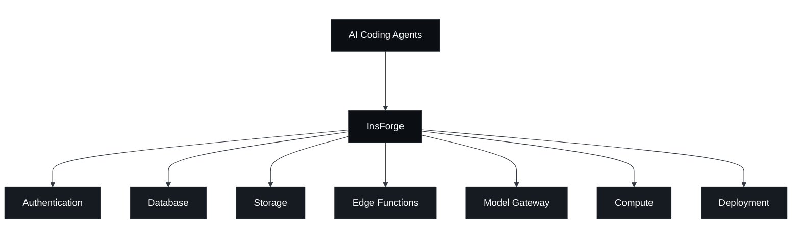

<div align="center">
  <a href="https://insforge.dev">
    <picture>
      <source media="(prefers-color-scheme: dark)" srcset="assets/logo-dark.svg">
      <source media="(prefers-color-scheme: light)" srcset="assets/logo-light.svg">
      
    </picture>
  </a>

  <p>
    面向 AI Agent 编程的一体化开源后端平台。<br />
  </p>

  <p>
    <a href="https://opensource.org/licenses/Apache-2.0"></a>
    <a href="https://www.npmjs.com/package/@insforge/sdk"></a>
    <a href="https://github.com/InsForge/InsForge/graphs/contributors"></a>
    <a href="https://insforge.dev"></a>
    <a href="https://gitcgr.com/InsForge/InsForge">
      
    </a>
  </p>
  <p>
    <a href="https://x.com/InsForge"></a>
    <a href="https://www.linkedin.com/company/insforge"></a>
    <a href="https://discord.com/invite/MPxwj5xVvW"></a>
  </p>
  <a href="https://trendshift.io/repositories/19834" target="_blank">
    
  </a>
  <br /><br />
  <a href="https://vercel.com/oss">
    
  </a>
</div>

<p align="center">
  ⭐ <em>帮助我们触达更多开发者，壮大 InsForge 社区。给这个仓库点个 Star！</em>
</p>

## InsForge
面向 AI Agent 编程的一体化开源后端平台。InsForge 为你的编程 Agent 提供数据库、身份认证（Auth）、存储、计算能力、托管服务以及 AI 网关，助你端到端地交付全栈应用。

https://github.com/user-attachments/assets/345efbc6-ca63-4189-bde0-12ef3bda561b

### 工作原理

编程 Agent 可通过以下两种接口之一与 InsForge 交互：

- **MCP Server**（支持自托管和云端）：将 InsForge 的操作暴露为工具，任何兼容 MCP 的 Agent 均可调用。
- **CLI + Skills**（仅云端）：命令行界面搭配 Skills，Agent 可直接在终端中调用。

这两种接口都让编程 Agent 能够像后端工程师一样操作后端服务：

- **读取后端上下文与状态**：拉取文档、数据库 Schema、元数据（已部署的函数、Bucket 内容、认证配置）和运行时日志，确保 Agent 拥有编写代码、验证构建结果以及调试故障所需的信息。
- **配置基础资源**：直接部署边缘函数、执行数据库迁移、创建存储 Bucket、设置认证提供商以及其他后端资源配置。



### 核心产品：
- **身份认证（Authentication）**：用户管理、登录认证与会话管理
- **数据库（Database）**：PostgreSQL 关系型数据库
- **存储（Storage）**：兼容 S3 协议的文件存储
- **模型网关（Model Gateway）**：跨多家大语言模型（LLM）提供商的 OpenAI 兼容 API
- **边缘函数（Edge Functions）**：运行在边缘节点的无服务器代码
- **计算服务（Compute，私有预览中）**：长期运行的容器服务
- **站点部署（Site Deployment）**：网站构建与部署


## ⭐️ 点亮仓库 (Star)

<p align="center">
  
</p>

如果你觉得 InsForge 有用或有趣，欢迎在 GitHub 上点亮 Star ⭐️ 支持我们！

## 快速开始

### 云端托管：[insforge.dev](https://insforge.dev)

<a href="https://insforge.dev" target="_blank" rel="noopener noreferrer"></a>

### 自托管（Docker Compose）

**前置条件**：[Docker](https://www.docker.com/) + [Node.js](https://nodejs.org/)

#### 1. 环境配置

你可以通过 Docker Compose 在本地运行 InsForge。这将在你的机器上启动一个本地的 InsForge 实例。

[![Deploy on Docker][docker-btn]][docker-deploy]

或从源码运行：
```bash
# Run with Docker
git clone https://github.com/InsForge/InsForge.git
cd insforge
cp .env.example .env
docker compose -f docker-compose.prod.yml up
```

#### 2. 连接 InsForge MCP

打开 [http://localhost:7130](http://localhost:7130)

按照提示步骤连接 InsForge MCP Server。

<div align="center">
  
</div>

#### 3. 验证安装

要验证连接，请将以下 Prompt（提示词）发送给你的 Agent：
```
I'm using InsForge as my backend platform, call InsForge MCP's fetch-docs tool to learn about InsForge instructions.
```

#### 4. 运行多个项目

你可以通过使用不同的端口和项目名，在同一台主机上运行多个 InsForge 项目。

```bash
# Create a separate env file for each project
cp .env.example .env.project1
cp .env.example .env.project2
```

修改 `.env.project2` 中的不同端口：
```
POSTGRES_PORT=5442
POSTGREST_PORT=5440
APP_PORT=7230
AUTH_PORT=7231
DENO_PORT=7233
```

为每个项目指定唯一的名称启动：
```bash
docker compose -f docker-compose.prod.yml --env-file .env.project1 -p project1 up -d
docker compose -f docker-compose.prod.yml --env-file .env.project2 -p project2 up -d
```

每个项目都拥有独立的数据库、存储和配置。你可以通过以下命令管理它们：
```bash
docker compose -f docker-compose.prod.yml --env-file .env.project1 -p project1 ps      # status
docker compose -f docker-compose.prod.yml --env-file .env.project1 -p project1 logs -f  # logs
docker compose -f docker-compose.prod.yml --env-file .env.project1 -p project1 down     # stop
```

### 一键部署

除了在本地运行，你还可以使用预配置的环境快速启动 InsForge。这样无需在本地安装 Docker 即可迅速上手。

| Railway | Zeabur | Sealos |
| --- | --- | --- |
| [](https://railway.com/deploy/insforge) | [](https://zeabur.com/templates/Q82M3Y) | [](https://sealos.io/products/app-store/insforge) |


## 贡献指南

**参与贡献**：如果你有兴趣参与开发，可以查看我们的[贡献指南](CONTRIBUTING.md)。我们非常感谢所有的 Pull Request（PR），任何形式的帮助我们都十分感激！

**技术支持**：如果你需要任何帮助或支持，欢迎在我们的 [Discord 频道](https://discord.com/invite/MPxwj5xVvW)留言，或直接发送邮件至 [info@insforge.dev](mailto:info@insforge.dev)。


## 文档与支持

### 官方文档
- **[Official Docs](https://docs.insforge.dev/introduction)** - 全面的开发指南与 API 参考手册

### 社区交流
- **[Discord](https://discord.com/invite/MPxwj5xVvW)** - 加入我们活跃的开发者社区
- **[Twitter (X)](https://x.com/InsForge)** - 关注动态与实用技巧

### 联系方式
- **邮箱**：info@insforge.dev

## 许可证

本项目采用 Apache License 2.0 开源协议授权 - 详见 [LICENSE](LICENSE) 文件。

---

[](https://www.star-history.com/#InsForge/InsForge&Date)

## 徽章展示

展示你的项目由 InsForge 构建。

### Made with InsForge

<a href="https://insforge.dev">
  
</a>

**Markdown：**
```md
[](https://insforge.dev)
```

**HTML：**
```html
<a href="https://insforge.dev">
  
</a>
```

### Made with InsForge (dark)

<a href="https://insforge.dev">
  
</a>

**Markdown：**
```md
[](https://insforge.dev)
```

**HTML：**
```html
<a href="https://insforge.dev">
  
</a>
```


<p align="center">⭐ <b>在 GitHub 上点亮 Star，第一时间获取新版本更新通知！</b></p>

<!-- LINK GROUPS -->

[docker-btn]: ./deploy/buttons/docker.png
[docker-deploy]: ./deploy/docker-deploy.md