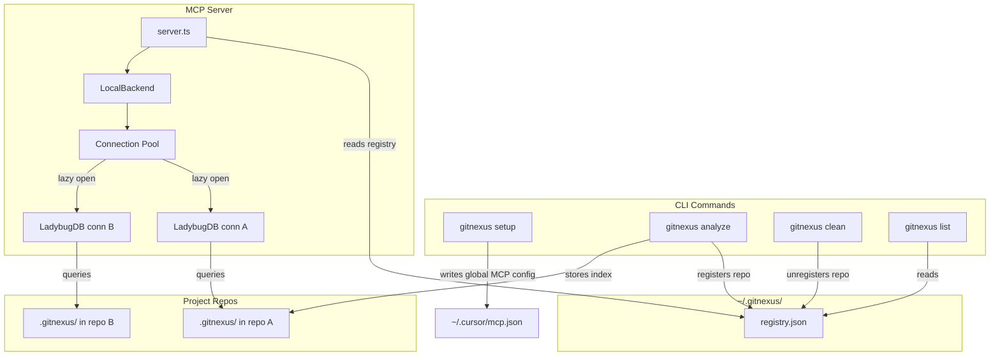
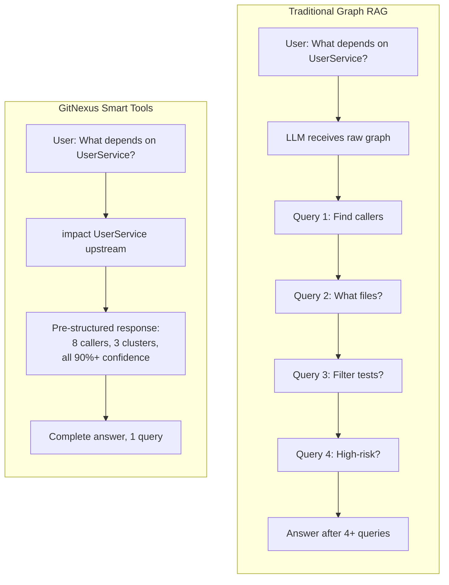

# GitNexus

**⚠️ 重要提示：** GitNexus **没有**官方加密货币、代币或币种。在 Pump.fun 或其他任何平台上使用 GitNexus 名称的任何代币/币种均**与本项目的维护者无关，未获本项目认可，也不是由本项目创建的**。请勿购买声称与 GitNexus 相关的任何加密货币。

<div align="center">

  <a href="https://trendshift.io/repositories/19809" target="_blank">
    
  </a>

  <h2>加入官方 Discord 讨论想法、问题等！</h2>

  <a href="https://discord.gg/MgJrmsqr62">
    
  </a>
  <a href="https://www.npmjs.com/package/gitnexus">
    
  </a>
  <a href="https://polyformproject.org/licenses/noncommercial/1.0.0/">
    
  </a>
  <a href="https://securityscorecards.dev/viewer/?uri=github.com/abhigyanpatwari/GitNexus">
    
  </a>

  <p><strong>企业版（SaaS 与自托管）</strong> - <a href="https://akonlabs.com">akonlabs.com</a></p>

</div>

**为 Agent 上下文构建“神经系统”。**

将任意代码库索引为知识图谱——涵盖每个依赖项、调用链、聚类簇和执行流程——然后通过智能工具暴露这些结构，确保 AI Agent 不会遗漏任何代码。

https://github.com/user-attachments/assets/172685ba-8e54-4ea7-9ad1-e31a3398da72

> _比 DeepWiki 更深入_。DeepWiki 帮助你 _理解_ 代码，而 GitNexus 让你能够 _分析_ 它——因为知识图谱追踪的是每一个关系，而不仅仅是描述。

**TL;DR（太长不看）：** **Web UI** 是与任意仓库快速对话的快捷方式。**CLI + MCP** 则是让你的 AI Agent 真正可靠的方法——它为 Cursor、Claude Code、Antigravity、Codex 等工具提供代码库的深度架构视图，使它们不再遗漏依赖项、破坏调用链或盲目提交修改。即使是较小的模型也能获得完整的架构清晰度，从而媲美大型模型（Goliath models）。

---

## Star History

[](https://www.star-history.com/#abhigyanpatwari/GitNexus&type=date&legend=top-left)

## 两种使用方式

|             | **CLI + MCP**                                                         | **Web UI**                                                           |
| ----------- | --------------------------------------------------------------------- | -------------------------------------------------------------------- |
| **用途**    | 本地索引仓库，通过 MCP 连接 AI Agent                                    | 浏览器中的可视化图探索器 + AI 对话                                   |
| **适用场景** | 日常开发（配合 Cursor、Claude Code、Antigravity、Codex、Windsurf、OpenCode） | 快速探索、演示、一次性分析                                           |
| **规模**    | 完整仓库，任意大小                                                      | 受浏览器内存限制（约 5k 文件），或通过后端模式实现无限制             |
| **安装方式** | `npm install -g gitnexus`                                             | 无需安装 — [gitnexus.vercel.app](https://gitnexus.vercel.app)      |
| **存储引擎** | LadybugDB native（快速、持久化）                                         | LadybugDB WASM（内存中，按会话存储）                                  |
| **解析方式** | Tree-sitter 原生绑定                                                    | Tree-sitter WASM                                                   |
| **隐私安全** | 全部本地运行，无网络请求                                                | 全部在浏览器内运行，无服务器                                         |

> **桥接模式：** `gitnexus serve` 将两者连接起来——Web UI 会自动检测本地服务器，并允许你浏览所有通过 CLI 索引的仓库，无需重新上传或重新索引。

---

## 企业版

GitNexus 提供**企业级服务**——支持完全托管的 **SaaS** 模式或 **自托管** 部署。同时也可通过正式授权用于开源版本的商业用途。

企业版包含：
- **PR（拉取请求）审查** — 自动化影响范围分析
- **自动更新的代码 Wiki** — 始终保持文档最新（Wiki 功能在开源版中也可用）
- **自动重新索引** — 知识图谱自动保持新鲜
- **多仓库支持** — 跨仓库的统一图谱
- **OCaml 语言支持** — 扩展更多语言覆盖
- **优先功能/语言支持** — 可请求新语言或新功能

**即将推出：**
- 自动回归故障排查（Auto regression forensics）
- 端到端测试生成（End-to-end test generation）

👉 了解更多请访问 [akonlabs.com](https://akonlabs.com)

💬 如需商业授权或企业咨询，请在 [Discord](https://discord.gg/AAsRVT6fGb) 上联系我们，或发送邮件至 founders@akonlabs.com

---

## 开发指南
- [ARCHITECTURE.md](ARCHITECTURE.md) — 包结构、索引 → 图谱 → MCP 流程，以及代码修改位置说明
- [RUNBOOK.md](RUNBOOK.md) — 分析流程、Embedding（向量嵌入）、过期索引处理、MCP 恢复及 CI 片段示例
- [GUARDRAILS.md](GUARDRAILS.md) — 安全规则与面向贡献者/Agent 的操作“标志（Signs）”
- [CONTRIBUTING.md](CONTRIBUTING.md) — 许可证、环境配置、提交规范及 Pull Request 指南
- [TESTING.md](TESTING.md) — `gitnexus` 与 `gitnexus-web` 的测试命令

## CLI + MCP（推荐）

CLI 会索引你的仓库并运行一个 MCP 服务器，为 AI Agent 提供深度的代码库感知能力。

### 快速开始

```bash
# 索引你的仓库（在仓库根目录执行）
npx gitnexus analyze
```

只需一条命令即可完成：索引代码库、安装 Agent Skills、注册 Claude Code Hook，并生成 `AGENTS.md` / `CLAUDE.md` 上下文文件。

> **使用 npm 11.x？** `npx` 在安装过程中可能会因 `Cannot destructure property 'package' of 'node.target'`（npm/arborist 的已知 Bug，发生在 GitNexus 运行前）而崩溃。请改用 pnpm ——它会显式构建原生依赖：
>
> ```bash
> pnpm --allow-build=@ladybugdb/core --allow-build=gitnexus --allow-build=tree-sitter dlx gitnexus@latest analyze
> ```
>
> 或全局安装（`npm install -g gitnexus@latest`）后运行 `gitnexus analyze`。详见 [#1939](https://github.com/abhigyanpatwari/GitNexus/issues/1939)。

为编辑器配置 MCP，只需运行一次 `npx gitnexus setup`——或参考下方的手动配置。

> **更快的安装方式（无需 C++ 工具链）：** 在 `npm install -g gitnexus` 前设置环境变量 `GITNEXUS_SKIP_OPTIONAL_GRAMMARS=1`，以跳过内置语法模块的构建/编译（tree-sitter-dart, tree-sitter-proto, tree-sitter-swift）。Dart/Proto/Swift 文件将不会被解析，但安装过程将在数秒内完成，且无需 `python3`/`make`/`g++`。严格等于 `=1` 才生效，其他值会回退到默认重建流程。

### MCP 配置

`gitnexus setup` 会自动检测你的编辑器并写入正确的全局 MCP 配置。只需运行一次即可。

### 编辑器支持

| Editor               | MCP | Skills | Hooks (auto-augment)                                                                    | Support      |
| -------------------- | --- | ------ | --------------------------------------------------------------------------------------- | ------------ |
| **Claude Code**      | 是   | 是     | 是（PreToolUse + PostToolUse）                                                          | **完整支持**     |
| **Cursor**           | 是   | 是     | 是（postToolUse，[手动安装](gitnexus-cursor-integration/README.md#hook-install)) | **完整支持**     |
| **Antigravity** (Google) | 是 | 是 | 是（AfterTool，[Gemini CLI hooks schema](https://geminicli.com/docs/hooks/reference/)）[¹](#fn-antigravity-hooks) | **完整支持**     |
| **Codex**            | 是   | 是     | —                                                                                       | MCP + Skills |
| **Windsurf**         | 是   | —      | —                                                                                       | MCP          |
| **OpenCode**         | 是   | 是     | —                                                                                       | MCP + Skills |

> **Claude Code** 获得最深度集成：MCP 工具 + Agent Skills + PreToolUse Hook（通过图谱上下文丰富搜索）+ PostToolUse Hook（在提交后检测过期索引并提示 Agent 重新索引）。

<a id="fn-antigravity-hooks"></a>
> ¹ **Antigravity Hooks** 遵循 [Gemini CLI Hook 参考文档](https://geminicli.com/docs/hooks/reference/)（Antigravity 2.0 是 Gemini CLI 的官方继任者）。增强逻辑在 `AfterTool` 中运行，因为 Gemini 协议中的 `BeforeTool` 没有上下文注入通道——Agent 会通过 `hookSpecificOutput.additionalContext` 看到附加到工具结果上的图谱上下文。过期索引提示会在成功执行 `git commit/merge/rebase/cherry-pick/pull` 后通过同一通道传递。如果 Antigravity 的特定 Hook 文档与 Gemini CLI 存在差异，Schema 可能会演进；实现代码将同步跟踪这些变更。

## 社区集成

由社区构建——非官方维护，但值得体验。

| Project                                                                       | Author                                                 | Description                                                             |
| ----------------------------------------------------------------------------- | ------------------------------------------------------ | ----------------------------------------------------------------------- |
| [pi-gitnexus](https://github.com/tintinweb/pi-gitnexus)                       | [@tintinweb](https://github.com/tintinweb)             | GitNexus 插件，用于 [pi](https://pi.dev) — `pi install npm:pi-gitnexus` |
| [gitnexus-stable-ops](https://github.com/ShunsukeHayashi/gitnexus-stable-ops) | [@ShunsukeHayashi](https://github.com/ShunsukeHayashi) | 稳定运维与部署工作流（Miyabi ecosystem）                    |

> 有基于 GitNexus 的项目？欢迎提交 PR 添加到这里！

如果你偏好手动配置：
> **推荐最快启动方式：** 全局安装 gitnexus（`npm i -g gitnexus`）并运行 `gitnexus setup`——这将写入绝对路径的 MCP 配置，完全绕过 `npx`。下方固定的 `npx` 代码段仅作快速启动备选；在冷缓存环境下，`npx` 的安装时间可能超过 Claude Code 默认的 `MCP_TIMEOUT`（约 30 秒）。

**Claude Code**（完整支持——MCP + Skills + Hooks）：
```bash
# macOS / Linux
claude mcp add gitnexus -- npx -y gitnexus@latest mcp

# Windows
claude mcp add gitnexus -- cmd /c npx -y gitnexus@latest mcp
```

**Codex**（完整支持——MCP + Skills）：
```bash
codex mcp add gitnexus -- npx -y gitnexus@latest mcp
```

**Cursor**（`~/.cursor/mcp.json` — 全局生效，适用于所有项目）：
```json
{
  "mcpServers": {
    "gitnexus": {
      "command": "npx",
      "args": ["-y", "gitnexus@latest", "mcp"]
    }
  }
}
```

**Antigravity**（Google）— `~/.gemini/antigravity/mcp_config.json`：
```json
{
  "mcpServers": {
    "gitnexus": {
      "command": "npx",
      "args": ["-y", "gitnexus@latest", "mcp"]
    }
  }
}
```

> `gitnexus setup` 还会将 `AfterTool` 条目合并至 `~/.gemini/settings.json`（遵循标准的 [Gemini CLI Hook Schema](https://geminicli.com/docs/hooks/reference/)），并将 Skills 安装到 `~/.gemini/antigravity/skills/`。现有用户 Hook 将被保留。Hook 适配器的路径在安装时会自动重写，因此请运行 `gitnexus setup` 而非手动编辑。

**OpenCode**（`~/.config/opencode/config.json`）：
```json
{
  "mcp": {
    "gitnexus": {
      "type": "local",
      "command": ["gitnexus", "mcp"]
    }
  }
}
```

**Codex**（系统级 `~/.codex/config.toml` 或项目级 `.codex/config.toml`）：
```toml
[mcp_servers.gitnexus]
command = "npx"
args = ["-y", "gitnexus@latest", "mcp"]
```

### CLI 命令

```bash
gitnexus setup                   # 为编辑器配置 MCP（一次性操作）
gitnexus analyze [path]          # 索引仓库（或更新过期索引）
gitnexus analyze --repair-fts    # 快速路径：仅重建/验证现有索引数据上的 FTS 索引
gitnexus analyze --force         # 全量重建：重新解析 + 图谱重建 + FTS 重建
gitnexus analyze --skills        # 根据检测到的功能模块生成仓库专属 Skill 文件
gitnexus analyze --skip-embeddings  # 跳过 Embedding 生成（更快）
gitnexus analyze --skip-agents-md  # 保留自定义的 AGENTS.md/CLAUDE.md gitnexus 区块修改
gitnexus analyze --skip-git        # 索引非 Git 仓库的文件夹
gitnexus analyze --embeddings [limit]  # 启用 Embedding 生成（较慢，搜索更精准）
gitnexus analyze --verbose       # 当解析器不可用时记录跳过的文件
gitnexus analyze --worker-timeout 60  # 增加工作线程空闲超时时间（秒），适用于慢速解析场景
gitnexus analyze --wal-checkpoint-threshold 67108864  # 64 MiB。控制 LadybugDB WAL 自动检查点阈值（默认：67108864 = 64 MiB；-1 保持 Ladybug 原生 ~16 MiB）
gitnexus analyze --workers <n>        # 解析工作线程池大小（默认：核心数-1，上限 16；0 = 串行）
gitnexus mcp                     # 启动 MCP 服务器（stdio）— 服务所有已索引仓库
gitnexus serve                   # 启动本地 HTTP 服务器（多仓库），供 Web UI 连接
gitnexus list                    # 列出所有已索引的仓库
gitnexus status                  # 显示当前仓库的索引状态
gitnexus clean                   # 删除当前仓库的索引
gitnexus clean --all --force     # 删除所有索引
gitnexus wiki [path]             # 基于知识图谱生成仓库 Wiki
gitnexus wiki --model <model>    # 使用自定义 LLM 模型生成 Wiki（默认：gpt-4o-mini）
gitnexus wiki --base-url <url>   # 使用自定义 LLM API 基础 URL 生成 Wiki
gitnexus publish                 # 通知 understand-quickly 注册表（可选，见下文）

# 仓库分组（多仓库 / Monorepo 服务追踪）
gitnexus group create <name>                                   # 创建仓库分组
gitnexus group add <group> <groupPath> <registryName>          # 将仓库加入分组。<groupPath> 为层级路径（如 hr/hiring/backend）；<registryName> 为注册表中的仓库名（见 `gitnexus list`）
gitnexus group remove <group> <groupPath>                      # 按层级路径从分组中移除仓库
gitnexus group list [name]                                     # 列出所有分组，或显示指定分组的配置
gitnexus group sync <name>                                     # 提取合约并在跨仓库/服务间进行匹配
gitnexus group contracts <name>  # 检查已提取的合约与交叉链接
gitnexus group query <name> <q>  # 搜索分组内所有仓库的执行流程
gitnexus group status <name>     # 检查组内仓库的过期状态
```

如果 `analyze` 在大型或特殊结构仓库上报告工作线程解析超时，它仍会继续运行并安全回退。如需为慢速工作任务分配更多时间，请使用 `gitnexus analyze --worker-timeout 60` 或设置环境变量 `GITNEXUS_WORKER_SUB_BATCH_TIMEOUT_MS=60000`。对于超大文件，`GITNEXUS_WORKER_SUB_BATCH_MAX_BYTES` 控制单个工作任务的字节预算上限。

#### Embedding 节点限制

`gitnexus analyze --embeddings` 会生成语义搜索向量，默认启用 50,000 节点的内存安全上限以保护大型仓库的内存。当你确认宿主机有足够内存处理更大的图谱时，可覆盖此上限；或为一次性全量 Embedding 运行完全禁用它。

```bash
# 使用默认的 50,000 节点安全上限生成 Embedding
gitnexus analyze --embeddings

# 完全禁用安全上限
gitnexus analyze --embeddings 0

# 使用自定义上限
gitnexus analyze --embeddings 100000
```

如果大型仓库跳过了 Embedding，说明索引图谱可能已超出默认安全上限。请重新运行 `gitnexus analyze --embeddings 0` 移除限制，或使用 `gitnexus analyze --embeddings <n>` 设置更高上限以控制内存占用。

#### 环境变量

大多数 `analyze` 参数同样支持 CLI Flag（`--workers`, `--worker-timeout`, `--max-file-size`, `--verbose`）。当你不想每次重复输入相同 Flag，或从长期运行的宿主机（MCP Server、Eval-Server、CI Shell）调用 GitNexus 时，建议使用环境变量形式。CLI Flag 优先级高于环境变量；环境变量优先级高于内置默认值。

| Variable                               | Default                   | Effect                                                                                                                                                     | Tune when…                                                                                                                                  |
| -------------------------------------- | ------------------------- | ---------------------------------------------------------------------------------------------------------------------------------------------------------- | ------------------------------------------------------------------------------------------------------------------------------------------- |
| `GITNEXUS_WORKER_POOL_SIZE`            | `cores - 1`, capped at 16 | 解析工作线程池大小。`0` 禁用该池（回退为串行）。等价于 `--workers <n>`。                                                        | 容器资源受限（cgroup CPU 限制）、CI Runner 有明确配额，或通过设为 `0` 调试仅线程崩溃时。                      |
| `GITNEXUS_PARSE_CHUNK_CONCURRENCY`     | `2`                       | 工作池分发当前 Chunk 时，允许并行读取到内存的文件块数量。工作池本身的分发仍保持串行。                                                | 文件足够大（总源码多 MB）且磁盘 I/O 占分析耗时的可测量比例时。                          |
| `GITNEXUS_VERBOSE`                     | unset                     | 设为 `1` 时启用详细摄入日志（跳过文件警告、每块吞吐量、解析缓存统计）。等价于 `--verbose`.                      | 调试“已完成”但似乎遗漏了文件的分析过程；调优 `--workers` / 分块并发与可观测吞吐量的关系。 |
| `GITNEXUS_PROFILE_DEFERRED`            | unset                     | 设为 `1` 时输出 `[deferred-profile]` 时序/进度日志，用于分块后的延迟解析阶段（imports → heritage → buildHeritageMap → legacy call resolution）。由 `GITNEXUS_VERBOSE` 隐式触发。 | 诊断大型 Java/Kotlin 仓库在“Resolving calls (all chunks)”阶段的停滞问题（Issue #1741），且不想引入完整详细日志的噪音。 |
| `GITNEXUS_PROFILE_DEFERRED_SLOW_MS`    | `3000` (verbose) / `5000` | 超过此阈值（毫秒）时，`processCallsFromExtracted` 会输出 `slow file …` 日志行。通过 `Number()` 解析：接受整数 (`5000`)、科学计数法 (`2.5e3`)、小数 (`.5`) 和十六进制 (`0x10`)。非有限或非正值回退到默认值。 | 排查少数主导延迟调用解析阶段的异常文件；调低以暴露更多，调高仅聚焦最严重的文件。          |
| `GITNEXUS_MAX_FILE_SIZE`               | `512` (KB)                | Walker 跳过阈值（KB）。硬上限为 `32768`（tree-sitter 缓冲区天花板）。等价于 `--max-file-size <kb>`。                                       | 索引包含故意的大型源文件仓库（如生成的解析器、vendored bundles）但仍需解析时。                     |
| `GITNEXUS_WORKER_SUB_BATCH_TIMEOUT_MS` | `30000`                   | 工作线程空闲超时时间（毫秒），超时后重试/回退。等价于 `--worker-timeout <seconds>` × 1000。                                              | 解析慢的文件（如大型压缩 JS、深层嵌套的 TS 类型）确实需要超过 30s 时。                                        |
| `GITNEXUS_WAL_CHECKPOINT_THRESHOLD`       | `67108864` (64 MiB)       | LadybugDB WAL 自动检查点阈值（字节）。等价于 `--wal-checkpoint-threshold <bytes>`。设为 `-1` 保持 LadybugDB 原生阈值（~16 MiB）。较大阈值降低检查点频率但增加轮换时的 WAL 体积——在磁盘受限环境中请选择较小值。 | 需要为分析负载调整更大或更小的 WAL 自动检查点阈值时。                                                         |
| `GITNEXUS_WORKER_SUB_BATCH_MAX_BYTES`  | `8388608` (8 MB)          | 工作池单次 `postMessage` 发送给单个工作任务的字节预算。                                                                                   | 处理超大单个文件；主要用于诊断——超过 8 MB 可能引发 structured-clone 内存压力。                                  |
| `GITNEXUS_WORKER_MAX_RESPAWNS_PER_SLOT`        | `3`                       | 工作槽在从活跃轮换中移除前允许的最大替换重生次数。限制频繁崩溃的工作槽的重生循环。           | 宿主机上某个不稳定工作线程应重试更多（调高）或快速失败（调低）后再移除该槽位时。                                       |
| `GITNEXUS_WORKER_MAX_CUMULATIVE_TIMEOUT_MS`    | `5 × subBatchTimeoutMs`   | 单次任务在隔离前的总重试墙钟时间预算。结合 `timeoutBackoffFactor`，防止指数级增长的 retries 导致数小时停滞。 | 确实需要长总重试窗口的慢速文件；调低以在停滞时快速失败。                                                    |
| `GITNEXUS_WORKER_CONSECUTIVE_FAILURE_THRESHOLD`| `max(3, poolSize)`        | 单槽连续死亡次数达到此阈值时，触发工作池的熔断器（Circuit Breaker）。触发后，后续所有分发将被拒绝，直到创建新工作池。       | 宿主机上易引发 SIGSEGV 的原生语法应更早触发熔断；CI Runner 应 loudly fail。                              |
| `GITNEXUS_CHUNK_BYTE_BUDGET`           | `2097152` (2 MB)          | 用于缓存键组合与分发的 Chunk 边界阈值。越小 = 更细粒度的缓存命中，但分发开销越大。                                 | 调优 Monorepo 上的增量分析缓存行为。                                                                                     |
| `GITNEXUS_NO_GITIGNORE`                | unset                     | 设置后跳过 `.gitignore` 解析。`.gitnexusignore` 仍会被遵守。                                                                                  | 索引某个 `.gitignore` 排除了一些你实际希望被索引的文件（例如为跨仓库查找而提交的生成代码）的仓库时。         |
| `GITNEXUS_SKIP_OPTIONAL_GRAMMARS`      | unset                     | 严格设为 `=1` 时，在安装阶段跳过 `tree-sitter-dart`, `tree-sitter-proto`, 和 `tree-sitter-swift` 的 vendored grammar 构建/编译。        | 在无 C++ 工具链的主机上安装，或 Swift prebuilds 不匹配；你愿意跳过 Dart/Proto/Swift 解析时。         |

#### 发布到 understand-quickly（可选）

[`looptech-ai/understand-quickly`](https://github.com/looptech-ai/understand-quickly) 是一个公开的代码知识图谱注册表，将 `gitnexus@1` 列为首选格式。注册一次你的仓库后（`npx @understand-quickly/cli add` 或访问 [向导页面](https://looptech-ai.github.io/understand-quickly/add.html)），运行 `gitnexus publish` 会触发单次 `repository_dispatch` 事件，使注册表按需同步你的条目，而非等待夜间批处理任务。

此为可选功能，未设置 `UNDERSTAND_QUICKLY_TOKEN` 时执行无操作——该 Token 是具备 `Repository dispatches: write` 权限的 GitHub Fine-grained PAT（针对注册表仓库）。不会发生其他任何操作；也不会上传图谱文件。完整协议请参阅 [协议规范](https://github.com/looptech-ai/understand-quickly/blob/main/docs/integrations/protocol.md)。

### 你的 AI Agent 将获得什么

通过 MCP 暴露的 **16 个工具**（11 个单仓库 + 5 个分组）：

| Tool              | What It Does                                                     | `repo` Param |
| ----------------- | ---------------------------------------------------------------- | ------------ |
| `list_repos`      | 发现所有已索引的仓库                                               | —            |
| `query`           | 处理分组混合搜索（BM25 + 语义 + RRF）                              | 可选         |
| `context`         | 360° 符号视图 —— 分类引用、流程参与情况                            | 可选         |
| `impact`          | 带深度分组的爆炸半径分析，附带置信度评分                           | 可选         |
| `detect_changes`  | Git Diff 影响分析 —— 将变更行映射到受影响的进程                    | 可选         |
| `rename`          | 结合图谱与文本搜索的多文件协调重命名                               | 可选         |
| `cypher`          | 原始 Cypher 图查询                                                 | 可选         |
| `group_list`      | 列出已配置的仓库分组                                               | —            |
| `group_sync`      | 提取合约并在跨仓库/服务间进行匹配                                  | —            |
| `group_contracts` | 检查已提取的合约与交叉链接                                         | —            |
| `group_query`     | 搜索分组内所有仓库的执行流程                                       | —            |
| `group_status`    | 检查组内仓库的过期状态                                             | —            |

> 当仅索引了一个仓库时，`repo` 参数为可选。多仓库场景下需指定目标：`query({query: "auth", repo: "my-app"})`。

**资源（用于即时上下文）**：
| Resource                                | Purpose                                              |
| --------------------------------------- | ---------------------------------------------------- |
| `gitnexus://repos`                      | 列出所有已索引的仓库（建议首先读取）                   |
| `gitnexus://repo/{name}/context`        | 代码库统计、过期检查及可用工具列表                     |
| `gitnexus://repo/{name}/clusters`       | 包含凝聚力分数的所有功能聚类簇                         |
| `gitnexus://repo/{name}/cluster/{name}` | 聚类成员与详细信息                                     |
| `gitnexus://repo/{name}/processes`      | 所有执行流程                                           |
| `gitnexus://repo/{name}/process/{name}` | 包含完整步骤的进程追踪                                 |
| `gitnexus://repo/{name}/schema`         | Cypher 查询所需的图谱 Schema                           |

**2 个 MCP Prompt（引导工作流）**：
| Prompt          | What It Does                                                              |
| --------------- | ------------------------------------------------------------------------- |
| `detect_impact` | 提交前变更分析 —— 范围、受影响进程、风险等级                                |
| `generate_map`  | 基于知识图谱生成架构文档，附带 Mermaid 图表                                 |

**自动安装至 `.claude/skills/` 的 4 项 Agent Skills**：
- **Exploring（探索）** — 利用知识图谱导航陌生代码
- **Debugging（调试）** — 沿调用链追踪 Bug
- **Impact Analysis（影响分析）** — 在修改前分析影响范围
- **Refactoring（重构）** — 基于依赖映射规划安全的重构操作

**使用 `--skills` 生成的仓库专属 Skills**：
运行 `gitnexus analyze --skills` 时，GitNexus 会通过 Leiden 社区检测算法识别代码库的功能模块，并在 `.claude/skills/generated/` 下为每个模块生成一个 `SKILL.md` 文件。每个 Skill 描述了该模块的关键文件、入口点、执行流程及跨模块连接——让你的 AI Agent 获得与你当前工作区精确匹配的上下文。每次运行 `--skills` 都会重新生成 Skills 以保持与代码库同步。

---

## 多仓库 MCP 架构

GitNexus 使用**全局注册表**，使得单个 MCP 服务器即可服务多个已索引的仓库。无需为每个项目单独配置 MCP——只需一次设置，处处可用。



**工作原理：** 每次执行 `gitnexus analyze` 都会将索引存储在仓库内的 `.gitnexus/` 目录中（可移植且默认被 gitignore），并在 `~/.gitnexus/registry.json` 注册一个指针。当 AI Agent 启动时，MCP 服务器读取该注册表即可服务任意已索引的仓库。LadybugDB 连接会在首次查询时懒加载打开，并在 5 分钟无活动后释放（最多同时保持 5 个连接）。如果仅索引了一个仓库，所有工具的 `repo` 参数均可省略——Agent 无需任何改动。

---

## Web UI（基于浏览器）

客户端图探索器与 AI 对话工具——你的代码永远不会离开本地机器。

**立即体验：** [gitnexus.vercel.app](https://gitnexus.vercel.app) —— 在本地运行 `npx gitnexus@latest serve`，页面会自动连接至你的本地后端。


或在本地运行前端：
```bash
git clone https://github.com/abhigyanpatwari/gitnexus.git
cd gitnexus/gitnexus-shared && npm install && npm run build
cd ../gitnexus-web && npm install
npm run dev
# 然后在另一个终端启动前端连接的 backend：
npx gitnexus@latest serve
```

## Docker

官方 Docker 配置通过 `docker-compose.yaml` 编排了**两个已签名的镜像**。每个镜像同时发布在 **GitHub Container Registry**（GHCR）和 **Docker Hub**——构建版本、摘要及 Cosign 签名完全一致，你可按需选择任一注册表：

| Purpose                                                                | GHCR (default in `docker-compose.yaml`)       | Docker Hub mirror              |
| ---------------------------------------------------------------------- | --------------------------------------------- | ------------------------------ |
| CLI / `gitnexus serve` backend（HTTP API on port `4747`, MCP, indexer） | `ghcr.io/abhigyanpatwari/gitnexus:latest`     | `akonlabs/gitnexus:latest`     |
| Static web UI (port `4173`)                                            | `ghcr.io/abhigyanpatwari/gitnexus-web:latest` | `akonlabs/gitnexus-web:latest` |

> **注意 —— 镜像名称变更。** 早期版本将 Web UI 发布在 `ghcr.io/abhigyanpatwari/gitnexus`。自引入捆绑后端后，该路径现用于 CLI/服务器镜像，UI 已移至 `ghcr.io/abhigyanpatwari/gitnexus-web`。旧版 Tag 仍可拉取，但新版本仅发布在新路径下。请相应更新你的 `docker run` / compose 文件（或直接采用捆绑的 compose 配置）。

### 一键部署

```bash
docker compose up -d
```

此命令将在 `http://localhost:4747` 启动服务器，在 `http://localhost:4173` 启动 Web UI。由于浏览器运行在宿主机上并通过映射端口访问容器，UI 会自动检测该服务器。

命名卷（`gitnexus-data`）用于持久化全局注册表、索引及克隆的仓库至服务器容器内的 `/data/gitnexus` 目录。若要使宿主机上的仓库可被索引，请在启动服务前设置 `WORKSPACE_DIR`：
```bash
WORKSPACE_DIR=$HOME/code docker compose up -d
# 在服务器容器内该目录以只读方式挂载为 /workspace。
docker compose exec gitnexus-server gitnexus index /workspace/my-repo
```

### 直接使用 `docker run`

```bash
# Server
docker run --rm -d \
  --name gitnexus-server \
  -p 4747:4747 \
  -v gitnexus-data:/data/gitnexus \
  ghcr.io/abhigyanpatwari/gitnexus:latest

# Web UI
docker run --rm -d \
  --name gitnexus-web \
  -p 4173:4173 \
  ghcr.io/abhigyanpatwari/gitnexus-web:latest
```

可选环境变量文件（覆盖镜像 Tag、容器名、端口及工作区目录）：
```bash
cp .env.example .env
docker compose --env-file .env up -d
```

### 版本管理与供应链保护

Docker 镜像与 npm 包严格绑定：
- 稳定版镜像**仅从 `vX.Y.Z` Git Tag 发布**（通过直接由 Tag Push 触发的 `docker.yml` 工作流构建）。工作流会拒绝构建，除非 Tag 与 `gitnexus/package.json` 中的版本完全一致。因此 `ghcr.io/abhigyanpatwari/gitnexus:1.6.2`（及其 Docker Hub 镜像 `akonlabs/gitnexus:1.6.2`）与 `npm install gitnexus@1.6.2` 的发布物字节级完全相同——无版本漂移，不会基于 `main` 分支浮动构建。两个注册表通过单次构建步骤接收相同的摘要，你可从任一平台拉取且签名验证结果一致。
- 候选发布（RC）镜像（如 `:1.7.0-rc.1`）随每个 RC npm 版本同步发布。它们由 `publish.yml` 在创建并推送 RC Tag 后调用 `docker.yml` 作为可重用工件构建而成。
- `:latest` 仅通过 Docker Metadata Action 从非预发布 Tag 自动晋升，因此始终指向已正式发布的 npm 版本。

两个镜像均使用工作流的 GitHub OIDC 身份通过 [Cosign 无密钥签名][cosign-keyless] 进行签名，并附带构建溯源与 SBOM 证明。**这是你防范供应链攻击的保障**：即使攻击者在别处重新发布同名镜像（或意外推送到拼写仿冒注册表），也无法伪造绑定至 `abhigyanpatwari/GitNexus` 的 `docker.yml` 的 Cosign 签名。在敏感环境中拉取前请务必验证：

**稳定版发布** —— 从 `v*` Tag Ref 签名：
```bash
cosign verify ghcr.io/abhigyanpatwari/gitnexus:1.6.2 \
  --certificate-identity-regexp '^https://github\.com/abhigyanpatwari/GitNexus/\.github/workflows/docker\.yml@refs/tags/v[0-9]+\.[0-9]+\.[0-9]+(-[a-zA-Z0-9.]+)?$' \
  --certificate-oidc-issuer https://token.actions.githubusercontent.com

# 相同签名同样验证 Docker Hub 镜像（摘要一致）：
cosign verify docker.io/akonlabs/gitnexus:1.6.2 \
  --certificate-identity-regexp '^https://github\.com/abhigyanpatwari/GitNexus/\.github/workflows/docker\.yml@refs/tags/v[0-9]+\.[0-9]+\.[0-9]+(-[a-zA-Z0-9.]+)?$' \
  --certificate-oidc-issuer https://token.actions.githubusercontent.com
```

该正则表达式将证书身份锁定为此仓库 `docker.yml` 工作流**从 `v*` Tag 触发时的运行记录**——拒绝未签名镜像、其他工作流签名的镜像，以及非受保护分支的签名。由于两套 Tag 均在同一次工作流运行中以相同摘要签名，因此两个注册表的验证逻辑完全一致。

**候选发布（RC）** —— 从 `refs/heads/main` 签名（当 `publish.yml` 将 `docker.yml` 作为可重用工件调用时，此为调用方 Ref）：
```bash
cosign verify ghcr.io/abhigyanpatwari/gitnexus:1.7.0-rc.1 \
  --certificate-identity 'https://github.com/abhigyanpatwari/GitNexus/.github/workflows/docker.yml@refs/heads/main' \
  --certificate-oidc-issuer https://token.actions.githubusercontent.com
```

你还可检查构建溯源与 SBOM：
```bash
cosign download attestation ghcr.io/abhigyanpatwari/gitnexus:1.6.2 \
  --predicate-type https://slsa.dev/provenance/v1
```

#### Kubernetes：在准入阶段强制验证签名

对于 Kubernetes 部署，请分发捆绑的 [`ClusterImagePolicy`](deploy/kubernetes/cluster-image-policy.yaml)，以便 [Sigstore policy-controller][policy-controller] 拒绝任何未由本仓库 `docker.yml`（从 `vX.Y.Z` Tag 触发）签名的 GitNexus Pod——这与上方 `cosign verify` 代码段锁定的身份一致。

```bash
# 1. 安装控制器（一次性，集群级）
helm repo add sigstore https://sigstore.github.io/helm-charts && helm repo update
helm install policy-controller -n cosign-system --create-namespace \
  sigstore/policy-controller

# 2. 启用命名空间策略
kubectl label namespace <your-ns> policy.sigstore.dev/include=true

# 3. 应用策略
kubectl apply -f deploy/kubernetes/cluster-image-policy.yaml
```

配置完成后，尝试部署未签名镜像或仅由非本仓库 `docker.yml`（在 `v*` Tag）签名的镜像时，将在 Pod 创建前被准入 Webhook 拦截并拒绝。这将可验证的签名转化为强制策略，满足大多数集群对供应链控制的实际需求。

[cosign-keyless]: https://docs.sigstore.dev/cosign/signing/overview/
[policy-controller]: https://docs.sigstore.dev/policy-controller/overview/

### 文件说明
- [Dockerfile.web](Dockerfile.web) —— 构建 `gitnexus-shared` 与 `gitnexus-web`，并启动生产环境前端。
- [Dockerfile.cli](Dockerfile.cli) —— 构建 CLI/服务端（含原生依赖）并执行 `gitnexus serve --host 0.0.0.0`。
- [docker-compose.yaml](docker-compose.yaml) —— 并行启动两个已签名镜像。
- [.env.example](.env.example) —— 用于覆盖镜像名、容器名、端口及工作区挂载路径的示例文件。

Web UI 使用与 CLI 相同的索引流水线，但完全在 WebAssembly（Tree-sitter WASM, LadybugDB WASM, 浏览器内 Embedding）中运行。它非常适合快速探索，但对于大型仓库受限于浏览器内存。

**本地后端模式：** 运行 `gitnexus serve` 并在本地打开 Web UI——它会自动检测服务器并展示所有已索引的仓库，同时提供完整的 AI 对话支持。无需重新上传或重新索引。Agent 的工具（Cypher 查询、搜索、代码导航）均自动通过后端 HTTP API 路由。

---

## GitNexus 解决的问题

**Cursor**、**Claude Code**、**Codex**、**Cline**、**Roo Code** 和 **Windsurf** 等工具功能强大——但它们并未真正掌握你的代码库结构。

**典型问题：**
1. AI 修改了 `UserService.validate()`
2. 但不知道有 47 个函数依赖其返回值类型
3. **导致破坏性变更被提交上线**

### 传统图 RAG vs GitNexus

传统方法将原始图边直接交给大语言模型（LLM），并期望它能自行探索足够多的路径。GitNexus 在索引阶段就**预计算了结构**——聚类、追踪、评分——使得工具只需一次调用即可返回完整上下文：


**核心创新：预计算关系智能（Precomputed Relational Intelligence）**
- **可靠性** —— 上下文已内置于工具响应中，LLM 不会遗漏关键信息
- **Token 效率** —— 无需通过 10 次查询链来理解单个函数
- **模型普惠化** —— 工具承担了繁重的推理工作，使得较小规模的 LLM 也能高效运行

---

## 工作原理

GitNexus 通过多阶段索引流水线构建代码库的完整知识图谱：
1. **结构解析（Structure）** —— 遍历文件树并映射文件夹/文件的层级关系
2. **语法分析（Parsing）** —— 利用 Tree-sitter AST 提取函数、类、方法和接口
3. **符号解析（Resolution）** —— 基于语言感知逻辑，跨文件解析导入项、函数调用、继承关系、构造函数推断及 `self`/`this` 接收者类型
4. **聚类分析（Clustering）** —— 将相关符号按功能模块分组为社区
5. **流程追踪（Processes）** —— 从入口点出发沿调用链追踪执行流程
6. **混合搜索（Search）** —— 构建混合索引以实现快速检索

### 支持的语言

| Language   | Imports | Named Bindings | Exports | Heritage | Type Annotations | Constructor Inference | Config | Frameworks | Entry Points |
| ---------- | ------- | -------------- | ------- | -------- | ---------------- | --------------------- | ------ | ---------- | ------------ |
| TypeScript | ✓       | ✓              | ✓       | ✓        | ✓                | ✓                     | ✓      | ✓          | ✓            |
| JavaScript | ✓       | ✓              | ✓       | ✓        | —                | ✓                     | ✓      | ✓          | ✓            |
| Python     | ✓       | ✓              | ✓       | ✓        | ✓                | ✓                     | ✓      | ✓          | ✓            |
| Java       | ✓       | ✓              | ✓       | ✓        | ✓                | ✓                     | —      | ✓          | ✓            |
| Kotlin     | ✓       | ✓              | ✓       | ✓        | ✓                | ✓                     | —      | ✓          | ✓            |
| C#         | ✓       | ✓              | ✓       | ✓        | ✓                | ✓                     | ✓      | ✓          | ✓            |
| Go         | ✓       | —              | ✓       | ✓        | ✓                | ✓                     | ✓      | ✓          | ✓            |
| Rust       | ✓       | ✓              | ✓       | ✓        | ✓                | ✓                     | —      | ✓          | ✓            |
| PHP        | ✓       | ✓              | ✓       | —        | ✓                | ✓                     | ✓      | ✓          | ✓            |
| Ruby       | ✓       | —              | ✓       | ✓        | —                | ✓                     | —      | ✓          | ✓            |
| Swift      | —       | —              | ✓       | ✓        | ✓                | ✓                     | ✓      | ✓          | ✓            |
| C          | —       | —              | ✓       | —        | ✓                | ✓                     | —      | ✓          | ✓            |
| C++        | —       | —              | ✓       | ✓        | ✓                | ✓                     | —      | ✓          | ✓            |
| Dart       | ✓       | —              | ✓       | ✓        | ✓                | ✓                     | —      | ✓          | ✓            |

**Imports（导入解析）** —— 跨文件导入关系识别 · **Named Bindings（命名绑定）** —— `import { X as Y }` / 重新导出追踪 · **Exports（导出检测）** —— 公共/已导出符号识别 · **Heritage（继承关系）** —— 类继承、接口、Mixin · **Type Annotations（类型注解）** —— 显式提取类型以辅助接收者解析 · **Constructor Inference（构造函数推断）** —— 通过构造函数调用推断接收者类型（所有语言均包含 `self`/`this` 解析）· **Config（配置解析）** —— 解析语言工具链配置（如 tsconfig、go.mod 等）· **Frameworks（框架支持）** —— 基于 AST 的框架模式检测 · **Entry Points（入口点）** —— 入口点评分启发式算法

---

## 工具示例

### 影响分析（Impact Analysis）
```
impact({target: "UserService", direction: "upstream", minConfidence: 0.8})

TARGET: Class UserService (src/services/user.ts)

UPSTREAM (what depends on this):
  Depth 1 (WILL BREAK):
    handleLogin [CALLS 90%] -> src/api/auth.ts:45
    handleRegister [CALLS 90%] -> src/api/auth.ts:78
    UserController [CALLS 85%] -> src/controllers/user.ts:12
  Depth 2 (LIKELY AFFECTED):
    authRouter [IMPORTS] -> src/routes/auth.ts
```

可选参数：`maxDepth`、`minConfidence`、`relationTypes`（`CALLS`、`IMPORTS`、`EXTENDS`、`IMPLEMENTS`）、`includeTests`、`limit`（每层最大符号数，默认 100）、`offset`（分页起始位置）及 `summaryOnly`（仅返回统计与风险等级，省略符号列表）。

**消歧处理** —— 当多个符号共享目标名称时，`impact` 会返回一个按优先级排序的 `ambiguous` 候选列表，而非盲目猜测。可通过 `target_uid`（精确匹配、零歧义）、`file_path` 或 `kind`（`Function`、`Class`、`Method` 等）进行缩小范围。从 CLI 调用时分别对应 `--uid`、`--file` 和 `--kind`，与 `gitnexus context` 保持一致：
```bash
gitnexus impact get_embeddings                       # → ambiguous: lists ranked candidates
gitnexus impact get_embeddings --file src/embed.py   # → resolves to the one in that file
gitnexus impact get_embeddings --uid "Function:src/embed.py:get_embeddings"  # exact
```

### 流程分组搜索（Process-Grouped Search）
```
query({query: "authentication middleware"})

processes:
  - summary: "LoginFlow"
    priority: 0.042
    symbol_count: 4
    process_type: cross_community
    step_count: 7

process_symbols:
  - name: validateUser
    type: Function
    filePath: src/auth/validate.ts
    process_id: proc_login
    step_index: 2

definitions:
  - name: AuthConfig
    type: Interface
    filePath: src/types/auth.ts
```

### 上下文（Context / 360° 符号视图）
```
context({name: "validateUser"})

symbol:
  uid: "Function:validateUser"
  kind: Function
  filePath: src/auth/validate.ts
  startLine: 15

incoming:
  calls: [handleLogin, handleRegister, UserController]
  imports: [authRouter]

outgoing:
  calls: [checkPassword, createSession]

processes:
  - name: LoginFlow (step 2/7)
  - name: RegistrationFlow (step 3/5)
```

### 变更检测（Detect Changes / 提交前预检）
```
detect_changes({scope: "all"})

summary:
  changed_count: 12
  affected_count: 3
  changed_files: 4
  risk_level: medium

changed_symbols: [validateUser, AuthService, ...]
affected_processes: [LoginFlow, RegistrationFlow, ...]
```

### 批量重命名（Rename / 多文件协调）
```
rename({symbol_name: "validateUser", new_name: "verifyUser", dry_run: true})

status: success
files_affected: 5
total_edits: 8
graph_edits: 6     (high confidence)
text_search_edits: 2  (review carefully)
changes: [...]
```

### Cypher 查询
```cypher
-- Find what calls auth functions with high confidence
MATCH (c:Community {heuristicLabel: 'Authentication'})<-[:CodeRelation {type: 'MEMBER_OF'}]-(fn)
MATCH (caller)-[r:CodeRelation {type: 'CALLS'}]->(fn)
WHERE r.confidence > 0.8
RETURN caller.name, fn.name, r.confidence
ORDER BY r.confidence DESC
```

---

## Wiki 生成

基于知识图谱生成由大语言模型驱动的文档：
```bash
# 需要配置 LLM API Key（如 OPENAI_API_KEY）
gitnexus wiki

# 使用自定义模型或提供商
gitnexus wiki --model gpt-4o
gitnexus wiki --base-url https://api.anthropic.com/v1

# 强制全量重新生成
gitnexus wiki --force


# 为大型代码库或响应缓慢的 LLM 提供商增加超时或重试次数
gitnexus wiki --timeout <seconds> # LLM 请求超时时间（秒，默认：禁用）
gitnexus wiki --retries <n>      # 每次请求的最大 LLM 重试次数（默认：3）

# 更改 Wiki 生成的输出语言
gitnexus wiki --lang <lang>  # 生成文档的输出语言（例如 english, chinese, spanish, japanese）
```

Wiki 生成器会读取索引后的图谱结构，通过 LLM 将文件分组为模块，生成各模块的文档页面并创建总览页——所有页面均包含指向知识图谱的交叉引用。

---

## 技术栈

| Layer               | CLI                                   | Web                                     |
| ------------------- | ------------------------------------- | --------------------------------------- |
| **Runtime**         | Node.js（原生）                       | 浏览器（WASM）                          |
| **Parsing**         | Tree-sitter 原生绑定                  | Tree-sitter WASM                        |
| **Database**        | LadybugDB native                      | LadybugDB WASM                          |
| **Embeddings**      | HuggingFace transformers.js (GPU/CPU) | transformers.js（WebGPU/WASM）           |
| **Search**          | BM25 + 语义 + RRF                     | BM25 + 语义 + RRF                       |
| **Agent Interface** | MCP（stdio）                          | LangChain ReAct agent                   |
| **Visualization**   | —                                     | Sigma.js + Graphology（WebGL）           |
| **Frontend**        | —                                     | React 18, TypeScript, Vite, Tailwind v4 |
| **Clustering**      | Graphology                            | Graphology                              |
| **Concurrency**     | Worker threads + async                | Web Workers + Comlink                   |

---

## 路线图

### 正在开发中
- [ ] **LLM 聚类增强（LLM Cluster Enrichment）** —— 通过 LLM API 生成语义化聚类名称
- [ ] **AST 装饰器检测（AST Decorator Detection）** —— 解析 `@Controller`、`@Get` 等注解
- [ ] **增量索引（Incremental Indexing）** —— 仅重新索引变更文件

### 近期已完成
- [x] 构造函数推断类型解析、`self`/`this` 接收者映射
- [x] Wiki 生成、多文件重命名、Git Diff 影响分析
- [x] 流程分组搜索、360° 上下文视图、Claude Code Hooks
- [x] 多仓库 MCP、零配置部署、14 语言支持
- [x] 社区检测、流程检测、置信度评分
- [x] 混合搜索、向量索引

---

## 安全与隐私

- **CLI**：全部在本地运行。无网络请求。索引存储于 `.gitnexus/`（默认 gitignore）。全局注册表位于 `~/.gitnexus/`，仅保存路径与元数据。
- **Web**：全部在浏览器内运行。代码不会上传至任何服务器。API 密钥仅存储于 `localStorage`。
- 开源——欢迎自行审计代码。

---

## 致谢

- [Tree-sitter](https://tree-sitter.github.io/) —— AST 语法解析
- [LadybugDB](https://ladybugdb.com/) —— 支持向量的嵌入式图数据库（原 KuzuDB）
- [Sigma.js](https://www.sigmajs.org/) —— WebGL 图渲染
- [transformers.js](https://huggingface.co/docs/transformers.js) —— 浏览器端机器学习
- [Graphology](https://graphology.github.io/) —— 图数据结构库
- [MCP](https://modelcontextprotocol.io/) —— Model Context Protocol