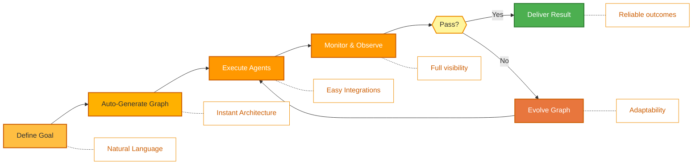

<p align="center">
  
</p>

<p align="center">
  <a href="README.md">English</a> |
  <a href="docs/i18n/zh-CN.md">简体中文</a> |
  <a href="docs/i18n/es.md">Español</a> |
  <a href="docs/i18n/hi.md">हिन्दी</a> |
  <a href="docs/i18n/pt.md">Português</a> |
  <a href="docs/i18n/ja.md">日本語</a> |
  <a href="docs/i18n/ru.md">Русский</a> |
  <a href="docs/i18n/ko.md">한국어</a>
</p>

<p align="center">
  <a href="https://github.com/aden-hive/hive/blob/main/LICENSE"></a>
  <a href="https://www.ycombinator.com/companies/aden"></a>
  <a href="https://discord.com/invite/MXE49hrKDk"></a>
  <a href="https://x.com/aden_hq"></a>
  <a href="https://www.linkedin.com/company/teamaden/"></a>
  
</p>

<p align="center">
  
  
  
  
  
  
</p>
<p align="center">
  
  
  
</p>

<p align="center"><em>面向生产环境负载的 Agent 执行框架（Agent Harness）—— 涵盖状态管理、故障恢复、可观测性与人工监督，让你的 Agent 真正稳定运行。</em></p>

## Overview

OpenHive 是一个开箱即用、模型无关的执行框架，能够动态生成多 Agent 拓扑结构，以应对复杂且长周期的业务流程，无需任何编排样板代码。只需定义你的目标，运行时便会编译出一个严格的、基于图的执行 DAG，安全地协调专业 Agent 并行执行并发任务。依托持久化且按角色划分的记忆机制，它能随项目上下文智能演进。OpenHive 确保确定性容错、深度的状态可观测性，以及与你所选底层 LLM 的无缝异步执行。

## Features

- ✅ 多 Agent 协调以并行执行任务 
- ✅ 基于图的执行机制，适用于重复性及复杂流程 
- ✅ 随项目演进的按角色划分的记忆系统 
- ✅ 零配置启动 —— 无需技术设置
- ✅ 通用计算使用与浏览器操作，支持原生扩展 
- ✅ 自定义模型支持

访问 [adenhq.com](https://adenhq.com) 获取完整文档、示例和指南。

访问 [HoneyComb](http://honeycomb.open-hive.com/) 查看哪些工作正被 AI 自动化。这是一个由社区 AI Agent 进展驱动的工作任务交易市场。你可以根据自己对某项工作被 AI 替代程度的预测，对其进行做多或做空（使用计算代币而非真实资金）。

https://github.com/user-attachments/assets/bf10edc3-06ba-48b6-98ba-d069b15fb69d


## Who Is Hive For?

Hive 是面向将 AI Agent 从原型推向生产环境的团队而设计的多 Agent 执行框架层。像 Openclaw 和 Cowork 这样的单 Agent 能很好地完成个人任务，但缺乏满足企业业务流程所需的严谨性。 

如果你的场景符合以下情况，Hive 将是非常合适的选择：

- 需要能够**执行真实业务流程**的 AI Agent，而非演示 Demo
- 需要能够在大规模下处理状态、恢复和并行执行的**运行时环境**
- 需要能够自我修复并随时间自适应改进的 Agent
- 需要**人工干预（Human-in-the-Loop）**控制、可观测性及成本限制
- 计划在**生产环境**中运行 Agent，且对可用性、成本和审计追踪有严格要求

如果你仅是在尝试简单的 Agent 链或一次性脚本，Hive 可能不是最佳选择。

## When Should You Use Hive?

当瓶颈不再在于模型本身，而在于其外围执行框架时，请使用 Hive：

- 需要**状态持久化和崩溃恢复**的长周期 Agent
- 生产环境负载要求**成本管控、可观测性及审计日志**
- 通过故障捕获和图结构演进实现**自我修复**的 Agent
- 具备**会话隔离与共享缓冲区**的多 Agent 协调机制
- 能够随模型能力提升而扩展，而非与之冲突的框架

## Quick Links

- **[文档中心](https://docs.adenhq.com/)** - 完整指南与 API 参考
- **[自托管指南](https://docs.adenhq.com/getting-started/quickstart)** - 在自有基础设施上部署 Hive
- **[更新日志](https://github.com/aden-hive/hive/releases)** - 最新功能与版本发布
- **[路线图](docs/roadmap.md)** - 即将推出的功能与计划
- **[反馈问题](https://github.com/aden-hive/hive/issues)** - 提交 Bug 报告和功能请求
- **[贡献指南](CONTRIBUTING.md)** - 如何参与贡献并提交 PR

## Quick Start

### Prerequisites

- Python 3.11+（用于 Agent 开发）
- 为 Agent 提供支持的 LLM 服务提供商
- **ripgrep（可选，Windows 推荐安装）：** `search_files` 工具使用 ripgrep 进行更快的文件搜索。若未安装，将回退至 Python 实现。在 Windows 上：执行 `winget install BurntSushi.ripgrep` 或 `scoop install ripgrep`

> **Windows 用户：** 支持通过 `quickstart.ps1` 和 `hive.ps1` 在原生 Windows 环境下运行。请在 PowerShell 5.1+ 中执行这些脚本。WSL 也是可选方案，但非必需。

### Installation

> **Note**
> Hive 采用 `uv` 工作区布局，不支持通过 `pip install` 安装。
> 在仓库根目录运行 `pip install -e .` 会生成一个占位包，导致 Hive 无法正常工作。
> 请使用下方的快速启动脚本来配置环境。

```bash
# Clone the repository
git clone https://github.com/aden-hive/hive.git
cd hive

# Run quickstart setup (macOS/Linux)
./quickstart.sh

# Windows (PowerShell)
.\quickstart.ps1
```

This sets up:

- **framework** - 核心 Agent 运行时与图执行器（位于 `core/.venv`）
- **aden_tools** - 用于扩展 Agent 能力的 MCP 工具集（位于 `tools/.venv`）
- **credential store** - 加密的 API Key 存储目录（`~/.hive/credentials`）
- **LLM provider** - 交互式默认模型设置，包含 Hive LLM 和 OpenRouter
- 使用 `uv` 安装所有必需的 Python 依赖项

- 最后，它将在你的浏览器中打开 Hive 界面

> **Tip:** 若需稍后重新打开仪表盘，请在项目目录中运行 `hive open`。

### Build Your First Agent

在首页输入框中输入你想构建的 Agent 名称。“Queen”（女王）Agent 会向你提问，并与你共同制定解决方案。


### Use Template Agents

点击“尝试示例 Agent”并浏览模板。你可以直接运行某个模板，或选择基于现有模板构建你自己的版本。

### Run Agents

现在，你可以通过选择 Agent（现有 Agent 或示例 Agent）来运行它。你可以点击左上角的 `Run` 按钮，也可以与 Queen Agent 对话，让它为你自动执行。


## Integration

<a href="https://github.com/aden-hive/hive/tree/main/tools/src/aden_tools/tools"></a>
Hive 采用模型无关和系统无关的架构设计。

- **LLM 灵活性** - Hive Framework 通过兼容 LiteLLM 的服务商，支持 Anthropic、OpenAI、OpenRouter、Hive LLM 以及其他托管或本地模型。
- **业务系统连接性** - Hive Framework 设计为可通过 MCP 协议将各类业务系统作为工具接入，例如 CRM、客服、即时通讯、数据平台、文件系统及内部 API。

## Why Hive

随着模型能力的提升，Agent 的能力上限不断提高——但其可靠性与生产环境价值由执行框架决定。Hive 专注于生成能够运行真实业务流程的 Agent，而非通用型 Agent。与传统方式要求你手动设计工作流、定义 Agent 交互并被动处理故障不同，Hive 颠覆了这一范式：**你只需描述目标结果，系统便会自动构建**——提供以结果为驱动、具备自适应能力的体验，并配备易用的工具与集成接口。



### How It Works

1. **[定义目标](docs/key_concepts/goals_outcome.md)** → 用自然语言描述你想要实现的目标
2. **编码 Agent 生成代码** → 创建 [Agent 图结构](docs/key_concepts/graph.md)、连接代码及测试用例
3. **[Worker 执行任务](docs/key_concepts/worker_agent.md)** → 由 SDK 封装的节点在完全可观测且具备工具访问权限的环境下运行
4. **控制平面监控** → 实时指标、预算管控与策略管理
5. **[自适应演进](docs/key_concepts/evolution.md)** → 发生故障时，系统自动演进图结构并重新部署

## Documentation

- **[开发者指南](docs/developer-guide.md)** - 面向开发者的全面参考手册
- [快速入门](docs/getting-started.md) - 环境配置说明
- [配置指南](docs/configuration.md) - 所有可配置选项详解
- [架构概览](docs/architecture/README.md) - 系统设计结构与原理

## Contributing
我们欢迎社区贡献！目前特别需要协助构建框架的工具、集成及示例 Agent（详见 [#2805](https://github.com/aden-hive/hive/issues/2805)）。如果你有兴趣扩展其功能，这里是绝佳的起点。详细规范请参见 [CONTRIBUTING.md](CONTRIBUTING.md)。

**重要提示：** 提交 PR 前请务必先认领 Issue。在相关 Issue 下留言声明认领，维护者会为你分配任务。带有可复现步骤的 Bug 报告和功能提案将优先处理，这有助于避免重复劳动。

1. 查找或创建 Issue 并申请分配
2. Fork 仓库
3. 创建你的功能分支（`git checkout -b feature/amazing-feature`）
4. 提交更改（`git commit -m 'Add amazing feature'`）
5. 推送到分支（`git push origin feature/amazing-feature`）
6. 打开 Pull Request

## Community & Support

我们使用 [Discord](https://discord.com/invite/MXE49hrKDk) 进行技术支持、功能请求及社区讨论。

- Discord - [加入我们的社区](https://discord.com/invite/MXE49hrKDk)
- Twitter/X - [@adenhq](https://x.com/aden_hq)
- LinkedIn - [公司主页](https://www.linkedin.com/company/teamaden/)

## Join Our Team

**我们正在招聘！** 欢迎加入我们的工程、研发及市场团队。

[查看在招职位](https://jobs.adenhq.com/a8cec478-cdbc-473c-bbd4-f4b7027ec193/applicant)

## Security

如有安全相关 concerns，请参阅 [SECURITY.md](SECURITY.md)。

## License

本项目采用 Apache License 2.0 开源协议 - 详见 [LICENSE](LICENSE) 文件。

## Frequently Asked Questions (FAQ)

**Q: Hive 支持哪些 LLM 服务提供商？**

Hive 通过 LiteLLM 集成支持 100+ LLM 提供商，包括 OpenAI（GPT-4, GPT-4o）、Anthropic（Claude 模型）、Google Gemini、DeepSeek、Mistral、Groq、OpenRouter 以及 Hive LLM。只需设置相应的 API Key 环境变量并指定模型名称即可。详见 [docs/configuration.md](docs/configuration.md) 获取特定提供商的配置示例。

**Q: 我能在 Hive 中使用本地 AI 模型（如 Ollama）吗？**

可以！Hive 通过 LiteLLM 支持本地模型。只需使用 `ollama/model-name` 格式的模型名称（例如 `ollama/llama3`、`ollama/mistral`），并确保本地已启动 Ollama 服务即可。

**Q: Hive 与其他 Agent 框架有何不同？**

Hive 是一个 Agent 执行框架（agent harness），而不仅仅是一个编排框架。它提供了生产级运行时层——包括会话隔离、基于检查点的崩溃恢复、成本管控、实时可观测性及人工干预控制——使 Agent 具备运行真实负载的可靠性。在此基础上，Hive 能够根据自然语言目标自动生成整个 Agent 系统，并在 Agent 失败时自动 [演进图结构](docs/key_concepts/evolution.md)。强大的执行框架与自我改进生成能力的结合，正是 Hive 的独特之处。

**Q: Hive 是开源的吗？**

是的，Hive 完全采用 Apache License 2.0 开源协议发布。我们积极鼓励社区贡献与协作。

**Q: Hive 是否支持人工干预（Human-in-the-Loop）工作流？**

是的，Hive 通过允许暂停执行以等待人工输入的干预节点（intervention nodes），全面支持 [human-in-the-loop](docs/key_concepts/graph.md#human-in-the-loop) 工作流。这些节点包含可配置的超时时间与升级策略，实现人类专家与 AI Agent 的无缝协作。

**Q: Hive 支持哪些编程语言？**

Hive 框架基于 Python 构建。JavaScript/TypeScript SDK 已在开发路线图中。

**Q: Hive Agent 能否与外部工具和 API 交互？**

可以。Aden 的 SDK 封装节点提供内置工具访问权限，且框架支持灵活的工具生态。Agent 可通过节点架构与外部 API、数据库及服务进行集成。

**Q: Hive 的成本控制机制是如何工作的？**

Hive 提供细粒度的预算管控功能，包括支出限额、速率限制（throttles）及自动模型降级策略。你可以在团队、Agent 或工作流级别设置预算，并享受实时成本追踪与告警服务。

**Q: 在哪里可以找到示例和文档？**

访问 [docs.adenhq.com](https://docs.adenhq.com/) 获取完整指南、API 参考及入门教程。仓库的 `docs/` 文件夹中也包含详细文档及全面的 [开发者指南](docs/developer-guide.md)。

**Q: 如何为 Aden 做出贡献？**

欢迎贡献！请 Fork 仓库，创建功能分支，实现你的更改并提交 Pull Request。详细规范请参阅 [CONTRIBUTING.md](CONTRIBUTING.md)。

## Star History

<a href="https://star-history.com/#aden-hive/hive&Date">
 <picture>
   <source media="(prefers-color-scheme: dark)" srcset="https://api.star-history.com/svg?repos=aden-hive/hive&type=Date&theme=dark" />
   <source media="(prefers-color-scheme: light)" srcset="https://api.star-history.com/svg?repos=aden-hive/hive&type=Date" />
   
 </picture>
</a>

---

<p align="center">
  🔥 充满热情地在旧金山打造
</p>