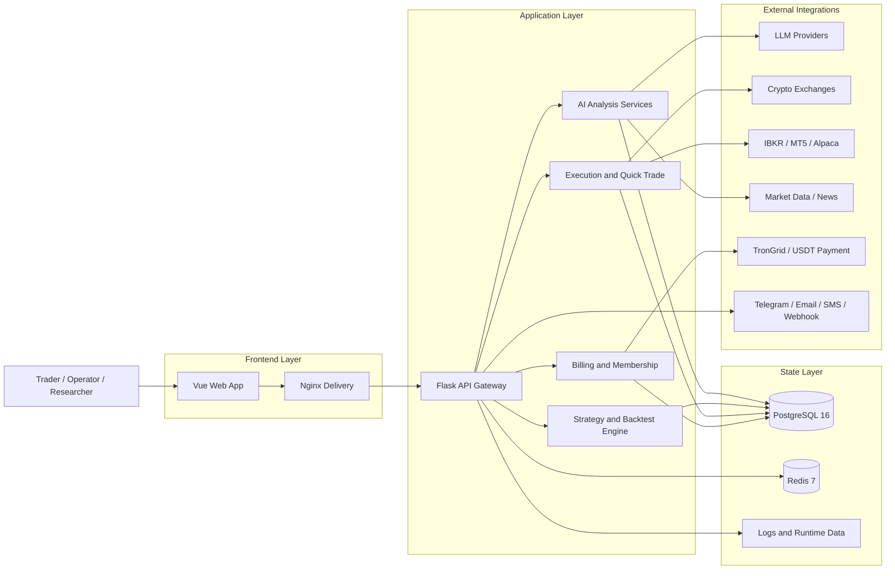

<div align="center">
  <a href="https://github.com/brokermr810/QuantDinger">
    
  </a>

  <h1>QuantDinger</h1>
  <h3>开源量化交易 AI 基础设施层</h3>
  <p><strong>将交易想法转化为 Python 策略、回测、模拟交易与实盘执行——全部集成于一个自托管技术栈中。</strong></p>
  <p><em>AI 研究 → 策略代码 → 回测 → 模拟/实盘执行 → 监控</em></p>

  <div align="center" style="max-width: 680px; margin: 1.25rem auto 0; padding: 20px 22px 22px; border: 1px solid #d1d9e0; border-radius: 16px;">
    <p style="margin: 0 0 14px; line-height: 1.65;">
      <a href="README.md"><strong>English</strong></a>
      <span style="color: #afb8c1;"> · </span>
      <a href="docs/README_CN.md"><strong>简体中文</strong></a>
      <span style="color: #afb8c1;"> · </span>
      <a href="docs/README_JA.md"><strong>日本語</strong></a>
      <span style="color: #afb8c1;"> · </span>
      <a href="docs/README_KO.md"><strong>한국어</strong></a>
      <span style="color: #afb8c1;"> · </span>
      <a href="docs/README_TH.md"><strong>ไทย</strong></a>
      <span style="color: #afb8c1;"> · </span>
      <a href="docs/README_VI.md"><strong>Tiếng Việt</strong></a>
      <span style="color: #afb8c1;"> · </span>
      <a href="docs/README_AR.md"><strong>العربية</strong></a>
    </p>
    <p style="margin: 0 0 18px; padding-bottom: 16px; border-bottom: 1px solid #eaeef2; line-height: 2;">
      <a href="https://ai.quantdinger.com"><strong>SaaS</strong></a>
      <span style="color: #d8dee4;"> &nbsp;·&nbsp; </span>
      <a href="docs/api/README.md"><strong>API Docs</strong></a>
      <span style="color: #d8dee4;"> &nbsp;·&nbsp; </span>
      <a href="https://www.youtube.com/watch?v=tNAZ9uMiUUw"><strong>Video Demo</strong></a>
      <span style="color: #d8dee4;"> &nbsp;·&nbsp; </span>
      <a href="https://www.quantdinger.com"><strong>Website</strong></a>
      <span style="color: #d8dee4;"> &nbsp;·&nbsp; </span>
      <a href="https://aws.amazon.com/marketplace/pp/prodview-naanrb7d2mbc6"><strong>AWS Marketplace</strong></a>
    </p>
    <p style="margin: 0; line-height: 2;">
      <a href="https://t.me/quantdinger"></a>
      &nbsp;
      <a href="https://discord.com/invite/tyx5B6TChr"></a>
      &nbsp;
      <a href="https://youtube.com/@quantdinger"></a>
      &nbsp;
      <a href="https://x.com/QuantDinger_EN"></a>
    </p>
  </div>

  <p style="margin-top: 1.45rem; margin-bottom: 10px;">
    <a href="LICENSE"></a>
    
    
    
    
    
    
    
    
  </p>
  <p style="margin: 10px 0 12px;">
    <a href="https://aws.amazon.com/marketplace/pp/prodview-naanrb7d2mbc6"></a>
  </p>
  <p style="margin: 12px 0 10px;">
    <a href="https://oosmetrics.com/repo/brokermr810/QuantDinger"></a>
  </p>
  <p style="margin-top: 14px;">
    <a href="https://www.producthunt.com/products/quantdinger/launches/quantdinger?embed=true&amp;utm_source=badge-featured&amp;utm_medium=badge&amp;utm_campaign=badge-quantdinger" target="_blank" rel="noopener noreferrer"></a>
  </p>
</div>

---

## Contents

[2分钟快速体验](#try-in-2-minutes) · [为什么选择 QuantDinger](#why-quantdinger) · [安全模型](#safety-model) · [技术亮点](#technical-highlights) · [关联仓库](#related-repositories) · [AI Agent 与 MCP](#use-it-from-an-ai-agent-cursor--claude-code--codex--mcp) · [产品概述](#product-overview) · [功能一览](#features-at-a-glance) · [视觉导览](#visual-tour) · [架构设计](#architecture) · [安装部署](#installation--first-time-setup-docker-compose) · [文档中心](#documentation) · [常见问题](#faq) · [许可与商业条款](#license-and-commercial-terms)

---

## Try in 2 minutes

> **最快上手路径：一条命令。** 无需 `git clone`，无需 `npm`，无需 Vue 源码树。镜像直接从 GHCR 拉取；首次启动后端时自动生成 `SECRET_KEY`。

**前置条件：** [Docker](https://docs.docker.com/get-docker/) 搭配 Compose v2（Windows/macOS 使用 Docker Desktop）。**无需安装 Node.js。**

```bash
curl -fsSL https://raw.githubusercontent.com/brokermr810/QuantDinger/main/install.sh | bash
```

默认安装至 `~/quantdinger`（覆盖路径：`… | bash -s -- /opt/quantdinger`）。重新运行相同命令即可拉取最新镜像并重启。

随后打开 **`http://localhost:8888`**，使用 **`quantdinger` / `123456`** 登录，并立即**修改默认管理员密码**。

<details>
<summary><b>Windows、手动克隆或镜像故障排查</b></summary>

**Windows (PowerShell)** — 克隆后的文件夹名为 **`QuantDinger`**：

```powershell
git clone https://github.com/brokermr810/QuantDinger.git
Set-Location QuantDinger
Copy-Item backend_api_python\env.example -Destination backend_api_python\.env
$key = & python -c "import secrets; print(secrets.token_hex(32))" 2>$null
if (-not $key) { $key = & py -c "import secrets; print(secrets.token_hex(32))" 2>$null }
(Get-Content backend_api_python\.env) -replace '^SECRET_KEY=.*$', "SECRET_KEY=$key" | Set-Content backend_api_python\.env -Encoding utf8
docker compose pull
docker compose up -d
```

**标准克隆 (macOS / Linux)：**

```bash
git clone https://github.com/brokermr810/QuantDinger.git && cd QuantDinger && cp backend_api_python/env.example backend_api_python/.env && chmod +x scripts/generate-secret-key.sh && ./scripts/generate-secret-key.sh && docker compose pull && docker compose up -d
```

**`docker pull` 缓慢 (中国大陆 / VPN)：** 在仓库根目录的 `.env` 中添加 `IMAGE_PREFIX=docker.m.daocloud.io/library/`，或配置 **Docker Desktop → Proxies**。

</details>

如需逐步详细说明与故障排查，请参阅 **[安装与首次设置](#installation--first-time-setup-docker-compose)**。

---

## Why QuantDinger

| 传统工作流 | QuantDinger |
|----------------------|-------------|
| ChatGPT 仅生成代码 | 在同一技术栈中运行、回测并执行策略 |
| TradingView + Jupyter + 交易所机器人分散割裂 | 从研究到执行的统一自托管技术栈 |
| SaaS 平台持有你的 API 密钥 | 用户自主部署——基础设施与密钥完全由你掌控 |
| 缺乏权限范围与审计的 AI agent | 具备作用域限制的 Agent Gateway，默认仅支持模拟交易，并提供完整审计日志 |

QuantDinger 是一个**自托管、本地优先**的量化基础设施层——并非一个带购买按钮的聊天机器人。它将**多 LLM 研究**、**原生 Python 策略引擎**、**服务端回测**与**多券商实盘执行**（支持 10+ 加密资产交易所、IBKR、MT5、Alpaca）整合在一个你完全掌控的生产级技术栈中。

## Safety model

- **Agent token 默认仅限模拟交易（paper-only）**——实盘交易需显式在服务端解锁。
- **实盘执行需要明确授权**——需配置 token 作用域，并在自托管环境中设置 `AGENT_LIVE_TRADING_ENABLED`。
- **交易所密钥仅保留在用户自己的部署环境中**——自托管安装下，QuantDinger SaaS 运营方无法获取你的密钥。
- **每一次 Agent 调用均记录审计日志**——提供只追加的审计追踪，便于自动化审查与合规检查。
- **QuantDinger 不提供投资建议**——本软件仅用于合法研究与执行；你需自行承担合规与风控责任。

## API documentation

| 资源 | 链接 |
|----------|------|
| 前端 Web API（OpenAPI） | [`docs/api/openapi.yaml`](docs/api/openapi.yaml) |
| ReDoc 查看器（通过 HTTP 服务） | [`docs/api/index.html`](docs/api/index.html) — 在 `docs/api/` 目录下运行 `python -m http.server` |
| 规范（认证、信封格式） | [`docs/API_CONVENTIONS.md`](docs/API_CONVENTIONS.md) |
| Agent Gateway | [`docs/agent/agent-openapi.json`](docs/agent/agent-openapi.json) |

---

<div align="center">
  
  <p><sub><em>从零到运行技术栈——图表、AI 研究与策略工作流，几分钟内完成。</em></sub></p>
</div>

<div align="center">
  
  <p><sub><em>闭环流程：<strong>AI 研究 → 策略代码 → 回测 → 模拟/实盘执行 → 监控</strong>——市场数据输入，审计订单输出。</em></sub></p>
</div>

## Technical highlights

| | QuantDinger 的独特之处 |
|---|----------------------------------|
| **全栈量化操作系统** | 图表、指标 IDE、AI 研究、回测、实盘机器人、快捷交易与券商账户管理——一个产品，一套 PostgreSQL 状态存储。 |
| **原生 Agent 支持** | 一等公民级的 **Agent Gateway** (`/api/agent/v1`) + PyPI 上的 **[`quantdinger-mcp`](https://pypi.org/project/quantdinger-mcp/)** —— Cursor、Claude Code 和 Codex 可读取市场数据、运行回测并交易（默认仅模拟），且具备完整审计日志。 |
| **双策略运行时** | **`IndicatorStrategy`**（向量化 DataFrame 信号 + 图表叠加）与 **`ScriptStrategy`**（事件驱动 `on_bar`、显式下单）——研究与生产环境共用同一套代码库。 |
| **多交易所执行** | CCXT 加密资产（Binance, OKX, Bybit, …）、**IBKR** 美股、**MT5** 外汇、**Alpaca** 美股/ETF/加密货币——统一的 Broker Accounts 页面与隔离的多租户会话。 |
| **生产级基础设施** | **PostgreSQL 16** + **Redis 7**，连接池、后台 Worker（订单处理、组合监控、反思机制）、幂等 Schema 初始化，GHCR 多架构镜像（amd64/arm64）。 |
| **默认安全设计** | 拒绝使用默认的 `SECRET_KEY`，Agent token 静态加密存储，除非服务端显式解锁否则**仅支持模拟交易**，所有 Agent 调用均记录审计日志。 |
| **面向运营就绪** | 支持 OAuth、多用户角色、积分/会员/USDT 计费开关、AWS Marketplace AMI、7 种语言文档——基于此构建商业量化产品，而非仅作为个人爱好机器人。 |

<details>
<summary><b>更多安装路径（仅限 GHCR、构建说明）</b></summary>

**最轻量级——仅需两个文件（无需 `git clone`）：**

```bash
curl -O https://raw.githubusercontent.com/brokermr810/QuantDinger/main/docker-compose.ghcr.yml
curl -o backend.env https://raw.githubusercontent.com/brokermr810/QuantDinger/main/backend_api_python/env.example
docker compose -f docker-compose.ghcr.yml pull
docker compose -f docker-compose.ghcr.yml up -d
```

**常规安装请勿使用 `docker compose up --build`**——主 Compose 文件仅为前端声明了 `image:`；`--build` 仅影响后端。代码变更后重建后端：`docker compose up -d --build backend`。如需从 Vue 源码构建，请使用 `docker-compose.build.yml`（见 [安装](#installation--first-time-setup-docker-compose)）。

</details>

## Related repositories

本仓库提供**后端**、**Docker Compose** 技术栈与**文档**。Web UI 镜像由兄弟 Vue 仓库独立发布至 GHCR。如需源码级 UI 修改或移动端应用，请使用兄弟仓库：

| Repository | 说明 |
|------------|------|
| **[QuantDinger](https://github.com/brokermr810/QuantDinger)** (本仓库) | Backend（Flask/Python）、Compose 技术栈、文档 |
| **[QuantDinger-Vue](https://github.com/brokermr810/QuantDinger-Vue)** | **Web 前端源码**（Vue）——标记 `v*` 时自动发布 `ghcr.io/brokermr810/quantdinger-frontend` |
| **[QuantDinger-Mobile](https://github.com/brokermr810/QuantDinger-Mobile)** | **开源移动端客户端**——与你自托管或 SaaS 后端配对使用 |

**注意：** 仅当你从 **QuantDinger-Vue** 构建 Web UI 时才需要 Node.js；默认的 Docker 快速启动直接拉取已发布镜像，无需安装。

## Use it from an AI agent (Cursor / Claude Code / Codex / MCP)

QuantDinger 内置 `/api/agent/v1` **Agent Gateway**，并提供一个轻量级 **MCP server**（PyPI 上的 [`quantdinger-mcp`](https://pypi.org/project/quantdinger-mcp/)），将其封装为 Model Context Protocol 工具。只需签发一次 token，你的 AI 客户端即可读取市场、管理策略、运行回测并下单（默认仅模拟）——全程无需暴露交易所密钥或管理员 JWT。

> 每一次 Agent 调用均**记录审计日志**，交易类 token 默认仅限**模拟交易**。实盘执行需同时满足 token 设置 `paper_only=false` 且服务端配置 `AGENT_LIVE_TRADING_ENABLED=true`。

**两套后端，同一套客户端配置——仅 `QUANTDINGER_BASE_URL` 不同：**

- **托管版（30秒体验）** — 在 [ai.quantdinger.com](https://ai.quantdinger.com) 注册 → **Profile → My Agent Token** → Issue Token。提供 T (Trading) 作用域；**默认仅模拟交易**。实盘执行仍需 token 设置 `paper_only=false`、签发时明确风险确认，以及服务端配置 `AGENT_LIVE_TRADING_ENABLED=true`。在多租户 SaaS 环境中，开启 T 作用域会增加共享基础设施负载与平台运营风险——详见应用内风险披露。
- **自托管版（本仓库）** — 完成 [2分钟快速体验](#try-in-2-minutes) Docker 部署后，打开 **Profile → My Agent Token**（或仅限管理员的 `/agent-tokens` 页面用于跨租户审计）。你完全掌控作用域、白名单、速率限制与实盘交易开关。

随后将 Cursor / Claude Code / Codex 指向 MCP server（`.cursor/mcp.json` 模板：[`docs/agent/cursor-mcp.example.json`](docs/agent/cursor-mcp.example.json)）：

```json
{ "mcpServers": { "quantdinger": {
  "command": "uvx", "args": ["quantdinger-mcp"],
  "env": { "QUANTDINGER_BASE_URL": "http://localhost:8888",
           "QUANTDINGER_AGENT_TOKEN": "qd_agent_xxxxxxxx" }
} } }
```

**完整配置指南** — 本地 stdio 配置、远程 HTTP 传输、Claude Code CLI 辅助工具、示例 Agent prompt、审计日志 walkthrough：**[`docs/agent/MCP_SETUP.md`](docs/agent/MCP_SETUP.md)**。

更多参考：[AI Integration design](docs/agent/AI_INTEGRATION_DESIGN.md) · [Quickstart with `curl`](docs/agent/AGENT_QUICKSTART.md) · [OpenAPI 3.0 spec](docs/agent/agent-openapi.json) · [MCP server README](mcp_server/README.md)

## Product overview

**目标用户：** 独立量化研究员、Python 策略作者、自营/小型团队，以及希望在私有基础设施上构建白标量化产品的运营方——无需将 API 密钥交给黑盒 SaaS。

## Visual Tour

<table align="center" width="100%">
  <tr>
    <td colspan="2" align="center">
      <a href="https://www.youtube.com/watch?v=wHIvvv6fmHA">
        
      </a>
      <br/>
      <sub>
        <a href="https://www.youtube.com/watch?v=wHIvvv6fmHA">
          <strong>▶ 在 YouTube 观看产品演示</strong>
        </a>
      </sub>
      <br/>
      <sub>点击上方预览卡片即可打开完整视频导览。</sub>
    </td>
  </tr>
  <tr>
    <td width="50%" align="center"><br/><sub>指标 IDE、图表、回测与快捷交易</sub></td>
    <td width="50%" align="center"><br/><sub>AI 资产分析与机会雷达</sub></td>
  </tr>
  <tr>
    <td align="center"><br/><sub>交易机器人工作区与自动化模板</sub></td>
    <td align="center"><br/><sub>策略实盘运营、绩效与监控</sub></td>
  </tr>
</table>

## Features at a glance

- **研究与 AI** — 多 LLM 集成分析、关注列表、机会雷达、自然语言转指标/策略、回测后 AI 提示；可选置信度校准。**[Agent Gateway + MCP](#use-it-from-an-ai-agent-cursor--claude-code--codex--mcp)** 支持 Cursor / Claude Code / Codex，配备作用域 token 与 SSE 任务流。
- **构建** — 专业 KLine 图表 UI；`IndicatorStrategy`（DataFrame `buy`/`sell` 信号）与 `ScriptStrategy`（`on_bar`, `ctx.buy()` / `ctx.sell()`）；AI 代码生成作为起点，Python 为最终真理来源。
- **验证** — 服务端回测，含资金曲线、回撤指标、交易日志与策略快照——杜绝仅在前端运行的“剧场式”回测。
- **运营** — 实盘策略机器人、快捷交易、通过 CCXT 接入的 **10+ 加密交易所**、**IBKR** / **MT5** / **Alpaca**（美股、ETF、加密货币）；统一的 **Broker Accounts** 页面；通知支持（Telegram, email, SMS, Discord, webhooks）。
- **平台** — Docker Compose + GHCR 镜像，PostgreSQL 16，Redis 7，OAuth，多用户 RBAC，积分/会员/USDT 计费开关，AWS Marketplace AMI，7 种语言文档。

## Architecture

**设计原则：** 分离**市场数据摄入**、**策略/回测计算**与**订单执行**，确保研究流程不会在代码层面与实盘资金混用（除非你显式将策略升级为生产级）。

**技术栈：** Nginx 提供预构建的 Vue SPA (`ghcr.io/brokermr810/quantdinger-frontend`)；**Flask + Gunicorn** API 承载策略、AI、计费与 Agent 服务；**PostgreSQL 16** 作为核心数据记录系统；**Redis 7** 支撑缓存与 Worker 协调。交易所、券商、LLM 与支付通道通过环境变量驱动的适配器接入——更换提供商无需修改核心代码。

**运行时流程：** 市场数据流 → 指标/信号层 → 策略引擎 → 回测或实盘运行 → 交易所特定执行适配器；挂单由后台 Worker 分发，具备健康检查与重试机制。

**部署形态：** 一行式 `install.sh`、零仓库 GHCR Compose、全仓库 Compose（本地后端构建）、AWS Marketplace AMI，以及 [ai.quantdinger.com](https://ai.quantdinger.com) SaaS 试用版。

### System diagram



## Installation & first-time setup (Docker Compose)

> **已完成 [2分钟快速体验](#try-in-2-minutes)？** 跳过本节——结果相同，此处仅展开为面向首次部署者与运维人员的逐步检查清单。

本节对应典型的“本地部署”路径：**准备主机 → 获取代码 → 配置密钥 → 启动技术栈 → 验证 → 加固 → 可选接入 AI**。无需 Node.js：`frontend` 服务直接拉取 `ghcr.io/brokermr810/quantdinger-frontend`，因此 Nginx 可直接提供 SPA 而无需本地构建。

### Prerequisites

| Item | Notes |
|------|--------|
| [Docker](https://docs.docker.com/get-docker/) + Docker Compose v2 | 用于 Postgres、Redis、API 与静态 UI。 |
| `git` | 克隆本仓库。 |
| Ports (defaults) | `8888`（Web）、`5000`（API，绑定至 **127.0.0.1**）、`5432` / `6379`（DB/Redis，默认仅回环）。冲突时可通过根目录 `.env` 修改。 |
| Disk | Postgres 数据卷随用户、策略与日志增长；严肃使用建议预留数 GB 空间。 |

### 1) Clone the repository

```bash
git clone https://github.com/brokermr810/QuantDinger.git
cd QuantDinger
```

### 2) Create backend configuration (mandatory)

```bash
cp backend_api_python/env.example backend_api_python/.env
```

几乎所有运行时行为均由 **`backend_api_python/.env`** 驱动（数据库 URL、管理员用户、LLM 密钥、Worker 配置、计费开关等）。可选的**仓库根目录** `.env` 仅调整 Compose 级参数，如 **端口**与**镜像前缀** (`IMAGE_PREFIX`)。

### 3) Set `SECRET_KEY` before the first boot (mandatory)

若 `SECRET_KEY` 仍为 `env.example` 中的占位符，API **拒绝启动**。此举可防止因疏忽导致的不安全部署。

**Linux / macOS**（推荐）：

```bash
./scripts/generate-secret-key.sh
```

该脚本使用 Python 的 `secrets` 模块覆盖 `backend_api_python/.env` 中的 `SECRET_KEY=` 行。

**Manual**（任意系统）：生成一个长随机字符串（例如 64 位十六进制字符），并在 `backend_api_python/.env` 中设置 `SECRET_KEY=...`。

### 4) Start the stack

```bash
docker compose pull
docker compose up -d
```

- **`frontend`** — 拉取 `ghcr.io/brokermr810/quantdinger-frontend:latest`（无需本地 Vue 源码树）。
- **`backend`** — 若本地尚无镜像，首次启动时从 `./backend_api_python` 构建。
- 如需基于 Vue 源码进行 UI 开发，将 **QuantDinger-Vue** 克隆至 `./QuantDinger-Vue/`，并在命令中添加 `-f docker-compose.build.yml`（见下方 *从 Vue 源码构建前端*）。

服务：**`postgres`**、**`redis`**、**`backend`**、**`frontend`**（详见 `docker-compose.yml`）。

#### Alternative: zero-repo install from GHCR (lightest)

后端与前端均提供预编译的多架构（amd64/arm64）镜像——无需 `git clone`：

```bash
curl -O https://raw.githubusercontent.com/brokermr810/QuantDinger/main/docker-compose.ghcr.yml
curl -o backend.env https://raw.githubusercontent.com/brokermr810/QuantDinger/main/backend_api_python/env.example
docker compose -f docker-compose.ghcr.yml pull
docker compose -f docker-compose.ghcr.yml up -d
```

后端入口点会在首次启动时自动生成随机 `SECRET_KEY`，并以幂等方式应用 Schema（`migrations/init.sql`）。编辑 `backend.env` 以持久化覆盖配置（API 密钥、OAuth、券商凭证等）。Compose 编排参数放入独立的 `.env`（可选）——例如锁定版本：

```env
# Common case: lockstep both sides to one tag
IMAGE_TAG=3.0.22

# Advanced (opt-in): decouple sides. Either var alone overrides only
# that side; the other still follows IMAGE_TAG.
# BACKEND_TAG=v3.0.9
# FRONTEND_TAG=v3.1.0-rc1

# BACKEND_IMAGE=ghcr.io/<your-fork>/quantdinger-backend     # optional, for forks
# FRONTEND_IMAGE=ghcr.io/<your-fork>/quantdinger-frontend
```

标签解析优先级：`BACKEND_TAG` / `FRONTEND_TAG` → `IMAGE_TAG` → compose 默认值 (`latest`)。若无根目录 `.env`，两个 Compose 文件均拉取 `ghcr.io/brokermr810/quantdinger-{backend,frontend}:latest`。通过设置 `IMAGE_TAG`（双端同步）或 `BACKEND_TAG` / `FRONTEND_TAG`（分端控制）可锁定特定版本——详见 [GitHub Releases](https://github.com/brokermr810/QuantDinger/releases)。

#### Alternative: build the frontend from Vue source

若你拥有 **QuantDinger-Vue** 仓库权限，且希望在 UI 源码层面进行迭代（主题调整、分支修改、调试）而非拉取已发布镜像，可将其克隆至仓库根目录的 `./QuantDinger-Vue/` 位置（已在 gitignore 中），让 Compose 从此处构建：

```bash
git clone https://github.com/brokermr810/QuantDinger-Vue.git QuantDinger-Vue
docker compose -f docker-compose.yml -f docker-compose.build.yml up -d --build
```

主 `docker-compose.yml` 仅拉取 GHCR 镜像；覆盖文件 `docker-compose.build.yml` 添加了本地 `build:` 块。若无此覆盖文件，无需存在 `./QuantDinger-Vue/`。若希望将源码放在其他位置，可设置 `FRONTEND_SRC_PATH=/abs/path/to/QuantDinger-Vue`，或在根目录 `.env` 中设置 `COMPOSE_FILE=docker-compose.yml:docker-compose.build.yml` 以跳过冗长的 `-f -f` 调用。本地构建的镜像采用与发布版相同的标签规则（适用 `FRONTEND_TAG` / `IMAGE_TAG`），因此可直接无缝接入技术栈其余部分。

### 5) Verify and sign in

| Check | URL / command |
|--------|----------------|
| Web UI | `http://localhost:8888`（如需覆盖主机/端口，在根目录 `.env` 中修改 `FRONTEND_HOST` / `FRONTEND_PORT`）。 |
| API health | `http://localhost:5000/api/health` |
| Logs | `docker-compose logs -f backend` |

默认管理员（生产环境请立即修改）：

- **User**: `quantdinger`
- **Password**: `123456`（来自 `env.example`；若偏好，可在首次使用前通过 `.env` 中的 `ADMIN_USER` / `ADMIN_PASSWORD` 覆盖）。

同时在 `backend_api_python/.env` 中设置 **`FRONTEND_URL`** 为用户实际访问的 URL（含反向代理后的 `https://`）；该值会影响重定向、CORS 相关配置及部分生成链接。

### 6) Optional: enable AI features

AI 分析、自然语言转代码及相关流程需至少配置一个 LLM 提供商。打开 `backend_api_python/env.example`，找到 **AI / LLM** 区块，将对应密钥复制至你的 `.env`（例如 `LLM_PROVIDER` + `OPENROUTER_API_KEY`，或其他支持的提供商）。编辑完成后重启后端。

### 7) Windows notes

使用 **Docker Desktop**（推荐 WSL2 后端）。从仓库根目录的 PowerShell 执行：

```powershell
git clone https://github.com/brokermr810/QuantDinger.git
Set-Location QuantDinger
Copy-Item backend_api_python\env.example -Destination backend_api_python\.env
$key = py -c "import secrets; print(secrets.token_hex(32))"
(Get-Content backend_api_python\.env) -replace '^SECRET_KEY=.*$', "SECRET_KEY=$key" | Set-Content backend_api_python\.env -Encoding UTF8
docker compose pull
docker compose up -d
```

若 `py` 不在 PATH 中，可在生成 `$key` 的单行命令中使用 `python` 或 `python3`。换行符应保持为 UTF-8；避免使用会自动剥离 `.env` 文件末尾换行的编辑器。

### Troubleshooting (first boot)

| Symptom | What to check |
|---------|----------------|
| `QuantDinger-Vue` not found | 你添加了 `-f docker-compose.build.yml` 但未克隆 Vue 源码。移除覆盖参数（直接使用 `docker compose up -d`）或先克隆至 `./QuantDinger-Vue/`。 |
| `redis` / `python` / `node` pull fails, `content size of zero` | Docker Desktop 无法访问 Docker Hub。设置根目录 `.env` 的 `IMAGE_PREFIX=docker.m.daocloud.io/library/`，并配置 **Docker Desktop → Proxies**（仅系统 VPN 通常不够）。 |
| Backend exits immediately | `SECRET_KEY` 仍为默认值，或 `.env` 语法无效。运行 `docker compose logs backend` 查看日志。 |
| Blank page or API errors from browser | `FRONTEND_URL` / origins 不匹配；API 对你打开浏览器的主机不可达。 |
| Port already in use | `5432` / `6379` / `5000` / `8888` 端口已被其他 Postgres、Redis 或本地服务占用。按 `docker-compose.yml` 说明在根目录 `.env` 中调整变量。 |
| Many live strategies, “start denied” | 提高 `backend_api_python/.env` 中的 `STRATEGY_MAX_THREADS` 并重启 API（详见 `env.example` 注释）。 |

### Common Docker commands

```bash
docker compose ps
docker compose logs -f backend
docker compose restart backend
docker compose pull
docker compose up -d
docker compose up -d --build backend   # 仅后端代码变更时重建
docker compose down
```

### Optional root `.env` (Compose only)

用于**自定义端口**或**基础镜像的镜像源/前缀**（解决 Docker Hub 拉取缓慢），在**仓库根目录**（与 `docker-compose.yml` 同级）创建名为 `.env` 的文件：

```ini
FRONTEND_PORT=3000
BACKEND_PORT=127.0.0.1:5001
IMAGE_PREFIX=docker.m.daocloud.io/library/
```

生产级 TLS、域名与反向代理部署详见 **[Cloud deployment](docs/CLOUD_DEPLOYMENT_EN.md)**。

### Suggested first session (product walkthrough)

技术栈健康后：(1) 运行一次 **AI 资产/市场分析**以验证 LLM 与数据通路；(2) 打开 **Indicator IDE**，加载交易对，在小时间范围内运行**信号回测**；(3) 可选使用 **AI 代码生成**起草指标，随后手动编辑 Python；(4) 准备就绪后，绑定**交易所 API 密钥**（Profile / Credentials），测试连接，然后探索你计划使用的执行模式下的**实盘策略**或**快捷交易**。此顺序可尽早暴露配置问题，避免真金白银受损。

## Minimal Example: Python Indicator Strategy

这是 QuantDinger 专为原生 Python 策略逻辑设计的典型示例：

```python
# @param sma_short int 14 Short moving average
# @param sma_long int 28 Long moving average

sma_short_period = params.get('sma_short', 14)
sma_long_period = params.get('sma_long', 28)

my_indicator_name = "Dual Moving Average Strategy"
my_indicator_description = f"SMA {sma_short_period}/{sma_long_period} crossover"

df = df.copy()
sma_short = df["close"].rolling(sma_short_period).mean()
sma_long = df["close"].rolling(sma_long_period).mean()

buy = (sma_short > sma_long) & (sma_short.shift(1) <= sma_long.shift(1))
sell = (sma_short < sma_long) & (sma_short.shift(1) >= sma_long.shift(1))

df["buy"] = buy.fillna(False).astype(bool)
df["sell"] = sell.fillna(False).astype(bool)
```

完整示例见：

- [`docs/examples/dual_ma_with_params.py`](docs/examples/dual_ma_with_params.py)
- [`docs/examples/multi_indicator_composite.py`](docs/examples/multi_indicator_composite.py)
- [`docs/examples/cross_sectional_momentum_rsi.py`](docs/examples/cross_sectional_momentum_rsi.py)

## Supported Markets, Brokers, and Exchanges

### Crypto Exchanges

| Venue | Coverage |
|-------|----------|
| Binance | Spot, Futures, Margin |
| OKX | Spot, Perpetual, Options |
| Bitget | Spot, Futures, Copy Trading |
| Bybit | Spot, Linear Futures |
| Coinbase | Spot |
| Kraken | Spot, Futures |
| Gate.io | Spot, Futures |
| HTX | Spot, USDT-margined perpetuals |

### Traditional Markets

| Market | Broker / Source | Execution |
|--------|------------------|-----------|
| US Stocks | IBKR, Alpaca, Yahoo Finance, Finnhub | Via IBKR or Alpaca (paper + live) |
| ETFs | Alpaca | Via Alpaca (paper + live) |
| Forex | MT5, OANDA | Via MT5 |
| Futures | Exchange and data integrations | Data and workflow support |

> **Broker Accounts page (`/broker-accounts`, v3.0.5+)** — IBKR、MT5 和 Alpaca 共享统一的托管管理页面：按券商的连接表单、账户 KPI、持仓表与一键撤单管理。多租户安全隔离：每个用户的会话通过 `BrokerSessionRegistry` 独立，因此一个用户重连不会踢掉其他用户。

## Strategy Development Modes

QuantDinger 支持两种主要的策略编写模式：

### IndicatorStrategy

- 基于 DataFrame 的 Python 脚本
- 生成 `buy` / `sell` 信号
- 图表渲染与信号风格回测
- 适用于研究、指标逻辑开发与可视化策略原型验证

### ScriptStrategy

- 事件驱动型 `on_init(ctx)` / `on_bar(ctx, bar)` 脚本
- 通过 `ctx.buy()`、`ctx.sell()`、`ctx.close_position()` 显式控制运行时状态
- 适用于有状态策略、执行导向逻辑与实盘对齐开发

完整开发者工作流见：

- [Strategy Development Guide](docs/STRATEGY_DEV_GUIDE.md)
- [Cross-Sectional Strategy Guide](docs/CROSS_SECTIONAL_STRATEGY_GUIDE_EN.md)
- [Strategy Examples](docs/examples/)

示例脚本位于 `docs/examples/`，并与当前策略开发指南保持同步。

## Repository Layout

```text
QuantDinger/
├── backend_api_python/      # 后端开源源码
│   ├── app/routes/          # REST 端点
│   ├── app/services/        # AI、交易、计费、回测、集成服务
│   ├── migrations/init.sql  # 数据库初始化脚本
│   ├── env.example          # 核心环境变量模板
│   └── Dockerfile
├── docs/                    # 产品、策略与部署文档
├── install.sh               # 一行式 GHCR 安装 (curl | bash)
├── docker-compose.yml       # Web UI 通过 GHCR；可选 ./QuantDinger-Vue/ 用于本地 UI 构建
├── docker-compose.ghcr.yml  # 零仓库部署——双端镜像均来自 GHCR
├── LICENSE
└── TRADEMARKS.md
```

## Configuration Areas

以 `backend_api_python/env.example` 为主要模板。关键配置区域包括：

| Area | Examples |
|------|----------|
| Authentication | `SECRET_KEY`, `ADMIN_USER`, `ADMIN_PASSWORD` |
| Database | `DATABASE_URL` |
| LLM / AI | `LLM_PROVIDER`, `OPENROUTER_API_KEY`, `OPENAI_API_KEY` |
| OAuth | `GOOGLE_CLIENT_ID`, `GITHUB_CLIENT_ID` |
| Security | `TURNSTILE_SITE_KEY`, `ENABLE_REGISTRATION` |
| Billing | `BILLING_ENABLED`, `BILLING_COST_AI_ANALYSIS` |
| Membership | `MEMBERSHIP_MONTHLY_PRICE_USD`, `MEMBERSHIP_MONTHLY_CREDITS` |
| USDT Payment | `USDT_PAY_ENABLED`, `USDT_TRC20_XPUB`, `TRONGRID_API_KEY` |
| Optional data APIs | `TWELVE_DATA_API_KEY`, `FINNHUB_API_KEY`, `TIINGO_API_KEY`, `ADANOS_API_KEY` |
| Proxy | `PROXY_URL` |
| Workers | `ENABLE_PENDING_ORDER_WORKER`, `ENABLE_PORTFOLIO_MONITOR`, `ENABLE_REFLECTION_WORKER` |
| AI tuning | `ENABLE_AI_ENSEMBLE`, `ENABLE_CONFIDENCE_CALIBRATION`, `AI_ENSEMBLE_MODELS` |

## Documentation

| Doc | Notes |
|-----|--------|
| [Human Web API (OpenAPI)](docs/api/openapi.yaml) | flask-smorest 规范 —— 使用 [`docs/api/index.html`](docs/api/index.html) 浏览（需 HTTP 服务器） |
| [API conventions](docs/API_CONVENTIONS.md) | 认证、信封格式、可见性分级 |
| [Changelog](docs/CHANGELOG.md) | 版本发布与迁移记录 |
| [README (中文)](docs/README_CN.md) | 中文概览 |
| [JA](docs/README_JA.md) · [KO](docs/README_KO.md) · [TH](docs/README_TH.md) · [VI](docs/README_VI.md) · [AR](docs/README_AR.md) | 精简本地化 README（日语、韩语、泰语、越南语、阿拉伯语） |
| [Cloud deployment](docs/CLOUD_DEPLOYMENT_EN.md) | HTTPS、反向代理、生产环境部署 |
| [Multi-user](docs/multi-user-setup.md) | Postgres 多租户模式 |
| [Agent environment](docs/agent/AGENT_ENVIRONMENT_DESIGN.md) · [AI integration](docs/agent/AI_INTEGRATION_DESIGN.md) · [Quickstart](docs/agent/AGENT_QUICKSTART.md) · [OpenAPI](docs/agent/agent-openapi.json) · [MCP server](mcp_server/README.md) | 编程 Agent 与 MCP（PyPI 上的 `quantdinger-mcp`） |

**策略开发：** [EN](docs/STRATEGY_DEV_GUIDE.md) · [CN](docs/STRATEGY_DEV_GUIDE_CN.md) · [TW](docs/STRATEGY_DEV_GUIDE_TW.md) · [JA](docs/STRATEGY_DEV_GUIDE_JA.md) · [KO](docs/STRATEGY_DEV_GUIDE_KO.md) · [Cross-sectional EN](docs/CROSS_SECTIONAL_STRATEGY_GUIDE_EN.md) / [CN](docs/CROSS_SECTIONAL_STRATEGY_GUIDE_CN.md) · [Examples](docs/examples/)

**集成与通知：** [IBKR](docs/IBKR_TRADING_GUIDE_EN.md) · [MT5 EN](docs/MT5_TRADING_GUIDE_EN.md) / [CN](docs/MT5_TRADING_GUIDE_CN.md) · [OAuth EN](docs/OAUTH_CONFIG_EN.md) / [CN](docs/OAUTH_CONFIG_CN.md) · Telegram / Email / SMS 配置位于 [`docs/`](docs/) 目录下（`NOTIFICATION_*`）。

## FAQ

### Is QuantDinger really self-hosted?
是的。默认部署模型是你自己的 Docker Compose 技术栈，包含你自己的数据库、Redis 实例、凭证与环境配置。

### Is QuantDinger only for crypto trading?
不是。加密资产是主要焦点之一，但平台也内置了 IBKR 和 Alpaca 工作流用于美股/ETF（Alpaca 额外覆盖加密货币），以及 MT5 工作流用于外汇交易。

### Can I write strategies directly in Python?
可以。QuantDinger 同时支持基于 DataFrame 的 `IndicatorStrategy` 开发与事件驱动的 `ScriptStrategy` 开发。你也可以使用 AI 生成初始代码，然后自行编辑。

### Is this a research tool or a live trading platform?
两者皆是。QuantDinger 旨在将 AI 研究、图表分析、策略开发、回测、快捷交易流程与实盘执行运营整合于同一系统中。

### Can I use QuantDinger commercially?
后端采用 Apache 2.0 许可。**Web** 前端源码（[QuantDinger-Vue](https://github.com/brokermr810/QuantDinger-Vue)）使用独立的源代码可见许可——请查阅两者，如需商业前端授权请联系项目方。 **[移动端仓库](https://github.com/brokermr810/QuantDinger-Mobile)** 在其独立许可下开源（详见该仓库）。

### Is there a mobile app?
有——见 **[QuantDinger-Mobile](https://github.com/brokermr810/QuantDinger-Mobile)**（开源）。它连接到你自托管的后端或 SaaS 服务。

## Exchange Partner Links

以下链接可在应用内 **Profile → Open account** 或 **Broker Accounts → Open account** 中找到，根据各交易所政策，用户可能符合交易手续费返佣资格。

### Crypto exchanges (API keys)

| Exchange | Signup Link |
|----------|-------------|
| Binance | [Register](https://www.bsmkweb.cc/register?ref=QUANTDINGER) |
| Bitget | [Register](https://partner.hdmune.cn/bg/7r4xz8kd) |
| Bybit | [Register](https://partner.bybit.com/b/DINGER) |
| OKX | [Register](https://www.xqmnobxky.com/join/QUANTDINGER) |
| Gate.io | [Register](https://www.gateport.business/share/DINGER) |
| HTX | [Register](https://www.htx.com/invite/zh-cn/1f?invite_code=dinger) |

### Forex / CFD — TMGM (MetaTrader 5)

| Broker | Signup Link |
|--------|-------------|
| TMGM (MT5) | [Register](https://portal.tmgm.com/register?node=MTM0Mzc5&language=en) |

开通 TMGM 账户后，安装 MetaTrader 5 并在 **Profile → Exchange** 或 **Broker Accounts** 中绑定你的服务器/登录信息。

## License and Commercial Terms

- 后端源码采用 **Apache License 2.0**。详见 `LICENSE`。
- 本仓库将前端 UI 作为**预编译文件**分发以支持一体化部署。
- 前端源码在 [QuantDinger Frontend](https://github.com/brokermr810/QuantDinger-Vue) 独立提供，采用 **QuantDinger Frontend Source-Available License v1.0**。
- 根据该前端许可，非商业用途及符合条件的合格非营利用途可免费使用，商业使用需获得版权方单独的商业授权。
- 商标、品牌标识、署名与水印的使用受独立条款约束，未经许可不得移除或修改。详见 `TRADEMARKS.md`。

如需商业授权、前端源码访问、品牌授权或部署支持：

- Website: [quantdinger.com](https://quantdinger.com)
- Telegram: [t.me/worldinbroker](https://t.me/worldinbroker)
- Email: [support@quantdinger.com](mailto:support@quantdinger.com)

## Legal Notice and Compliance

QuantDinger 仅用于**合法**研究、教育与合规交易——不得用于欺诈、市场操纵、规避制裁、洗钱或其他非法活动。运营方必须遵守其部署所在司法管辖区的适用法律、牌照要求与交易所规则。**本项目不提供法律、税务、投资或监管建议。** 你使用本软件的风险自负；在法律允许的最大范围内，贡献者不对因使用或滥用本软件导致的交易亏损、服务中断或监管执法承担任何责任。

## Community and Support

<p>
  <a href="https://t.me/quantdinger"></a>
  <a href="https://discord.com/invite/tyx5B6TChr"></a>
  <a href="https://youtube.com/@quantdinger"></a>
</p>

- [Contributing Guide](CONTRIBUTING.md)
- [Contributors](CONTRIBUTORS.md)
- [Report Bugs / Request Features](https://github.com/brokermr810/QuantDinger/issues)
- Email: [support@quantdinger.com](mailto:support@quantdinger.com)

## Support the Project

Crypto donations:

```text
0x96fa4962181bea077f8c7240efe46afbe73641a7
```

## Star History

[](https://star-history.com/#brokermr810/QuantDinger&Date)

## Acknowledgements

QuantDinger 建立在强大的开源生态之上。特别感谢以下项目：

- [Flask](https://flask.palletsprojects.com/)
- [Pandas](https://pandas.pydata.org/)
- [CCXT](https://github.com/ccxt/ccxt)
- [yfinance](https://github.com/ranaroussi/yfinance)
- [Vue.js](https://vuejs.org/)
- [Ant Design Vue](https://antdv.com/)
- [KLineCharts](https://github.com/klinecharts/KLineChart)
- [ECharts](https://echarts.apache.org/)
- [Capacitor](https://capacitorjs.com/)
- [bip-utils](https://github.com/ebellocchia/bip_utils)

## P.S. — A Note on the Name

**QuantDinger** 是对 **[Erwin Schrödinger](https://en.wikipedia.org/wiki/Erwin_Schr%C3%B6dinger)** 的小小致敬——我们名字中的 "-dinger" 正是 "Schrödinger" 的后缀。盒中之猫是一个思想实验；每一笔未成交的策略都是它微小的缩影——在订单真正成交前，同时处于盈利与亏损的叠加态。回测打开盒子，实盘交易则使波函数坍缩。谨慎交易。

<p align="center"><sub>如果 QuantDinger 对你有用，一个 GitHub Star 将对项目有极大帮助。</sub></p>