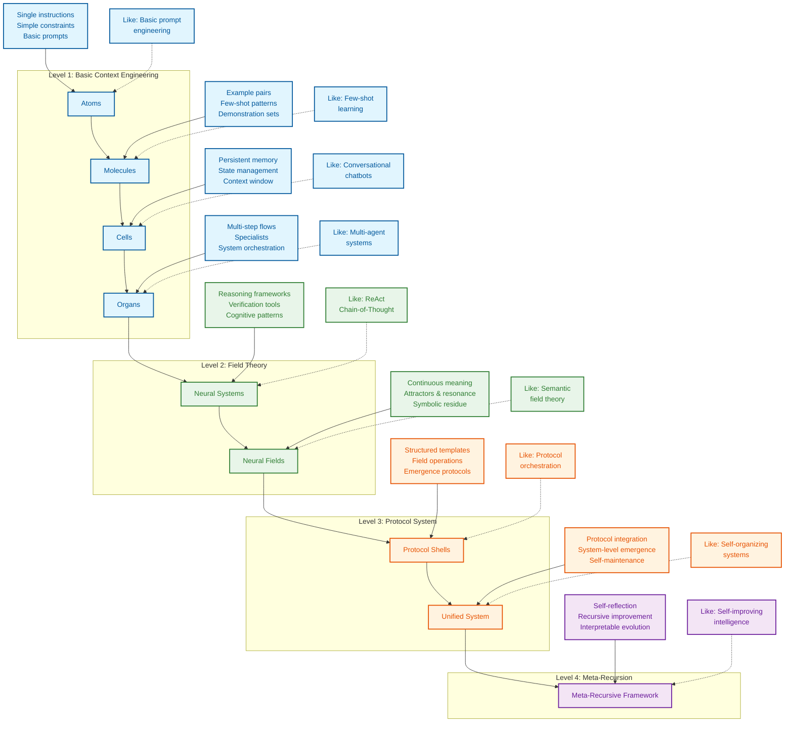

<div align="center">
  
# 上下文工程 (Context Engineering)

</div>


> **“上下文工程是一门细腻的艺术与科学，旨在为下一步操作向上下文窗口中注入恰到好处的信息。”——[**Andrej Karpathy**](https://x.com/karpathy/status/1937902205765607626)**
>
> **[软件正在再次改变（演讲）@ YC AI 创业学院](https://www.youtube.com/watch?v=LCEmiRjPEtQ)**

<div align="center">
  
## [](https://deepwiki.com/davidkimai/Context-Engineering)


</div>

<div align="center">
  
 ## [DeepGraph](https://www.deepgraph.co/davidkimai/Context-Engineering)
 
## [使用 NotebookLM 进行对话与播客深度解析](https://notebooklm.google.com/notebook/0c6e4dc6-9c30-4f53-8e1a-05cc9ff3bc7e)

## [](https://discord.gg/JeFENHNNNQ)


</div>

## [综合课程开发中](https://github.com/davidkimai/Context-Engineering/tree/main/00_COURSE)

> ### **[上下文工程综述：1400篇研究论文回顾](https://arxiv.org/pdf/2507.13334)**
>
> [**awesome-context-engineering 仓库**](https://github.com/Meirtz/Awesome-Context-Engineering)

基于第一性原理与可视化手段，落地最新的上下文研究——涵盖 2025年7月来自 ICML、IBM、NeurIPS、OHBM 等机构的最新成果。 


> **“为 GPT-4.1 提供“认知工具”后，其在 AIME2024 上的 pass@1 表现从 26.7% 提升至 43.3%，非常接近 o1-preview 的性能。”** — [**IBM 苏黎世实验室**](https://www.arxiv.org/pdf/2506.12115)

<div align="center">
  
## [`Agent 命令`](https://github.com/davidkimai/Context-Engineering/tree/main/.claude/commands)
**支持 [Claude Code](https://www.anthropic.com/claude-code) | [OpenCode](https://opencode.ai/) | [Amp](https://sourcegraph.com/amp) | [Kiro](https://kiro.dev/) | [Codex](https://openai.com/codex/) | [Gemini CLI](https://github.com/google-gemini/gemini-cli)**

#### [上下文工程综述：1400篇研究论文回顾](https://arxiv.org/pdf/2507.13334) | [上下文衰减 (Context Rot)](https://research.trychroma.com/context-rot) | [IBM 苏黎世实验室](https://www.arxiv.org/pdf/2506.12115) | [量子语义学](https://arxiv.org/pdf/2506.10077) | [ICML 普林斯顿的涌现符号学](https://openreview.net/forum?id=y1SnRPDWx4) | [MEM1 新加坡-麻省理工学院](https://arxiv.org/pdf/2506.15841) | [上海人工智能的 LLM 吸引子](https://arxiv.org/pdf/2502.15208?) | [MemOS 上海](https://github.com/MemTensor/MemOS) | [潜在推理 (Latent Reasoning)](https://arxiv.org/pdf/2507.06203) | [动态递归深度 (Dynamic Recursive Depths)](https://arxiv.org/pdf/2507.10524)


</div>

一本前沿的、基于第一性原理的手册，带你超越提示词工程（Prompt Engineering），迈向更广阔的上下文设计、编排与优化领域。


```
                    Prompt Engineering  │  Context Engineering
                       ↓                │            ↓                      
               "What you say"           │  "Everything else the model sees"
             (Single instruction)       │    (Examples, memory, retrieval,
                                        │     tools, state, control flow)
```

## 上下文工程的定义

> **上下文不仅仅是用户发送给大语言模型（LLM）的那一条提示词。上下文是在推理时提供给 LLM 的完整信息载荷，涵盖模型为合理完成特定任务所需的所有结构化信息组件。**
>
> — [**来自《超 1400 篇研究论文的系统性分析》中的“上下文工程定义”**](https://arxiv.org/pdf/2507.13334)

```
╭─────────────────────────────────────────────────────────────╮
│              CONTEXT ENGINEERING MASTERY COURSE             │
│                    From Zero to Frontier                    │
╰─────────────────────────────────────────────────────────────╯
                          ▲
                          │
                 Mathematical Foundations
                  C = A(c₁, c₂, ..., cₙ)
                          │
                          ▼
┌─────────────┬──────────────┬──────────────┬─────────────────┐
│ FOUNDATIONS │ SYSTEM IMPL  │ INTEGRATION  │ FRONTIER        │
│ (Weeks 1-4) │ (Weeks 5-8)  │ (Weeks 9-10) │ (Weeks 11-12)   │
└─────┬───────┴──────┬───────┴──────┬───────┴─────────┬───────┘
      │              │              │                 │
      ▼              ▼              ▼                 ▼
┌─────────────┐ ┌──────────────┐ ┌──────────────┐ ┌──────────────┐
│ Math Models │ │ RAG Systems  │ │ Multi-Agent  │ │ Meta-Recurs  │
│ Components  │ │ Memory Arch  │ │ Orchestrat   │ │ Quantum Sem  │
│ Processing  │ │ Tool Integr  │ │ Field Theory │ │ Self-Improv  │
│ Management  │ │ Agent Systems│ │ Evaluation   │ │ Collaboration│
└─────────────┘ └──────────────┘ └──────────────┘ └──────────────┘
```


## 为什么创建此仓库

> **“意义并非语义表达固有的、静态的属性，而是一种涌现现象”**
> — [**Agostino 等人——2025年7月，印第安纳大学**](https://arxiv.org/pdf/2506.10077)

提示词工程曾独占鳌头，但现在我们可以对接下来的演进感到兴奋。当你掌握了提示词编写后，真正的威力来自于构建围绕这些提示词的**整个上下文窗口**。换句话说，这是在引导模型的思考过程。 

本仓库提供了一套循序渐进、基于第一性原理的上下文工程方法，其核心采用了一种生物学隐喻：

```
atoms → molecules → cells → organs → neural systems → neural & semantic field theory 
  │        │         │         │             │                         │        
single    few-     memory +   multi-   cognitive tools +     context = fields +
prompt    shot     agents     agents   operating systems     persistence & resonance
```
> “抽象是泛化的代价”—— [**Grant Sanderson (3Blue1Brown)**](https://www.3blue1brown.com/)


<div align="center">


*《上下文工程综述》- 2025年7月*


  
 **[论涌现、吸引子与动力系统理论](https://content.csbs.utah.edu/~butner/systems/DynamicalSystemsIntro.html) | [哥伦比亚大学动力系统理论 (DST)](http://wordpress.ei.columbia.edu/ac4/about/our-approach/dynamical-systems-theory/)**


https://github.com/user-attachments/assets/9f046259-e5ec-4160-8ed0-41a608d8adf3


</div>




## 快速上手

1. **阅读 [`00_foundations/01_atoms_prompting.md`](00_foundations/01_atoms_prompting.md)** (5 min)  
   了解为什么仅靠提示词往往效果不佳

2. **运行 [`10_guides_zero_to_hero/01_min_prompt.py`](10_guides_zero_to_hero/01_min_prompt.py)**（Jupyter Notebook 风格） 
   尝试一个最小可行示例

3. **探索 [`20_templates/minimal_context.yaml`](20_templates/minimal_context.yaml)**  
   复制粘贴模板到你的项目中  

4. **研究 [`30_examples/00_toy_chatbot/`](30_examples/00_toy_chatbot/)**  
   查看包含完整上下文管理的实现

## 学习路径

```
┌─────────────────┐     ┌──────────────────┐     ┌────────────────┐
│ 00_foundations/ │     │ 10_guides_zero_  │     │ 20_templates/  │
│                 │────▶│ to_one/          │────▶│                │
│ Theory & core   │     │ Hands-on         │     │ Copy-paste     │
│ concepts        │     │ walkthroughs     │     │ snippets       │
└─────────────────┘     └──────────────────┘     └────────────────┘
         │                                                │
         │                                                │
         ▼                                                ▼
┌─────────────────┐                             ┌────────────────┐
│ 40_reference/   │◀───────────────────────────▶│ 30_examples/   │
│                 │                             │                │
│ Deep dives &    │                             │ Real projects, │
│ eval cookbook   │                             │ progressively  │
└─────────────────┘                             │ complex        │
         ▲                                      └────────────────┘
         │                                                ▲
         │                                                │
         └────────────────────┐               ┌───────────┘
                              ▼               ▼
                         ┌─────────────────────┐
                         │ 50_contrib/         │
                         │                     │
                         │ Community           │
                         │ contributions       │
                         └─────────────────────┘
```

## 你将学到什么

| 概念 | 是什么 | 为什么重要 |
|---------|------------|----------------|
| **Token 预算** | 优化上下文中的每一个 token | 更多 token = 更高成本与更慢的响应速度 |
| **少样本学习 (Few-Shot Learning)** | 通过示例进行教学 | 通常比单纯解释更有效 |
| **记忆系统** | 跨轮次持久化信息 | 实现状态保持、交互连贯 |
| **检索增强生成 (RAG)** | 查找并注入相关文档 | 让回答基于事实，减少幻觉 |
| **控制流** | 将复杂任务拆解为步骤 | 用更简单的提示词解决更难的问题 |
| **上下文剪枝** | 移除无关信息 | 仅保留对性能至关重要的内容 |
| **指标与评估** | 衡量上下文有效性 | 迭代优化 token 使用量与质量之间的平衡 |
| **认知工具与提示编程** | 学习构建自定义工具与模板 | 提示编程为上下文工程开启新层级 |
| **神经场理论 (Neural Field Theory)** | 将上下文视为神经场 | 将上下文建模为动态神经场，支持迭代更新 |
| **符号机制** | 符号架构实现高阶推理 | 更智能的系统 = 更少的人工干预 |
| **量子语义学** | 意义依赖于观测者 | 设计利用叠加态技术的上下文系统 |

## 受 Karpathy + 3Blue1Brown 启发的风格

> 适合所有经验水平的学习者

1. **第一性原理** – 从最基础的上下文概念开始
2. **迭代添加** – 仅补充模型确实缺失的内容
3. **全面度量** – 记录 token 成本、延迟与质量评分
4. **无情删减** – 剪枝优于填充
5. **代码 > PPT** – 每个概念都附带可运行的代码单元
6. **可视化一切** — 所有概念均通过 ASCII 和符号图表进行展示

# 研究证据 
## 记忆与推理

### **[MEM1：学习协同记忆与推理以实现高效长程 Agent - 新加坡-麻省理工学院 2025年6月](https://www.arxiv.org/pdf/2506.15841)**

> “我们的结果证明了以推理驱动的记忆巩固，作为训练长程交互 Agent 的可扩展替代方案所展现的潜力——在该方案中，效率与性能均得到优化。” — [**新加坡-麻省理工学院**](https://arxiv.org/pdf/2506.15841)


1. **MEM1 训练 AI Agent 只保留关键信息——在每一步都融合记忆与推理，无论任务多长，Agent 都不会被淹没。**

2. **与其堆积无尽的上下文，MEM1 将每次交互压缩为紧凑的“内部状态”，就像一本智能笔记：持续更新，而非不断复制粘贴。**

3. **通过将记忆与思考融入单一流程，MEM1 学会只记住 essentials——让 Agent 运行更快、思维更敏锐，并能处理长得多对话。**

4. **Agent 执行的每一步都被标记并结构化，因此每个动作、问题或事实都清晰可查——不再出现“黑盒记忆”。**

5. **在每个循环中，旧杂项被剪枝，仅保留最新、最相关的洞察向前推进，这与专家解题时提炼笔记的过程如出一辙。**

6. **MEM1 证明：递归式、协议驱动的记忆机制（始终进行精炼与整合）在速度与准确性上均优于传统的“单纯增加上下文”方法。**
## 认知工具

### **[通过认知工具激发语言模型的推理能力 - IBM 苏黎世实验室 2025年6月](https://www.arxiv.org/pdf/2506.12115)**

### 提示词与提示程序作为推理工具调用
> “认知工具”将推理操作封装在 LLM 内部—— [IBM 苏黎世实验室](https://www.arxiv.org/pdf/2506.12115)


> **这些认知工具（作为工具调用的结构化提示词模板）通过识别核心概念、提取问题中的相关信息，并高亮可能有助于解题的有意义属性、定理与技术，从而将问题拆解。**


> **这些模板构建了类似认知心理捷径（通常被称为“启发式方法”）的推理层级。**

1. **该研究表明，将复杂任务拆解为模块化的“认知工具”，能让 AI 更审慎地解决问题——这模拟了人类专家逐步推理的过程。**

2. **模型不再依赖单一的大提示词，而是调用专门的提示词模板（即认知工具），如“理解问题”、“回忆相关”、“检查答案”和“回溯”——每个模块处理不同的思维操作。**

3. **认知工具如同内在心理捷径：AI 在每个阶段选择合适的程序并运行它，以规划推理与后续动作，从而在执行任务前获得更高的准确性与灵活性。**

4. **通过将推理步骤模块化，这些工具防止了混淆、降低了错误率，并使模型的思考过程透明且可审计——即使在复杂的数学问题上也是如此。**

5. **该模块化方法同时提升了开源与闭源模型的性能——在无需额外训练的情况下，显著增强了实际场景中的数学解题能力，并逼近了经过强化学习训练的“推理”模型性能。**

6. **结果表明：强大的推理种子已存在于大语言模型内部——认知工具只是解锁并编排了这些能力，提供了一种透明、高效且可解释的替代方案，取代黑盒调参。**
## 涌现符号

## **[涌现符号机制支持大语言模型的抽象推理 - ICML 普林斯顿 2025年6月18日](https://openreview.net/forum?id=y1SnRPDWx4)**


> **TL;DR：研究识别出一种三阶段架构，该架构通过一组涌现的符号处理机制支持 LLM 进行抽象推理。**
>
>


**其中包括符号归纳头（symbol induction heads）、符号抽象头（symbolic abstraction heads）和检索头（retrieval heads）。**

**1. 在早期层中，符号抽象头根据 token 之间的关系将输入 token 转换为抽象变量。**

**2. 在中间层中，符号归纳头对这些抽象变量执行序列归纳。**

**3. 最后，在后期层中，检索头通过检索与预测的抽象变量关联的值来预测下一个 token。**

**这些结果指向了对符号主义与神经网络方法之间长期争论的一种解决思路：表明神经网络的涌现推理依赖于符号机制的涌现。—— [**ICML 普林斯顿**](https://openreview.net/forum?id=y1SnRPDWx4)** 


>
> **为何有用？**
>
>
> **这解释了为什么 Markdown、JSON 等结构化符号格式更易于 LLM 解析**
>
> **概念：与 Agent 协作，应用分隔符、语法、符号、象征性词汇、隐喻和结构，以提升推理/上下文/记忆/持久化效果**

1. **该论文证明，大语言模型会发展出内在的符号“逻辑电路”——使其能够使用抽象变量进行推理，而不仅仅是匹配表层词形。**

2. **LLM 展现出三阶段过程：首先从输入中抽象出符号，接着对这些变量进行推理，最后将抽象答案映射回实际 token。**

3. **这些涌现机制意味着 LLM 并非单纯记忆——它们实际上创建了灵活的内部表征，使其能够泛化到新问题和类比中。**

4. **早期层的注意力头充当“符号提取器”，中间层头执行符号推理，晚期头检索具体答案——这与人类的抽象与检索过程高度相似。**

5. **通过定向实验与干预，作者证明这些符号过程对于跨模型、跨任务的抽象推理既是必要的也是充分的。**

6. **结果弥合了符号 AI 与神经网络之间的历史鸿沟——表明在大规模下，神经网络能够发明并使用符号机制，从而支持真正的泛化与推理能力。**


## Star History

[](https://www.star-history.com/#davidkimai/Context-Engineering&Date)

## 贡献指南

欢迎贡献！请查阅 [CONTRIBUTING.md](.github/CONTRIBUTING.md) 了解规范。

## 许可证

[MIT License](LICENSE)

## 引用

```bibtex
@misc{context-engineering,
  author = {Context Engineering Contributors},
  title = {Context Engineering: Beyond Prompt Engineering},
  year = {2025},
  publisher = {GitHub},
  url = {https://github.com/davidkimai/context-engineering}
}
```

## 致谢
> 我一直在期待这一概念被形式化与体系化，因为此前并不存在一个公认的领域。提示词工程背负着不少偏见，且无法完全涵盖我与大多数研究者实际所做的工作。

- [Andrej Karpathy](https://x.com/karpathy/status/1937902205765607626) 提出“上下文工程”一词并启发本仓库 
- 所有贡献者及开源社区