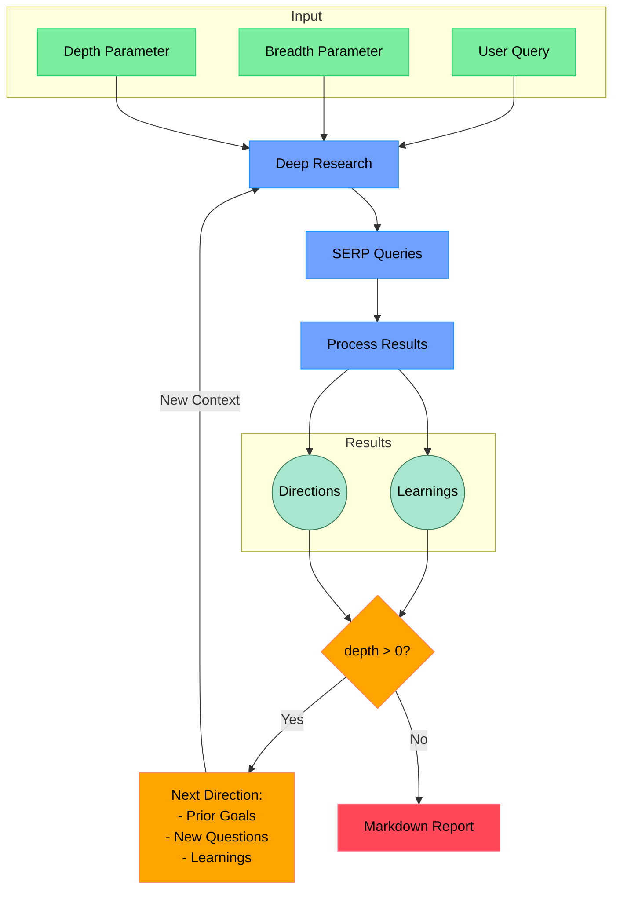

# Open Deep Research

一款由 AI 驱动的研究助手，通过结合搜索引擎、网页抓取和大语言模型（LLM），对任何主题进行迭代式深度研究。

本仓库的目标是提供一个最简化的深度研究智能体（agent）实现——例如，一个能够随时间推移不断调整研究方向并深入探索特定主题的 agent。目标是保持代码量在 <500 LoC 以下，以便于理解并在其基础上进行二次开发。

如果你喜欢这个项目，欢迎给它点个 Star 并在 [X/Twitter](https://x.com/dzhng) 上关注我。本项目由 [Duet](https://duet.so) 创建。

## How It Works



## Features

- **迭代研究**：通过不断生成搜索查询、处理结果并基于发现深入挖掘，执行深度研究。
- **智能查询生成**：利用大语言模型（LLM），根据研究目标和前期发现生成精准的搜索查询。
- **深度与广度控制**：提供可配置参数，用于控制研究的覆盖范围（广度）和挖掘程度（深度）。
- **智能追问**：生成后续问题，以更准确地理解研究需求。
- **综合报告**：生成包含详细发现和来源引用的 Markdown 格式报告。
- **并发处理**：并行执行多项搜索与结果处理，提升效率。

## Requirements

- Node.js 运行环境
- API 密钥（API keys）：
  - Firecrawl API（用于网页搜索和内容提取）
  - OpenAI API（用于调用 o3 mini 模型）

## Setup

### Node.js

1. 克隆本仓库
2. 安装依赖项：

```bash
npm install
```

3. 在 `.env.local` 文件中配置环境变量：

```bash
FIRECRAWL_KEY="your_firecrawl_key"
# If you want to use your self-hosted Firecrawl, add the following below:
# FIRECRAWL_BASE_URL="http://localhost:3002"

OPENAI_KEY="your_openai_key"
```

若要使用本地大语言模型，请注释掉 `OPENAI_KEY`，并取消注释 `OPENAI_ENDPOINT` 和 `OPENAI_MODEL`：

- 将 `OPENAI_ENDPOINT` 设置为本地服务器的地址（例如 `"http://localhost:1234/v1"`）
- 将 `OPENAI_MODEL` 设置为你的本地服务器中加载的模型名称。

### Docker

1. 克隆本仓库
2. 将 `.env.example` 重命名为 `.env.local` 并配置你的 API 密钥

3. 运行 `docker build -f Dockerfile`

4. 启动 Docker 镜像：

```bash
docker compose up -d
```

5. 在 Docker 容器中执行 `npm run docker`：

```bash
docker exec -it deep-research npm run docker
```

## Usage

运行研究助手：

```bash
npm start
```

系统将提示你依次输入/选择以下内容：

1. 输入你的研究主题/查询内容
2. 指定研究广度（推荐值：3-10，默认：4）
3. 指定研究深度（推荐值：1-5，默认：2）
4. 回答后续问题以细化研究方向

随后系统将执行以下操作：

1. 生成并执行搜索查询
2. 处理与分析搜索结果
3. 基于发现结果递归地进行更深层次的探索
4. 生成综合性的 Markdown 报告

最终报告将保存为你工作目录下的 `report.md` 或 `answer.md`，具体文件名取决于你选择的运行模式。

### Concurrency

如果你使用的是付费版或本地部署的 Firecrawl，可以通过设置 `CONCURRENCY_LIMIT` 环境变量来增加并发限制（ConcurrencyLimit），从而提升运行速度。

如果你使用的是免费版，可能会偶尔遇到速率限制错误。你可以将限制降低至 1（但运行速度会显著变慢）。

### DeepSeek R1

深度研究在 R1 模型上表现优异！我们使用 [Fireworks](http://fireworks.ai) 作为 R1 模型的主要服务提供商。要使用 R1，只需设置一个 Fireworks API 密钥：

```bash
FIREWORKS_KEY="api_key"
```

检测到该密钥后，系统将自动切换至使用 R1 模型替代默认的 `o3-mini`。

### Custom endpoints and models

还有另外两个可选的环境变量，可用于自定义接口地址（适用于其他兼容 OpenAI 的 API，如 OpenRouter 或 Gemini）以及模型名称。

```bash
OPENAI_ENDPOINT="custom_endpoint"
CUSTOM_MODEL="custom_model"
```

## How It Works

1. **初始设置**

   - 接收用户查询及研究参数（广度与深度）
   - 生成后续问题，以更准确地理解研究需求

2. **深度研究流程**

   - 根据研究目标生成多个 SERP 查询
   - 处理搜索结果以提取关键信息/学习点
   - 生成后续研究方向建议

3. **递归探索**

   - 若深度大于 0，则采用新的研究方向并继续探索
   - 每次迭代均基于前期的发现进行构建
   - 保持对研究目标和已有发现的上下文关联

4. **报告生成**
   - 将所有发现汇总为一份综合性的 Markdown 报告
   - 包含所有来源与参考文献/链接
   - 以清晰易读的格式组织信息
  
## Community implementations

**Python**：https://github.com/Finance-LLMs/deep-research-python

## License

MIT 许可证——欢迎根据需求自由使用和修改。