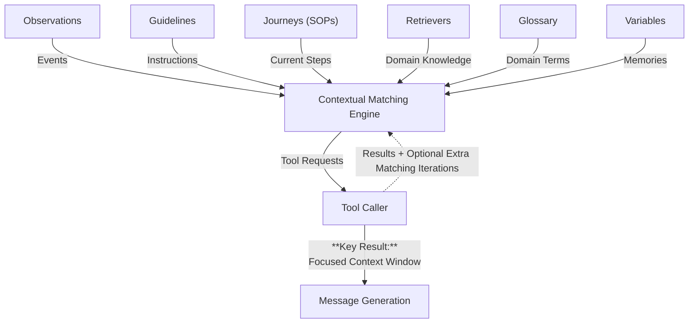
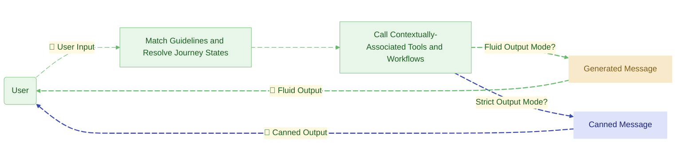

<div align="center">

<picture>
  <source media="(prefers-color-scheme: dark)" srcset="https://github.com/emcie-co/parlant/blob/develop/docs/LogoTransparentLight.png?raw=true">
  
</picture>

### 面向客户交互的 AI Agent 控制框架

<p>
  <a href="https://pypi.org/project/parlant/"></a>
  
  <a href="https://opensource.org/licenses/Apache-2.0"></a>
  <a href="https://discord.gg/duxWqxKk6J"></a>
  
</p>

<p>
  <a href="https://www.parlant.io/" target="_blank">官网</a> &bull;
  <a href="https://www.parlant.io/docs/quickstart/installation" target="_blank">快速入门</a> &bull;
  <a href="https://www.parlant.io/docs/quickstart/examples" target="_blank">示例</a> &bull;
  <a href="https://discord.gg/duxWqxKk6J" target="_blank">Discord</a>
</p>

<p>
  <a href="https://zdoc.app/de/emcie-co/parlant">Deutsch</a> |
  <a href="https://zdoc.app/es/emcie-co/parlant">Español</a> |
  <a href="https://zdoc.app/fr/emcie-co/parlant">français</a> |
  <a href="https://zdoc.app/ja/emcie-co/parlant">日本語</a> |
  <a href="https://zdoc.app/ko/emcie-co/parlant">한국어</a> |
  <a href="https://zdoc.app/pt/emcie-co/parlant">Português</a> |
  <a href="https://zdoc.app/ru/emcie-co/parlant">Русский</a> |
  <a href="https://zdoc.app/zh/emcie-co/parlant">中文</a>
</p>

<a href="https://trendshift.io/repositories/12768" target="_blank">
  
</a>

</div>

&nbsp;

> **正在寻找 Ada、Decagon 或 Sierra 的开源替代方案？**

**Parlant 已具备生产环境部署能力。它简化了企业级 B2C（面向消费者）和高敏感度 B2B 交互的开发与维护，确保交互一致、合规、符合品牌调性，并支持全面的可追溯性。**

## 为什么选择 Parlant？

**对话式上下文工程（Context Engineering）之所以困难**，是因为现实世界的交互场景多样、细节微妙且非线性。

### ❌ 痛点：你可能尝试过但难以在大规模场景下落地的方案
**系统提示词（System Prompts）**在生产环境复杂度提升前有效。你在提示词中添加的指令越多，Agent 忽略这些指令的速度就越快。

**路由图（Routed Graphs）**解决了提示词过载问题，但添加的路由越多，在面对自然交互的混乱时就越脆弱。

### 🔑 解决方案：专为对话控制优化的上下文工程
Parlant 是一个 Agent 控制框架，为对话场景提供了经过优化的[上下文工程（Context Engineering）](https://www.gartner.com/en/articles/context-engineering)方案：在正确的时间，将恰好合适、不多不少的上下文注入提示词中。你只需一次性定义规则、知识和工具，引擎便会实时收窄上下文范围，仅保留与当前对话轮次直接相关的内容。


### Parlant 与 LangGraph 或 DSPy 有何不同？
Parlant 专注于对话治理、行为控制与一致性；LangGraph 更适合工作流自动化，而 DSPy 则擅长底层提示词优化。

## 设计目标

Parlant 围绕三个核心目标构建，这些目标塑造了框架中的每一项决策：

### 1. 对话体验的极致控制力

Parlant 的设计基于一个简单理念：**开发者应能精确地控制 Agent 的行为**。在面向客户的对话中，语气、时机、边缘情况、政策约束和品牌调性等细节至关重要。因此我们选择了一种设计架构，使这些方面易于配置和管理。虽然这增加了复杂性，但它让团队能够更紧密地掌控 Agent 在实际对话中的表现。

### 2. 最大程度防止不当行为

Parlant 将“模型对齐（Alignment）”视为核心设计问题。它基于[关于模型准确性与一致性的研究](https://arxiv.org/abs/2503.03669#:~:text=We%20present%20Attentive%20Reasoning%20Queries%20%28ARQs%29%2C%20a%20novel,in%20Large%20Language%20Models%20through%20domain-specialized%20reasoning%20blueprints.)，使得 Agent 偏离预期边界的行为在结构上更难发生，同时也更易于检测和纠正。Parlant 并非简单地在输出端添加护栏（Guardrails），而是将约束和控制点直接融入 LLM 的使用方式中，从而从根本上生成安全、正确的结果。

### 3. 从产品反馈到落地的最短路径

Parlant 旨在让负责 Agent 对话体验的团队能够以直观的方式塑造其行为，实现快速反馈循环，工程师也能轻松适配。Parlant 的设计让你能以最快速度融入持续的产品反馈，无需手动重连图结构或微调模型，确保宝贵的工程时间仅用于深度改造，而非琐碎调整。

## 快速入门

```bash
pip install parlant
```

```python
import parlant.sdk as p

async with p.Server():
    agent = await server.create_agent(
        name="Customer Support",
        description="Handles customer inquiries for an airline",
    )

    # Evaluate and call tools only under the right conditions
    expert_customer = await agent.create_observation(
        condition="customer uses financial terminology like DTI or amortization",
        tools=[research_deep_answer],
    )

    # When the expert observation holds, always respond
    # with depth. Set the guideline to automatically match
    # whenever the observation it depends on holds...
    expert_answers = await agent.create_guideline(
        matcher=p.MATCH_ALWAYS,
        action="respond with technical depth",
        dependencies=[expert_customer],
    )

    beginner_answers = await agent.create_guideline(
        condition="customer seems new to the topic",
        action="simplify and use concrete examples",
    )

    # When both match, beginners wins. Neither expert-level
    # tool-data nor instructions can enter the agent's context.
    await beginner_answers.exclude(expert_customer)
```

请查阅 **[5分钟快速入门指南](https://www.parlant.io/docs/quickstart/installation)** 获取完整操作指引。

## 核心架构一览

你在代码中（而非提示词中）定义 Agent 的行为，引擎会在每一轮对话时动态收窄上下文范围，仅保留即时相关的内容，从而使 LLM 保持专注，并确保你的 Agent 行为始终对齐。



与传统方式不同，Parlant 不会将庞大的系统提示词和原始对话直接发送给模型。它首先组装聚焦的上下文——仅匹配与当前对话轮次相关的指令和工具——然后基于收窄后的上下文生成回复。



通过这种方式，增加规则会让 Agent 变得更智能，而不是更困惑——因为过滤上下文相关性的引擎是 Parlant，而非 LLM。

## Parlant 适合你吗？

Parlant 专为需要让 AI Agent 在真实客户面前稳定表现的团队打造。如果你的情况符合以下描述，它将非常合适：

- 你正在构建一个**面向客户的 Agent**（如客服、销售、入职引导、咨询顾问），语气准确性与合规性至关重要。
- 你有**数十甚至数百条行为规则**，且系统提示词已不堪重负。
- 你处于**强监管或高风险领域**（金融、保险、医疗、电信），每条回复都必须可解释、可审计。

**_Parlant 已部署于包括银行在内的最严苛机构的生产环境中。_*

> _Parlant 不仅仅是一个框架，它是一个解决对话建模问题的高层级软件平台。_
> —— **Sarthak Dalabehera**，Slice Bank 首席工程师

> _迄今为止我见过最优雅的对话式 AI 框架。_
> —— **Vishal Ahuja**，JPMorgan Chase 高级应用 AI 负责人

> _Parlant 大幅减少了对提示词工程和复杂流程控制的需求。构建 Agent 的过程更接近领域建模。_
> —— **Diogo Santiago**，Orcale AI 工程师

## 核心功能

- **[行为准则（Guidelines）](https://parlant.io/docs/concepts/customization/guidelines)** — 
  基于条件-动作对的行为规则；引擎仅匹配每轮对话相关的内容。

- **[关系映射（Relationships）](https://parlant.io/docs/concepts/customization/relationships)** — 
  准则间的依赖与互斥机制，保持上下文精简聚焦。

- **[交互旅程（Journeys）](https://parlant.io/docs/concepts/customization/journeys)** — 
  多轮标准作业程序（SOP），可根据客户实际交互方式自适应调整。

- **[预设回复（Canned Responses）](https://parlant.io/docs/concepts/customization/canned-responses)** — 
  预审批的回复模板，在关键时刻彻底消除幻觉风险。

- **[工具（Tools）](https://parlant.io/docs/concepts/customization/tools)** — 
  外部 API 与工作流，仅在观测条件匹配时触发。

- **[术语表（Glossary）](https://parlant.io/docs/concepts/customization/glossary)** — 
  领域专属词汇库，确保 Agent 理解客户用语。

- **[可解释性（Explainability）](https://parlant.io/docs/advanced/explainability)** — 
  完整的 OpenTelemetry 链路追踪——每条准则匹配与决策均会被记录。

## [行为准则（Guidelines）](https://parlant.io/docs/concepts/customization/guidelines)

基于条件-动作对的行为规则：当条件满足时，对应动作将注入上下文。

无需将所有准则塞入单个提示词中，引擎会在每一轮对话时评估哪些准则适用，并仅将相关内容加入 LLM 的上下文中。

这使得你可以定义数百条准则而不会导致遵循率下降。

```python
await agent.create_guideline(
    condition="customer uses financial terminology like DTI or amortization",
    action="respond with technical depth — skip basic explanations",
)
```

## [关系映射（Relationships）](https://parlant.io/docs/concepts/customization/guidelines)

元素间的关系配置帮助你精准控制最终上下文：保持精简与聚焦。

**互斥（Exclusion）**关系可在冲突准则匹配时，将特定准则排除在模型注意力之外。

```python
for_experts = await agent.create_guideline(
    condition="customer uses financial terminology",
    action="respond with technical depth",
)

for_beginners = await agent.create_guideline(
    condition="customer seems new to the topic",
    action="simplify and use concrete examples",
)

# In conflicting reads of the customer, set which takes priority
await for_beginners.exclude(for_experts)
```

**依赖（Dependency）**关系确保某条准则仅在另一条准则已铺垫好上下文时才激活，帮助你构建_基于主题的准则层级结构。_

```python
suspects_fraud = await agent.create_observation(
    condition="customer suspects unauthorized transactions on their card",
)

await agent.create_guideline(
    condition="customer wants to take action regarding the transaction",
    action="ask whether they want to dispute the transaction or lock the card",
    # Only activates when fraud suspicion has been established
    dependencies=[suspects_fraud],
)
```

## [交互旅程（Journeys）](https://parlant.io/docs/concepts/customization/journeys)

多轮标准作业程序（SOP）。为预订、故障排查或入职引导等流程定义交互路径。Agent 会遵循该路径但具备自适应能力——它可跳过状态、回溯先前步骤，或根据客户互动节奏调整进度。

```python
journey = await agent.create_journey(
    title="Book Flight",
    description="Guide the customer through flight booking",
    conditions=["customer wants to book a flight"],
)

t0 = await journey.initial_state.transition_to(
    # Instruction to follow while in this state (could be multiple turns)
    chat_state="See if they're interested in last-minute deals",
)

# Branch A - not interested in deals
t1 = await t0.target.transition_to(
    chat_state="Determine where they want to go and when",
    condition="They aren't interested",
)

# Branch B - interested in deals
t2 = await t0.target.transition_to(
    tool_state=load_latest_flight_deals,
    condition="They are",
)

t3 = await t1.target.transition_to(
    chat_state="List deals and see if they're interested",
)
```

## [预设回复（Canned Responses）](https://parlant.io/docs/concepts/customization/canned-responses)

在关键时刻或特定对话事件中，限制 Agent 仅使用预审批的回复模板。

引擎完成匹配序列并草拟消息后，Agent 会选取与生成草稿最匹配的模板进行发送，而非直接输出原始内容，从而彻底消除幻觉风险并保持措辞绝对精准。

```python
await agent.create_guideline(
    condition="The customer discusses things unrelated to our business"
    action="Tell them you can't help with that",
    # Strict composition mode triggers when this guideline
    # matches - the rest of the agent stays fluid
    composition_mode=p.CompositionMode.STRICT,
    canned_responses=[
        await agent.create_canned_response(
            "Sorry, but I can't help you with that."
        )
    ],
    priority=100,  # Top priority, focuses the agent on this alone
)
```

## [工具（Tools）](https://parlant.io/docs/concepts/customization/tools)

工具仅在观测条件匹配时激活，不会永久占用上下文。这有效避免了传统 LLM 工具调用中常见的误触发问题。

```python
@p.tool
async def query_docs(context: p.ToolContext, user_query: str) -> p.ToolResult:
    results = search_knowledge_base(user_query)
    return p.ToolResult(results)

await agent.create_observation(
    condition="customer asks about service features",
    tools=[query_docs],
)
```

工具还可将自定义值注入预设回复模板中。

## [术语表（Glossary）](https://parlant.io/docs/concepts/customization/glossary)

为 Agent 提供领域专属词汇库。将口语化表达和同义词映射到精确的业务定义，确保 Agent 准确理解客户用语。

```python
await agent.create_term(
    name="Ocean View",
    description="Room category with direct view of the Atlantic",
    synonyms=["sea view", "rooms with a view to the Atlantic"],
)
```

## [可解释性（Explainability）](https://parlant.io/docs/advanced/explainability)

所有决策均通过 OpenTelemetry 进行追踪。Parlant 开箱即提供详尽的日志、指标与链路追踪功能。

## 框架集成

Parlant 负责对话治理，它不会替代你现有的技术栈。

可将其与 LangGraph、Agno、LlamaIndex 或其他框架配合使用，以实现工作流自动化和知识检索。Parlant 接管行为控制层，而你选择的框架负责处理 Agent 的其他逻辑。

任何外部工作流或 Agent 都可作为 Parlant 工具接入，仅在相关时触发：

```python
from my_workflows import refund_graph  # a compiled LangGraph StateGraph

@p.tool
async def run_refund_workflow(
  context: p.ToolContext,
  order_id: str
) -> p.ToolResult:
    result = await refund_graph.ainvoke({"order_id": order_id})

    # Graph result can inject both data and instructions into the agent.
    # Instructions are transformed to guidelines, and participate
    # in contextual guideline resolution (including prioritizations)

    return p.ToolResult(
        data=result["data"],
        # Inject dynamic guidelines from workflow result
        guidelines=[
            {"action": inst, "priority": 3} for inst in result["instructions"]
        ],
    )

await agent.create_observation(
    condition="customer wants to process a refund",
    tools=[run_refund_workflow],
)
```

该模式同样适用于 LlamaIndex 查询引擎、Agno Agent 或任何异步 Python 函数。

## 模型无关性（LLM Agnostic）

Parlant 兼容大多数 LLM 提供商。官方推荐 **[Emcie](https://www.emcie.co)**，因其专为 Parlant 打造，能提供最理想的性价比；OpenAI 和 Anthropic 也能提供卓越的质量输出。你还可以通过 LiteLLM 使用任意模型与提供商，但需确保模型质量达标——过于轻量级的现成模型往往会导致结果不稳定。

通常情况下，更换模型无需调整行为配置。

## [官方 React 聊天组件](https://github.com/emcie-co/parlant-chat-react)

开箱即用的聊天组件，可快速部署前端界面。

## 深入学习

- **[Parlant 如何确保合规性](https://www.parlant.io/blog/how-parlant-guarantees-compliance)** — 深入解析引擎原理
- **[Parlant 与 LangGraph 对比](https://www.parlant.io/blog/parlant-vs-langgraph)** — 适用场景指南
- **[Parlant 与 DSPy 对比](https://www.parlant.io/blog/parlant-vs-dspy)** — 针对不同问题的工具选型

## 社区与支持

- **[Discord 频道](https://discord.gg/duxWqxKk6J)** — 提问交流、分享项目进展
- **[GitHub Issues](https://github.com/emcie-co/parlant/issues)** — 提交 Bug 报告与功能建议
- **[联系我们](https://parlant.io/contact)** — 直接对接工程团队

**如果 Parlant 帮助你构建了更优秀的 Agent，请**[给它一个 Star](https://github.com/emcie-co/parlant)**——这能帮助更多人发现该项目。**

## 开源协议

Apache 2.0 —— 支持商业免费使用。

---

<div align="center">

**[立即试用](https://www.parlant.io/docs/quickstart/installation)** &bull; **[加入 Discord](https://discord.gg/duxWqxKk6J)** &bull; **[阅读文档](https://www.parlant.io/)**

由 **[Emcie](https://emcie.co)** 团队打造

</div>