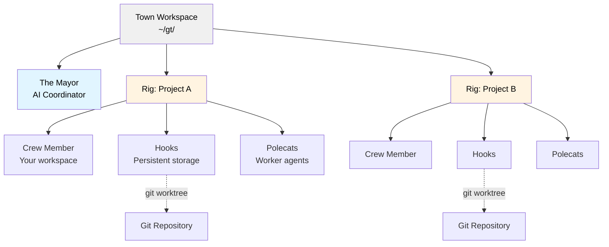
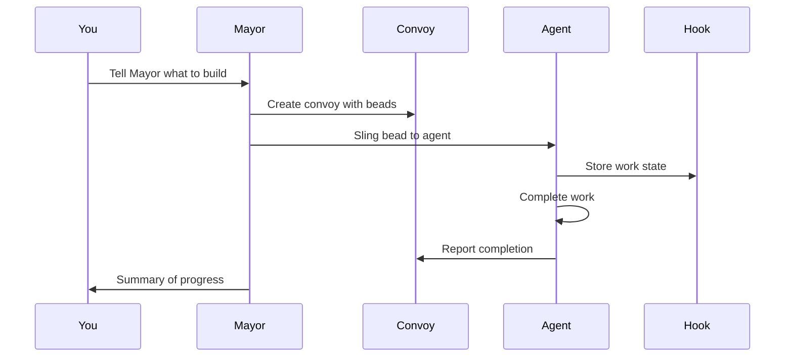
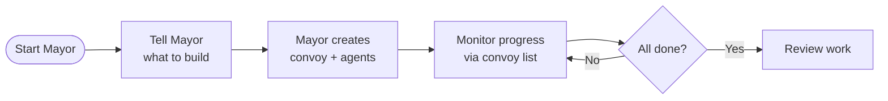
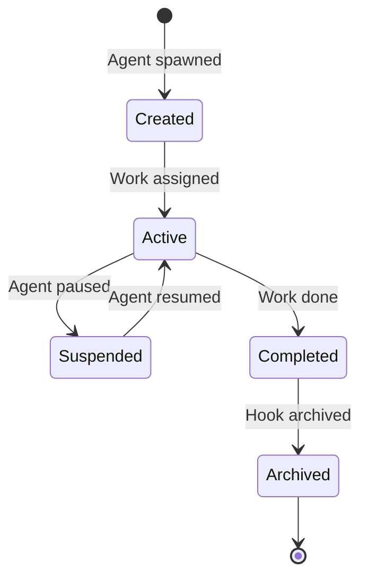

# Gas Town

**适用于 Claude Code、GitHub Copilot 及其他 AI Agent，具备持久化工作追踪的多智能体编排系统**

## 概述

Gas Town 是一个工作区管理器，让你能够协调多个 AI 编程智能体（如 Claude Code、GitHub Copilot、Codex、Gemini 等）并行处理不同任务。当智能体重启时不会丢失上下文，因为 Gas Town 将工作状态持久化存储在基于 Git 的 Hooks（钩子）中，从而实现了可靠的多智能体工作流。

### 解决的核心问题？

| 挑战                       | Gas Town 解决方案                            |
| ------------------------------- | -------------------------------------------- |
| 智能体重启时丢失上下文          | 工作状态持久化在基于 Git 的 Hooks（钩子）中    |
| 手动协调智能体                  | 内置邮箱、身份标识与工作交接机制               |
| 4-10 个智能体会陷入混乱         | 可舒适扩展至 20-30 个智能体                    |
| 工作状态丢失在智能体内存中      | 状态存储于 Beads（珠子）账本中                 |

### 架构设计



## 核心概念

### 市长（The Mayor）🎩

你的主要 AI 协调器。市长是一个拥有完整工作区、项目及智能体上下文的 Claude Code 实例。**从这里开始**——只需告诉市长你想完成什么任务即可。

### 城镇（Town）🏘️

你的工作区目录（例如 `~/gt/`）。包含所有项目、智能体及配置文件。

### 工程容器（Rigs）🏗️

项目容器。每个 Rig 封装一个 Git 仓库，并管理其关联的智能体。

### 船员成员（Crew Members）👤

你在某个 Rig 内的个人工作区。用于进行实际操作和开发的地方。

### 鼬鼠智能体（Polecats）🦨

具有持久化身份但会话临时的工作型智能体。按需生成以执行任务，任务完成后会话结束，但其身份标识和工作历史会保留。

### 钩子（Hooks）🪝

基于 Git Worktree 的智能体工作持久化存储。可抵御崩溃和重启导致的数据丢失。

### 车队/任务组（Convoys）🚚

工作追踪单元。将多个 Beads（珠子/工单）打包并分配给智能体。标记为 `mountain` 的车队具备自动停滞检测与智能跳过逻辑，适用于史诗级规模的任务执行。

### Beads（珠子）集成 📿

基于 Git 的工单追踪系统，将工作状态存储为结构化数据。

**Bead ID（也称作 Issue ID）**采用“前缀+5位字母数字”格式（例如 `gt-abc12`、`hq-x7k2m`）。前缀表示工单的来源或所属 Rig。命令如 `gt sling` 和 `gt convoy` 接受这些 ID 来引用特定工作项。“Bead”与“Issue”可互换使用——Bead 是底层数据格式，Issue 则是以 Bead 形式存储的工作项。

### 分子（Molecules）🧬

协调多步骤工作的流程模板。公式（TOML 定义）被实例化为带有可追踪步骤的 Molecule。支持两种模式：仅根节点 Wisps（步骤在运行时生成，轻量级）与已倾倒 Wisps（步骤生成为子 Wisps，具备检查点恢复能力）。详见 [Molecules](docs/concepts/molecules.md)。

### 监控体系：Witness、Deacon、Dogs 🐕

三级看门狗系统用于保障智能体健康运行：

- **Witness（见证者）** - 单 Rig 生命周期管理器。监控 Polecats，检测停滞的智能体，触发恢复机制，管理会话清理。
- **Deacon（执事）** - 后台监督进程，在所有 Rig 间执行连续巡逻周期。
- **Dogs（猎犬）** - 由 Deacon 派发的基础设施维护工作者（例如用于分诊的 Boot）。

### 合并处理器/炼油厂（Refinery）🏭

单 Rig 的合并请求队列处理器。当 Polecats 通过 `gt done` 完成工作时，Refinery 会批量处理合并请求（MR），运行验证关卡，并使用类似 Bors 的二分法队列将代码合并至 main 分支。失败的 MR 会被隔离，随后进行内联修复或重新派发。

### 升级机制（Escalation）🚨

按严重程度路由的工单升级机制。遇到阻塞的智能体通过 `gt escalate` 发起升级，系统会创建可追踪的 Beads，并按 Deacon、Mayor 及（必要时）Overseer 的路由传递。严重程度分级：CRITICAL (P0)、HIGH (P1)、MEDIUM (P2)。详见 [Escalation](docs/design/escalation.md)。

### 调度器（Scheduler）⏱️

基于配置的 Polecats 派发容量控制器。通过在下发可配置并发限制内批量派发来防止 API 速率限制耗尽。默认为直接派发；设置 `scheduler.max_polecats` 即可启用与守护进程的延迟派发机制。详见 [Scheduler](docs/design/scheduler.md)。

### 通灵会话（Seance）👻

会话发现与续接机制。通过 `.events.jsonl` 日志发现之前的智能体会话，使当前智能体能向历史会话查询上下文及早期决策。

```bash
gt seance                       # List discoverable predecessor sessions
gt seance --talk <id> -p "What did you find?"  # One-shot question
```

### 废土网络（Wasteland）🏜️

通过 DoltHub 连接多个 Gas Town 的联邦化工作协调网络。Rig 可发布需求，认领其他城镇的工作，提交完成证明，并通过多维印章赚取可迁移的声誉积分。详见 [Wasteland](docs/WASTELAND.md)。

> **初次使用 Gas Town？** 请参阅 [术语表（Glossary）](docs/glossary.md) 获取完整的术语与概念指南。

## 安装指南

### 前置条件

- **Go 1.25+** - [go.dev/dl](https://go.dev/dl/)
- **Git 2.25+** - for worktree support
- **Dolt 2.0.7+** - `brew install dolt` on macOS, or see [github.com/dolthub/dolt](https://github.com/dolthub/dolt)
- **beads (bd) 0.55.4+** - installed by `brew install gastown`, or see [github.com/steveyegge/beads](https://github.com/steveyegge/beads)
- **sqlite3** - for convoy database queries (usually pre-installed on macOS/Linux)
- **tmux 3.0+** - recommended for full experience
- **Claude Code CLI** (default runtime) - [claude.ai/code](https://claude.ai/code)
- **Codex CLI** (optional runtime) - [developers.openai.com/codex/cli](https://developers.openai.com/codex/cli)
- **GitHub Copilot CLI** (optional runtime) - [cli.github.com](https://cli.github.com) (requires Copilot seat)

### 配置步骤（下文含 Docker Compose）

```bash
# Install Gas Town
$ brew install gastown                                    # Homebrew (recommended)
$ npm install -g @gastown/gt                              # npm
$ go install github.com/steveyegge/gastown/cmd/gt@latest  # From source (Linux only)

# macOS: go install produces unsigned binaries that macOS will SIGKILL.
# Use brew install (above) or install Dolt and clone/build with make:
$ brew install dolt
$ git clone https://github.com/steveyegge/gastown.git && cd gastown
$ make build && mv gt $HOME/go/bin/

# Windows (or if go install fails): clone and build manually
$ git clone https://github.com/steveyegge/gastown.git && cd gastown
$ go build -o gt.exe ./cmd/gt
$ mv gt.exe $HOME/go/bin/  # or add gastown to PATH

# If using go install, add Go binaries to PATH (add to ~/.zshrc or ~/.bashrc)
export PATH="$PATH:$HOME/go/bin"

# Create workspace with git initialization
gt install ~/gt --git
cd ~/gt

# Add your first project
gt rig add myproject https://github.com/you/repo.git

# Create your crew workspace
gt crew add yourname --rig myproject
cd myproject/crew/yourname

# Start the Mayor session (your main interface)
gt mayor attach
```

### Docker Compose 部署

```bash
export GIT_USER="<your name>"
export GIT_EMAIL="<your email>"
export FOLDER="/Users/you/code"
export DASHBOARD_PORT=8080  # optional, host port for the web dashboard

docker compose build              # only needed on first run or after code changes
docker compose up -d

docker compose exec gastown zsh   # or bash

gt up

gh auth login                     # if you want gh to work

gt mayor attach
```

## 快速入门指南

### 开始使用
运行以下命令，然后告诉市长你想构建什么！
```shell
gt install ~/gt --git &&
cd ~/gt &&
gt config agent list &&
gt mayor attach
```
---

### 基础工作流



### 示例：功能开发

```bash
# 1. Start the Mayor
gt mayor attach

# 2. In Mayor session, create a convoy with bead IDs
gt convoy create "Feature X" gt-abc12 gt-def34 --notify --human

# 3. Assign work to an agent
gt sling gt-abc12 myproject

# 4. Track progress
gt convoy list

# 5. Monitor agents
gt agents
```

## 常见工作流

### 市长工作流（推荐）

**适用场景：** 协调复杂的多工单任务



**命令：**

```bash
# Attach to Mayor
gt mayor attach

# In Mayor, create convoy and let it orchestrate
gt convoy create "Auth System" gt-x7k2m gt-p9n4q --notify

# Track progress
gt convoy list
```

### 极简模式（无需 Tmux）

手动运行各个独立的运行时实例。Gas Town 仅负责状态追踪。

```bash
gt convoy create "Fix bugs" gt-abc12   # Create convoy (sling auto-creates if skipped)
gt sling gt-abc12 myproject            # Assign to worker
claude --resume                        # Agent reads mail, runs work (Claude)
# or: codex                            # Start Codex in the workspace
gt convoy list                         # Check progress
```

### Beads 公式工作流

**适用场景：** 预定义的可重复流程

Formula（公式）是嵌入在 `gt` 二进制文件中的 TOML 定义工作流（源码位于 `internal/formula/formulas/`）。

**示例 Formula** (`internal/formula/formulas/release.formula.toml`)：

```toml
description = "Standard release process"
formula = "release"
version = 1

[vars.version]
description = "The semantic version to release (e.g., 1.2.0)"
required = true

[[steps]]
id = "bump-version"
title = "Bump version"
description = "Run ./scripts/bump-version.sh {{version}}"

[[steps]]
id = "run-tests"
title = "Run tests"
description = "Run make test"
needs = ["bump-version"]

[[steps]]
id = "build"
title = "Build"
description = "Run make build"
needs = ["run-tests"]

[[steps]]
id = "create-tag"
title = "Create release tag"
description = "Run git tag -a v{{version}} -m 'Release v{{version}}'"
needs = ["build"]

[[steps]]
id = "publish"
title = "Publish"
description = "Run ./scripts/publish.sh"
needs = ["create-tag"]
```

**执行方式：**

```bash
# List available formulas
bd formula list

# Run a formula with variables
bd cook release --var version=1.2.0

# Create formula instance for tracking
bd mol pour release --var version=1.2.0
```

### 手动车队工作流

**适用场景：** 直接控制任务分配

```bash
# Create convoy manually
gt convoy create "Bug Fixes" --human

# Add issues to existing convoy
gt convoy add hq-cv-abc gt-m3k9p gt-w5t2x

# Assign to specific agents
gt sling gt-m3k9p myproject/my-agent

# Check status
gt convoy show
```

## 运行时配置

Gas Town 支持多种 AI 编程运行环境。各 Rig 的运行环境设置位于 `settings/config.json`。

```json
{
  "runtime": {
    "provider": "codex",
    "command": "codex",
    "args": [],
    "prompt_mode": "none"
  }
}
```

**注意事项：**

- Claude Code 使用 `.claude/settings.json` 中的 Hooks（通过 `--settings` 参数管理）进行邮件注入与启动配置。
- 对于 Codex，需在 `~/.codex/config.toml` 中设置 `project_doc_fallback_filenames = ["CLAUDE.md"]` 以加载角色指令。
- 对于无 Hooks 的运行环境（如 Codex），Gas Town 会在会话就绪后发送启动回退指令：`gt prime`，可选的自主角色指令 `gt mail check --inject`，以及 `gt nudge deacon session-started`。
- **GitHub Copilot** (`copilot`) 为内置预设，使用 `--yolo` 参数启用自主模式。它通过 `.github/hooks/gastown.json` 中的可执行生命周期 Hooks（事件与 Claude 相同：`sessionStart`、`userPromptSubmitted`、`preToolUse`、`sessionEnd`）运行。采用 5 秒就绪延迟替代提示词检测。需具备 Copilot 席位及组织级 CLI 策略。详见 [docs/INSTALLING.md](docs/INSTALLING.md)。

## 核心命令

### 工作区管理

```bash
gt install <path>           # Initialize workspace
gt rig add <name> <repo>    # Add project
gt rig list                 # List projects
gt crew add <name> --rig <rig>  # Create crew workspace
```

### 智能体操作

```bash
gt agents                   # List active agents
gt sling <bead-id> <rig>    # Assign work to agent
gt sling <bead-id> <rig> --agent cursor   # Override runtime for this sling/spawn
gt mayor attach             # Start Mayor session
gt mayor start --agent auggie           # Run Mayor with a specific agent alias
gt prime                    # Context recovery (run inside existing session)
gt feed                     # Real-time activity feed (TUI)
gt feed --problems          # Start in problems view (stuck agent detection)
```

**内置智能体预设**：`claude`、`gemini`、`codex`、`cursor`、`auggie`、`amp`、`opencode`、`copilot`、`pi`、`omp`

### 车队（工作追踪）

```bash
gt convoy create <name> [issues...]   # Create convoy with issues
gt convoy list              # List all convoys
gt convoy show [id]         # Show convoy details
gt convoy add <convoy-id> <issue-id...>  # Add issues to convoy
```

### 配置管理

```bash
# Set custom agent command
gt config agent set claude-glm "claude-glm --model glm-4"
gt config agent set codex-low "codex --thinking low"

# Set default agent
gt config default-agent claude-glm
```

### 监控与健康状态

```bash
gt escalate -s HIGH "description"  # Escalate a blocker
gt escalate list               # List open escalations
gt scheduler status            # Show scheduler state
gt seance                      # Discover previous sessions
gt seance --talk <id>          # Query a predecessor session
```

### Beads（珠子）集成

```bash
bd formula list             # List formulas
bd cook <formula>           # Execute formula
bd mol pour <formula>       # Create trackable instance
bd mol list                 # List active instances
```

### 废土联邦网络

```bash
gt wl join <remote>            # Join a wasteland
gt wl browse                   # View wanted board
gt wl claim <id>               # Claim work
gt wl done <id> --evidence <url>  # Submit completion
```

## 运行公式（Cooking Formulas）

Gas Town 内置了适用于常见工作流的 Formula。可用配方见 `internal/formula/formulas/`。

## 活动流（Activity Feed）

`gt feed` 会启动一个交互式终端仪表盘，用于实时监控所有智能体活动。它将 Beads 活动、智能体事件和合并队列更新整合为三面板 TUI：

- **Agent Tree** - 按 Rig 和角色分组的层级化智能体视图
- **Convoy Panel** - 进行中和刚完成的车队列表
- **Event Stream** - 创建、完成、派发、提示等操作的 chronological（时间顺序） feed

```bash
gt feed                      # Launch TUI dashboard
gt feed --problems           # Start in problems view
gt feed --plain              # Plain text output (no TUI)
gt feed --window             # Open in dedicated tmux window
gt feed --since 1h           # Events from last hour
```

**操作导航：** 按 `j`/`k` 滚动，`Tab` 切换面板，`1`/`2`/`3` 跳转至指定面板，`?` 查看帮助，`q` 退出。

### 问题视图（Problems View）

在大规模部署（20-50+ 智能体）时，在活动流中定位停滞的智能体会变得困难。问题视图通过分析结构化的 Beads 数据，突出显示需要人工干预的智能体。

在 `gt feed` 中按 `p`（或启动时加 `--problems`）切换至问题视图，该视图会按健康状态对智能体进行分组：

| State | Condition |
|-------|-----------|
| **GUPP Violation** | Hooked work with no progress for an extended period |
| **Stalled** | Hooked work with reduced progress |
| **Zombie** | Dead tmux session |
| **Working** | Active, progressing normally |
| **Idle** | No hooked work |

**干预快捷键**（在问题视图中）：按 `n` 提示选中智能体，按 `h` 进行交接（刷新上下文）。

## Web 仪表盘

Gas Town 内置了用于监控工作区的 Web 仪表盘。该仪表盘必须在 Gas Town 工作区（HQ）目录下运行。

```bash
# Start dashboard (default port 8080)
gt dashboard

# Start on a custom port
gt dashboard --port 3000

# Start and automatically open in browser
gt dashboard --open
```

仪表盘提供单页面概览，展示工作区内智能体、车队、Hooks、队列、工单及升级项的所有动态。它通过 htmx 实现自动刷新，并内置命令面板，支持直接在浏览器中执行 `gt` 命令。

## 监控与健康体系

Gas Town 采用三级看门狗链式架构以保障大规模智能体健康运行：

```
Daemon (Go process) ← heartbeat every 3 min
    └── Boot (AI agent) ← intelligent triage
        └── Deacon (AI agent) ← continuous patrol
            └── Witnesses & Refineries ← per-rig agents
```

### Witness（单 Rig 监控）

每个 Rig 均配备一个 Witness 用于监控其 Polecats。Witness 负责检测停滞的智能体、触发恢复机制（提示或交接）、管理会话清理并追踪完成状态。Witness 采用委派工作的方式而非直接实现逻辑。

### Deacon（跨 Rig 监督）

Deacon 在所有 Rig 间执行连续巡逻周期，检查智能体健康状态、为维护任务派发 Dogs，并将 Witness 无法解决的工单进行升级。

### 工单升级（Escalation）

当智能体遇到阻塞时，会主动发起升级而非等待：

```bash
gt escalate -s HIGH "Description of blocker"
gt escalate list                    # List open escalations
gt escalate ack <bead-id>           # Acknowledge an escalation
```

工单会根据严重程度按 Deacon -> Mayor -> Overseer 的路由进行传递。详见 [升级机制设计（Escalation design）](docs/design/escalation.md)。

## 合并队列（Refinery）

Refinery 通过二分法合并队列处理已完成的 Polecats 工作：

1. Polecat runs `gt done` -> branch pushed, MR bead created
2. Refinery batches pending MRs
3. Runs verification gates on the merged stack
4. If green: all MRs in batch merge to main
5. If red: bisects to isolate the failing MR, merges the good ones

此为类 Bors 风格的合并队列——Polecats 永远不会直接推送至 main 分支。

## 调度器（Scheduler）

调度器控制 Polecats 的派发容量，以防止 API 速率限制耗尽：

```bash
gt config set scheduler.max_polecats 5   # Enable deferred dispatch (max 5 concurrent)
gt scheduler status                      # Show scheduler state
gt scheduler pause                       # Pause dispatch
gt scheduler resume                      # Resume dispatch
```

默认模式（`max_polecats = -1`）通过 `gt sling` 立即派发。设置上限后，守护进程会按容量限制增量派发。详见 [调度器设计（Scheduler design）](docs/design/scheduler.md)。

## 通灵会话（Seance）

发现并查询历史智能体会话：

```bash
gt seance                              # List discoverable predecessor sessions
gt seance --talk <id>                  # Full context conversation with predecessor
gt seance --talk <id> -p "Question?"   # One-shot question to predecessor
```

Seance 通过 `.events.jsonl` 日志发现会话，使智能体能恢复早期工作的上下文与决策，而无需重新读取整个代码库。

## 废土联邦网络（Wasteland Federation）

废土网络是一个通过 DoltHub 连接多个 Gas Town 的联邦化工作协调系统：

```bash
gt wl join hop/wl-commons              # Join a wasteland
gt wl browse                           # View wanted board
gt wl claim <id>                       # Claim a wanted item
gt wl done <id> --evidence <url>       # Submit completion with evidence
gt wl post --title "Need X"            # Post new wanted item
```

完成的工作可通过多维印章（质量、速度、复杂度）赚取可迁移的声誉积分。详见 [废土指南（Wasteland guide）](docs/WASTELAND.md)。

## 遥测数据（OpenTelemetry）

Gas Town 将所有智能体操作作为结构化日志和指标发送至任意兼容 OTLP 的后端服务（默认使用 VictoriaMetrics/VictoriaLogs）：

```bash
# Configure OTLP endpoints
export GT_OTEL_LOGS_URL="http://localhost:9428/insert/jsonline"
export GT_OTEL_METRICS_URL="http://localhost:8428/api/v1/write"
```

**上报事件**：会话生命周期、智能体状态变更、带耗时的 bd 调用、邮件操作、sling/nudge/done 工作流、Polecats 生成/移除、Formula 实例化、车队创建、守护进程重启等。

**指标包含**：`gastown.session.starts.total`、`gastown.bd.calls.total`、`gastown.polecat.spawns.total`、`gastown.done.total`、`gastown.convoy.creates.total` 等。

完整事件架构详见 [OTEL 数据模型（OTEL data model）](docs/otel-data-model.md) 与 [OTEL 架构（OTEL architecture）](docs/design/otel/)。

## 高级概念

### 推进原则（The Propulsion Principle）

Gas Town 将 Git Hooks 作为推进机制。每个 Hook 都是一个具备以下特性的 Git Worktree：

1. **持久化状态** - 工作可抵御智能体重启
2. **版本控制** - 所有变更均通过 Git 追踪
3. **回滚能力** - 可恢复至任意历史状态
4. **多智能体协调** - 通过 Git 共享协作

### Hook 生命周期



### MEOW（市长增强编排工作流）

MEOW 为官方推荐的工作模式：

1. **告知市长** - 描述你的目标
2. **市长分析** - 拆解为具体任务
3. **创建车队** - 市长生成包含 Beads 的车队
4. **生成智能体** - 市长按需启动对应智能体
5. **任务分发** - 通过 Hooks 将 Beads 派发至智能体
6. **进度监控** - 通过车队状态进行追踪
7. **完成交付** - 市长汇总结果

## Shell 自动补全

```bash
# Bash
gt completion bash > /etc/bash_completion.d/gt

# Zsh
gt completion zsh > "${fpath[1]}/_gt"

# Fish
gt completion fish > ~/.config/fish/completions/gt.fish
```

## 项目角色

| Role            | Description                          | Primary Interface    |
| --------------- | ------------------------------------ | -------------------- |
| **市长（Mayor）**       | AI 协调器                            | `gt mayor attach`    |
| **人类（你）**      | 船员成员                             | 你的 Crew 目录       |
| **鼬鼠（Polecat）**     | 工作型智能体                         | 由市长生成           |
| **见证者（Witness）**     | 单 Rig 智能体健康监控                | 自动巡逻             |
| **执事（Deacon）**      | 跨 Rig 监督守护进程                  | `gt patrol`          |
| **炼油厂（Refinery）**    | 合并队列处理器                       | 自动运行             |
| **钩子（Hook）**        | 持久化存储                           | Git Worktree         |
| **车队（Convoy）**      | 工作追踪器                           | `gt convoy` 命令     |

## 使用技巧

- **始终从市长开始** - 它是为你设计的主要交互界面
- **利用车队进行协调** - 提供跨智能体的全局可见性
- **善用 Hooks 实现持久化** - 你的工作不会丢失
- **为重复任务创建 Formula** - 借助 Beads 配方节省时间
- **使用 `gt feed` 进行实时监控** - 观察智能体活动并尽早发现停滞状态
- **监控 Web 仪表盘** - 在浏览器中获取实时视图
- **交由市长编排** - 它深知如何管理智能体

## 设计文档

如需更深入的技术细节，请参阅 `docs/` 目录下的设计文档：

| Topic | Document |
|-------|----------|
| Architecture | [docs/design/architecture.md](docs/design/architecture.md) |
| Glossary | [docs/glossary.md](docs/glossary.md) |
| Molecules | [docs/concepts/molecules.md](docs/concepts/molecules.md) |
| Escalation | [docs/design/escalation.md](docs/design/escalation.md) |
| Scheduler | [docs/design/scheduler.md](docs/design/scheduler.md) |
| Wasteland | [docs/WASTELAND.md](docs/WASTELAND.md) |
| OTEL data model | [docs/otel-data-model.md](docs/otel-data-model.md) |
| Witness design | [docs/design/witness-at-team-lead.md](docs/design/witness-at-team-lead.md) |
| Convoy lifecycle | [docs/design/convoy/](docs/design/convoy/) |
| Polecat lifecycle | [docs/design/polecat-lifecycle-patrol.md](docs/design/polecat-lifecycle-patrol.md) |
| Plugin system | [docs/design/plugin-system.md](docs/design/plugin-system.md) |
| Agent providers | [docs/agent-provider-integration.md](docs/agent-provider-integration.md) |
| Hooks | [docs/HOOKS.md](docs/HOOKS.md) |
| Installation guide | [docs/INSTALLING.md](docs/INSTALLING.md) |

## 故障排除

### 智能体失去连接

检查 Hooks 是否正确初始化：

```bash
gt hooks list
gt hooks repair
```

### 车队卡住

强制刷新：

```bash
gt convoy refresh <convoy-id>
```

### 市长无响应

重启市长会话：

```bash
gt mayor detach
gt mayor attach
```

## 许可证

MIT License - see LICENSE file for details