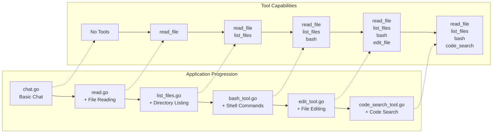
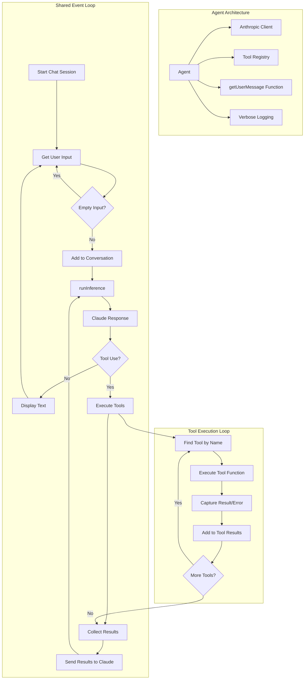

# 🧠 通过分步工作坊构建你自己的编程智能体

欢迎！👋 本工作坊将引导你逐步构建自己的 **AI 驱动的编程助手** —— 从基础聊天机器人开始，并添加文件读取、Shell 命令执行和代码搜索等强大工具。

你不需要是 AI 专家。只需跟随步骤，一步步动手构建即可！

🌐 **想要详细了解？** 请查看博客文章：[ghuntley.com/agent](https://ghuntley.com/agent/)

---

## 🎯 你将学到什么

完成本工作坊后，你将掌握如何：

- ✅ 连接 Anthropic Claude API
- ✅ 构建一个简单的 AI 聊天机器人
- ✅ 添加读取文件、编辑代码和运行命令等工具
- ✅ 处理工具请求与错误
- ✅ 构建一个在每一步中不断变聪明的智能体（Agent）

---

## 🛠️ 我们将构建什么

你将构建 6 个版本的编程助手。 

每个版本都会增加更多功能：

1. **基础聊天** —— 与 Claude 对话
2. **文件读取器** —— 读取代码文件
3. **文件浏览器** —— 列出文件夹中的文件
4. **命令执行器** —— 运行 Shell 命令
5. **文件编辑器** —— 修改文件
6. **代码搜索** —— 使用模式搜索你的代码库



最后，你将拥有一个强大的本地开发助手！


---

## 🧱 工作原理（架构）

每个智能体的工作流程如下：

1. 等待你的输入
2. 将其发送给 Claude
3. Claude 可能直接回复，或请求使用工具
4. 智能体运行该工具（例如读取文件）
5. 将结果发送回 Claude
6. Claude 给出最终答案

我们称之为 **事件循环（Event Loop）** —— 它就像智能体的心跳。



## 🚀 快速开始

### ✅ 前置条件

* Go 1.24.2+ 或 [devenv](https://devenv.sh/)（推荐用于轻松配置环境）
* 一个 [Anthropic API 密钥](https://www.anthropic.com/product/claude)

### 🔧 设置你的环境

**选项 1：推荐（使用 devenv）**

```bash
devenv shell  # Loads everything you need
```

**选项 2：手动设置**

```bash
# Make sure Go is installed
go mod tidy
```

### 🔐 添加你的 API 密钥

```bash
export ANTHROPIC_API_KEY="your-api-key-here"
```

---

## 🏁 从基础开始

### 1. `chat.go` —— 基础聊天

一个与 Claude 对话的简单聊天机器人。

```bash
go run chat.go
```

* ➡️ 尝试：“你好！”
* ➡️ 添加 `--verbose` 参数以查看详细日志

---

## 🛠️ 逐步添加工具

### 2. `read.go` —— 读取文件

现在 Claude 可以读取你电脑上的文件。

```bash
go run read.go
```

* ➡️ 尝试：“读取 fizzbuzz.js”

---

### 3. `list_files.go` —— 浏览文件夹

让 Claude 查看你的目录结构。

```bash
go run list_files.go
```

* ➡️ 尝试：“列出此文件夹中的所有文件”
* ➡️ 尝试：“fizzbuzz.js 里有什么内容？”

---

### 4. `bash_tool.go` —— 运行 Shell 命令

允许 Claude 运行安全的终端命令。

```bash
go run bash_tool.go
```

* ➡️ 尝试：“执行 git status”
* ➡️ 尝试：“使用 bash 列出所有 .go 文件”

---

### 5. `edit_tool.go` —— 编辑文件

现在 Claude 可以**修改代码**、创建文件并进行更改。

```bash
go run edit_tool.go
```

* ➡️ 尝试：“创建一个 Python hello world 脚本”
* ➡️ 尝试：“在 fizzbuzz.js 顶部添加注释”

---

### 6. `code_search_tool.go` —— 搜索代码

使用模式搜索（由 [ripgrep](https://github.com/BurntSushi/ripgrep) 提供支持）。

```bash
go run code_search_tool.go
```

* ➡️ 尝试：“查找所有 Go 文件中的函数定义”
* ➡️ 尝试：“搜索 TODO 注释”

---

## 🧪 示例文件（已包含在内）

1. `fizzbuzz.js`：用于文件读取和编辑练习
2. `riddle.txt`：一个有趣的文本文件，供探索使用
3. `AGENT.md`：关于项目环境的信息

---

## 🐞 故障排除

**API 密钥无法工作？**

* 确保已正确导出环境变量：`echo $ANTHROPIC_API_KEY`
* 在 [Anthropic 控制台](https://www.anthropic.com) 检查你的额度

**遇到 Go 报错？**

* 运行 `go mod tidy`
* 确保使用的是 Go 1.24.2 或更高版本

**遇到工具报错？**

* 使用 `--verbose` 参数查看完整错误日志
* 检查文件路径和权限设置

**环境配置问题？**

* 运行 `devenv shell` 以避免配置冲突

---

## 💡 工具工作原理（底层机制）

工具就像插件。你需要定义：

* **名称**（例如 `read_file`）
* **输入结构（Schema）**（所需的信息格式）
* **函数逻辑**（具体执行的操作）

以下是 Go 语言中的工具定义示例：

```go
var ToolDefinition = ToolDefinition{
    Name:        "read_file",
    Description: "Reads the contents of a file",
    InputSchema: GenerateSchema[ReadFileInput](),
    Function:    ReadFile,
}
```

结构体（Struct）生成模式定义 —— 因此易于定义和复用。

---

## 🧭 学习路径：边做边学

| 阶段 | 学习重点                                 |
| ----- | ------------------------------------------------ |
| **1** | `chat.go`：API 集成与响应处理 |
| **2** | `read.go`：工具系统与模式定义生成        |
| **3** | `list_files.go`：多工具调用与文件系统交互     |
| **4** | `bash_tool.go`：Shell 执行与错误捕获   |
| **5** | `edit_tool.go`：文件编辑与安全校验      |
| **6** | `code_search_tool.go`：模式搜索与 ripgrep 集成   |

---

## 🛠️ 开发者环境（可选）

如果你使用 [`devenv`](https://devenv.sh/)，它将提供：

* Go、Node.js、Python、Rust、.NET
* Git 及其他开发工具

```bash
devenv shell   # Load everything
devenv test    # Run checks
hello          # Greeting script
```

---

## 🚀 下一步做什么？

完成本工作坊后，你可以尝试构建：

* 自定义工具（例如 API 调用器、网页爬虫）
* 工具链（按顺序执行多个工具）
* 记忆功能（跨会话记住上下文信息）
* 智能体的 Web 界面
* 与其他 AI 模型的集成

---

## 📦 总结

本工作坊将帮助你：

* 理解智能体架构
* 学习构建智能助手的方法
* 逐步扩展功能能力
* 实践将 Claude 与 Go 结合使用

---

尽情探索并打造你自己的 AI 驱动工具吧！💻✨

如有疑问或想法，欢迎 Fork 本仓库、提交 Issue，或与社区交流！