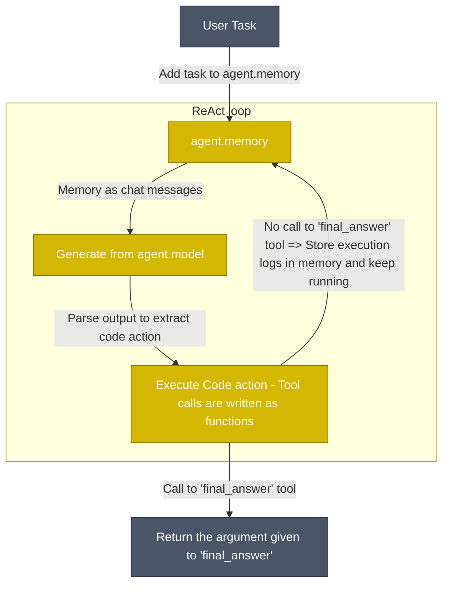

<!---
Copyright 2024 The HuggingFace Team. All rights reserved.

Licensed under the Apache License, Version 2.0 (the "License");
you may not use this file except in compliance with the License.
You may obtain a copy of the License at

    http://www.apache.org/licenses/LICENSE-2.0

Unless required by applicable law or agreed to in writing, software
distributed under the License is distributed on an "AS IS" BASIS,
WITHOUT WARRANTIES OR CONDITIONS OF ANY KIND, either express or implied.
See the License for the specific language governing permissions and
limitations under the License.
-->
<p align="center">
    <!-- Uncomment when CircleCI is set up
    <a href="https://circleci.com/gh/huggingface/accelerate"></a>
    -->
    <a href="https://github.com/huggingface/smolagents/blob/main/LICENSE"></a>
    <a href="https://huggingface.co/docs/smolagents"></a>
    <a href="https://github.com/huggingface/smolagents/releases"></a>
    <a href="https://github.com/huggingface/smolagents/blob/main/CODE_OF_CONDUCT.md"></a>
    <a href="https://deepwiki.com/huggingface/smolagents"></a>
</p>

<h3 align="center">
  <div style="display:flex;flex-direction:row;">
    
    <p>用代码思考的 Agent！</p>
  </div>
</h3>

`smolagents` 是一个让你只需几行代码即可运行强大 Agent（智能体）的库。它提供：

✨ **简洁性**：Agent 的逻辑仅需约 1,000 行代码（见 [agents.py](https://github.com/huggingface/smolagents/blob/main/src/smolagents/agents.py)）。我们在原始代码之上将抽象保持到了最小！

🧑‍💻 **对 Code Agent 的一流支持**。我们的 [`CodeAgent`](https://huggingface.co/docs/smolagents/reference/agents#smolagents.CodeAgent) 将动作以代码形式编写（而不是“被用来写代码的 Agent”）。为确保安全，我们支持通过 [Blaxel](https://blaxel.ai)、[E2B](https://e2b.dev/)、[Modal](https://modal.com/) 或 Docker 在沙箱环境中执行。

🤗 **与 Hub 集成**：你可以 [向 Hub 分享/拉取工具或 Agent](https://huggingface.co/docs/smolagents/reference/tools#smolagents.Tool.from_hub)，实现高效 Agent 的即时共享！

🌐 **模型无关（Model-agnostic）**：smolagents 支持任意 LLM。它可以是本地 `transformers` 或 `ollama` 模型、[Hub 上的众多提供商之一](https://huggingface.co/blog/inference-providers)，或通过我们的 [LiteLLM](https://www.litellm.ai/) 集成使用的 OpenAI、Anthropic 及其他厂商的任何模型。

👁️ **模态无关（Modality-agnostic）**：Agent 支持文本、视觉、视频甚至音频输入！关于视觉支持的详细教程请参见[此处](https://huggingface.co/docs/smolagents/examples/web_browser)。

🛠️ **工具无关（Tool-agnostic）**：你可以使用来自任意 [MCP 服务器](https://huggingface.co/docs/smolagents/reference/tools#smolagents.ToolCollection.from_mcp)、[LangChain](https://huggingface.co/docs/smolagents/reference/tools#smolagents.Tool.from_langchain) 的工具，甚至可以将一个 [Hub Space](https://huggingface.co/docs/smolagents/reference/tools#smolagents.Tool.from_space) 作为工具来调用。

完整文档请查阅[此处](https://huggingface.co/docs/smolagents/index)。

> [!NOTE]
> 查看我们的[首发博客文章](https://huggingface.co/blog/smolagents)，了解更多关于 `smolagents` 的信息！

## Quick demo（快速演示）

首先安装带有默认工具集的包：
```bash
pip install "smolagents[toolkit]"
```
然后定义你的 Agent，赋予它所需的工具并运行！
```py
from smolagents import CodeAgent, WebSearchTool, InferenceClientModel

model = InferenceClientModel()
agent = CodeAgent(tools=[WebSearchTool()], model=model, stream_outputs=True)

agent.run("How many seconds would it take for a leopard at full speed to run through Pont des Arts?")
```

https://github.com/user-attachments/assets/84b149b4-246c-40c9-a48d-ba013b08e600

你甚至可以将你的 Agent 作为 Space 仓库分享到 Hub：
```py
agent.push_to_hub("m-ric/my_agent")

# agent.from_hub("m-ric/my_agent") to load an agent from Hub
```

我们的库是模型无关的（LLM-agnostic）：你可以将上述示例切换到任意推理提供商。

<details>
<summary> <b>InferenceClientModel，HF 支持的所有<a href="https://huggingface.co/docs/inference-providers/index">推理提供商</a>的网关</b></summary>

```py
from smolagents import InferenceClientModel

model = InferenceClientModel(
    model_id="deepseek-ai/DeepSeek-R1",
    provider="together",
)
```
</details>
<details>
<summary> <b>通过 LiteLLM 访问 100+ LLMs</b></summary>

```py
from smolagents import LiteLLMModel

model = LiteLLMModel(
    model_id="anthropic/claude-4-sonnet-latest",
    temperature=0.2,
    api_key=os.environ["ANTHROPIC_API_KEY"]
)
```
</details>
<details>
<summary> <b>兼容 OpenAI 的服务端：Together AI</b></summary>

```py
import os
from smolagents import OpenAIModel

model = OpenAIModel(
    model_id="deepseek-ai/DeepSeek-R1",
    api_base="https://api.together.xyz/v1/", # Leave this blank to query OpenAI servers.
    api_key=os.environ["TOGETHER_API_KEY"], # Switch to the API key for the server you're targeting.
)
```
</details>
<details>
<summary> <b>兼容 OpenAI 的服务端：OpenRouter</b></summary>

```py
import os
from smolagents import OpenAIModel

model = OpenAIModel(
    model_id="openai/gpt-4o",
    api_base="https://openrouter.ai/api/v1", # Leave this blank to query OpenAI servers.
    api_key=os.environ["OPENROUTER_API_KEY"], # Switch to the API key for the server you're targeting.
)
```

</details>
<details>
<summary> <b>本地 `transformers` 模型</b></summary>

```py
from smolagents import TransformersModel

model = TransformersModel(
    model_id="Qwen/Qwen3-Next-80B-A3B-Thinking",
    max_new_tokens=4096,
    device_map="auto"
)
```
</details>
<details>
<summary> <b>Azure 模型</b></summary>

```py
import os
from smolagents import AzureOpenAIModel

model = AzureOpenAIModel(
    model_id = os.environ.get("AZURE_OPENAI_MODEL"),
    azure_endpoint=os.environ.get("AZURE_OPENAI_ENDPOINT"),
    api_key=os.environ.get("AZURE_OPENAI_API_KEY"),
    api_version=os.environ.get("OPENAI_API_VERSION")    
)
```
</details>
<details>
<summary> <b>Amazon Bedrock 模型</b></summary>

```py
import os
from smolagents import AmazonBedrockModel

model = AmazonBedrockModel(
    model_id = os.environ.get("AMAZON_BEDROCK_MODEL_ID") 
)
```
</details>

## CLI（命令行界面）

你可以通过两个 CLI 命令运行 Agent：`smolagent` 和 `webagent`。

`smolagent` 是一个通用命令，用于运行可配备多种工具的逐步执行 `CodeAgent`。

```bash
# Run with direct prompt and options
smolagent "Plan a trip to Tokyo, Kyoto and Osaka between Mar 28 and Apr 7."  --model-type "InferenceClientModel" --model-id "Qwen/Qwen3-Next-80B-A3B-Thinking" --imports pandas numpy --tools web_search

# Run in interactive mode (launches setup wizard when no prompt provided)
smolagent
```

交互模式将引导你完成：
- Agent 类型选择（CodeAgent vs ToolCallingAgent）  
- 从可用工具箱中选择工具
- 模型配置（类型、ID、API 设置）
- 高级选项，如额外导入模块
- 任务提示词输入

而 `webagent` 是一个使用 [helium](https://github.com/mherrmann/helium) 的专用网页浏览 Agent（更多信息请参见[此处](https://github.com/huggingface/smolagents/blob/main/src/smolagents/vision_web_browser.py)）。

例如：
```bash
webagent "go to xyz.com/men, get to sale section, click the first clothing item you see. Get the product details, and the price, return them. note that I'm shopping from France" --model-type "LiteLLMModel" --model-id "gpt-5"
```

## Code Agent 是如何工作的？

我们的 [`CodeAgent`](https://huggingface.co/docs/smolagents/reference/agents#smolagents.CodeAgent) 工作方式与经典的 ReAct Agent 基本一致——唯一的区别在于，LLM 引擎将动作编写为 Python 代码片段。



动作现在是 Python 代码片段。因此，工具调用将以 Python 函数调用的形式执行。例如，以下是 Agent 如何在单次动作中跨多个网站进行网页搜索：
```py
requests_to_search = ["gulf of mexico america", "greenland denmark", "tariffs"]
for request in requests_to_search:
    print(f"Here are the search results for {request}:", web_search(request))
```

将动作编写为代码片段已被证明比当前行业让 LLM 输出工具调用字典的做法更有效：[使用步骤减少 30%](https://huggingface.co/papers/2402.01030)（即 LLM 调用次数减少 30%），并在[困难基准测试中取得更高性能](https://huggingface.co/papers/2411.01747)。前往[我们的 Agent 高级介绍](https://huggingface.co/docs/smolagents/conceptual_guides/intro_agents) 了解更多详情。

由于代码执行可能带来严重的安全隐患（任意代码执行风险！），**你应该在沙箱中运行 Agent 代码**。我们提供以下几种选项：
  - [E2B](https://e2b.dev/)、[Blaxel](https://blaxel.ai)、[Modal](https://modal.com/) ——托管云沙箱，配置最简单
  - [Docker](https://www.docker.com/) ——自托管容器隔离

内置的 `LocalPythonExecutor` **并非安全沙箱**。它应用了一些限制，但可能被绕过，绝不能用作安全边界。

除了 [`CodeAgent`](https://huggingface.co/docs/smolagents/reference/agents#smolagents.CodeAgent)，我们还提供了标准的 [`ToolCallingAgent`](https://huggingface.co/docs/smolagents/reference/agents#smolagents.ToolCallingAgent)，它将动作编写为 JSON/文本块。你可以根据用例选择最适合的风格。

## 这个库有多精简？

我们力求将抽象保持在最低限度：`agents.py` 中的主代码不到 1,000 行。
尽管如此，我们实现了多种类型的 Agent：`CodeAgent` 将动作编写为 Python 代码片段，而更经典的 `ToolCallingAgent` 则利用内置的工具调用方法。我们还支持多 Agent 层级、从工具集合导入、远程代码执行、视觉模型等功能……

顺便一提，为什么一定要用框架？因为其中很大一部分内容并不简单。例如，代码 Agent 必须在其系统提示词、解析器和执行过程中保持代码格式的一致性。因此，我们的框架为你处理了这些复杂性。当然，我们仍然鼓励你深入源码，仅提取并使用你需要的部分！

## 开源模型在 Agentic 工作流中表现如何？

我们使用一些主流模型创建了 [`CodeAgent`](https://huggingface.co/docs/smolagents/reference/agents#smolagents.CodeAgent) 实例，并在[此基准测试](https://huggingface.co/datasets/m-ric/agents_medium_benchmark_2) 中对它们进行了比较。该测试汇集了来自不同基准的问题，提出了多样化的挑战组合。

[在此查看基准测试代码](https://github.com/huggingface/smolagents/blob/main/examples/smolagents_benchmark/run.py) 以了解所使用的 Agent 设置的更多细节，并查看使用 LLM 代码 Agent 与基础方法的对比（剧透：代码 Agent 表现更好）。

<p align="center">
    
</p>

这张对比图表明，开源模型现在完全可以媲美甚至超越闭源最佳模型！

## Security（安全）

在使用可执行代码的 Agent 时，安全性是关键考量。请确保使用提供不受信任代码隔离的沙箱执行选项之一。

**警告：** `LocalPythonExecutor` 仅提供尽力而为的缓解措施，且**不是安全边界**。请勿使用它运行不受信任的代码。

有关安全策略、漏洞报告以及更多关于安全 Agent 执行的信息，请参阅我们的 [Security Policy](SECURITY.md)。

## Contribute（贡献）

欢迎所有人参与贡献，请查阅我们的 [contribution guide](https://github.com/huggingface/smolagents/blob/main/CONTRIBUTING.md) 开始。

## Cite smolagents（引用）

如果你在出版物中使用了 `smolagents`，请使用以下 BibTeX 条目进行引用。

```bibtex
@Misc{smolagents,
  title =        {`smolagents`: a smol library to build great agentic systems.},
  author =       {Aymeric Roucher and Albert Villanova del Moral and Thomas Wolf and Leandro von Werra and Erik Kaunismäki},
  howpublished = {\url{https://github.com/huggingface/smolagents}},
  year =         {2025}
}
```