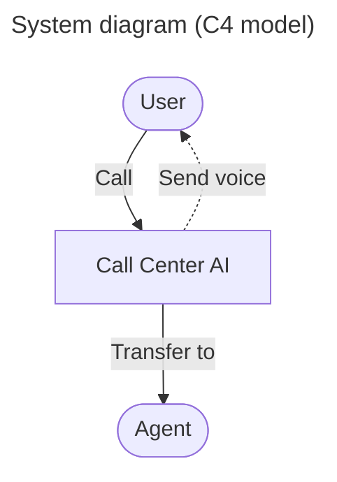
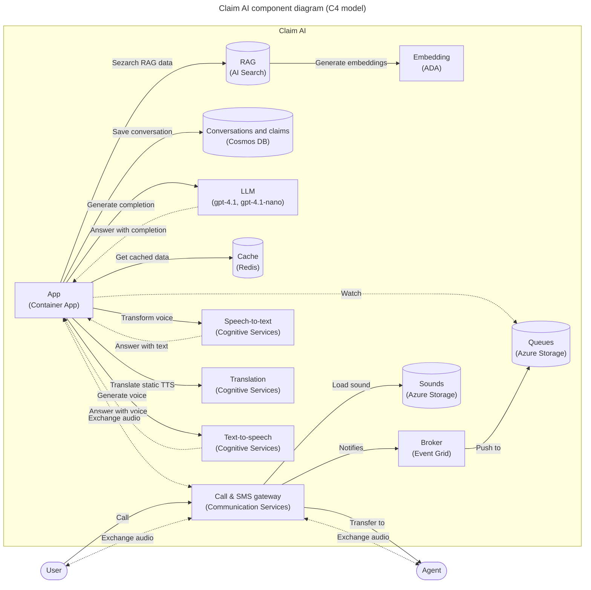

# 呼叫中心 AI

基于 Azure 和 OpenAI GPT 的 AI 驱动呼叫中心解决方案。

<!-- github.com badges -->
[](https://github.com/clemlesne/call-center-ai/releases)
[](https://github.com/clemlesne/call-center-ai/blob/main/LICENSE)

<!-- GitHub Codespaces badge -->
[](https://codespaces.new/microsoft/call-center-ai?quickstart=1)

## 概述

通过 API 调用让 AI 代理拨打电话，或直接拨打已配置的电话号码与机器人对话！

适用于保险、IT 支持、客户服务等场景。该机器人可在数小时内（真的）根据你的需求进行定制。

```bash
# Ask the bot to call a phone number
data='{
  "bot_company": "Contoso",
  "bot_name": "Amélie",
  "phone_number": "+11234567890",
  "task": "Help the customer with their digital workplace. Assistant is working for the IT support department. The objective is to help the customer with their issue and gather information in the claim.",
  "agent_phone_number": "+33612345678",
  "claim": [
    {
      "name": "hardware_info",
      "type": "text"
    },
    {
      "name": "first_seen",
      "type": "datetime"
    },
    {
      "name": "building_location",
      "type": "text"
    }
  ]
}'

curl \
  --header 'Content-Type: application/json' \
  --request POST \
  --url https://xxx/call \
  --data $data
```

### 功能特性

- **增强沟通与用户体验**：集成呼入和呼出电话，支持专用电话号码；支持多种语言和语音语调；允许用户通过 SMS 发送或接收信息。对话内容会**实时流式传输（streamed）**以避免延迟，支持**断线后恢复**，并**存储以供后续查阅**。这确保了**更优的客户体验**，实现全天候沟通，并能处理低至中等复杂度的呼叫请求，使交互更加便捷友好。

- **高级智能与数据管理**：利用 **gpt-4.1** 和 **gpt-4.1-nano**（以更高性能和 10–15 倍的成本溢价著称）实现精细化理解。能够讨论**私有和敏感数据**，包括客户专属信息，同时遵循**检索增强生成（RAG）**最佳实践，确保内部文档的安全合规处理。系统能理解领域特定术语，遵循结构化的索赔模式，自动生成待办事项列表，过滤不当内容，并检测越狱尝试。历史对话和过往交互也可用于**微调 LLM**，随时间推移提升准确性和个性化程度。Redis 缓存进一步提升了效率。

- **可定制性、监督与可扩展性**：提供**可定制的提示词（prompts）**、受控实验的功能标志位、人工代理回退机制以及通话录音质检功能。集成 Application Insights 用于监控和追踪，公开可访问的索赔数据，并计划未来增强如自动回访和类 IVR 工作流。它还支持创建**品牌专属定制语音**，使助手的语音反映公司身份并提升品牌一致性。

- **云原生部署与资源管理**：基于 **Azure** 部署，采用容器化、无服务器架构以实现低维护和弹性伸缩。该方案根据使用情况优化成本，确保长期的灵活性和经济性。与 **Azure Communication Services**、**Cognitive Services** 和 **OpenAI 资源**无缝集成，提供安全的环境，适合快速迭代、持续改进以及应对呼叫中心可变的工作负载。

### 演示

YouTube 上提供了法语版演示。请随意以 1.5 倍速观看以获得项目概览。语音中的犹豫是故意为之，以展示机器人能够处理此类情况。所有基础设施均部署在 Azure 上，主要为无服务器模式。可通过预配 LLM 资源来降低延迟。

[](https://youtube.com/watch?v=i_qhNdUUxSI)

演示中展示的主要交互：

1. 用户拨打呼叫中心
2. 机器人接听并开始对话
3. 机器人将对话、索赔信息和待办事项列表存储到数据库中

通话期间存储的数据片段：

```json
{
  "claim": {
    "incident_description": "Collision avec un autre véhicule, voiture dans le fossé, pas de blessés",
    "incident_location": "Nationale 17",
    "involved_parties": "Dujardin, Madame Lesné",
    "policy_number": "DEC1748"
  },
  "messages": [
    {
      "created_at": "2024-12-10T15:51:04.566727Z",
      "action": "talk",
      "content": "Non, je pense que c'est pas mal. Vous avez répondu à mes questions et là j'attends la dépaneuse. Merci beaucoup.",
      "persona": "human",
      "style": "none",
      "tool_calls": []
    },
    {
      "created_at": "2024-12-10T15:51:06.040451Z",
      "action": "talk",
      "content": "Je suis ravi d'avoir pu vous aider! Si vous avez besoin de quoi que ce soit d'autre, n'hésitez pas à nous contacter. Je vous souhaite une bonne journée et j'espère que tout se passera bien avec la dépanneuse. Au revoir!",
      "persona": "assistant",
      "style": "none",
      "tool_calls": []
    }
  ],
  "next": {
    "action": "case_closed",
    "justification": "The customer has provided all necessary information for the insurance claim, and a reminder has been set for a follow-up call. The customer is satisfied with the assistance provided and is waiting for the tow truck. The case can be closed for now."
  },
  "reminders": [
    {
      "created_at": "2024-12-10T15:50:09.507903Z",
      "description": "Rappeler le client pour faire le point sur l'accident et l'avancement du dossier.",
      "due_date_time": "2024-12-11T14:30:00",
      "owner": "assistant",
      "title": "Rappel client sur l'accident"
    }
  ],
  "synthesis": {
    "long": "During our call, you reported an accident involving your vehicle on the Nationale 17. You mentioned that there were no injuries, but both your car and the other vehicle ended up in a ditch. The other party involved is named Dujardin, and your vehicle is a 4x4 Ford. I have updated your claim with these details, including the license plates: yours is U837GE and the other vehicle's is GA837IA. A reminder has been set for a follow-up call tomorrow at 14:30 to discuss the progress of your claim. If you need further assistance, please feel free to reach out.",
    "satisfaction": "high",
    "short": "the accident on Nationale 17",
    "improvement_suggestions": "To improve the customer experience, it would be beneficial to ensure that the call connection is stable to avoid interruptions. Additionally, providing a clear step-by-step guide on what information is needed for the claim could help streamline the process and reduce any confusion for the customer."
  }
  ...
}
```

### 通话后用户报告

可在 `https://[your_domain]/report/[phone_number]`（例如 `http://localhost:8080/report/%2B133658471534`）查看报告。它显示对话历史、索赔数据和提醒事项。


## 架构

### 高层级架构



### 组件级架构



## 部署

> [!NOTE]
> 本项目为概念验证（Proof of Concept）。不建议用于生产环境。它展示了如何结合 Azure Communication Services、Azure Cognitive Services 和 Azure OpenAI 构建自动化呼叫中心解决方案。

### 前置条件

[推荐使用 GitHub Codespaces 快速开始。](https://codespaces.new/microsoft/call-center-ai?quickstart=1) 环境将自动配置所有必需工具。

在 macOS 上，使用 [Homebrew](https://brew.sh)，只需运行 `make brew`。

对于其他系统，请确保已安装以下内容：

- [Azure CLI](https://learn.microsoft.com/en-us/cli/azure/install-azure-cli)
- [Twilio CLI](https://www.twilio.com/docs/twilio-cli/getting-started/install)（可选）
- [yq](https://github.com/mikefarah/yq?tab=readme-ov-file#install)
- 兼容 Bash 的 Shell，如 `bash` 或 `zsh`
- Make，`apt install make`（Ubuntu）、`yum install make`（CentOS）、`brew install make`（macOS）

随后，需要配置 Azure 资源：

#### 1. [创建新的资源组](https://learn.microsoft.com/en-us/azure/azure-resource-manager/management/manage-resource-groups-portal)

- 建议使用小写字母和连字符（例如 `ccai-customer-a`），避免使用特殊字符

#### 2. [创建 Communication Services 资源](https://learn.microsoft.com/en-us/azure/communication-services/quickstarts/create-communication-resource?tabs=linux&pivots=platform-azp)

- 名称与资源组相同
- 启用系统托管标识（System Managed Identity）

#### 3. [购买电话号码](https://learn.microsoft.com/en-us/azure/communication-services/quickstarts/telephony/get-phone-number?tabs=linux&pivots=platform-azp-new)

- 从 Communication Services 资源中操作
- 允许呼入和呼出通信
- 启用语音（必需）和 SMS（可选）功能

前置条件配置完成后（本地 + Azure），即可进行部署。

### 远程（在 Azure 上）

GitHub Actions 上提供了预构建的容器镜像，将用于在 Azure 上部署解决方案：

- 分支最新版本：`ghcr.io/clemlesne/call-center-ai:main`
- 特定标签版本：`ghcr.io/clemlesne/call-center-ai:0.1.0`（推荐）

#### 1. 创建轻量级配置文件

根据 [`config-remote-example.yaml`](./config-remote-example.yaml) 中的示例填写模板。该文件应放置在项目根目录下，命名为 `config.yaml`。它将由安装脚本（包括 Makefile 和 Bicep）用于配置 Azure 资源。

#### 2. 登录到你的 Azure 环境

```zsh
az login
```

#### 3. 运行部署自动化

> [!TIP]
> 在 `image_version` 参数下指定发布版本（默认为 `main`）。例如，`image_version=16.0.0` 或 `image_version=sha-7ca2c0c`。这将确保未来项目的破坏性更改不会影响你的部署。

```zsh
make deploy name=my-rg-name
```

等待部署完成。

#### 4. 获取日志

```zsh
make logs name=my-rg-name
```

### 本地（在你的机器上）

#### 1. 前置条件

如果你跳过了首次安装部分的 `make brew` 命令，请确保已安装以下内容：

- [Rust](https://rust-lang.org)
- [uv](https://docs.astral.sh/uv)

最后运行 `make install` 以配置 Python 环境。

#### 2. 创建完整配置文件

如果应用已部署在 Azure 上，可运行 `make name=my-rg-name sync-local-config` 将远程配置复制到本地机器。

> [!TIP]
> 若要使用服务主体（Service Principal）进行 Azure 身份验证，你还可以在 `.env` 文件中添加以下内容：
>
> ```dotenv
> AZURE_CLIENT_ID=xxx
> AZURE_CLIENT_SECRET=xxx
> AZURE_TENANT_ID=xxx
> ```

如果解决方案未在线运行，请根据 [`config-local-example.yaml`](./config-local-example.yaml) 中的示例填写模板。该文件应放置在项目根目录下，命名为 `config.yaml`。

#### 3. 运行部署自动化

若解决方案尚未在 Azure 上部署则执行此步骤。

```zsh
make deploy-bicep deploy-post name=my-rg-name
```

- 这将部署 Azure 资源但不包含 API 服务器，允许你在本地测试机器人
- 等待部署完成

#### 4. 连接至 Azure Dev Tunnels

> [!IMPORTANT]
> Tunnel 需要在单独的终端中运行，因为它需要始终保持运行状态。

```zsh
# Log in once
devtunnel login

# Start the tunnel
make tunnel
```

#### 5. 快速迭代代码

> [!NOTE]
> 若要覆盖特定配置值，可使用环境变量。例如，要覆盖 `llm.fast.endpoint` 的值，可使用 `LLM__FAST__ENDPOINT` 变量：
>
> ```dotenv
> LLM__FAST__ENDPOINT=https://xxx.openai.azure.com
> ```

> [!NOTE]
> 此外，还提供 `local.py` 脚本用于测试应用，无需拨打电话（即无需 Communication Services）。运行方式如下：
>
> ```bash
> python3 -m tests.local
> ```

```zsh
make dev
```

- 文件更改时代码会自动重新加载，无需重启服务器
- API 服务器可在 `http://localhost:8080` 访问

## 高级用法

### 启用通话录音

默认情况下通话录音已禁用。要启用它：

1. 在 Azure Storage 账户中创建新容器（即 `recordings`），如果在 Azure 上部署过解决方案则已完成
2. 将 App Configuration 中的功能标志位 `recording_enabled` 更新为 `true`

### 使用 AI Search 添加自定义训练数据

训练数据存储于 AI Search，以便机器人按需检索。

所需索引架构：

| **字段名称** | `类型` | 可检索 | 可搜索 | 维度 | 向量化器 |
|-|-|-|-|-|-|
| **answer** | `Edm.String` | 是 | 是 | | |
| **context** | `Edm.String` | 是 | 是 | | |
| **created_at** | `Edm.String` | 是 | 否 | | |
| **document_synthesis** | `Edm.String` | 是 | 是 | | |
| **file_path** | `Edm.String` | 是 | 否 | | |
| **id** | `Edm.String` | 是 | 否 | | |
| **question** | `Edm.String` | 是 | 是 | | |
| **vectors** | `Collection(Edm.Single)` | 否 | 是 | 1536 | *OpenAI ADA* |

填充索引的软件包含在 [Synthetic RAG Index](https://github.com/clemlesne/rag-index) 仓库中。

### 自定义语言

机器人支持多语言使用，并能理解用户选择的语言。

请参阅 Text-to-Speech 服务的[支持语言列表](https://learn.microsoft.com/en-us/azure/ai-services/speech-service/language-support?tabs=tts#supported-languages)。

```yaml
# config.yaml
conversation:
  initiate:
    lang:
      default_short_code: fr-FR
      availables:
        - pronunciations_en: ["French", "FR", "France"]
          short_code: fr-FR
          voice: fr-FR-DeniseNeural
        - pronunciations_en: ["Chinese", "ZH", "China"]
          short_code: zh-CN
          voice: zh-CN-XiaoqiuNeural
```

如果你构建并部署了 [Azure Speech 自定义神经语音（CNV）](https://learn.microsoft.com/en-us/azure/ai-services/speech-service/custom-neural-voice)，请在语言配置中添加 `custom_voice_endpoint_id` 字段：

```yaml
# config.yaml
conversation:
  initiate:
    lang:
      default_short_code: fr-FR
      availables:
        - pronunciations_en: ["French", "FR", "France"]
          short_code: fr-FR
          voice: xxx
          custom_voice_endpoint_id: xxx
```

### 自定义审核级别

每个内容安全类别都定义了级别。分数越高，审核越严格（0-7）。审核应用于机器人的所有数据，包括网页和对话内容。请在 Azure OpenAI Content Filters 中配置它们。

### 自定义索赔数据结构

完全支持数据架构的定制。你可以根据需求添加或移除字段。

默认情况下，架构包含：
- `caller_email` (`email`)
- `caller_name` (`text`)
- `caller_phone` (`phone_number`)

值会经过验证以确保符合你的架构格式要求。它们可以是以下类型之一：
- `datetime`
- `email`
- `phone_number`（E164 格式）
- `text`

最后，可提供可选的描述信息。描述必须简短且具有实际意义，它将传递给 LLM。

呼入呼叫的默认架构在配置中定义：

```yaml
# config.yaml
conversation:
  default_initiate:
    claim:
      - name: additional_notes
        type: text
        # description: xxx
      - name: device_info
        type: text
        # description: xxx
      - name: incident_datetime
        type: datetime
        # description: xxx
```

可通过在 `POST /call` API 调用中添加 `claim` 字段来为每次呼叫自定义索赔架构。

### 自定义通话目标

目标是描述机器人在通话期间将执行的操作。它用于向 LLM 提供上下文。应简短、有意义，并使用英文编写。

此方案优于覆盖 LLM prompt。

呼入呼叫的默认任务在配置中定义：

```yaml
# config.yaml
conversation:
  initiate:
    task: |
      Help the customer with their insurance claim. Assistant requires data from the customer to fill the claim. The latest claim data will be given. Assistant role is not over until all the relevant data is gathered.
```

可通过在 `POST /call` API 调用中添加 `task` 字段来为每次呼叫自定义任务。

### 自定义对话选项

对话选项以功能特性形式表示。可从 App Configuration 中配置，无需重新部署或重启应用。更新某项功能后，需等待 60 秒才能使更改生效。

默认情况下，值每 60 秒刷新一次。刷新在所有实例间不同步，因此可能需要长达 60 秒才能看到所有用户端的变更。可在 `app_configuration.ttl_sec` 字段中修改此设置。

| 名称 | 描述 | 类型 | 默认值 |
|-|-|-|-|
| `answer_hard_timeout_sec` | 在因超时而中止回答并返回错误消息前等待 LLM 的时间（秒）。 | `int` | 15 |
| `answer_soft_timeout_sec` | 在发送等待消息前等待 LLM 的时间（秒）。 | `int` | 4 |
| `callback_timeout_hour` | 回访超时时间（小时）。设为 0 则禁用。 | `int` | 3 |
| `phone_silence_timeout_sec` | 触发助手警告提示的静音时长（秒）。 | `int` | 20 |
| `recognition_retry_max` | 语音识别最大重试次数。最小为 1。 | `int` | 3 |
| `recognition_stt_complete_timeout_ms` | STT 完成超时时间（毫秒）。 | `int` | 100 |
| `recording_enabled` | 是否启用通话录音。 | `bool` | false |
| `slow_llm_for_chat` | 是否在聊天中使用较慢的 LLM。 | `bool` | false |
| `vad_cutoff_timeout_ms` | 语音活动检测（VAD）的截止超时时间（毫秒）。 | `int` | 250 |
| `vad_silence_timeout_ms` | 触发 VAD 的静音时长（毫秒）。 | `int` | 500 |
| `vad_threshold` | VAD 阈值。介于 0.1 和 1 之间。 | `float` | 0.5 |

### 使用 Twilio 发送 SMS

要使用 Twilio 处理 SMS，你需要创建账户并获取以下信息：

- Account SID
- Auth Token
- Phone number

然后在 `config.yaml` 文件中添加以下内容：

```yaml
# config.yaml
sms:
  mode: twilio
  twilio:
    account_sid: xxx
    auth_token: xxx
    phone_number: "+33612345678"
```

### 自定义提示词（Prompts）

请注意，prompt 示例中包含 `{xxx}` 占位符。这些占位符会被机器人替换为对应的数据。例如，`{bot_name}` 会在内部被替换为机器人的名称。请确保所有 TTS prompt 均使用英文编写。该语言将作为对话翻译的枢纽语言。所有文本均以列表形式引用，因此你每次拨打时都可能获得不同的体验，从而使对话更加生动有趣。

```yaml
# config.yaml
prompts:
  tts:
    hello_tpl:
      - : |
        Hello, I'm {bot_name}, from {bot_company}! I'm an IT support specialist.

        Here's how I work: when I'm working, you'll hear a little music; then, at the beep, it's your turn to speak. You can speak to me naturally, I'll understand.

        What's your problem?
      - : |
        Hi, I'm {bot_name} from {bot_company}. I'm here to help.

        You'll hear music, then a beep. Speak naturally, I'll understand.

        What's the issue?
  llm:
    default_system_tpl: |
      Assistant is called {bot_name} and is in a call center for the company {bot_company} as an expert with 20 years of experience in IT service.

      # Context
      Today is {date}. Customer is calling from {phone_number}. Call center number is {bot_phone_number}.
    chat_system_tpl: |
      # Objective
      Provide internal IT support to employees. Assistant requires data from the employee to provide IT support. The assistant's role is not over until the issue is resolved or the request is fulfilled.

      # Rules
      - Answers in {default_lang}, even if the customer speaks another language
      - Cannot talk about any topic other than IT support
      - Is polite, helpful, and professional
      - Rephrase the employee's questions as statements and answer them
      - Use additional context to enhance the conversation with useful details
      - When the employee says a word and then spells out letters, this means that the word is written in the way the employee spelled it (e.g. "I work in Paris PARIS", "My name is John JOHN", "My email is Clemence CLEMENCE at gmail GMAIL dot com COM")
      - You work for {bot_company}, not someone else

      # Required employee data to be gathered by the assistant
      - Department
      - Description of the IT issue or request
      - Employee name
      - Location

      # General process to follow
      1. Gather information to know the employee's identity (e.g. name, department)
      2. Gather details about the IT issue or request to understand the situation (e.g. description, location)
      3. Provide initial troubleshooting steps or solutions
      4. Gather additional information if needed (e.g. error messages, screenshots)
      5. Be proactive and create reminders for follow-up or further assistance

      # Support status
      {claim}

      # Reminders
      {reminders}
```

### 优化响应延迟

延迟主要来自两个方面：

- 语音输入和输出由 Azure AI Speech 处理，两者均采用流式模式实现，但语音不会直接流式传输到 LLM。
- LLM 的延迟，特别是 API 调用与首句生成之间的时间可能较长（句子一旦生成便会逐条发送），如果模型产生幻觉并返回空答案则会更长（这种情况经常发生，应用程序会重试通话）。

目前，你能做的最具影响力的优化集中在 LLM 部分。这可以通过在 Azure 上配置 PTU，或使用智能程度较低但更快的模型如 `gpt-4.1-nano`（最新版本默认选择）来实现。在 Azure OpenAI 上使用 PTU 可在某些情况下将延迟降低一半。

该应用原生集成 Azure Application Insights，因此你可监控响应时间并查看耗时分布。这是识别瓶颈的良好起点。

如有优化响应延迟的想法，欢迎提交 Issue 或 PR。

### 通过模型微调提升对话质量

通过整合人工呼叫中心的歷史数据来提升 LLM 的准确性和领域适应性。在操作前，请确保遵守数据隐私法规、内部安全标准及[负责任 AI 原则](https://learn.microsoft.com/en-us/azure/machine-learning/concept-responsible-ai?view=azureml-api-2)。可参考以下步骤：

1. 聚合真实数据源：收集先前人工管理交互中的语音录音、通话转录文本和聊天记录，为 LLM 提供真实的训练材料。
2. 预处理与匿名化数据：[移除敏感信息（AI Language 个人身份信息检测）](https://learn.microsoft.com/en-us/azure/ai-services/language-service/personally-identifiable-information/overview)，包括个人标识符或机密详情，以保护用户隐私、满足合规要求并符合负责任 AI 指南。
3. 执行迭代微调：持续[使用精选数据集优化模型（AI Foundry Fine-tuning）](https://learn.microsoft.com/en-us/azure/ai-studio/concepts/fine-tuning-overview)，使其学习行业特定术语、偏好的对话风格和问题解决方法。
4. 验证改进效果：在样本场景下测试更新后的模型，并衡量关键绩效指标（如用户满意度、通话时长、解决率），以确认调整带来了实质性提升。
5. 监控、迭代与 A/B 测试：定期重新评估模型性能，整合新收集的数据，并在需要时应用进一步微调。利用[内置功能配置进行 A/B 测试（App Configuration Experimentation）](https://learn.microsoft.com/en-us/azure/azure-app-configuration/concept-experimentation)不同版本的模型，确保做出负责任、数据驱动的决策并实现持续优化。

### 监控应用

应用会将追踪和指标发送至 Azure Application Insights。你可通过 Azure 门户或使用 API 来监控应用。

这包括应用程序行为、数据库查询和外部服务调用。此外，还包括来自 [OpenLLMetry](https://github.com/traceloop/openllmetry) 的 LLM 指标（延迟、Token 使用量、Prompt 内容、原始响应），遵循[针对 OpenAI 操作的语义约定](https://opentelemetry.io/docs/specs/semconv/gen-ai/openai/#openai-spans)。

此外还发布了自定义指标（可在 Application Insights > Metrics 中查看），主要包括：

- `call.aec.droped`，回声消除完全丢弃语音的次数。
- `call.aec.missed`，回声消除未能及时去除回声的次数。
- `call.answer.latency`，用户语音结束到机器人语音开始之间的时间间隔。

## Q&A

### 这会花费多少费用？

假设每月使用 1000 次通话，每次 10 分钟。成本估算基于 2024-12-10 的数据，单位为美元。价格可能变动。

> [!NOTE]
> 对于生产环境使用，建议升级到支持 vNET 集成和私有端点的 SKU。这可能会显著增加成本。

总计约 $720.07 /月，$0.12 /小时，具体细分如下：

[Azure Communication Services](https://azure.microsoft.com/en-us/pricing/details/communication-services/)：

| 区域 | 指标 | 单价 | 月度总价 ($) | 备注 |
|-|-|-|-|-|
| West Europe | Audio Streaming | $0.004 /分钟 | $40 | |

[Azure OpenAI](https://azure.microsoft.com/en-us/pricing/details/cognitive-services/openai-service/)：

| 区域 | 指标 | 单价 | 月度总价 ($) | 备注 |
|-|-|-|-|-|
| Sweden Central | gpt-4.1-nano global | $0.15 /百万输入 Token | $35.25 | 对话历史 8k Token，RAG 3750 Token，每位参与者每 15s 发言一次 |
| Sweden Central | gpt-4.1-nano global | $0.60 /百万输出 Token | $1.4 | 每次响应含工具调用约 400 Token，每位参与者每 15s 发言一次 |
| Sweden Central | gpt-4.1 global | $2.50 /百万输入 Token | $10 | 每次对话获取洞察约 4k Token |
| Sweden Central | gpt-4.1 global | $10 /百万输出 Token | $10 | 每次对话获取洞察约 1k Token |
| Sweden Central | text-embedding-3-large | $0.00013 /千 Token | $2.08 | 每次消息一次搜索或 400 Token，每位参与者每 15s 发言一次 |

[Azure Container Apps](https://azure.microsoft.com/en-us/pricing/details/container-apps/)：

| 区域 | 指标 | 单价 | 月度总价 ($) | 备注 |
|-|-|-|-|-|
| Sweden Central | Serverless vCPU | $0.000024 /秒 | $128.56 | 平均 2 个副本，每个 1 vCPU |
| Sweden Central | Serverless memory (avg of 2 replicas) | $0.000003 /秒 | $32.14 | 平均 2 个副本，每个 2GB |

[Azure AI Search](https://azure.microsoft.com/en-us/pricing/details/search/)：

| 区域 | 指标 | 单价 | 月度总价 ($) | 备注 |
|-|-|-|-|-|
| Sweden Central | Basic | $73.73 /月 | $73.73 | 含 15GB 存储/索引，大数据集建议升级 |

[Azure AI Speech](https://azure.microsoft.com/en-us/pricing/details/cognitive-services/speech-services/)：

| 区域 | 指标 | 单价 | 月度总价 ($) | 备注 |
|-|-|-|-|-|
| West Europe | Speech-to-text real-time | $1 /小时 | $83.33 | 每位参与者每 15s 发言一次 |
| West Europe | Text-to-speech standard | $15 /百万字符 | $69.23 | 每次响应约 300 Token，英文约 1.3 Token/词，每位参与者每 15s 发言一次 |

[Azure Cosmos DB](https://azure.microsoft.com/en-us/pricing/details/cosmos-db/autoscale-provisioned/)：

| 区域 | 指标 | 单价 | 月度总价 ($) | 备注 |
|-|-|-|-|-|
| Sweden Central | Multi-region write RU/s /region | $11.68 /百 RU/s | $233.6 | 平均 1k RU/s，跨 2 个区域 |
| Sweden Central | Transactional storage | $0.25 /GB | $0.5 | 2GB 存储，如需更多历史记录建议升级 |

**未包含在上述费用中：**

> [!NOTE]
> Azure Monitor 成本不应被视为可选，因为监控是维护业务关键型应用和为用户提供高质量服务的关键部分。

可选成本总计约 $343.02 /月，具体细分如下：

[Azure Communication Services](https://azure.microsoft.com/en-us/pricing/details/communication-services/)：

| 区域 | 指标 | 单价 | 月度总价 ($) | 备注 |
|-|-|-|-|-|
| West Europe | Call recording | $0.002 /分钟 | $20 | |

[Azure OpenAI](https://azure.microsoft.com/en-us/pricing/details/cognitive-services/openai-service/)：

| 区域 | 指标 | 单价 | 月度总价 ($) | 备注 |
|-|-|-|-|-|
| Sweden Central | text-embedding-3-large | $0.00013 /千 Token | $0.52 | 1万页 PDF，每页 400 Token，用于索引 |

[Azure Monitor](https://azure.microsoft.com/en-us/pricing/details/monitor/)：

| 区域 | 指标 | 单价 | 月度总价 ($) | 备注 |
|-|-|-|-|-|
| Sweden Central | Basic logs ingestion | $0.645 /GB | $322.5 | 500GB 日志 [启用采样](https://learn.microsoft.com/en-us/azure/azure-monitor/app/opentelemetry-configuration?tabs=python#enable-sampling) |

### 需要哪些条件才能使其达到生产就绪状态？

质量：
- [x] 持久化层的单元测试与集成测试
- [ ] 完整的单元测试与集成测试覆盖率

可靠性：
- [x] 可复现的构建流程
- [x] 追踪与遥测数据
- [ ] 常见问题的运维手册（Runbooks）
- [ ] Azure Application Insights 中的专业仪表板配置（随 IaC 部署）

可维护性：
- [x] 自动化且必需的静态代码检查
- [ ] 将助手逻辑从指标服务中解耦至独立服务
- [ ] 同行评审以降低“巴士系数”风险

弹性与容错：
- [x] 基础设施即代码（IaC）
- [ ] 多区域部署
- [ ] 可复现的性能测试

安全性：
- [x] CI 构建证明（Attestations）
- [x] CodeQL 静态代码检查
- [ ] GitOps 部署流程
- [ ] 私有网络隔离
- [ ] 支持 vNET 集成的生产级 SKU
- [ ] 红队演练

负责任 AI：
- [x] 有害内容检测
- [ ] 结合 Content Safety 的幻觉/事实性检测（Grounding detection）
- [ ] 社会影响评估

### 为什么不使用 LLM 框架？

在开发初期，尚无可用的 LLM 框架能够同时处理所有所需功能：多工具流式传输、可用性故障时的备用模型切换、以及触发工具中的回调机制。因此直接使用了 OpenAI SDK，并实现了一些算法来保障可靠性。

## 相关内容

- 如需一个仅支持本地部署的简单示例（使用 Azure OpenAI `gpt-4o-realtime`），[请参见 VoiceRAG](https://github.com/Azure-Samples/aisearch-openai-rag-audio)
- 如需一个更易用且已部署在 Azure 上的示例（使用 Azure OpenAI `gpt-4o-realtime`），[请参见 Realtime Call Center Solution Accelerator](https://github.com/Azure-Samples/realtime-call-center-accelerator)