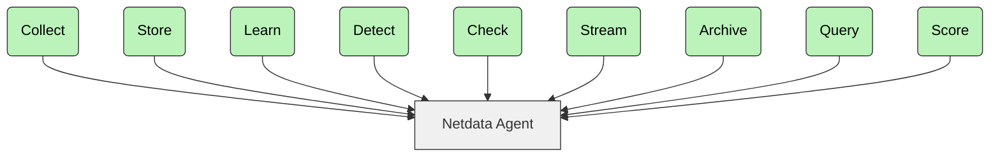

<h3 align="center">为你的基础设施提供 X 光般的洞察力！</h3>
<h4 align="center">每一秒的每一个指标。绝无废话。</h4>

 

  
   
  
  
  
   
  
  
   
  
  

  
  
  
  

<b>访问我们的 <a href="https://www.netdata.cloud">主页</a></b>

目录：**[我们是谁](#who-we-are)** | **[核心特性](#key-features)** | **[快速开始](#getting-started)** | **[工作原理](#how-it-works)** | **[常见问题 (FAQ)](#faq)** | **[文档](#book-documentation)** | **[社区](#tada-community)** | **[贡献代码](#pray-contribute)** | **[许可证](#scroll-license)**

> [!WARNING]
> 人们会对 Netdata **上瘾。**
> 一旦在你的系统上使用它，*就再也回不去了。*

---

## 我们是谁 (WHO WE ARE)

Netdata 是一款开源的实时基础设施监控平台。你可以在整个基础设施范围内进行监控、检测并采取行动。

**核心优势：**

* **即时洞察** – 借助 Netdata，你可以获取每秒级别的指标和可视化数据。
* **零配置** – 你无需复杂设置即可立即部署。
* **基于机器学习 (ML)** – 你可检测异常、预测问题并自动化分析流程。
* **高效节能** – 你可以在资源占用极低的情况下实现最大程度的可扩展性。
* **安全且分布式** – 你的数据可保留在本地，无需集中式采集。

使用 Netdata，你将获得实时的每秒级更新。一目了然的**清晰洞察**，毫无复杂性。

  
<strong>所有英雄都有精彩的起源故事。点击探索我们的故事。</strong>

   

2013年，在 Costa Tsaousis 担任首席运营官（COO）的公司里，大量基于云的交易 silently failed（静默失败），严重影响了业务表现。

Costa 和他的团队尝试了当时所有可用的故障排查工具。没有任何一款能找出根本原因。正如 Costa 后来所写：

“*我简直不敢相信监控系统的指标这么少、分辨率这么低，扩展性这么差，而且运行成本还这么高。*”

出于 frustration（沮丧），他决定从零开始构建自己的监控工具。

这一决定带来了无数个熬夜和周末的奋战。它也引发了基础设施监控与故障排查在方法和成本上的根本性转变。

### 能效最高的监控工具

根据[阿姆斯特丹大学的研究](https://www.ivanomalavolta.com/files/papers/ICSOC_2023.pdf)，Netdata 是监控基于 Docker 的系统时能效最高的工具。该研究还表明，与其他监控解决方案相比，Netdata 在 CPU 占用、RAM 使用和执行时间方面表现优异。

---

## 核心特性 (Key Features)

| 特性                     | 描述                               | 独特之处                                     |
|----------------------------|-------------------------------------------|----------------------------------------------------------|
| **实时 (Real-Time)**              | 每秒采集与处理数据 | 秒级响应——点击即可即时查看结果        |
| **零配置 (Zero-Configuration)**     | 自动检测与发现         | 自动发现其运行的节点上的所有组件           |
| **基于机器学习 (ML-Powered)**             | 无监督异常检测            | 在边缘为每个指标训练多个 ML 模型         |
| **长期保留 (Long-Term Retention)**    | 高性能存储                  | 每样本约 0.5 字节，支持分层归档存储  |
| **高级可视化 (Advanced Visualization)** | 丰富、交互式仪表板              | 无需查询语言即可自由分析数据               |
| **极致可扩展性 (Extreme Scalability)**    | 原生水平扩展                 | 父子集中架构，支持每秒数百万样本的处理量 |
| **完整可见性 (Complete Visibility)**    | 从基础设施到应用程序       | 简化运维并打破数据孤岛               |
| **基于边缘计算 (Edge-Based)**             | 在本地进行数据处理               | 分发代码而非集中数据            |

> [!NOTE]  
> 想测试 Netdata 与 Prometheus 的对比吗？
> 探索[完整对比文章](https://www.netdata.cloud/blog/netdata-vs-prometheus-2025/)。

---

## Netdata 生态系统 (Netdata Ecosystem)

这套三部分架构使你能够扩展从单节点到复杂多云环境：

| 组件         | 描述                                                                                                                                                 | 许可证                                         |
|-------------------|-------------------------------------------------------------------------------------------------------------------------------------------------------------|-------------------------------------------------|
| **Netdata Agent** | • 核心监控引擎 • 负责数据采集、存储、ML、告警和导出 • 运行于服务器、云环境、K8s、IoT • 对生产环境零影响            | [GPL v3+](https://www.gnu.org/licenses/gpl-3.0) |
| **Netdata Cloud** | • 企业级功能 • 用户管理、RBAC（基于角色的访问控制）、水平扩展 • 集中式告警 • 免费社区版 • 不集中存储指标数据 |                                                 |
| **Netdata UI**    | • 仪表板与可视化界面 • 免费使用 • 包含在标准包中 • 通过 CDN 提供最新版本                                             | [NCUL1](https://app.netdata.cloud/LICENSE.txt)  |

## 你可监控的内容 (What You Can Monitor)

借助 Netdata，你可以在所有平台上监控以下组件：

|                                                                                                   组件 |              Linux               | FreeBSD | macOS |                      Windows                      |
|------------------------------------------------------------------------------------------------------------:|:--------------------------------:|:-------:|:-----:|:-------------------------------------------------:|
|                             **系统资源**<small> CPU、内存及系统共享资源</small> |               Full               |   Yes   |  Yes  |                        Yes                        |
|                                **存储**<small> 磁盘、挂载点、文件系统、RAID 阵列</small> |               Full               |   Yes   |  Yes  |                        Yes                        |
|                                 **网络**<small> 网卡、协议、防火墙等</small> |               Full               |   Yes   |  Yes  |                        Yes                        |
|                        **硬件与传感器**<small> 风扇、温度、控制器、GPU 等</small> |               Full               |  Some   | Some  |                       Some                        |
|                                       **操作系统服务**<small> 资源、性能及状态</small> | Yes<small> `systemd`</small> |    -    |   -   |                         -                         |
|                                      **进程**<small> 资源、性能、OOM 等</small> |               Yes                |   Yes   |  Yes  |                        Yes                        |
|                                                                             系统与应用程序**日志 (Logs)** | Yes<small> `systemd`-journal |    -    |   -   | Yes<small> `Windows Event Log`, `ETW`</small> |
|                                 **网络连接**<small> 每个 PID 的实时 TCP/UDP 套接字</small> |               Yes                |    -    |   -   |                         -                         |
|                               **容器 (Containers)**<small> Docker/containerd、LXC/LXD、Kubernetes 等</small> |               Yes                |    -    |   -   |                         -                         |
|                                 **虚拟机 (VMs)**（从宿主机）<small> KVM、qemu、libvirt、Proxmox 等</small> | Yes<small> `cgroups`</small> |    -    |   -   |         Yes<small> `Hyper-V`</small>          |
|                       **合成检查 (Synthetic Checks)**<small> 测试 API、TCP 端口、Ping、证书等</small> |               Yes                |   Yes   |  Yes  |                        Yes                        |
| **打包应用**<small> nginx、apache、postgres、redis、mongodb, 以及数百种更多组件</small> |               Yes                |   Yes   |  Yes  |                        Yes                        |
|                              **云提供商基础设施**<small> AWS、GCP、Azure 等</small> |               Yes                |   Yes   |  Yes  |                        Yes                        |
|                       **自定义应用 (Custom Applications)**<small> OpenMetrics、StatsD，即将支持 OpenTelemetry</small> |               Yes                |   Yes   |  Yes  |                        Yes                        |

在 Linux 上，你可以持续监控所有内核功能和硬件传感器以检测错误，包括 Intel/AMD/Nvidia GPU、PCI AER、RAM EDAC、IPMI、S.M.A.R.T、Intel RAPL、NVMe、风扇、电源和电压读数。

---

## 快速开始 (Getting Started)

你可以在所有主流操作系统上安装 Netdata。要开始使用：

### 1. 安装 Netdata

选择你的平台并遵循安装指南：

* [Linux 安装](https://learn.netdata.cloud/docs/installing/one-line-installer-for-all-linux-systems)
* [macOS](https://learn.netdata.cloud/docs/installing/macos)
* [FreeBSD](https://learn.netdata.cloud/docs/installing/freebsd)
* [Windows](https://learn.netdata.cloud/docs/netdata-agent/installation/windows)
* [Docker 指南](/packaging/docker/README.md)
* [Kubernetes 设置](https://learn.netdata.cloud/docs/installation/install-on-specific-environments/kubernetes)

> [!NOTE]
> 你可以通过 `http://localhost:19999`（或远程时 `http://NODE:19999`）访问 Netdata UI。

### 2. 配置采集器 (Collectors)

Netdata 会自动发现大多数指标，但你可以手动配置部分采集器：

* [所有采集器](https://learn.netdata.cloud/docs/data-collection/)
* [SNMP 监控](https://learn.netdata.cloud/docs/data-collection/monitor-anything/networking/snmp)

### 3. 配置告警 (Alerts)

你可以使用数百种内置告警，并集成到：

`email`、`Slack`、`Telegram`、`PagerDuty`、`Discord`、`Microsoft Teams` 等。

> [!NOTE]  
> 如果已配置 MTA，邮件告警默认即可工作。

### 4. 配置父节点 (Parents)

你可以通过 Netdata 父节点集中管理仪表板、告警和存储：

* [流式传输参考](https://learn.netdata.cloud/docs/streaming/streaming-configuration-reference)

> [!NOTE]  
> 你可以使用 Netdata 父节点实现集中仪表板、更长的数据保留期和告警配置。

### 5. 连接 Netdata Cloud

[登录 Netdata Cloud](https://app.netdata.cloud/sign-in) 并连接你的节点以实现：

* 随时随地访问
* 水平扩展与多节点仪表板
* 针对告警和数据收集的 UI 配置
* 基于角色的访问控制 (RBAC)
* 提供免费层级

> [!NOTE]  
> Netdata Cloud 是可选的。你的数据始终保留在你的基础设施中。

## 在线演示站点 (Live Demo Sites)

  <b>查看 Netdata 的实际运行效果</b> 
  <a href="https://frankfurt.netdata.rocks"><b>法兰克福</b></a> |
  <a href="https://newyork.netdata.rocks"><b>纽约</b></a> |
  <a href="https://atlanta.netdata.rocks"><b>亚特兰大</b></a> |
  <a href="https://sanfrancisco.netdata.rocks"><b>旧金山</b></a> |
  <a href="https://toronto.netdata.rocks"><b>多伦多</b></a> |
  <a href="https://singapore.netdata.rocks"><b>新加坡</b></a> |
  <a href="https://bangalore.netdata.rocks"><b>班加罗尔</b></a>
   
  <i>这些演示集群使用默认配置，展示真实的监控数据。</i>
   
  <i>选择离你最近的实例以获得最佳性能。</i>

---

## 工作原理 (How It Works)

借助 Netdata，你可以运行一个用于指标采集、处理和可视化的模块化流水线。

在每个 Agent 中，你可以：

1. **采集 (Collect)** – 从系统、容器、应用、日志、API 和合成检查中收集指标。
2. **存储 (Store)** – 将指标保存到高效的分层时序数据库中。
3. **学习 (Learn)** – 使用近期行为为每个指标训练 ML 模型。
4. **检测 (Detect)** – 利用已训练的 ML 模型识别异常。
5. **检查 (Check)** – 根据预设或自定义告警规则评估指标。
6. **流式传输 (Stream)** – 将指标实时发送到 Netdata 父节点。
7. **归档 (Archive)** – 将指标导出到 Prometheus、InfluxDB、OpenTSDB、Graphite 等。
8. **查询 (Query)** – 通过 API 访问指标，用于仪表板或第三方工具。
9. **评分 (Score)** – 使用评分引擎查找跨指标的规律和相关性。

> [!NOTE]  
> 了解更多：[Netdata 的架构](https://learn.netdata.cloud/docs/netdata-agent/#distributed-observability-pipeline)

## Agent 能力 (Agent Capabilities)

借助 Netdata Agent，你可以开箱即用以下核心能力：

| 能力                   | 描述                                                                                                                                   |
|------------------------------|-----------------------------------------------------------------------------------------------------------------------------------------------|
| **全面采集** | • 800+ 集成 • 系统、容器、虚拟机、硬件传感器 • OpenMetrics、StatsD 和日志 • 即将支持 OpenTelemetry |
| **高性能与高精度**  | • 每秒采集 • 1秒延迟的实时可视化 • 高分辨率指标                                       |
| **基于边缘的机器学习 (Edge-Based ML)**            | • 在边缘训练 ML 模型 • 每个指标的自动异常检测 • 基于历史行为的模式识别             |
| **高级日志管理**  | • 直接集成 systemd-journald 和 Windows Event Log • 在边缘处理日志 • 丰富的日志可视化                         |
| **可观测性流水线 (Observability Pipeline)**   | • 父子关系架构 • 灵活的集中化方式 • 多级复制与保留                                          |
| **自动化可视化**  | • NIDL（指标数据模型） • 自动生成仪表板 • 无需查询语言                                                                |
| **智能告警 (Smart Alerting)**           | • 预配置告警 • 多种通知方式 • 主动检测                                                           |
| **低维护成本**          | • 自动检测 • 零接触 ML（Zero-touch ML） • 易于扩展 • 友好支持 CI/CD                                                                 |
| **开放且可扩展 (Open & Extensible)**        | • 模块化架构 • 易于自定义 • 与现有工具集成                                                             |

---

## CNCF 成员资格 (CNCF Membership)

  <picture>
    <source media="(prefers-color-scheme: dark)" srcset="https://raw.githubusercontent.com/cncf/artwork/master/other/cncf/horizontal/white/cncf-white.svg">
    <source media="(prefers-color-scheme: light)" srcset="https://raw.githubusercontent.com/cncf/artwork/master/other/cncf/horizontal/color/cncf-color.svg">
    
  </picture>
   
  Netdata 积极支持并成为云原生计算基金会 (CNCF) 的成员。 
  它是 <a href="https://landscape.cncf.io/?item=observability-and-analysis--observability--netdata">CNCF 全景图</a>中星标最多的项目之一。

---

## 常见问题 (FAQ)

<strong>Netdata 安全吗？</strong>

 

是的。Netdata 遵循 [OpenSSF 最佳实践](https://bestpractices.coreinfrastructure.org/en/projects/2231)，采用安全优先的设计，并定期接受社区审计。

* [安全设计](https://learn.netdata.cloud/docs/security-and-privacy-design)
* [安全策略与公告](https://github.com/netdata/netdata/security)

<strong>它占用大量资源吗？</strong>

 

不。即使启用 ML 和每秒级指标，Netdata 的资源占用也极低。

* 生产系统默认约 5% CPU 和 150MiB RAM
* 禁用 ML 和告警并使用临时存储时 <1% CPU 和 ~100MiB RAM
* 父节点配合适当硬件可每秒处理数百万指标

> 你可以通过仪表板中的 **Netdata Monitoring** 部分检查其资源使用情况。

<strong>数据能保留多久/多少？</strong>

 

取决于你的磁盘容量。

借助 Netdata，你可以使用分层保留策略：

* Tier 0: 每秒分辨率
* Tier 1: 每分钟分辨率
* Tier 2: 每小时分辨率

这些会根据缩放级别自动查询。

<strong>它能扩展到很多服务器吗？</strong>

 

可以。借助 Netdata，你可以：

* 通过多个 Agent 水平扩展
* 通过强大的父节点垂直扩展
* 通过 Netdata Cloud 无限扩展

> 你可以使用 Netdata Cloud 将许多独立的基础设施合并为一个逻辑视图。

<strong>磁盘 I/O 是问题吗？</strong>

 

不是。Netdata 最小化磁盘占用：

* 指标每 17 分钟均匀刷新到磁盘一次
* 使用直接 I/O 和压缩 (ZSTD)
* 可完全在 RAM 中运行或流式传输到父节点

> 你可以使用 `alloc` 或 `ram` 模式实现无磁盘写入。

<strong>与 Prometheus + Grafana 有何不同？</strong>

 

借助 Netdata，你获得的是完整的监控解决方案——而不仅仅是工具。

* 无需手动设置或配置仪表板
* 内置 ML、告警、仪表板和关联分析
* 更高效且更易于部署

> [性能对比](https://blog.netdata.cloud/netdata-vs-prometheus-performance-analysis/)

<strong>与商业 SaaS 工具有何不同？</strong>

 

借助 Netdata，你可以将所有指标存储在你的基础设施中——无采样、无聚合、无数据丢失。

* 默认高分辨率指标
* 每个指标的独立 ML（而非共享模型）
* 可扩展性无限且成本不会飙升

<strong>能与 Nagios、Zabbix 等共存吗？</strong>

 

可以。你可以将 Netdata 与传统工具配合使用。

借助 Netdata，你获得：

* 实时高分辨率监控
* 零配置与自动生成仪表板
* 异常检测与高级可视化

<strong>感到不知所措怎么办？</strong>

 

你可以从小处着手：

* 使用仪表板的目录和搜索功能
* 探索异常评分（切换 "AR"）
* 在 Netdata Cloud 中创建自定义仪表板

> [文档与指南](https://learn.netdata.cloud/guides)

<strong>我必须使用 Netdata Cloud 吗？</strong>

 

不需要。Netdata Cloud 是可选的。

没有它，Netdata 也能正常工作，但配合 Cloud 你可以：

* 通过 SSO 远程访问
* 保存仪表板自定义设置
* 集中配置告警
* 基于角色协作

<strong>它收集哪些遥测数据？</strong>

 

匿名遥测数据有助于改进产品。你可以禁用它：

* 在安装程序中添加 `--disable-telemetry`，或
* 创建 `/etc/netdata/.opt-out-from-anonymous-statistics` 文件并重启 Netdata

> 遥测数据帮助我们了解使用情况，而非追踪用户。不会收集任何私人数据。

<strong>谁在使用 Netdata？</strong>

 

你将与以下用户为伍：

* 大型企业（Amazon、ABN AMRO Bank、Facebook、Google、IBM、Intel、Netflix、Samsung）
* 大学（NYU、Columbia、首尔国立大学、UCL）
* 全球政府机构
* 基础设施密集型组织
* 技术运营商
* 初创公司与自由职业者
* SysAdmins 和 DevOps 专业人士

---

## 📖 文档 (Documentation)

访问 [Netdata Learn](https://learn.netdata.cloud) 获取完整文档与指南。

> [!NOTE]  
> 涵盖部署、配置、告警、导出、故障排除等内容。

---

## 🎉 社区 (Community)

加入 Netdata 社区：

* [Discord](https://discord.com/invite/2mEmfW735j)
* [论坛](https://community.netdata.cloud)
* [GitHub Discussions](https://github.com/netdata/netdata/discussions)

> [!NOTE]  
> [行为准则 (Code of Conduct)](https://github.com/netdata/.github/blob/main/CODE_OF_CONDUCT.md)

关注我们：
[Twitter](https://twitter.com/netdatahq) | [Reddit](https://www.reddit.com/r/netdata/) | [YouTube](https://www.youtube.com/c/Netdata) | [LinkedIn](https://www.linkedin.com/company/netdata-cloud/)

---

## 🙏 贡献 (Contribute)

我们欢迎你的贡献。

你可以通过以下方式帮助我们保持敏锐：

* 分享最佳实践与监控洞察
* 报告问题或缺失功能
* 改进文档
* 开发新集成或采集器
* 在论坛和聊天中帮助用户

> [!NOTE]  
> [贡献指南](https://github.com/netdata/.github/blob/main/CONTRIBUTING.md)

---

## 📜 许可证 (License)

Netdata 生态系统包含：

* **Netdata Agent** – 开源核心（GPLv3+）。**包含**数据采集、存储、ML、告警、API，并**重新分发**了其他多个开源工具和库。
    * [Netdata Agent 许可证](https://github.com/netdata/netdata/blob/master/LICENSE)
    * [Netdata Agent 重新分发包](https://github.com/netdata/netdata/blob/master/REDISTRIBUTED.md)
* **Netdata UI** – 闭源，但可免费用于 Netdata Agent 和 Cloud。通过 CDN 交付。它集成了第三方开源组件。
    * [Netdata Cloud UI 许可证](https://app.netdata.cloud/LICENSE.txt)
    * [Netdata UI 第三方许可证](https://app.netdata.cloud/3D_PARTY_LICENSES.txt)
* **Netdata Cloud** – 闭源，提供免费和付费层级。增加远程访问、SSO、可扩展性等功能。