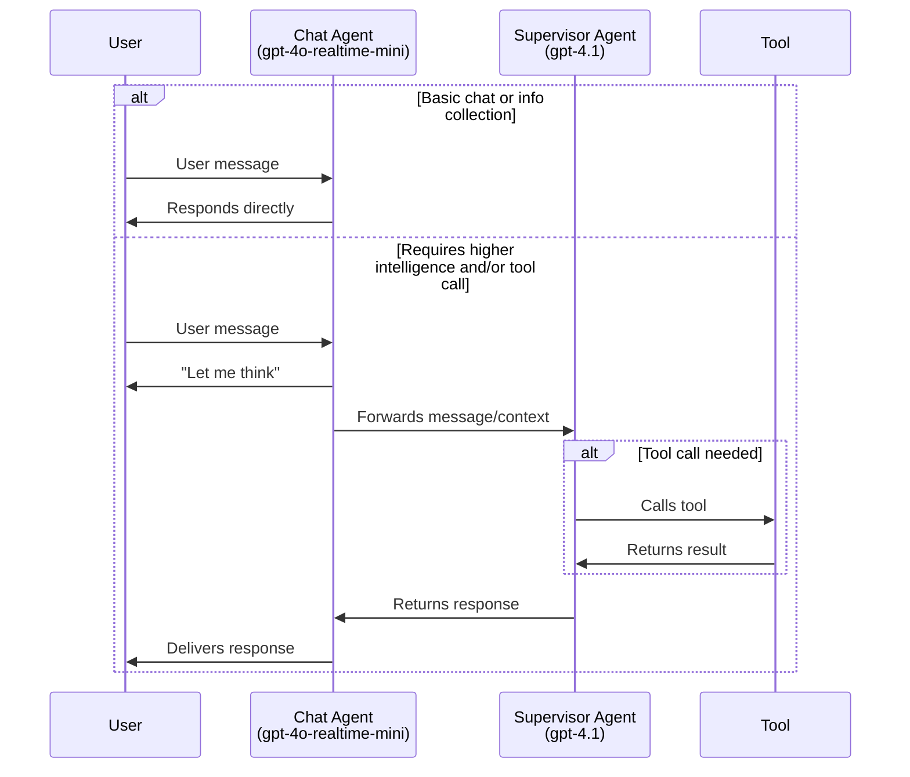
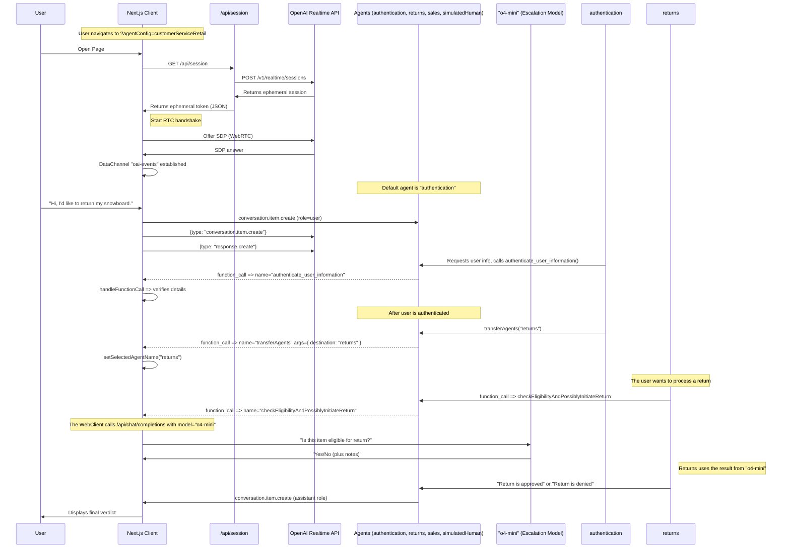

# Realtime API 智能体演示

本仓库演示了使用 OpenAI Realtime API 和 OpenAI Agents SDK 构建语音智能体的进阶模式。

## 关于 OpenAI Agents SDK

本项目使用了 [OpenAI Agents SDK](https://github.com/openai/openai-agents-js)，这是一个用于构建、管理和部署高级 AI 智能体的工具包。该 SDK 提供了：

- 统一的接口，用于定义智能体行为与工具集成。
- 内置对智能体编排（orchestration）、状态管理和事件处理的支持。
- 轻松集成 OpenAI Realtime API，实现低延迟的流式交互。
- 可扩展的模式，支持多智能体协作、任务交接（handoff）、工具调用与安全护栏（guardrails）。

完整文档、指南和 API 参考请参见官方 [OpenAI Agents SDK 文档](https://github.com/openai/openai-agents-js#readme)。

**注意：** 如需不使用 OpenAI Agents SDK 的版本，请参阅 [without-agents-sdk 分支](https://github.com/openai/openai-realtime-agents/tree/without-agents-sdk)。

本项目主要演示了两种模式：
1. **聊天主管（Chat-Supervisor）：** 基于实时语音的聊天智能体与用户交互并处理基础任务，而一个更强大的文本模型（如 `gpt-4.1`）作为“主管”负责工具调用和复杂响应。该方法上手简单且回答质量高，仅带来微小的延迟增加。
2. **顺序交接（Sequential Handoff）：** 专用智能体（由实时 API 驱动）之间按序转移用户会话以处理特定意图。这非常适合客户服务场景，不同领域的专家模型可依次处理用户请求。该模式避免了将所有指令和工具堆砌在单个智能体中导致性能下降的问题。

## 环境配置

- 本项目是一个基于 TypeScript 的 Next.js 应用。使用 `npm i` 安装依赖项。
- 将你的 `OPENAI_API_KEY` 添加到环境变量中。可以将其写入 `.bash_profile`（或等效文件），或将 `.env.sample` 复制为 `.env` 并在其中添加。
- 使用 `npm run dev` 启动服务器。
- 在浏览器中访问 [http://localhost:3000](http://localhost:3000)。默认将加载 `chatSupervisor` 智能体配置。
- 你可以通过右上角的“场景（Scenario）”下拉菜单切换示例。

# 模式一：聊天主管（Chat-Supervisor）

该模式在 [chatSupervisor](src/app/agentConfigs/chatSupervisor/index.ts) 智能体配置中演示。聊天智能体使用实时模型与用户对话并处理基础任务（如问候、闲聊和信息收集），而更强大的文本主管模型（例如 `gpt-4.1`）则负责工具调用和复杂响应。你可以通过将特定任务“加入”聊天智能体的白名单来灵活控制决策边界。

视频演示：[https://x.com/noahmacca/status/1927014156152058075](https://x.com/noahmacca/status/1927014156152058075)

## 示例

*在此交互中，请注意系统立即响应以收集电话号码，并移交主管智能体处理工具调用和生成回复。在说出“请稍等”到开始说“感谢等待。您的上一期账单...”之间约有 ~2s 的延迟。*

## 架构图


## 优势
- **上手更简单。** 如果你已经有一个表现良好的文本聊天智能体，只需将相同的提示词和工具集赋予主管智能体，并对聊天智能体的提示词稍作调整，即可得到一个与文本智能体性能相当的语音智能体。
- **平滑过渡到完整实时智能体：** 无需将整个智能体切换到实时 API，你可以一次迁移一个任务，在部署到生产环境前充分验证并建立信任。
- **高智能水平：** 你的语音智能体可以充分利用 `gpt-4.1` 等模型的高智商、卓越的工具调用能力和指令遵循能力。
- **成本更低：** 如果聊天智能体仅用于基础任务，你可以使用 realtime-mini 模型。即使与 GPT-4.1 结合使用，其成本也应低于直接使用完整的 4o-realtime 模型。
- **用户体验更佳：** 相比拼接式架构（用户说完话后延迟常达 1.5s 或更长），此架构提供更自然的对话体验。在该架构中，即使需要依赖主管智能体，模型也会立即响应用户。
  - 不过，部分助手回复会以“让我想想”开头，而不是直接给出完整答案。

## 自定义你的智能体
1. 修改 [supervisorAgent](src/app/agentConfigs/chatSupervisorDemo/supervisorAgent.ts)。
  - 添加你现有的文本智能体提示词和工具（如果已有）。这应包含语音智能体的核心逻辑，并明确指定其应该/不应该做什么以及如何回复。将此信息添加到 `==== Domain-Specific Agent Instructions ====` 下方。
  - 你可能需要调整此提示词以更适合语音交互，例如指示保持简洁、避免冗长的列表等。
2. 修改 [chatAgent](src/app/agentConfigs/chatSupervisor/index.ts)。
  - 根据你的语气、问候语等自定义 `chatAgent` 指令。
  - 将工具定义添加到 `chatAgentInstructions` 中。建议使用简短的 YAML 描述而非 JSON，以确保模型不会混淆并尝试直接调用该工具。
  - 你可以通过向 `# Allow List of Permitted Actions`（允许操作白名单）部分添加新项来修改决策边界。
3. 为降低成本，可尝试对聊天智能体使用 `gpt-4o-mini-realtime`，或对主管模型使用 `gpt-4.1-mini`。为在关键或高风险任务中最大化智能水平，可考虑权衡延迟并在主管提示词中加入思维链（chain-of-thought），或使用基于推理模型的 `o4-mini` 作为主管。

# 模式二：顺序交接（Sequential Handoffs）

该模式受 [OpenAI Swarm](https://github.com/openai/swarm) 启发，涉及在专用智能体之间按序转移用户会话。交接由模型决定并通过工具调用协调，可能的交接路径在智能体图谱中明确定义。一次交接会触发带有新指令和工具的 `session.update` 事件。该模式能有效利用各领域的专家智能体处理多样化的用户意图，每个智能体可拥有独立的长指令和大量工具。

这是一个展示其工作原理的[视频演示](https://x.com/OpenAIDevs/status/1880306081517432936)。你应能在不到 20 分钟内使用此仓库原型化你自己的多智能体实时语音应用！


*在此简单示例中，用户从问候智能体转移到俳句（haiku）智能体。详见下方的完整配置。*

`src/app/agentConfigs/simpleExample.ts` 中的配置如下：
```typescript
import { RealtimeAgent } from '@openai/agents/realtime';

// Define agents using the OpenAI Agents SDK
export const haikuWriterAgent = new RealtimeAgent({
  name: 'haikuWriter',
  handoffDescription: 'Agent that writes haikus.', // Context for the agent_transfer tool
  instructions:
    'Ask the user for a topic, then reply with a haiku about that topic.',
  tools: [],
  handoffs: [],
});

export const greeterAgent = new RealtimeAgent({
  name: 'greeter',
  handoffDescription: 'Agent that greets the user.',
  instructions:
    "Please greet the user and ask them if they'd like a haiku. If yes, hand off to the 'haikuWriter' agent.",
  tools: [],
  handoffs: [haikuWriterAgent], // Define which agents this agent can hand off to
});

// An Agent Set is just an array of the agents that participate in the scenario
export default [greeterAgent, haikuWriterAgent];
```
## CustomerServiceRetail 流程

这是一个更复杂、更具代表性的实现，展示了客户服务流程，具有以下特性：
- 更复杂的智能体图谱，包含用于用户认证、退货、销售和占位符人工客服（用于升级处理）的智能体。
- [退货](https://github.com/openai/openai-realtime-agents/blob/60f4effc50a539b19b2f1fa4c38846086b58c295/src/app/agentConfigs/customerServiceRetail/returns.ts#L233) 智能体向 `o4-mini` 发起升级，以验证并启动退货流程。这是一个高风险决策示例，采用了与上述类似的模式。
- 提示模型遵循状态机逻辑，例如通过逐字确认来准确收集姓名和电话号码以完成用户认证。
  - 要测试此流程，请尝试说“我想退回我的滑雪板”，并按提示操作！

`src/app/agentConfigs/customerServiceRetail/index.ts` 中的配置如下：
```javascript
import authentication from "./authentication";
import returns from "./returns";
import sales from "./sales";
import simulatedHuman from "./simulatedHuman";
import { injectTransferTools } from "../utils";

authentication.downstreamAgents = [returns, sales, simulatedHuman];
returns.downstreamAgents = [authentication, sales, simulatedHuman];
sales.downstreamAgents = [authentication, returns, simulatedHuman];
simulatedHuman.downstreamAgents = [authentication, returns, sales];

const agents = injectTransferTools([
  authentication,
  returns,
  sales,
  simulatedHuman,
]);

export default agents;
```

## 架构图

此图展示了在 `src/app/agentConfigs/customerServiceRetail/` 中定义的更高级交互流程，包含详细的事件流转。

<details>
<summary><strong>显示 CustomerServiceRetail 流程图</strong></summary>



</details>

# 其他信息
## 后续步骤
- 你可以复制这些模板来创建自己的多智能体语音应用！创建新的智能体集配置后，将其添加到 `src/app/agentConfigs/index.ts`，即可在 UI 的“场景”下拉菜单中选择它。
- 每个 `agentConfig` 均可定义指令、工具和工具逻辑（toolLogic）。默认情况下，所有工具调用仅返回 `True`；若你定义了 `toolLogic`，它将运行你的特定业务逻辑并向对话返回一个对象（例如用于检索 RAG 上下文）。
- 如需帮助使用 customerServiceRetail 中展示的规范创建你自己的提示词（包括定义状态机），我们提供了一个元提示词 [在这里](src/app/agentConfigs/voiceAgentMetaprompt.txt)，你也可以使用我们的 [语音智能体元提示生成器 GPT](https://chatgpt.com/g/g-678865c9fb5c81918fa28699735dd08e-voice-agent-metaprompt-gpt)

## 输出安全护栏（Output Guardrails）
在 UI 显示前，助手消息会经过安全与合规性检查。护栏（Guardrail）调用现在直接位于 `src/app/App.tsx` 内部：当 `response.text.delta` 流开始时，我们将消息标记为 **IN_PROGRESS**；一旦服务器发出 `guardrail_tripped` 或 `response.done` 事件，消息将分别被标记为 **FAIL** 或 **PASS**。如果你想修改审核的触发方式或显示逻辑，请在 `App.tsx` 中搜索 `guardrail_tripped` 并调整相关代码。

## 界面导航
- 你可以通过“场景（Scenario）”下拉菜单选择智能体场景，并通过“智能体（Agent）”下拉菜单自动切换到特定智能体。
- 对话记录位于左侧，包含工具调用、工具响应和智能体切换信息。点击可展开非消息元素。
- 事件日志位于右侧，显示客户端和服务端的事件。点击可查看完整载荷（payload）。
- 底部提供断开连接、切换自动语音活动检测或按键说话（PTT）、关闭音频播放以及开关日志的功能。

## Pull Requests

欢迎随时提交 Issue 或 Pull Request，我们将尽力审核。本仓库的宗旨是演示新型智能体工作流的核心逻辑；超出此核心范围的 PR 可能不会被合并。

# Core Contributors
- Noah MacCallum - [noahmacca](https://x.com/noahmacca)
- Ilan Bigio - [ibigio](https://github.com/ibigio)
- Brian Fioca - [bfioca](https://github.com/bfioca)