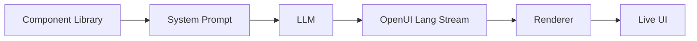

<div align="center">

<a href="https://www.openui.com" target="_blank" rel="noopener noreferrer">
  
</a>

# OpenUI - 生成式 UI 的开放标准

<p align="center">
  <a href="https://github.com/thesysdev/openui/actions/workflows/build-js.yml"></a>
  <a href="./LICENSE"></a>
  <a href="https://discord.com/invite/Pbv5PsqUSv"></a>
</p>

<a href="https://trendshift.io/repositories/22357" target="_blank"></a>

</div>


OpenUI 是一个全栈生成式 UI 框架：它包含一种紧凑且优先支持流式输出的语言、内置组件库的 React 运行时，以及开箱即用的聊天界面，其 Token（令牌）使用效率比 JSON 高出最多 67%。

<div align="center">

[Docs](https://openui.com) · [Playground](https://www.openui.com/playground) · [Discord](https://discord.com/invite/Pbv5PsqUSv) · [Contributing](./CONTRIBUTING.md)

</div>

> **重要提示：** OpenUI 没有官方加密货币、代币或硬币。任何使用 OpenUI 名称的资产均与该项目的维护者无关，也不受其认可。

---

## 什么是 OpenUI

<div align="center">


</div>

OpenUI 的核心是 **OpenUI Lang**：一种紧凑且优先支持流式输出的语言，专为模型生成的 UI 设计。与仅将模型输出视为文本不同，OpenUI 允许你定义组件、从该组件库生成提示（prompt）指令，并在模型流式输出时渲染结构化的 UI。

**核心功能：**

- **OpenUI Lang**：一种紧凑的语言，专为支持流式输出的结构化 UI 生成而设计。
- **内置组件库**：图表、表单、表格、布局等，开箱即用或可扩展。
- **基于你的组件库生成提示（prompt）**：直接从你允许的组件中生成模型指令。
- **流式渲染器（Renderer）**：随着 Token 到达，在 React 中逐步解析并渲染模型输出。
- **聊天与应用界面**：使用相同的基础架构构建助手、代码副驾驶（Copilot）以及更广泛的交互式产品流程。


## 快速开始

```bash
npx @openuidev/cli@latest create --name genui-chat-app
cd genui-chat-app
echo "OPENAI_API_KEY=sk-your-key-here" > .env
npm run dev
```

这是使用 OpenUI 最快的方式。生成的应用脚手架为你提供了一个端到端的起点，内置流式输出、UI 组件和 OpenUI Lang 支持。

你将获得：

- **OpenUI Lang 支持**：在应用流程中直接使用结构化 UI 生成。
- **组件库驱动提示（prompt）**：基于你允许的组件集生成指令。
- **流式支持**：随着输出到达逐步更新 UI。
- **可运行的应用基础**：从开箱即用的示例开始，无需手动配置所有环节。


## 工作原理

你的组件定义了模型可以生成的内容。



1. 定义或复用组件库。
2. 从该库生成系统提示（system prompt）。
3. 将该提示发送给模型。
4. 将 OpenUI Lang 输出流式传输回客户端。
5. 使用渲染器（Renderer）逐步渲染输出。

你可以在[在线体验](https://www.openui.com/playground)中亲自尝试：使用默认组件库实时生成 UI。

## 核心包

| Package | Description |
| :--- | :--- |
| [`@openuidev/react-lang`](./packages/react-lang) | 核心运行时：组件定义、解析器、渲染器、提示生成 |
| [`@openuidev/react-headless`](./packages/react-headless) | 无头聊天状态管理、流式适配器、消息格式转换器 |
| [`@openuidev/react-ui`](./packages/react-ui) | 预置聊天布局及两套内置组件库 |
| [`@openuidev/cli`](./packages/openui-cli) | 用于应用脚手架生成和系统提示生成的 CLI 工具 |
| [`@openuidev/openclaw-os-plugin`](https://github.com/thesysdev/openclaw-os/tree/main/packages/claw-plugin) | OpenClaw OS 插件，用于提供由 OpenUI 驱动的 OpenClaw 工作区 | 

```bash
npm install @openuidev/react-lang @openuidev/react-ui
```

## 为什么选择 OpenUI Lang

OpenUI Lang 专为需要同时具备结构化和流式输出特性的模型生成 UI 而设计。

- **流式输出**：随着 Token 到达逐步发出 UI 内容。
- **Token（令牌）效率**：比等效的 JSON 格式节省高达 67% 的 Token（详见[基准测试](./benchmarks)）。
- **受控渲染**：将输出限制在你定义和注册的组件范围内。
- **类型安全的组件契约**：使用 Zod 模式提前定义组件属性和结构。

### Token（令牌）效率基准测试

使用 `tiktoken`（GPT-5 编码器）进行测量。对比了 OpenUI Lang 与两种基于 JSON 的流式格式在七种 UI 场景下的表现：

| Scenario           | Vercel JSON-Render | Thesys C1 JSON | OpenUI Lang | vs Vercel |      vs C1 |
| ------------------ | -----------------: | -------------: | ----------: | ---------: | ---------: |
| simple-table       |                340 |            357 |         148 |     -56.5% |     -58.5% |
| chart-with-data    |                520 |            516 |         231 |     -55.6% |     -55.2% |
| contact-form       |                893 |            849 |         294 |     -67.1% |     -65.4% |
| dashboard          |               2247 |           2261 |        1226 |     -45.4% |     -45.8% |
| pricing-page       |               2487 |           2379 |        1195 |     -52.0% |     -49.8% |
| settings-panel     |               1244 |           1205 |         540 |     -56.6% |     -55.2% |
| e-commerce-product |               2449 |           2381 |        1166 |     -52.4% |     -51.0% |
| **TOTAL**          |          **10180** |       **9948** |    **4800** | **-52.8%** | **-51.7%** |

完整的方法论和复现步骤见 [`benchmarks/`](./benchmarks)。

## 文档

详细文档请访问 [openui.com](https://openui.com)。

## 仓库结构

```
openui/
├── packages/
│   ├── react-lang/       # 核心运行时（解析器、渲染器、提示生成）
│   ├── react-headless/   # 无头聊天状态与流式适配器
│   ├── react-ui/         # 预置聊天布局与组件库
│   └── openui-cli/       # CLI 脚手架与提示生成工具
├── skills/
│   └── openui/           # Claude Code AI 辅助开发技能
├── examples/
│   └── openui-chat/      # 完整可运行示例应用（Next.js）
├── docs/                 # 文档站点（openui.com）
└── benchmarks/           # Token 效率基准测试
```

推荐从这里开始：

- [openui.com](https://openui.com) 获取完整文档
- [`examples/openui-chat`](./examples/openui-chat) 查看可运行的示例应用
- [`CONTRIBUTING.md`](./CONTRIBUTING.md) 如果你想参与贡献

## 社区

- [Discord](https://discord.com/invite/Pbv5PsqUSv) - 提问交流，分享你的项目进展
- [GitHub Issues](https://github.com/thesysdev/openui/issues) - 提交 Bug 反馈或功能建议

## 与其他方案对比

| Feature                |             OpenUI |           json-render (Vercel) |     A2UI (Google) | CopilotKit OpenGenUI |
|------------------------|-------------------:|-------------------------------:|------------------:|---------------------:|
| Token（令牌）消耗      |                 1x |                             3x |                3x |                   4x |
| 延迟（60 token/s）     |               4.9s |                          14.2s |             14.2s |                 ~20s |
| 流式输出              |                Yes |                            Yes |               Yes |              Partial |
| 输出一致性            |                Yes |                            Yes |               Yes |                   No |
| 组件体系              |   Library + custom |               Library + custom |       Custom only |                 None |
| 多平台支持            | Web, mobile, email | Web, mobile, PDF, email, video | Web, iOS, Android |                  Web |
| 内置数据请求          |                Yes |                             No |                No |                   No |
| 内置聊天界面          |                Yes |                             No |                No |                  Yes |

更多详情，请参阅官方[OpenUI Lang 对比文档](https://www.openui.com/docs/openui-lang/comparison)。

## 采用者

使用 OpenUI 的组织和项目列表维护在 [`ADOPTERS.md`](./ADOPTERS.md) 中。如果你正在使用 OpenUI，欢迎添加你的组织信息；这有助于推动项目发展，并帮助其他采用者在类似场景中找到同行。

## 贡献指南

欢迎任何形式的贡献。请参阅 [`CONTRIBUTING.md`](./CONTRIBUTING.md) 了解参与方式和行为准则。

## AI 助手技能（Agent Skill）
 
OpenUI 提供了一项 [Agent Skill](https://agentskills.io)，使 AI 编程助手（如 Claude Code、Codex、Cursor、Copilot 等）能够协助你使用 OpenUI Lang 进行应用脚手架搭建、开发与调试。
 
### 安装
 
```bash
# With the skills CLI (works across all agents)
npx skills add thesysdev/openui --skill openui
 
# Manual - copy into your project
cp -r skills/openui .claude/skills/openui
```
 
该技能涵盖组件库设计、OpenUI Lang 语法、系统提示生成、渲染器（Renderer）、SDK 包的使用，以及调试格式错误的 LLM 输出等内容。

## ⭐ Star 历史

<a href="https://www.star-history.com/?repos=thesysdev%2Fopenui&type=date&legend=top-left">
 <picture>
   <source media="(prefers-color-scheme: dark)" srcset="https://api.star-history.com/chart?repos=thesysdev/openui&type=date&theme=dark&legend=top-left" />
   <source media="(prefers-color-scheme: light)" srcset="https://api.star-history.com/chart?repos=thesysdev/openui&type=date&legend=top-left" />
   
 </picture>
</a>

## 许可证

本项目遵循 [`LICENSE`](./LICENSE) 中描述的条款开放使用。