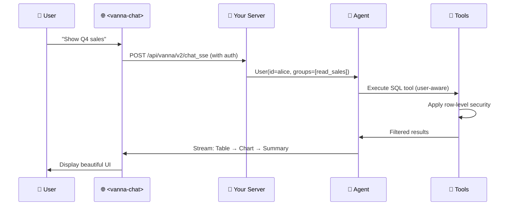

# Vanna 2.0：将问题转化为数据洞察

**自然语言 → SQL → 答案。** 现已支持企业级安全与基于用户身份的权限控制。

[](https://python.org)
[](LICENSE)
[](https://github.com/psf/black)

https://github.com/user-attachments/assets/476cd421-d0b0-46af-8b29-0f40c73d6d83


---

## 2.0 新功能

🔐 **全链路用户感知** —— 查询结果自动按用户权限进行过滤

🎨 **现代化网页界面** —— 开箱即用的精美 `<vanna-chat>` 组件

⚡ **流式响应** —— 实时展示表格、图表和进度更新

🔒 **企业级安全** —— 行级数据安全、审计日志与速率限制

🔄 **生产就绪** —— 无缝集成 FastAPI，内置可观测性与生命周期钩子（Lifecycle Hooks）

> **从 0.x 版本升级？** 请参阅[迁移指南](MIGRATION_GUIDE.md) | [变更详情？](#migration-notes)

---

## 快速上手

### 使用示例数据试用

[快速入门](https://vanna.ai/docs/quick-start)

### 配置说明

[配置指南](https://vanna.ai/docs/configure)

### 网页组件

```html
<!-- Drop into any existing webpage -->
<script src="https://img.vanna.ai/vanna-components.js"></script>
<vanna-chat
  sse-endpoint="https://your-api.com/chat"
  theme="dark">
</vanna-chat>
```

支持复用现有的 Cookie 或 JWT。兼容 React、Vue 或纯 HTML。

---

## 核心功能

使用自然语言提问，即可获得：

**1. 流式进度更新**

**2. SQL 代码块（默认仅向“管理员”用户展示）**

**3. 交互式数据表格**

**4. 图表**（基于 Plotly 的可视化）

**5. 自然语言摘要**

所有结果均以流式传输实时推送至你的网页组件。

---

## 为什么选择 Vanna 2.0？

### ✅ 开箱即用，快速启动
* 生产级聊天界面
* 基于你数据库的自定义 Agent（智能体）
* 可嵌入任意网页

### ✅ 企业级安全特性
**全链路用户感知** —— 身份标识贯穿系统提示词、工具执行与 SQL 过滤全流程
**行级数据安全** —— 查询结果自动按用户权限进行过滤
**审计日志** —— 逐用户追踪每次查询，满足合规要求
**速率限制** —— 通过生命周期钩子实现单用户配额管理

### ✅ 内置精美网页界面
**预置 `<vanna-chat>` 组件** —— 无需自行开发聊天界面
**流式表格与图表** —— 丰富的交互组件，而非纯文本输出
**响应式且可定制** —— 完美适配移动端、桌面端及明暗主题
**框架无关** —— 兼容 React、Vue 或纯 HTML

### ✅ 无缝集成你的技术栈
**任意大语言模型（LLM）**：OpenAI、Anthropic、Ollama、Azure、Google Gemini、AWS Bedrock、Mistral 及其他
**任意数据库**：PostgreSQL、MySQL、Snowflake、BigQuery、Redshift、SQLite、Oracle、SQL Server、DuckDB、ClickHouse 及其他
**你的认证系统** —— 支持自定义接入（Cookie、JWT、OAuth Token）
**你的后端框架**：FastAPI、Flask

### ✅ 高度可扩展且内置最佳实践
**自定义工具** —— 继承 `Tool` 基类进行扩展
**生命周期钩子** —— 支持配额检查、日志记录与内容过滤
**LLM 中间件（LLM Middlewares）** —— 实现缓存、提示词工程等
**可观测性（Observability）** —— 内置链路追踪与指标监控

---

## 架构设计


---

## 工作原理



**核心概念：**

1. **用户解析器（User Resolver）** —— 你定义如何从请求中提取用户身份（如 Cookie、JWT 等）
2. **用户感知工具（User-Aware Tools）** —— 工具自动根据用户的组权限进行鉴权
3. **流式组件（Streaming Components）** —— 后端将结构化的 UI 组件（表格、图表）实时推送至前端
4. **内置网页界面** —— 预置的 `<vanna-chat>` 组件负责精美渲染所有输出

---

## 结合你的认证系统部署生产环境

以下是一个完整的示例，展示如何将 Vanna 集成到你现有的 FastAPI 应用与认证系统中：

```python
from fastapi import FastAPI
from vanna import Agent
from vanna.servers.fastapi.routes import register_chat_routes
from vanna.servers.base import ChatHandler
from vanna.core.user import UserResolver, User, RequestContext
from vanna.integrations.anthropic import AnthropicLlmService
from vanna.tools import RunSqlTool
from vanna.integrations.sqlite import SqliteRunner
from vanna.core.registry import ToolRegistry

# Your existing FastAPI app
app = FastAPI()

# 1. Define your user resolver (using YOUR auth system)
class MyUserResolver(UserResolver):
    async def resolve_user(self, request_context: RequestContext) -> User:
        # Extract from cookies, JWTs, or session
        token = request_context.get_header('Authorization')
        user_data = self.decode_jwt(token)  # Your existing logic

        return User(
            id=user_data['id'],
            email=user_data['email'],
            group_memberships=user_data['groups']  # Used for permissions
        )

# 2. Set up agent with tools
llm = AnthropicLlmService(model="claude-sonnet-4-5")
tools = ToolRegistry()
tools.register(RunSqlTool(sql_runner=SqliteRunner("./data.db")))

agent = Agent(
    llm_service=llm,
    tool_registry=tools,
    user_resolver=MyUserResolver()
)

# 3. Add Vanna routes to your app
chat_handler = ChatHandler(agent)
register_chat_routes(app, chat_handler)

# Now you have:
# - POST /api/vanna/v2/chat_sse (streaming endpoint)
# - GET / (optional web UI)
```

**随后在前端中：**
```html
<vanna-chat sse-endpoint="/api/vanna/v2/chat_sse"></vanna-chat>
```

有关自定义工具、生命周期钩子及高级配置的完整说明，请参阅[官方文档](https://vanna.ai/docs)。

---

## 自定义工具

通过自定义工具扩展 Vanna，以满足你的特定业务需求：

```python
from vanna.core.tool import Tool, ToolContext, ToolResult
from pydantic import BaseModel, Field
from typing import Type

class EmailArgs(BaseModel):
    recipient: str = Field(description="Email recipient")
    subject: str = Field(description="Email subject")

class EmailTool(Tool[EmailArgs]):
    @property
    def name(self) -> str:
        return "send_email"

    @property
    def access_groups(self) -> list[str]:
        return ["send_email"]  # Permission check

    def get_args_schema(self) -> Type[EmailArgs]:
        return EmailArgs

    async def execute(self, context: ToolContext, args: EmailArgs) -> ToolResult:
        user = context.user  # Automatically injected

        # Your business logic
        await self.email_service.send(
            from_email=user.email,
            to=args.recipient,
            subject=args.subject
        )

        return ToolResult(success=True, result_for_llm=f"Email sent to {args.recipient}")

# Register your tool
tools.register(EmailTool())
```

---

## 高级功能

Vanna 2.0 内置了面向生产环境的强大企业级特性：

**生命周期钩子（Lifecycle Hooks）** —— 在请求生命周期的关键节点添加配额检查、自定义日志与内容过滤

**LLM 中间件（LLM Middlewares）** —— 围绕 LLM 调用实现缓存、提示词工程或成本追踪

**对话存储（Conversation Storage）** —— 按用户持久化与检索历史对话记录

**可观测性（Observability）** —— 内置链路追踪与指标集成

**上下文增强器（Context Enrichers）** —— 引入 RAG、记忆模块或文档以优化 Agent 响应

**Agent 配置（Agent Configuration）** —— 控制流式输出、温度参数、最大迭代次数等

---

## 适用场景

**Vanna 适用于：**
- 📊 带有自然语言接口的数据分析应用
- 🔐 需要用户感知权限的多租户 SaaS 平台
- 🎨 希望开箱即用网页组件与后端的开发团队
- 🏢 具备安全合规与审计要求的企业环境
- 📈 需要丰富流式响应（表格、图表、SQL）的应用程序
- 🔄 需集成现有认证系统的场景

---

## 社区与支持

- 📖 **[完整文档](https://vanna.ai/docs)** —— 详细指南与 API 参考手册
- 💡 **[GitHub 讨论区](https://github.com/vanna-ai/vanna/discussions)** —— 功能建议与常见问题解答
- 🐛 **[GitHub Issue](https://github.com/vanna-ai/vanna/issues)** —— 缺陷报告
- 📧 **企业支持** — support@vanna.ai

---

## 迁移说明

**从 Vanna 0.x 升级？**

Vanna 2.0 是一次彻底的重构，专注于用户感知型 Agent（智能体）与生产环境部署。主要变更如下：

- **全新 API**：基于 Agent 架构，取代原有的 `VannaBase` 类方法
- **用户感知**：所有组件均能识别当前用户身份
- **流式输出**：以丰富的 UI 组件替代纯文本或 DataFrames
- **网页优先**：内置 `<vanna-chat>` 组件与配套服务端

**迁移路径：**

1. **快速适配（Quick wrap）** —— 使用 `LegacyVannaAdapter` 包装现有的 Vanna 0.x 实例，即可立即获得新版网页界面
2. **渐进式迁移** —— 逐步迁移至全新的 Agent API 与工具体系

完整的分步操作指南请参阅[迁移指南](MIGRATION_GUIDE.md)。

---

## 许可证

MIT 协议 —— 详见[LICENSE](LICENSE)文件。

---

**由 Vanna 团队用 ❤️ 打造** | [官网](https://vanna.ai) | [文档](https://vanna.ai/docs) | [讨论区](https://github.com/vanna-ai/vanna/discussions)