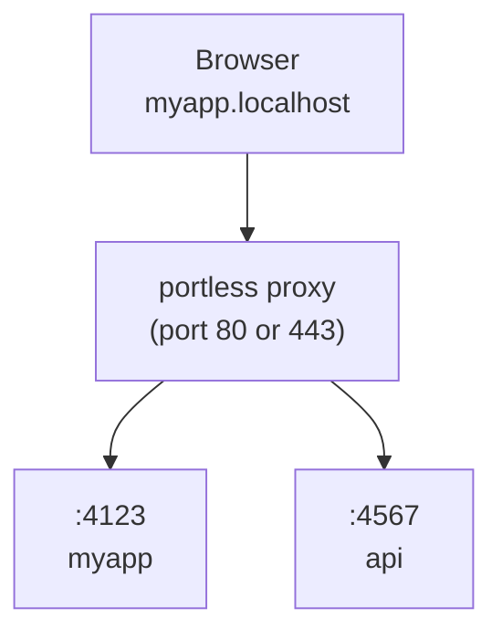

# portless

用稳定且带名称的 `.localhost` URL 替换端口号，用于本地开发。面向人类和 AI Agent。

```diff
- "dev": "next dev"                  # http://localhost:3000
+ "dev": "portless run next dev"     # https://myapp.localhost
```

## 安装

**全局安装（推荐）：**

```bash
npm install -g portless
```

**或作为项目开发依赖安装：**

```bash
npm install -D portless
```

> `portless` 处于 v1.0 以下版本。按项目单独安装时，不同贡献者可能运行不同的版本。状态目录格式可能在发布之间发生变化，这可能需要重新运行 `portless trust`。

## 运行你的应用

```bash
portless myapp next dev
# -> https://myapp.localhost
```

默认启用带 HTTP/2 的 HTTPS。首次运行时，portless 会生成本地 CA（证书颁发机构），将其添加到系统信任库中，并绑定端口 443（在 macOS/Linux 上会自动请求 sudo 提权）。如需使用纯 HTTP，请添加 `--no-tls` 参数。

代理会在你运行应用时自动启动。系统会通过 `PORT` 环境变量分配一个随机端口（4000-4999）。大多数框架（Next.js、Express、Nuxt 等）会自动识别该变量。对于忽略 `PORT` 的框架（Vite、VitePlus、Astro、React Router、Angular、Expo、React Native），portless 会自动注入正确的 `--port` 参数，并在必要时注入匹配的 `--host` 参数。

自动启动时，portless 会复用最近一次代理运行的配置（端口、TLS、TLD），因此重启或系统重启不会静默恢复为默认值。显式环境变量（如 `PORTLESS_PORT`、`PORTLESS_HTTPS` 等）始终优先于配置文件。

在非交互式环境（无 TTY，或设置了 `CI=1`）中，portless 会退出并显示描述性错误信息，而不是进行提示，以便 turborepo 和 CI 脚本等任务运行器能够快速失败并输出清晰的报错。

## 配置

直接使用 `portless` 即可开箱即用。它会通过代理运行 `package.json` 中的 `"dev"` 脚本，并从包名、git 根目录或当前目录推断应用名称：

```bash
portless        # -> runs "dev" script, https://<project>.localhost
```

使用可选的 `portless.json` 覆盖默认值：

```json
{ "name": "myapp" }
```

```bash
portless        # -> runs "dev" script, https://myapp.localhost
```

脚本默认为 `"dev"`。如果配置文件中未设置名称，则从 `package.json` 中推断。

### Monorepo（单体仓库）

在仓库根目录放置一个 `portless.json` 即可覆盖所有工作区包。Portless 会从 `pnpm-workspace.yaml`，或 `package.json` 中的 `"workspaces"` 字段（npm、yarn、bun）中自动发现包：

```json
{
  "apps": {
    "apps/web": { "name": "myapp" },
    "apps/api": { "name": "api.myapp" }
  }
}
```

```bash
portless        # from repo root: starts all workspace packages with a "dev" script
cd apps/web && portless   # start just one package
```

`apps` 映射是可选的，仅用于覆盖名称。未列出的包仍会自动发现，并从其 `package.json` 推断名称。

如果没有 `apps` 映射，主机名将遵循 `<package>.<project>.localhost` 的命名约定。项目名称取自工作区包中最常见的 npm scope（例如 `@myorg/web` 和 `@myorg/api` 会生成 `myorg`），若未找到则回退到工作区根目录名称。如果包的短名称与项目名匹配，则会使用不带重复的 `<project>.localhost`。

### Config fields（配置字段）

| Field     | Type    | Default  | Description                                               |
| --------- | ------- | -------- | --------------------------------------------------------- |
| `name`    | string  | inferred | Base app name. Worktree prefix still applies.             |
| `script`  | string  | `"dev"`  | Name of a `package.json` script to run.                   |
| `appPort` | number  | auto     | Fixed port for the child process.                         |
| `proxy`   | boolean | auto     | Whether to route through the proxy. Auto-detected.        |
| `apps`    | object  |          | Overrides for workspace packages, keyed by relative path. |
| `turbo`   | boolean | `true`   | Set `false` to use direct spawning instead of turborepo.  |

### package.json "portless" key（配置字段）

除了单独的 `portless.json`，你还可以直接在 `package.json` 中添加 `"portless"` 字段。字符串值相当于设置名称的简写：

```json
{
  "name": "@myorg/web",
  "portless": "myapp"
}
```

对象格式支持所有应用级字段（`name`、`script`、`appPort`、`proxy`）：

```json
{
  "name": "@myorg/web",
  "portless": { "name": "myapp", "script": "dev:app" }
}
```

`package.json` 中的 `"portless"` 字段优先级高于 `portless.json` 中的应用条目，但会被 CLI 参数覆盖。

### --script flag（参数）

为单次运行覆盖默认脚本：

```bash
portless --script start       # run "start" instead of "dev"
portless --script test        # run "test" instead of "dev"
```

### Turborepo

若要在 turborepo 中使用 portless，请将 `portless` 设为 `dev` 脚本，并将实际命令放在另一个脚本中：

```json
{
  "scripts": {
    "dev": "portless",
    "dev:app": "next dev"
  },
  "portless": { "name": "myapp", "script": "dev:app" }
}
```

Turbo 会运行每个包的 `dev` 脚本，该脚本会调用 portless。Portless 读取配置、检测包管理器，并通过代理运行 `pnpm run dev:app`（或 yarn/bun/npm）。无需修改 `turbo.json`。

在根目录执行 `pnpm dev` 仍会正常通过 turbo 运行。未安装 portless 的用户可直接运行 `pnpm run dev:app`。

## 在 package.json 中使用

你仍然可以在 `package.json` 脚本中使用 portless：

```json
{
  "scripts": {
    "dev": "portless run next dev"
  }
}
```

配合 `portless.json`，可简化为：

```json
{
  "scripts": {
    "dev": "next dev"
  }
}
```

然后运行 `portless` 或 `portless run` 即可通过代理访问。

## 子域名

使用子域名组织服务：

```bash
portless api.myapp pnpm start
# -> https://api.myapp.localhost

portless docs.myapp next dev
# -> https://docs.myapp.localhost
```

默认情况下，仅路由显式注册的子域名（严格模式）。在启动代理时使用 `--wildcard` 参数，允许任何已注册路由的子域回退到该应用（例如 `tenant1.myapp.localhost` 会路由到 `myapp` 应用，无需额外注册）。

## Git Worktrees

`portless run` 会自动检测 git worktree。在已链接的 worktree 中，分支名会作为子域名前缀添加，使每个 worktree 拥有独立的 URL，且无需任何配置更改：

```bash
# Main worktree (no prefix)
portless run next dev   # -> https://myapp.localhost

# Linked worktree on branch "fix-ui"
portless run next dev   # -> https://fix-ui.myapp.localhost
```

使用 `--name` 覆盖推断的基础名称，同时保留 worktree 前缀：

```bash
portless run --name myapp next dev   # -> https://fix-ui.myapp.localhost
```

只需在 `package.json` 中写入一次 `portless run`，即可随处使用。主签出目录使用基础名称，每个 worktree 获得唯一的子域名。无冲突，无需 `--force`。

## Custom TLD（自定义顶级域名）

默认情况下，portless 使用 `.localhost`，它在大多数浏览器中会自动解析为 `127.0.0.1`。如果你偏好其他 TLD（例如 `.test`），请使用 `--tld`：

```bash
portless proxy start --tld test
portless myapp next dev
# -> https://myapp.test
```

代理会自动同步路由主机名到 `/etc/hosts`（包括 `.test`），以便这些域名在你的机器上可解析。

推荐：`.test`（IANA 保留，无冲突风险）。避免使用 `.local`（与 mDNS/Bonjour 冲突）和 `.dev`（Google 所有，通过 HSTS 强制 HTTPS）。

## How it works（工作原理）



1. **启动代理（Start the proxy）**：运行应用时自动启动，或使用 `portless proxy start` 显式启动。
2. **运行应用（Run apps）**：`portless <name> <command>` 会分配一个空闲端口并向代理注册。
3. **通过 URL 访问（Access via URL）**：`https://<name>.localhost` 会通过代理路由到你的应用。

## HTTP/2 + HTTPS

默认启用带 HTTP/2 的 HTTPS。浏览器限制每个主机最多只能有 6 个 HTTP/1.1 连接，这会成为提供大量未打包文件（如 Vite、Nuxt 等）的开发服务器的瓶颈。HTTP/2 可在单个连接上复用所有请求。

首次运行时，portless 会生成本地 CA 并将其添加到系统信任库中。无需浏览器警告，也无需手动设置。

```bash
# Use your own certs (e.g., from mkcert)
portless proxy start --cert ./cert.pem --key ./key.pem

# Disable HTTPS (plain HTTP on port 80)
portless proxy start --no-tls

# If you skipped the trust prompt on first run, trust the CA later
portless trust
```

在 Linux 上，`portless trust` 支持 Debian/Ubuntu、Arch、Fedora/RHEL/CentOS 和 openSUSE（通过 `update-ca-certificates` 或 `update-ca-trust`）。在 Windows 上，它使用 `certutil` 将 CA 添加到系统信任库。

## Start at OS startup（开机自启代理）

将代理安装为操作系统启动服务，以便重启后无需从终端手动启动即可直接使用干净的 HTTPS URL：

```bash
portless service install
portless service install --lan
portless service install --wildcard
PORTLESS_STATE_DIR=~/.portless-lan PORTLESS_LAN=1 portless service install
portless service status
portless service uninstall
```

除非提供安装选项或 `PORTLESS_*` 环境变量，否则该服务将使用 portless 默认值（端口 443 上的 HTTPS 和 `.localhost` 名称）。`service install` 接受你用于 `proxy start` 的代理参数，包括 `--port`、`--no-tls`、`--lan`、`--ip`、`--tld`、`--wildcard`、`--cert` 和 `--key`。使用 `--state-dir <path>` 或 `PORTLESS_STATE_DIR=<path>` 可指定服务状态和日志的写入位置。

所选的服务配置会写入 launchd、systemd 或任务计划程序中，并在重启后复用。`portless service status` 会报告已安装的端口、HTTPS 模式、TLD、LAN 模式、通配符模式和状态目录。macOS 和 Linux 安装的是 root 权限服务，以便在启动时绑定端口 443。Windows 安装的是以 SYSTEM 身份运行的任务计划程序启动项。安装和卸载可能需要管理员权限。`portless clean` 会自动移除该服务。

## LAN mode（局域网模式）

```bash
portless proxy start --lan
portless proxy start --lan --https
portless proxy start --lan --ip 192.168.1.42
```

添加 `--lan` 会将代理切换为 mDNS 发现模式：服务将广播为 `<name>.local`，同一网络中的任何设备均可访问。Portless 会自动检测你的局域网 IP，并自动跟随 Wi-Fi/IP 变化，但你也可以通过 `--ip <address>` 或导出 `PORTLESS_LAN_IP` 固定另一个地址。在 shell 中设置 `PORTLESS_LAN=1`（0/1 布尔值）可使 LAN 模式成为代理启动时的默认行为。

Portless 会通过 `proxy.lan` 记住 LAN 模式，因此如果你停止 LAN 代理并重新启动，它会保持在 LAN 模式下。所有代理设置（端口、TLS、TLD、LAN）都会持久化并在自动启动时复用，除非被显式参数或环境变量覆盖。使用 `PORTLESS_LAN=0` 可仅对一次启动生效以切换回 `.localhost` 模式。如果已有不同显式 LAN/TLS/TLD 设置的代理正在运行，portless 会发出警告并要求你先停止它。

LAN 模式依赖于 portless 已启动的系统 mDNS 工具：macOS 自带 `dns-sd`，而 Linux 使用来自 `avahi-utils` 的 `avahi-publish-address`（通过 `sudo apt install avahi-utils` 或对应发行版的包安装）。如果缺少该命令或你的网络不可达，`portless proxy start --lan` 会打印相关错误并退出。

### Framework notes（框架注意事项）
- **Next.js**：将你的 `.local` 主机名添加到 `allowedDevOrigins` 中：

  ```js
  // next.config.js
  module.exports = {
    allowedDevOrigins: ["myapp.local", "*.myapp.local"],
  };
  ```

- **Expo / React Native**：portless 始终注入 `--port`。React Native 还会获得 `--host 127.0.0.1`。在非 LAN 模式下，Expo 会获得 `--host localhost`；但在 LAN 模式下，portless 会让 Metro 保持其默认的局域网主机行为，而不是强制设置 `--host` 或 `HOST`。

## Tailscale sharing（Tailscale 共享）

与你的 [Tailscale](https://tailscale.com) 网络中的团队成员共享开发服务器：

```bash
portless myapp --tailscale next dev
# -> https://myapp.localhost           (local)
# -> https://devbox.yourteam.ts.net    (tailnet)
```

每个带 `--tailscale` 的应用都会在其专属的 Tailscale HTTPS 端口上根挂载，因此无需配置框架的 `basePath`。第一个应用使用端口 443，后续应用依次使用 8443、8444 等。

```bash
portless myapp --tailscale next dev     # -> https://devbox.ts.net
portless api --tailscale pnpm start     # -> https://devbox.ts.net:8443
```

使用 `--funnel` 通过 [Tailscale Funnel](https://tailscale.com/kb/1223/funnel/) 将你的开发服务器暴露到公共互联网：

```bash
portless myapp --funnel next dev
# -> https://devbox.yourteam.ts.net    (public)
```

在启用 `--tailscale` 或 `--funnel` 之前，必须先启用 Tailscale HTTPS 证书。此外，必须为 tailnet 和节点启用 Funnel，才能注册公共 URL。如果缺少任一设置，portless 会在启动子进程前退出。

在 shell 配置文件或 `.env` 中设置 `PORTLESS_TAILSCALE=1` 可默认共享所有应用。`portless list` 会同时显示本地和 tailnet URL。当应用退出时，Tailscale serve 注册项会自动清理。

需要已安装并连接 Tailscale CLI（执行过 `tailscale up`），且启用了 Tailscale HTTPS 证书。

## Commands（命令）

```bash
portless                        # Run dev script through proxy
portless                        # From monorepo root: run all workspace packages
portless run [--name <name>] [cmd] [args...]  # Infer name, run through proxy
portless <name> <cmd> [args...]  # Run app at https://<name>.localhost
portless alias <name> <port>     # Register a static route (e.g. for Docker)
portless alias <name> <port> --force  # Overwrite an existing route
portless alias --remove <name>   # Remove a static route
portless list                    # Show active routes
portless trust                   # Add local CA to system trust store
portless clean                   # Remove state, CA trust entry, and hosts block
portless prune                   # Kill orphaned dev servers from crashed sessions
portless hosts sync              # Add routes to /etc/hosts (fixes Safari)
portless hosts clean             # Remove portless entries from /etc/hosts

# Disable portless (run command directly)
PORTLESS=0 pnpm dev              # Bypasses proxy, uses default port

# Proxy control
portless proxy start             # Start the HTTPS proxy (port 443, daemon)
portless proxy start --no-tls    # Start without HTTPS (port 80)
portless proxy start --lan       # Start in LAN mode (mDNS .local for devices)
portless proxy start -p 1355     # Start on a custom port (no sudo)
portless proxy start --foreground  # Start in foreground (for debugging)
portless proxy start --wildcard  # Allow unregistered subdomains to fall back to parent
portless proxy stop              # Stop the proxy

# OS startup service
portless service install         # Start HTTPS proxy when the OS starts
portless service install --lan   # Start service in LAN mode
portless service install --wildcard  # Persist wildcard routing in the service
portless service status          # Show service and proxy status
portless service uninstall       # Remove the startup service
```

### Options（参数）

```
-p, --port <number>              Port for the proxy (default: 443, or 80 with --no-tls)
--no-tls                         Disable HTTPS (use plain HTTP on port 80)
--https                          Enable HTTPS (default, accepted for compatibility)
--lan                            Enable LAN mode (mDNS .local for real devices)
--ip <address>                   Pin a specific LAN IP (disables auto-follow; use with --lan)
--cert <path>                    Use a custom TLS certificate
--key <path>                     Use a custom TLS private key
--foreground                     Run proxy in foreground instead of daemon
--tld <tld>                      Use a custom TLD instead of .localhost (e.g. test)
--wildcard                       Allow unregistered subdomains to fall back to parent route
--state-dir <path>               Use a custom state directory with service install
--script <name>                  Run a specific package.json script (default: dev)
--app-port <number>              Use a fixed port for the app (skip auto-assignment)
--tailscale                      Share the app on your Tailscale network (tailnet)
--funnel                         Share the app publicly via Tailscale Funnel
--force                          Kill the existing process and take over its route
--name <name>                    Use <name> as the app name
```

### Environment variables（环境变量）

```
# Configuration
PORTLESS_PORT=<number>           Override the default proxy port
PORTLESS_APP_PORT=<number>       Use a fixed port for the app (same as --app-port)
PORTLESS_HTTPS=0                 Disable HTTPS (same as --no-tls)
PORTLESS_LAN=1                   Enable LAN mode when set to 1 (auto-detects LAN IP)
PORTLESS_LAN_IP=<address>        Pin a specific LAN IP for LAN mode
PORTLESS_TLD=<tld>               Use a custom TLD (e.g. test; default: localhost)
PORTLESS_WILDCARD=1              Allow unregistered subdomains to fall back to parent route
PORTLESS_SYNC_HOSTS=0            Disable auto-sync of /etc/hosts (on by default)
PORTLESS_TAILSCALE=1             Share apps on your Tailscale network (same as --tailscale)
PORTLESS_FUNNEL=1                Share apps publicly via Tailscale Funnel (same as --funnel)
PORTLESS_STATE_DIR=<path>        Override the state directory

# Injected into child processes
PORT                             Ephemeral port the child should listen on
HOST                             Usually 127.0.0.1 (omitted for Expo in LAN mode)
PORTLESS_URL                     Public URL (e.g. https://myapp.localhost)
PORTLESS_TAILSCALE_URL           Tailscale URL of the app (when --tailscale is active)
NODE_EXTRA_CA_CERTS              Path to the portless CA (when HTTPS is active)
```

> **Reserved names（保留名称）：** `run`、`get`、`alias`、`hosts`、`list`、`trust`、`clean`、`prune`、`proxy` 和 `service` 为子命令，不能直接用作应用名。请使用 `portless run <cmd>` 从项目中自动推断名称，或使用 `portless --name <name> <cmd>` 强制指定任意名称（包括保留名称）。

## Uninstall / reset（卸载 / 重置）

要从你的机器中彻底清除 portless 数据（代理状态位于 `~/.portless` 及系统状态目录、OS 信任库中的本地 CA（由 portless 安装时添加）、以及 `/etc/hosts` 中的 portless 条目）：

```bash
portless clean
```

macOS/Linux 可能会提示输入 `sudo` 密码。通过 `--cert` 和 `--key` 传递的自定义证书路径不会被删除。

## Safari / DNS

在 Chrome、Firefox 和 Edge 中，`.localhost` 子域名会自动解析为 `127.0.0.1`。Safari 依赖系统 DNS 解析器，在某些配置下可能无法正确处理 `.localhost` 子域名。

如果 Safari 找不到你的 `.localhost` URL：

```bash
portless hosts sync    # Add current routes to /etc/hosts
portless hosts clean   # Clean up later
```

默认会自动将路由主机名同步到 `/etc/hosts`（包括 `.localhost`、自定义 TLD 和局域网 `.local`）。设置 `PORTLESS_SYNC_HOSTS=0` 可禁用此功能。

## Proxying Between Portless Apps（Portless 应用间的代理转发）

如果你的前端开发服务器（例如 Vite、webpack）将 API 请求代理到另一个 portless 应用，请确保代理会重写 `Host` 头。否则，portless 会将请求无限循环路由回前端。

**Vite** (`vite.config.ts`)：

```ts
server: {
  proxy: {
    "/api": {
      target: "https://api.myapp.localhost",
      changeOrigin: true,
      ws: true,
    },
  },
}
```

**webpack-dev-server** (`webpack.config.js`)：

```js
devServer: {
  proxy: [{
    context: ["/api"],
    target: "https://api.myapp.localhost",
    changeOrigin: true,
  }],
}
```

Portless 会自动在子进程中设置 `NODE_EXTRA_CA_CERTS`，使 Node.js 信任 portless CA。如果你在 portless 外部运行独立的 Node.js 进程，请手动指向该 CA：`NODE_EXTRA_CA_CERTS=~/.portless/ca.pem`。或者使用 `--no-tls` 启用纯 HTTP。

Portless 会检测到此错误配置，并返回 `508 Loop Detected` 状态码及指向此修复方案的提示信息。

## Development（开发）

该仓库是基于 [Turborepo](https://turbo.build) 的 pnpm workspace 单体仓库。可发布的包位于 `packages/portless/` 中。

请使用 Node.js 24+ 和 pnpm 11 进行仓库开发。`.node-version` 文件用于版本管理器锁定 Node 主版本号。

```bash
pnpm install          # Install all dependencies
pnpm build            # Build all packages
pnpm test             # Run tests
pnpm test:coverage    # Run tests with coverage
pnpm lint             # Lint all packages
pnpm type-check       # Type-check all packages
pnpm format           # Format all files with Prettier
```

## Requirements（环境要求）

- Node.js 24+
- macOS、Linux 或 Windows
- Tailscale CLI（可选，用于支持 `--tailscale` 和 `--funnel`）